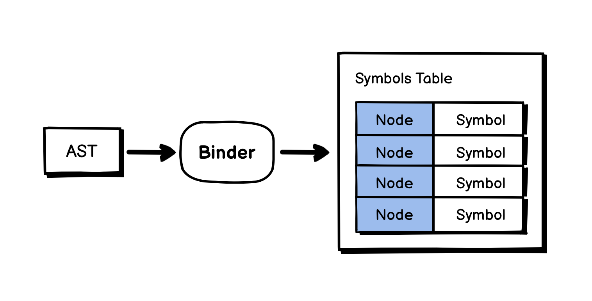
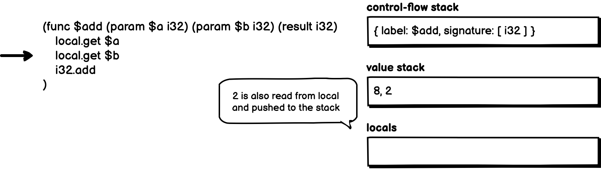
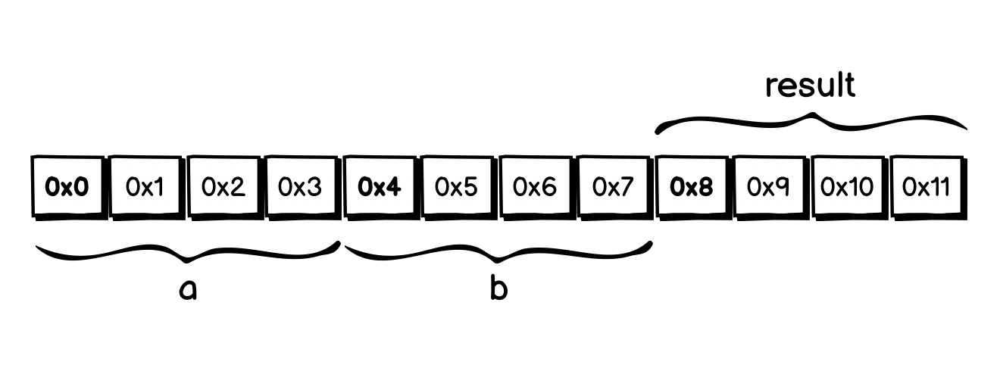

# 04.13.2022 - Reading Notes/Detect Infinite Recursive Call with Control Flow Graph

[**go-staticcheck**](https://github.com/dominikh/go-tools/) is a static code analysis tool for Go. It has an interesting ability to detect infinite recursive calls. For example, infinite calls like this would be detected early before the program run:

```go
func fac(n int) int {
    return n * fac(n - 1);
//             ^^^^^^^^^^^^
// infinite recursive call (SA5007) go-staticcheck
}
```

The way it works is interesting. It is based on [**Control Flow Graph Analysis**](https://en.wikipedia.org/wiki/Control-flow_graph).

Control Flow Graph (CFG) is a way to represent the code by a *directed graph*, where each *node* is a *basic block* — a straight line of code without any jumps. Each graph must have an _entry block_ and an _exit block_.

For example, look at the following factorial function:


There are 3 blocks **(1)**, **(2)**, and **(3)**. And the CFG for this function can be illustrated in the above graph. It has the **(entry)** and **(exit)** blocks.

In the above graph, there is a recursive call from the block **(3)**, which creates a loop to the **(entry)** block again. But thanks to the **if** statement at block **(1)**, we are able to break the loop and reach the **(exit)** block.

Let's see what happens if we make this function an infinite recursive, by removing the base condition:


Now, the recursive call from the block **(1)** creates a loop to the **(entry)** block, but there is nothing to stop the loop. We will never reach the block **(exit)**. So we know this is an infinite recursive call.

In **go-staticcheck**, this check is [implemented in **CheckInfiniteRecursion** function](https://github.com/dominikh/go-tools/blob/273d35f584109c9c64faa5cee9280f0258e4b711/staticcheck/lint.go#L2825-L2853).

```go
func CheckInfiniteRecursion(pass *analysis.Pass) (interface{}, error) {
	for _, fn := range pass.ResultOf[buildir.Analyzer].(*buildir.IR).SrcFuncs {
		eachCall(fn, func(caller *ir.Function, site ir.CallInstruction, callee *ir.Function) {
            ...
			block := site.Block()
			for _, b := range fn.Blocks {
				if block.Dominates(b) {
					continue
				}
				if len(b.Instrs) == 0 {
					continue
				}
				if _, ok := b.Control().(*ir.Return); ok {
					return
				}
			}
			report.Report(pass, site, "infinite recursive call")
		})
	}
	return nil, nil
}
```

It is worth noting that, this approach is only based on the syntax of the code, and can only catch issues during the compilation, not runtime.

For example, in the above infinite recursive call example, we can manipulate the CFG to pass the check by adding a dummy **if** statement, which does not actually serve as a base condition of the recursive call:


Syntactically, the **if** statement always creates two branches in the CFG, the static analyzer will assume that the **(exit)** block can be reached. But in this case, our **if** statement evaluates the **false** expression, which makes it always fall into the **false** branch, and the **true** branch will never reach. And at runtime, it will cause a stack overflow.


# 04.12.2022 - Reading Notes/Wall Clock and Monotonic Clock

In a computer system, there are 2 types of clocks: 

1. **Wall Clock** (or **Real-Time Clock**): is the clock that is synchronized with NTP (Network Time Protocol), which is subjected to jump (moving forward or backward) depending on the time server.
2. **Monotonic Clock**: is the clock that is guaranteed to only move forward, regardless of the time server. The frequency rate of this clock might vary, it can be adjusted if the system detects the local quartz is moving faster or slower than the NTP. But it's guaranteed to always move forward.

Go's documentation suggested that we should use **wall clock** only to *tell the time*, and use **monotonic clock** to *measure the time*.

When measuring performance or doing something that relies on the orders of time, we should not use **wall clock**, for example, a common mistake when measuring time in JavaScript is using **Date.now()**:

```javascript
const start = Date.now();
doSomeWork();
const end = Date.now();
const elapsed = end - start;
```

Because **Date.now()** is using **wall clock**, if the system time jumps between the measurement, the **elapsed** time will be incorrect.

This is why in JavaScript, it is recommended to use **performance.now()**, which is based on the **monotonic clock** for performance measurement.

```javascript
const start = performance.now();
doSomeWork();
const end = performance.now();
const elapsed = end - start;
```

**Monotonic clock** time can be obtained in some other languages like:

- **std::time::Instant** in Rust
- **time.monotonic()** in Python
- **time.Sub(startTime)** in Golang
- **hrtime** in NodeJS

It is important to note that, **monotonic clock** is only correct locally. In a distributed system, it is a different topic.

**References:**

- https://go.googlesource.com/proposal/+/master/design/12914-monotonic.md
- https://arush15june.github.io/posts/2020-07-12-clocks-timers-virtualization/
- https://developer.mozilla.org/en-US/docs/Web/API/Performance/now
- https://doc.rust-lang.org/std/time/struct.Instant.html
- https://docs.python.org/3/library/time.html#time.monotonic
- https://pkg.go.dev/time#hdr-Monotonic_Clocks
- https://nodejs.org/api/process.html#processhrtimebigint


# 04.11.2022 - TypeScript/Use String As Enum Key

In TypeScript, you can define an enum and access its value with a _string-like value_, like this:

```typescript
enum Editor {
    VIM = 'Neovim',
    EMACS = 'Emacs',
    VSCODE = 'Visual Studio Code'
};

const key = 'VSCODE';
const editor = Editor[key];
```

In this example, the type of the **key** variable is not actually a string, but a **literal type** called **'VSCODE'**.

If you change the **key** definition from **const** to **let**or give it a type annotation, you will actually see that a string cannot be used to access enum values:

```typescript
const key: string = 'VSCODE';
// or
let key = 'VSCODE';

const editor = Editor[key]; // ERROR!
//             ^^^^^^^^^^^^
// Element implicitly has an 'any' type because expression
// of type 'string' can't be used to index type 'typeof Editor'.
// No index signature with a parameter of type 'string' was
// found on type 'typeof Editor'.(7053)
```

There are many cases where you want to access your enum values with a string key, for example, when the key need to be calculated based on some constraints:

```typescript
const getEditor = (needMouse?: boolean): string => {
    return needMouse ? 'VSCode' : 'Vim';
}

const editor = Editor[getEditor(true).toUpperCase()];
```

Or when you want to map your enum to some other data structures, and still want to refer to that enum values:

```typescript
const editorList = Object.keys(Editor)
    .filter(key => key !== 'EMACS')
    .map(key => ({
        editorCode: key,
        displayName: Editor[key]
    }));

// Expected an array of:
// [
//    {
//        editorCode: 'VIM',
//        displayName: 'Neovim'
//    },
//    {
//        editorCode: 'VSCODE',
//        displayName: 'Visual Studio Code'
//    }
// ]
```

The values of the **Editor** enum can only be accessed by some keys of the union type **"VIM" | "EMACS" | "VSCODE"**. To make the above two example works, we need to annotate the **key** variable as the union **"VIM" | "EMACS" | "VSCODE"**.

You can define this union in two ways:

```typescript
type EditorKey = "VIM" | "EMACS" | "VSCODE";

// or

type EditorKey = keyof typeof Editor;
```

Now we can use [type assertion](/everyday/02-28-2022-typescript-type-annotation-vs-type-assertion) to convince TypeScript that **key** is a value of type **EditorKey**, and it should be OK to compile your code:

```typescript
const editorList = Object.keys(Editor)
    .filter(key => key !== 'EMACS')
    .map(key => ({
        editorCode: key,
        displayName: Editor[key as EditorKey] // THIS!
    }));
```


# 04.10.2022 - Algorithms/Tracking letter frequency with Hashmap and Array

Sometimes, you will need to count the frequency of letters in a string and do something with that count.

For example, with a simple algorithm to check if a string is a permutation of another one, we can build a character frequency map of each string, and compare the two maps if they're the same.

$$\\begin{align}
s1 &= hello \\rightarrow \\{ h= 1, e= 1, l= 2, o= 1 \\} \\\\
s2 &= olleh \\rightarrow \\{ o= 1, l= 2, e= 1, h= 1 \\}
\\end{align}$$

There are different approaches for creating a character frequency map, like using a hashmap, or arrays.

A hashmap-alike data structure in JavaScript can be easily implemented using an empty object:

```javascript
const s = "hello";
const hash = {};

for (const i in s) {
    let chr = s[i];
    if (!hash[chr]) hash[chr] = 0;
    hash[chr]++;
}
```

You can pre-define the keys to avoid changing the shape of the hashmap on every loop. But for some small coding problems, it's not really a big deal.

Comparing the two hashmaps (or objects, in this case) is requires us to get all the keys in one map, and compare the value with its corresponding value in the other map:

```javascript
const compareTwoHashmaps = (hash, hash) => {
    for (const [chr, count] of Object.entries(hash)) {
        if (count !== hash[chr]) return false;
    }
    return true;
}
```

Another approach is to use an array as a map. We can use the fact that for each character, we can map their char code to the range from 0 by subtracting the char code with the char code of the letter **'a'**, or **97**.

```javascript
'a'.charCodeAt(0) - 'a'.charCodeAt(0) === 0
// or
'z'.charCodeAt(0) - 97 === 25
```

We can use this range number as an index in the frequency map array, assuming we only working with strings containing all lowercase letters:

```javascript
const s = "hello";
const hash = new Array(26).fill(0);

for (const i in s) {
    const chrCode = s[i].charCodeAt(0);
    hash[chrCode - 97]++;
}
```

$$
hash = \[ \\overset{a}{0}, \\overset{b}{0}, \\overset{c}{0}, \cdots, \\overset{e}{1},\cdots \\overset{h}{1},\cdots \\overset{l}{2},\cdots \\overset{o}{1},\cdots, \\overset{z}{0} \]
$$

To compare the two arrays, we just need to iterate and compare each position. Writing for loop is boring, in JavaScript, we make it more fun:

```javascript
hash1.every(i => hash2[i] === hash1[i])

// or

hash1.some(i => hash2[i] !== hash1[i])
```

But writing code like the two above examples might not great for code readability.

Speaking of readability, I really like that in Golang, it's more convenient to create the character frequency array.

```go
hash := [26]int{}

for i := range s {
    hash[s[i] - 'a']++
}
```

Since most coding problems will have well-defined constraints on the input string, it is more likely that the frequency hash will have a fixed size, like, all the letters from a to z, or a to Z. We can just use an array instead of slice.

Using arrays also have another benefit, we can compare two arrays directly without writing any for loop (of course, it's just about code readability, not talking about the complexity of the comparison here):

```go
if array1 == array2 {
    return true
}
```


# 04.09.2022 - Golang/Use Delve on M1 Mac

[Delve](https://github.com/go-delve/delve/tree/master/Documentation/installation) is a GDB-alike debugger for Golang, with better support for Go's data structures and Goroutine.

To install Delve on M1 Mac devices, you first need to install the Go ARM64 version, then install Delve with:

```
$ go install github.com/go-delve/delve/cmd/dlv@latest
```

If you use the Go version for Intel chip, your Go programs still compile but Delve won't work, and you will need to recompile after installing the correct version.

To start debugging a program with Delve, go to your project's folder and run:

```
$ dlv debug
```

From here, you can put a breakpoint at the beginning of the `main()` function with:

```
break main.main
```

The above command means, putting a breakpoint at the beginning of the `main` function, in the `main` package. You can also put a breakpoint by line with `b <line>` command, or a breakpoint at any package's function with `b <package>.<fn>`.

Now, you can start the program with the `continue` (or `c`) command.

As you step through the code, use the key `n` to go to the next line, `s` to step in to a function.

To examine the local variables of scope, use `locals` command, or print the value of any expression with `print <expr>` or `p <expr>` command.

# 04.08.2022 - Algorithms/Cyclic Sort: Sorting in O(N)

Cyclic Sort is an easy to implement and efficient algorithm. The only caveat is that it requires an input array to be a continuous range of values.

It can be applied to the problems of finding *duplicate* or *missing* numbers.

We can use the fact that the input values are a continuous range of numbers, every value will match its index somehow. For example, an array of **[0..10]** will have all its values matching its index. Or in an array of **[100..200]**, every value of index $i$ has the value of $i + 100$.

So, to tell if a value is in the correct position in the array, we can just check its index.

The way the cyclic sort algorithm works is, assuming the values are in the range of **[0..n]**:

1. **Step 1:** Create a **current** pointer, check for the number under the pointer **nums[current]**
2. **Step 2:** If **nums[current]** is in the correct position, increase the pointer to the next number
3. **Step 3:** If **nums[current]** is not in the correct position, move it to the correct position (**target = nums[current]**) and move the value that is occupying position **target** back to **current**.
4. **Step 4:** Repeat until **current** reaches the end of the array

Let's take an example, we want to sort the array **nums = [2, 4, 0, 6, 3, 5, 1]**. First, the **current** pointer is at index 0, which has a value of 2. This is not the correct value, so we move the value 2 to the index 2, swapping the value **nums[2] = 0** back to **nums[0]**.


The value at **nums[current]** is now 0, which is correct. We can move the **current** pointer forward. This time, we have **current = 1**, the value at **nums[current] = 4**, which is not correct. So we move 4 into **nums[4]**, taking back the value at **nums[4]** and put it into **nums[1]**.


Now, the value at **nums[current]** is 3, still not the correct value for its position, we cannot move the **current** pointer forward. Instead, let's swap 3 with the value at **nums[3]**:


The value of **nums[current] = 6** still not the correct value for position **current = 1**, we have to swap one more time, this time, swap **nums[1]** with **nums[6]**:


Now, at the position **current = 1**, the value **nums[current] = 1** is the correct value. We can move the **current** pointer forward.


Since everything in the way are the correct values, we keep moving the pointer until we reach the end of the array, and the algorithm is finished.

The time complexity of the Cyclic Sort algorithm is $O(N)$. In the worst-case scenario, when we cannot increment the **current** pointer, it takes $O(2N - 1)$ time.

Here is the implementation of the Cyclic Sort algorithm:

```go
func CyclicSort(nums []int) {
	n := len(nums)
	i := 0
	for i < n {
		j := nums[i]
		if j < n && nums[j] != nums[i] {
			nums[j], nums[i] = nums[i], nums[j]
		} else {
			i++
		}
	}
}
```

For the problems that require us to find all the missing or duplicate numbers in an array, we can first sort the elements using Cyclic Sort and then loop through the sorted array to check if any value is displaced from its correct position.

```go
func findAllMissings(nums []int) []int {
	found := make([]int, 0)

	CyclicSort(nums)

	for i, n := range nums {
		if i != n {
			found = append(found, i)
		}
	}

	return found
}

func findAllDuplicates(nums []int) []int {
	found := make([]int, 0)

	CyclicSort(nums)

	for i, n := range nums {
		if i != n {
			found = append(found, n)
		}
	}

	return found
}
```

There is also a variant of Cyclic Sort that could return early when it finds the duplicate number during sorting, so we don't need a second loop:

```go
func findDuplicate(nums []int) int {
    n := len(nums)
    i := 0
    for i < n {
        if i != nums[i] {
            j := nums[i]
            if nums[j] != nums[i] {
                nums[j], nums[i] = nums[i], nums[j]
            } else {
                // Found the duplicate at i
                return i
            }
        } else {
            i++
        }
    }
    return -1
}
```


# 04.07.2022 - Algorithms/Fast and Slow Pointers For Linked List

In a Linked List, traversal is restricted to forward only, you can't really go back to previous nodes once you go past them. When working on a problem that requires us to do some lookup in a Linked List, the naive approach is to traverse the list multiple times.

Another better approach is to use the *Fast and Slow Pointers* technique. Most of the time, we can solve the problem with a single pass.

Let's take a look at some example use cases.

## Find the $n^{th}$ node from the end of the list

Let's say, we want to find the $n^{th}$ node from the end of a Linked List, we can do it naively by traversing from the head to the tail to get the length $L$ of the list, then do a second traversal just $L - n$ times.

Using fast and slow pointers, we can first increase the **fast** pointer **n** times, the distance between **fast** and **slow** is now **n** nodes.


Now, increase both the **fast** and **slow** pointers until **fast** reaches the end of the list. Since the two pointers have the distance of **n**, the position of the **slow** pointer is the $n^{th}$ node from the end of the list.


The algorithm can be implemented like this:

```go
fast := head
slow := head

for n > 0 {
    fast = fast.Next
}

for fast.Next != nil {
    fast = fast.Next
    slow = slow.Next
}

// slow is the nth from the end here
```

## Find the middle node of the list

Another example, this time we want to look for the middle node of the list. We can do it naively by traversal the list in two-pass, with the second pass in $L/2$ times.

Using fast and slow pointers, we increase the **slow** pointer one node at a time, and the **fast** pointer goes twice as fast with **fast = slow.Next.Next**, by the time **fast** reaches the end of the list, the **slow** pointer will be in the middle:


Implementation:

```go
fast := head
slow := head

for fast != nil && fast.Next != nil {
    slow = slow.Next
    fast = fast.Next.Next
}

// end of the loop, slow is the middle node
```

A similar technique can also be applied to detect a cycled linked list. Since the **fast** pointer will always, at some point, meet the **slow** pointer if it keeps cycling.

# 04.06.2022 - Monorepo/Code organization when using Nx

Nx is a tool to create and manage multiple-project workspaces. One of its most important features is the ability to track the changes in your projects in your workspace and only rebuild what is affected. (See: [Nx Affected](https://nx.dev/using-nx/affected)).

For example, if you have a workspace with 4 projects **A**, **B**, **C**, and **D** as described in the following chart. **Project A** and **B** have a dependency on **Project C**, while **Project D** is only used by **Project B**.


Making any changes to **Project C** will mark **Project A** and **B** as affected.


But if you make a change to **Project D**, only **Project B** will be marked as affected, leaving **Project A** untouched.


When using the `nx affected` to build or test the workspace, all the unaffected projects will not be built, but reuse the cached one from previous builds.

---

Sometimes, it is easy to organize the code in a way that prevents Nx from caching your build properly. For example, it is common to have a shared folder to store all the UI components or the application models in a shared project:


Since it makes sense to have all the models in one place, making it easier to find. This approach has a caveat:


Every project has a dependency on the shared Models project. Making any change to a model of any project will mark every project as affected!

A better way to organize the code, in this case, is to not share any app-specific code in the shared modules and pay attention to what you are going to share between the projects.


When making changes, also try to not change the shared code so much. This way, you will be able to keep the affected tree minimal and speed up the build process a lot.


This might sound obvious, but it actually happens for real. I know it because I did structure my project that way and wasted countless hours of waiting for Github Action to build =))

# 04.05.2022 - TypeScript/Some random notes about Classes

Some notes about some not-so-well-known things about TypeScript Classes.

## Parameter properties

In TypeScript, you can define a class's properties in two ways: Define it as a class property in the normal way, or define it as a constructor's parameter, a.k.a Parameter Properties:

```typescript
class Foo {
    private bar: Bar;
    public beep: Boop;

    constructor() {}
}

// is equivalent to

class Foo {
    constructor(
        private bar: Bar,
        public beep: Boop
    ) {}
}
```

You probably use this a lot if you've been writing Angular code:

```typescript
@Component({ ... })
class SomeComponent {
    constructor(
        private apiService: ApiService,
        ...
    ) {}
}
```

## Static blocks in class

You can define a static block in a class, it is useful when you need to do some initialization for static members of the class.

For example, you want to init some static values for the class, you cannot init it in a constructor, because it's just wrong:

```typescript
class Foo {
    static bar = 0;
    constructor() {
        Foo.bar = calculateSomethingComplex();
    }
}

console.log(Foo.bar); // output = 0
```

The right way to do this is, to use a `static` block:

```typescript
class Foo {
    static bar = 0;
    static {
        Foo.bar = calculateSomethingComplex(); // 50
    }
}

console.log(Foo.bar); // output = 50
```

## Classes are just shapes

For most of the cases, classes in TypeScript are compared structurally, this means, as long as the classes have the same shape, you can use them interchangeably:

```typescript
class Foo {
    x: number;
    y: string;
}

class Bar {
    x: number;
    y: string;
    z: boolean;
}

let x: Foo = new Bar(); // OK
let y: Bar = new Foo(); // Fail
```

In the above example, the **Bar** class has all the members of **Foo**, so it can be assigned to a variable of type **Foo**, but not the other way around because the **Foo** class doesn't have the `z: boolean` property.

This means, you can also assign an empty class to anything, but it does not mean you should do it.

# 04.04.2022 - Reading Notes/Understand Complex Code with Dry Run

OK, this one is embarrassing, I still remember the first time I was taught to dry run the code. It was many years ago when I started learning how to program. But I've never actually tried it properly.

Most of the time, I just let the compiler run and put a log between the lines to see the output values (what do we call? log-driven debugging?), this is not a bad approach but I find it hard to fully understand the code using this approach, for many reasons:

- We can't just put a log on every line of code, for example, on an **if** statement
- Sometimes, it's not straightforward to just test a particular function without running the whole program or the flow. Using a step debugger won't help in this case.

Until recently, a friend shows me the way she dry-run her code without actually running it with the compiler. As she goes over every line in their code, she put a comment on the side to trace the values of the variables. It helped detect the bugs faster and also helped everyone understand the code better.

When working with some code that you do not immediately understand, it's also good to apply this technique as well. The point is to slow down and actually take a closer look at every line of code and see how the input values transform between the lines.

There are many ways to dry run, actually. You can make a trace table to track the values at every step, like this:


<center>(Source: <a href="https://www.youtube.com/watch?v=Fpg7jpO3XlQ">Using trace tables to check an algorithm's correctness</a>)</center>

But a faster way, I think, is to just write a comment on each line of code to track the values.

For example, let's take a look at this function, and assume that we are not immediately sure what's this function does, or what's the value `a` or `r` here:

```javascript
const swap = (a, i) => {
    [a[i-1], a[i]] = [a[i], a[i-1]]
};

const sort = (a) => {  
    let r = false;  
    while (!r) {  
        r = true;  
        for (let i in a) {  
            if (a[i-1] > a[i]) {  
                r = false;  
                swap(a, i);
            }  
        }  
    }  
};
```

The only thing we know is, it's a sort function, so let's give it an array, for example: **[5,3,4,1]**. Go through every line of code and write the values of the variables on the side. So, after a few iterations, the code should look like this:

```javascript
const swap = (a, i) => { // a = [5,3,4,1], i = 1
    [a[i-1], a[i]] = [a[i], a[i-1]] // [5,3] = [3,5]
    // it's a swap! wow!
};

const sort = (a) => {  // a = [5,3,4,1]
    let r = false;  
    while (!r) {  // r = false
        r = true;  
        for (let i in a) {  // i = 1
            if (a[i-1] > a[i]) {  // 5 > 3 = true
                r = false;  
                swap(a, i); // swap(a, 1)
                            // a = [3, 5, 4, 1]
            }  
        }  
    }  
};
```

Keep going until you reached the end, know that this is an implementation of a bubble sort algorithm, it modifies the input data directly, so no need to return anything, and the swap algorithm is implemented using a neat array trick.

# 04.03.2022 - Algorithms/Sliding Window With Two Pointers

For the problems that require us to do something a stream of values, or a subsequence of an array, the typical approach is to use a sliding window.


A naive way to implement a sliding window is to have a nested loop, the first loop to iterate the start position of the window, and the second loop to collect the values inside a window:

```python
for(start = 0..array.length):
    for (end = start..start + window_length):
        // value array[start..end]
```

This algorithm would run in **O(N * K)** time, with **N** being the number of elements, and **K** is the window size.

A better approach to implementing sliding windows is to keep track of just the start and the end of the window. Since most of the items in between are overlapped when sliding, we can eliminate the inner loop, depending on what operation we need to perform on the array.


For example, if a problem requires us to perform some work on the sum of each window, we can reuse the sum by adding the value of the new element and subtracting the value of the value at the beginning of the previous window.

```python
start = 0
sum = 0
for (end = 0..array.length):
	sum += array[end]
	sum -= array[start]
	start += 1
```

This approach only takes **O(N)** time.

Sometimes, you will need to check for all subarrays without the fixed window size, the windows could be shrinking or expanding depending on some conditions.


In this case, the **start** and **end** pointers can be moved using this pattern:

```python
start = 0
for (end = 0..array.length):
	// do something
	...
	// shrink the window
	while (need_to_shrink):
		start += 1
```

The above approaches work well when you do not need to keep track of the overlapped items between the windows. In some problems, when working on a stream of data, you might need to have the information of all the items in between. In this case, using a circular buffer (or ring buffer) as a fixed queue would be a better solution.


A ring buffer can be easily implemented using an array for storing data, and two pointers for **writing** and **reading**.


Here's an implementation of a circular buffer using JavaScript:

```javascript
const CircularBuffer = function(size) {
    this.data = Array(size).fill(0).map(_ => 0);
    this.writePtr = 0;
    this.readPtr = 0;
    
    return {
        put: (value) => {
            this.data[this.writePtr++] = value;
            this.writePtr %= size;
        },
        get: () => {
            let item = this.data[this.readPtr++];
            this.readPtr %= size;
            return item;
        }
    }
};
```


# 04.02.2022 - Algorithms/Merge two sorted arrays with extra space

**The problem**

Given two non-decreasing arrays `a` of length `m`, and `b` of length `n`. Merge the two arrays into array `a`. Since it’s an in-place merge, `a` has some extra spaces to fit the result.

**The solution**

Iterating from the end of both input arrays, at each iteration, pick the larger of the last two inputs and insert it into the end of the target array. Repeat this process until we reach the beginning of either input.

**For example:**

Given two arrays **a** and **b** of length **m** and **n** as follow:

$$ \\begin{align}
a &= [ 1, 3, 5, 0, 0, 0 ] &m = 3 \\\\
b &= [ 2, 4, 7 ] &n = 3 \\\\
\\end{align} $$

Let **k** be the last index of the merged array:

$$ k = m + n - 1 $$

Compare the two numbers $a[m-1]$ and $b[n-1]$ and insert the larger one into the end of the merged array (at position $a[k]$). After that, decrease the index $k$ and the value of $m$ or $n$ depending on which value is selected.

Repeat the process until either $m$ or $n$ reach the beginning of the array.

---

Here's how the algorithm running. From the beginning:

$$ \\begin{align}
a &= [ 1, 3, \\overset{\overset{m}\downarrow}{5}, 0, 0, \overset{\overset{k}\downarrow}{0} ] \\\\
b &= [ 2, 4, \underset{\underset{n}\uparrow}{7} ] \\\\
\\end{align} $$

We have $a[m] = 5$, which is smaller than $b[n] = 7$. Move $b[n]$ into the position $a[k]$, decrease the value of both $n$ and $k$ by 1:

$$ \\begin{align}
a &= [ 1, 3, \overset{\overset{m}\downarrow}{5}, 0,  \overset{\overset{k}\downarrow}{0}, 7 ] \\\\
b &= [ 2, \underset{\underset{n}\uparrow}{4}, \emptyset ] \\\\
\\end{align} $$

Now, $a[m] = 5$ is larger than $b[n] = 4$. Move $a[m]$ into $a[k]$ and decrease both $m$ and $k$ by 1:

$$ \\begin{align}
a &= [ 1, \overset{\overset{m}\downarrow}{3}, \emptyset,  \overset{\overset{k}\downarrow}{0}, 5, 7 ] \\\\
b &= [ 2, \underset{\underset{n}\uparrow}{4}, \emptyset ] \\\\
\\end{align} $$
Next, $a[m] = 3$, less than $b[n] = 4$. Move $b[n]$ into $a[k]$ and decrease both $n$ and $k$:

$$ \\begin{align}
a &= [ 1, \overset{\overset{m}\downarrow}{3},  \overset{\overset{k}\downarrow}{\emptyset}, 4, 5, 7 ] \\\\
b &= [ \underset{\underset{n}\uparrow}{2}, \emptyset, \emptyset ] \\\\
\\end{align} $$

Next, $a[m] = 3$, larger than $b[n] = 2$. Move $a[m]$ into $a[k]$ and decrease $m$ and $k$:

$$ \\begin{align}
a &= [ \overset{\overset{m}\downarrow}{1},  \overset{\overset{k}\downarrow}{\emptyset}, 3, 4, 5, 7 ] \\\\
b &= [ \underset{\underset{n}\uparrow}{2}, \emptyset, \emptyset ] \\\\
\\end{align} $$
Finally, move $b[n]$ into $a[k]$ since $a[m] = 1$ is less than $b[n] = 2$, decreasing $n$ and $k$:

$$ \\begin{align}
a &= [ \overset{\overset{m,k}\downarrow}{1}, 2, 3, 4, 5, 7 ] \\\\
b &= \underset{\underset{n}\uparrow}{[} \emptyset, \emptyset, \emptyset ] \\\\
\\end{align} $$

At this point, we reach the end of the algorithm, the merged result is:

$$ a = [1, 2, 3, 4, 5, 7] $$

# 04.01.2022 - TypeScript/How the compiler compiles

This article is inspired by the talk [How the TypeScript compiler compiles](https://www.youtube.com/watch?v=X8k_4tZ16qU), you should really check it out for a more in-depth understanding about the TypeScript's compiling process.

At a high level, the TypeScript compiler is a tool to help us analyze and compile the TypeScript code into JavaScript (\*.js), as well as some type definition files (\*.d.ts) or source maps (\*.js.map).


If the source file contains some problems, the TypeScript compiler is also able to provide the diagnostics, so we know what went wrong and how to fix it.

## The compilation process

Internally, it's a complex process that involves many different parts, here's the summary of the process:


The compilation process starts when you invoke the `tsc` command. To run, the TypeScript compiler needs a `tsconfig.json` file, this file essentially defines two parts: the **Compiler Options** and the **Input Files**.

```json
{
    "files": [
        "src/*.ts"
    ],
    "compilerOptions": {
        ...
    }
}
```

The compilation context will be created as a **Program** object, defined in the **src/compiler/program.ts** file. When created, it loads all the input files and their imports. And call the **Parser** (defined in **src/compiler/parser.ts**) to parse each file into an **AST** (Abstract Syntax Tree).


Under the hood, the **Parser** creates a **Scanner** instance (defined in **src/compiler/scanner.ts**), which will scan the source code and generate a stream of `SyntaxKind` tokens.

The parsing process did not stop here, after this, the **AST** will be fed to the **Binder** (defined in **src/compiler/binder.ts**), to create a map between the **AST Nodes** and the **Symbols**.



A **Symbol** is additional metadata to store the type information of each **Node**. The **Binder** creates a **Symbols Table**, which will be used in later phases like type checking.

 After this, with the `Program.emit` call, the **Emit Worker** will be created to transform the **AST** into a string of JavaScript source code and other stuff. There are 2 types of **Emitter**:
 
- **The JavaScript Emitter**: defined in **src/compiler/emitter.ts**, emitting JavaScript source code and Source Maps.
- **Type Definition Emitter**: defined in **src/compiler/definitionEmitter.ts**, emitting type definition files.

When the **Emitter** running, it will call the `getDiagnostics()` function to create a **Type Checker**, this object is defined in the **src/compiler/checker.ts** file. Then the **Emitter** will walk the **AST** to process each **Node**.

On each **Node**, it will perform code analysis, using the type data from the **Symbols Table**, and if everything goes well, the final JavaScript sources will be generated.


## Error reporting

There are different types of errors that could be returned during the compilation process, depending on what phase the compiler found the error.

```typescript
enum BuildResultFlags {
    None = 0,
    Success = 1 << 0,
    DeclarationOutputUnchanged = 1 << 1,

    ConfigFileErrors = 1 << 2,
    SyntaxErrors = 1 << 3,
    TypeErrors = 1 << 4,
    DeclarationEmitErrors = 1 << 5,
    EmitErrors = 1 << 6,

    AnyErrors = ConfigFileErrors | SyntaxErrors | TypeErrors | DeclarationEmitErrors | EmitErrors
}
```

For example, if there is an error in `tsconfig.json` file, the `ConfigFileErrors` will be returned.

If an error is found by the **Scanner**, it is the `SyntaxErrors`. Sometimes, the code is written in the correct syntax, but semantically incorrect, most of the time they are `TypeErrors`, which can be caught by the **Parser** or the **Type Checker**. For example:

```typescript
let a: number = "hello";
```

This code is written in the correct syntax, but semantically incorrect because you cannot assign a string value to a number variable.

## Conclusion

In this article, I only illustrate the overview and the relation between each part of the compilation process, with this, you are able to explore the TypeScript source code to see how things are actually implemented.

It is recommended to read the [TypeScript Compiler Internals](https://basarat.gitbook.io/typescript/overview) document for a more in-depth version of this article (which also dives into which part of the code, and how things are called each other).

# 03.31.2022 - TypeScript/The intrinsic keyword

In the [previous post](/everyday/03-30-2022-typescript-how-some-utility-types-are-implemented), we learned how some utility types are implemented. The fact that they're all done at the type level is very interesting. But not all utility types can be done like that.

In TypeScript, there are some special utility types for string literal types manipulation like `Uppercase<T>`, `Lowercase<T>`, `Capitalize<T>`, `Uncapitalize<T>`. We would use them on a string literal types like this:

```typescript
type T10 = Uppercase<'hello'>;  // "HELLO"
type T11 = Lowercase<'HELLO'>;  // "hello"
type T12 = Capitalize<'hello'>;  // "Hello"
type T13 = Uncapitalize<'Hello'>;  // "hello"
```

Under the hood, they are implemented with nothing but a mystery `intrinsic` keyword:

```typescript
type Uppercase<S extends string> = intrinsic;
type Lowercase<S extends string> = intrinsic;
type Capitalize<S extends string> = intrinsic;
type Uncapitalize<S extends string> = intrinsic;
```

`intrinsic` is the keyword that TypeScript used to let the type checker know that it needs to provide an implementation for this type because it cannot be done in the type system.

Do a quick search in the Typescript code, we can see exactly where TypeScript implemented these types, in the compiler's type checker (*src/compiler/checker.ts*):

```typescript
function applyStringMapping(symbol: Symbol, str: string) {
    switch (intrinsicTypeKinds.get(symbol.escapedName as string)) {
        case IntrinsicTypeKind.Uppercase: return str.toUpperCase();
        case IntrinsicTypeKind.Lowercase: return str.toLowerCase();
        case IntrinsicTypeKind.Capitalize: return str.charAt(0).toUpperCase() + str.slice(1);
        case IntrinsicTypeKind.Uncapitalize: return str.charAt(0).toLowerCase() + str.slice(1);
    }
    return str;
}
```

Currently, the `intrinsic` keywords are limited to these utility types, in the future, there might be more:

```typescript
const intrinsicTypeKinds: ReadonlyESMap<string, IntrinsicTypeKind> = new Map(getEntries({
    Uppercase: IntrinsicTypeKind.Uppercase,
    Lowercase: IntrinsicTypeKind.Lowercase,
    Capitalize: IntrinsicTypeKind.Capitalize,
    Uncapitalize: IntrinsicTypeKind.Uncapitalize
}));
```


# 03.30.2022 - TypeScript/How some utility types are implemented

TypeScript provides several [utility types](https://www.typescriptlang.org/docs/handbook/utility-types.html) to help us manipulate types easier, like: `Partial<T>`, `Required<T>`, `Pick<T, Keys>`,...

Internally, these types are implemented in the **src/lib/es5.d.ts**, at the [type level](https://www.typescriptlang.org/docs/handbook/2/types-from-types.html). And their implementation details are very interesting.

## Prerequisites: Mapped Type

A mapped type is a generic type that iterates through the keys of another type, to create a new type. For example:

```typescript
type AllBoolean<Type> = {
    [Key in keyof Type]: boolean
}
```

The `keyof` keyword returns a union of all the keys inside a type, we then use the index signature syntax to iterate through these keys, map them with the `Boolean` type, the end result is a new type containing all the keys of `Type`, with the type `Boolean`.

Later on, we can use this `AllBoolean` type like this:

```typescript
type Foo = {
    name: string;
    age: number;
}

type BoolFoo = AllBoolean<Foo>;
//    ^? {
//         name: boolean,
//         age: boolean,
//       }
```

For more details about mapped types, please read the [TypeScript Handbook: Mapped Types](https://www.typescriptlang.org/docs/handbook/2/mapped-types.html).

## Types Impelementations

Now, let's go over some of the utility-type implementations. Most of them are created using mapped type.

### The Partial\<T\> Type

The `Partial<T>` type takes a type `T` and makes all of the fields in `T` optional. Here's how `Partial<T>` is implemented:

```typescript
type Partial<T> = {
    [P in keyof T]?: T[P];
};
```

It mapped all the field `P` of `T` into the type `T[P]` (which means, get the type of `P` as defined in `T`). But also added a `?` modifier for each of the fields.

The `?` modifier indicates that the field is optional.

### The Required\<T\> Type

Opposite from `Partial<T>` is `Required<T>`, which makes all the fields of type `T` become required. It was implemented as:

```typescript
type Required<T> = {
    [P in keyof T]-?: T[P];
};
```

The way it works is almost identical to how `Partial<T>` works, except this time, it removes the optional `?` modifier with the `-?` operator.

When the optional modifier is removed from a field, that field becomes required.

### The Readonly\<T\> Type

The `Readonly<T>` type makes all the properties in `T` become read-only, it does so by annotating each field with the `readonly` keyword while mapping:

```typescript
type Readonly<T> = {
    readonly [P in keyof T]: T[P];
};
```

### The Pick\<T, K\> Type

Now, this one has much more to talk about. The `Pick<T, K>` type takes a type `T` and returns a new type that only has the fields defined in the union `K`. It is implemented as:

```typescript
type Pick<T, K extends keyof T> = {
    [P in K]: T[P];
};
```

First, for the type parameters, the list of keys `K` is defined as:

```typescript
K extends keyof T
```

This means, `K` is a union that only contains the fields inside the type `T`, so we cannot pass some arbitrary values in here, because it would cause a problem during the mapping phase.

Next, we will iterate through the keys in `K` and map to the corresponding field found in the type `T`.

### The Exclude\<T, U\> Type

The `Exclude<T, U>` type is used to make sure `T` will never be any type that is assignable to `U`. It does so by checking if the type `T` is extendable to `U`, returns a `never` type, otherwise, return the type `T` itself:

```typescript
type Exclude<T, U> = T extends U ? never : T;
```

This means, `U` can be anything, a primitive type or a union. This type is very interesting because it can be used as a building block for other types, for example: `Omit<T, K>`.

### The Omit\<T, K\> Type

As the name implies, the `Omit<T, K>` is a reversed version of `Pick<T, K>`, it removes all the fields defined in `K` from the type `T`, with the help of `Exclude<T, K>`:

```typescript
type Omit<T, K extends keyof any> = Pick<T, Exclude<keyof T, K>>;
```

This type can be interpreted step by step:

- First, create a type `U` that is a union of every field in type `T`, which is not assignable to anything in type `K`:
  
    ```typescript
    type U = Exclude<keyof T, K>
    ```

    By doing this, we are able to remove all the fields in `T` that is assignable to `K`.

- Finally, since `U` only contains the fields that are not found in `K`, we can pick them:
  
  ```typescript
  type Result = Pick<T, U>
  ```

### The ReturnType\<T\> Type

OK, I know you are starting to get a headache already. This is the last one, I promise. The `ReturnType<T>` type is used to get the return type of a function type, this one is interesting:

```typescript
type ReturnType<T extends (...args: any) => any>
    = T extends (...args: any) => infer R ? R : any;
```

Whoa, there's a lot going on here.

First, the input type parameter of this type means, we take a type `T` that has the shape of a function:

```typescript
T extends (...args: any) => any
```

In the implementation, we use a conditional type to check if the return type of function type `T` can be inferred or not, and call the inferred type here is `R`:

```typescript
T extends (...args: any) => infer R
```

If it is, we return the inferred type `R`, otherwise, it can be anything, hence, `any`.

# 03.29.2022 - TypeScript/A note about lib.dom.d.ts

In TypeScript, all the type definitions for the Web API are implemented in the [lib.dom.d.ts](https://github.com/microsoft/TypeScript/blob/main/lib/lib.dom.d.ts) file.

One interesting thing is, this file is automatically generated from the Web Standards and does not mean to be edited by hand.


The [w3c/webref](https://github.com/w3c/webref) project generates the machine-readable version of the Web Standards. New data is generated every 6 hours.

The [microsoft/TypeScript-DOM-lib-generator](https://github.com/microsoft/TypeScript-DOM-lib-generator/) project pulls the machine-readable _webref_ and uses it as a reference data to generate the TypeScript interface for every Web API. The output is the generated `lib.dom.d.ts`, which will be used in TypeScript.

In this repository, we can modify the behavior of the generator like:

- **Adding new type definition** in the _inputfiles/addedTypes.jsonc_ file.
- **Overriding the default type definition** from the specs in the _inputfiles/overridingTypes.jsonc_ file.
- **Modify the comment string of a type** (which will also being shown in the documentation popup of the editor) in the _inputfiles/comments.jsonc_ file.

When the `npm run build` command is triggered, the `src/build.ts` script will pull the interfaces from _webref_ and check the `inputfiles/removedTypes.jsonc` to see if there is any types needed to be removed, then it checks the `addedTypes.jsonc` and `overridingTypes.jsonc` to modify the remaining interfaces accordingly.

Finally, the `lib.dom.d.ts` will be generated to be submitted to the TypeScript repository.

# 03.28.2022 - React/Memoization with React.memo

[Memoization](https://en.wikipedia.org/wiki/Memoization) is the technique to let an expensive function return the cached value if all of its arguments remain unchanged.

When a React component is wrapped inside a [`React.memo`](https://reactjs.org/docs/react-api.html#reactmemo), the render result of that component will be memoized. If you pass the same props, React will skip re-rendering that component.

Let's take a look at this example: We create a component `Book` that takes a string as `title`. And an _"Update"_ button.

```typescript
const BookComponent = ({ title }) => {
    console.log("Render book with ", title);
    return <div>{title}</div>;
};
const Book = BookComponent;

const DemoApp = () => {
    const [title, setTitle] = React.useState("Hello, World!");
    const update = () => {
        setTitle("Hello, World!");
    };
    return (
    <div>
        <Book title={title} />
        <button onClick={update}>Update</button>
    </div>
    );
};
```

Every time you click the _"Update"_ button, we update the `title` state, the `Book` component will always be re-rendered, even if the `title` value remains the same.

To keep the `Book` component from being re-rendered, we can wrap it with `React.memo`:

```typescript
const Book = React.memo(BookComponent);
```

Now, when updating the state, the `BookComponent` will be called, but the input props have been memoized before, so React will skip rendering.

By default, `React.memo` only do a shallow comparison on the props, this means, if the input prop is an object, the memoization will be broken.

For example, instead of taking a `title` string, we change the `BookComponent` to take an object instead:

```typescript
const BookComponent = ({ book: { title } }) => {
    console.log("Render book with ", book.title);
    return <div>{book.title}</div>;
};
const Book = React.memo(BookComponent);

const DemoApp = () => {
    const [data, setData] = React.useState({
        book: {
            title: "Hello, World!"
        }
    });
    const update = () => {
        setData({
            book: {
                title: "Hello, World!"
            }
        });
    };
    return (
    <div>
        <Book data={book} />
        <button onClick={update}>Update</button>
    </div>
    );
};
```

Clicking _"Update"_ will always result in a re-render. In this case, we can provide `React.memo` a custom comparison function:

```typescript
const compare = (prevProps, currentProps) => {
    return prevProps.book.title === currentProps.book.title;
};

const Book = React.memo(BookComponent, compare);
```

Now, memoization will work again.

It's a best practice to only use `React.memo` on complex components or components that do not require an update when props change.

# 03.27.2022 - Typography/Respect user's default font size

When working with text and CSS, we usually assume that the default font size of the browser is always a fixed number (for example, 16px), therefore, we don't think much when setting the base font size in the `html` or `body` tags to a particular pixel value, for example:

```css
html {
    font-size: 16px;
}
```

This is fine with web applications, but for content-oriented websites (like news sites, blogs, or other forms of content), this could lead to usability problems. Not everyone has the same preference for the default font size, and users can change their browser's default font size to any number. For example, in Chrome, it can be changed in [chrome://settings/fonts](chrome://settings/fonts).

It's a good practice to respect the user's preferences by setting your document's font size to a relative unit, for example:

```css
html {
    font-size: 100%;
}
```

And then, use `em` or `rem` values accordingly for the inner elements.

You can check sites like [Wikipedia](https://wikipedia.com), [The Economist](https://economist.com), [NYTimes](https://nytimes.com),... and see that they do respect the browser's default font size. While there are a lot of other well-known websites that set their own font size in pixels.

# 03.26.2022 - Typography/Hanging Punctuation

Hanging punctuation is the practice of pulling the punctuation marks into the margin of a text so that it does not disturb the _vertical [reading flow](https://betterwebtype.com/articles/2018/10/15/rhythm-in-web-typography/)_.


It was first introduced by Gutenberg in the [Gutenberg Bible](https://en.wikipedia.org/wiki/Gutenberg_Bible), the first book printed in Europe.

This practice should be applied to text that starts with a punctuation mark, for example, *quotations*, or *lists*,... and can be applied on both the left and right margin.


In CSS, there are different ways to implement hanging punctuation, for example, using the `hanging-punctuation` for body text or `list-style-position` for list items, or you can remove the padding, margin, depending on your HTML structure.

When using this style, pay attention to the mobile view or other small screen devices, because the punctuations might get overlapped to the edge of the screen.

**References**

- https://betterwebtype.com/articles/2018/10/15/rhythm-in-web-typography/#hanging-punctuation
- https://en.wikipedia.org/wiki/Hanging_punctuation
- https://www.artlebedev.com/mandership/120/
- https://www.fonts.com/content/learning/fontology/level-4/fine-typography/hanging-punctuation
- https://fonts.google.com/knowledge/using_type/working_with_hanging_punctuation
- https://css-tricks.com/almanac/properties/h/hanging-punctuation/

# 03.25.2022 - CSS/List counter-reset and the start attribute

In CSS, we can create a custom list numbering with `counter-reset`, `counter-increment` and `counter()` functions.

For example:

```css
ol {
    counter-reset: olcounter;

    li {
        counter-increment: olcounter;

        &::before {
            content: counter(olcounter) ". ";
        }
    }
}
```

This approach works fine for most of the continuous list, for example:

```html
<ol>
    <li>first item</li>
    <li>second item</li>
    <li>third item</li>
</ol>
```

But sometimes, you will have a list with a much more complex structure, the HTML structure would not be continuous. For example, when using a markdown generator on the following content:

```markdown
This is a list:

1. First item
   
   Another line here
   
2. Second item
   
   Some more lines
   Ok?
   
3. Third item
```

The generated HTML structure would be broken up into multiple `<ol>` tags. They are technically multiple lists, but each of them has the `start` attribute to specify the start value of the list. So they would look like a continuous list.

```html
<ol start="1">
    <li>
        <p>First item</p>
        <p>Another line here</p>
    </li>
</ol>
<ol start="2">
    <li>
        <p>Second item</p>
        <p>Some more lines</p>
        <p>Ok?</p>
    </li>
</ol>
<ol start="3">
    <li>
        <p>Third item</p>
    </li>
</ol>
```

If we are using the CSS style defined from the beginning of the post, the rendered list would look wrong, all the list items will start with 1 instead of incrementing:

```
1. First item
   
   Another line here
   
1. Second item
   
   Some more lines
   Ok?
   
1. Third item
```

The reason for this behavior is, we are resetting the counter at the beginning of each `<ol>` element.

```css
ol {
    counter-reset: olcounter;
}
```

To fix the problem, we should ignore the counter reset if the `start` attribute is presented, it can be done with the following CSS selector:

```css
ol {
    counter-reset: olcounter;

    &[start] {
        counter-reset: none;
    }
}
```

Please note that this approach does not really respect the value of the `start` attribute. If you want to make `counter-reset` respect the value of the `start` attribute, a possible approach is to use JavaScript to inline the style for each `<ol>` element, like this:

```javascript
const olWithStarts = document.querySelectorAll("ol[start]");

olWithStarts.forEach(ol => {
    const start = ol.getAttribute('start');
    ol.style = 'counter-reset: olcounter ' + start;
});
```

# 03.24.2022 - TypeScript/Source Code Walkthrough: InlayHints

So, I want to look into the TypeScript source code to understand how things work and maybe contribute to the project as well.

This is a quite big project but I think the code organization is pretty good. And they have loads of documents as well.

The [How the TypeScript Compiler Compiles](https://www.youtube.com/watch?v=X8k_4tZ16qU&list=PLYUbsZda9oHu-EiIdekbAzNO0-pUM5Iqj&index=4) video is a good place to start when you want to understand the compilation process of TypeScript.

Also, there are a lot of notes in [TypeScript Compiler Notes](https://github.com/microsoft/TypeScript-Compiler-Notes) repository, and the [TypeScript Deep Dive](https://basarat.gitbook.io/typescript/overview) book.

After reading them, what next is to pick up a feature that I want to look at. Since I saw a [recently closed ticket](https://github.com/microsoft/TypeScript/issues/48277) about inlay hints, maybe I can just go with it.

## Before we start: LSP and InlayHints

**Language Server Protocol (LSP)** is the communication protocol between the **code editors** (Neovim, VSCode, IntelliJ IDEA,...) and the **language servers** (tsserver, gopls, rust-analyzer...) to provide rich editing and code analysis experience.

**Inlay Hints** is one of the features provided by the language servers, to help the editor render the type annotation next to some tokens of code. For example, the little `:Point` tag in this screenshot:


The communication between the editor and the language server via language server protocol can be described as the following diagram:


## Explore the code

Let's start looking at TypeScript's source code to see how the inlay hints feature is implemented. Since it's a language server's feature, this has to be something related to `tsserver`. The best way to start is to look at the test files.

The unit tests for every features in `tsserver` is defined in the [testRunner/unittests/tsserver](https://github.com/microsoft/TypeScript/tree/main/src/testRunner/unittests/tsserver) folder. Look into it, we will see there is an [inlayHints.ts](https://github.com/microsoft/TypeScript/blob/main/src/testRunner/unittests/tsserver/inlayHints.ts) file.

Also, there are other tests cases for inlay hints defined in the [tests/cases/fourslash/inlayHints(...).ts](https://github.com/microsoft/TypeScript/tree/main/tests/cases/fourslash) files, you can look at these files too.

### The Execution Path


In the test runner, the inlay hints feature are invoked with the `session.executeCommandSeq<protocol.InlayHintsRequest>` call:

**testRunner/unittests/tsserver/inlayHints.ts**

```typescript
session.executeCommandSeq<protocol.InlayHintsRequest>({  
    command: protocol.CommandTypes.ProvideInlayHints,  
    arguments: {  
        file: app.path,  
        start: 0,  
        length: app.content.length,  
    }  
})
```

Follow along and look inside this method, which is defined in the [src/server/sessions.ts](https://github.com/microsoft/TypeScript/blob/main/src/server/session.ts) file. What it does is to call the correct handler from the request command (`CommandTypes.ProvideInlayHints`). All the handlers for the LSP commands are defined as a map:

```typescript
private handlers = new Map(  
    getEntries<(request: protocol.Request) => HandlerResponse>({  
        ...  
        [CommandNames.ProvideInlayHints]:  
            (request: protocol.InlayHintsRequest) => this.requiredResponse(this.provideInlayHints(request.arguments));  
        }));
```

Now, we arrive at the `provideInlayHints` function, what this method does it to call the `LanguageService.provideInlayHints()` method. Which is located at [src/services/inlayHints.ts](https://github.com/microsoft/TypeScript/blob/main/src/services/inlayHints.ts). And this is where TypeScript implemented the inlay hints feature.

### How provideInlayHints works

Now, let's take a look at the `InlayHints.provideInlayHints` function: it takes an `InlayHintsContext` and returns an array of `InlayHint`.

Some interesting information in the `InlayHintsContext`:

```typescript
export interface InlayHintsContext {
    file: SourceFile;
    program: Program;
    cancellationToken: CancellationToken;
    host: LanguageServiceHost;
    span: TextSpan;
    preferences: UserPreferences;
}
```

- The compiling context of the source file (where you can access the source, the AST, the type checker,...)
- The TextSpan (is the position of text that we want to process the inlay hints)
- The preferences from the user's editor (In IntelliJ, you can see the options at _Preferences -> Editor -> InlayHints -> TypeScript_)
- And lastly, the CancellationToken, I guess it's for cancel the previous inlay hints requests.

An `InlayHint` has the structure of:

```typescript
export interface InlayHint {
    text: string;
    position: number;
    kind: InlayHintKind;
    whitespaceBefore?: boolean;
    whitespaceAfter?: boolean;
}
```

- The text content
- The position where we will add the inlay hints to
- The kind of inlay hints

You can see the details of the above types at [src/services/types.ts](https://github.com/microsoft/TypeScript/blob/main/src/services/types.ts).

In the `InlayHints.provideInlayHints` function, there are **3 methods**: `addParameterHints`, `addTypeHints`, and `addEnumMemberValueHints`, which push a new `InlayHint` object into the result array:

```typescript
function addParameterHints(text: string, position: number, isFirstVariadicArgument: boolean) {
    result.push({
        ...
        kind: InlayHintKind.Parameter,
        ...
    });
}

function addTypeHints(text: string, position: number) {
    result.push({
        ...
        kind: InlayHintKind.Type,
        ...
    });
}

function addEnumMemberValueHints(text: string, position: number) {
    result.push({
        ...
        kind: InlayHintKind.Enum,
        ...
    });
}
```

So we know there are 3 types of inlay hints:

1. **Parameter Hint:** Is the hint that appears in function calls parameters
  
  
  
2. **Type Hint:** This is the hint that appears in variable or class/struct fields declarations
  
  
  
3. **Enum Member Value Hint:** This is the hint for the values of enums
  
  

The most important part of `InlayHints.provideInlayHints` is the `visitor()` method.


What it does is to **visit every node on the AST** of the current source file, and only generate the inlay hint **if the node is within the requested range** from the LSP client, it also skips if the node is a type declaration:

```typescript  
if (!textSpanIntersectsWith(span, node.pos, node.getFullWidth())) {  
    return;  
}  
  
if (isTypeNode(node)) {  
    return;  
}  
```

Now, for each valid node, more checks will be performed, if the node matches one of the three above inlay hints types, we get the Node's type and create the `InlayHint`:

```typescript
const declarationType = checker.getTypeAtLocation(decl);  
...  
  
const typeDisplayString = printTypeInSingleLine(declarationType);  
if (typeDisplayString) {  
    addTypeHints(typeDisplayString, decl.name.end);  
}  
```


There are some interesting pieces like the `printTypeInSingleLine(type: Type)` to format the inlay hints of a type into a single line, for example, with the following type:  
      
```json 
{  
    foo: number;  
    bar: string;  
}  
```  
      
The inlay hint string will be written as:  
      
```json  
{ foo: number; bar: string; }  
```

Lastly, all the `InlayHint` will be sent back to the code editor to render on the screen:


## Closing notes

In case you are lazy and scroll all the way down here from the beginning, here's a recap:


_(You can open the image in a new tab for a better resolution)_

At this point, we are pretty clear about how the inlay hints feature works, what we should do next is dig deeper into the AST traversal, messing up with various types of user preferences or the `InlayHint` structure to see how things change in the tests and maybe in your editor!

All the files in this walkthrough:

- [testRunner/unittests/tsserver/inlayHints.ts](https://github.com/microsoft/TypeScript/blob/main/src/testRunner/unittests/tsserver/inlayHints.ts)
- [server/session.ts](https://github.com/microsoft/TypeScript/blob/main/src/server/session.ts)
- [services/inlayHints.ts](https://github.com/microsoft/TypeScript/blob/main/src/services/inlayHints.ts)
- [services/types.ts](https://github.com/microsoft/TypeScript/blob/main/src/services/types.ts)

# 03.23.2022 - Skills/Active Listening

Active Listening is a process to **engage** and **empathize** with the speaker when talking about something.

The most important part of active listening is to:

- Try to understand the topic you're listening to from the speaker's point of view, not your point of view. Try to stop yourself from thinking about how you are going to respond.
- Response to the speaker to let them know you're engaged and understand what they said. By either nonverbal (nodding, mh-hmm,...) or verbal feedback (asking questions, suggesting ideas periodically, following up, rephrasing what they just said in your language,...)

If it's a meeting, prepare before joining it, stay engaged, put off every distraction (phone, computer,...), and turn on your camera.

If you are invited to a meeting, you're expected to add some value to it. Try to speak up whenever you have something to say. Don't just stay silent.

The longer you stay silent in meetings, the harder it will feel to speak up. Don't wait until the end.

If you’re not speaking up because you haven’t prepared, go prepare. Quickly note down the points you want to talk about on a piece of paper next to you helped a lot.

Do your research before each meeting, so you'll come to the meeting well prepared about the topic, so you know when and how to speak/ask.

If you have nothing to say, then stay quiet. But if there is something in your mind and you're wondering, "should I say this" it's probably time to speak up.

If there's never a silent moment for you to chime in, and you think it's rude to interrupt, just let everyone know that you want to talk (raising hand, have some gesture), if it's an online meeting, use the chat panel.

Some ways to add value to a meeting:

- Ask questions that spark further discussion, avoid dead-end questions)
- Summarize the discussion after the meeting
- Provide additional background information for people's ideas
- Support someone else's point of view
- Steer the discussion back if it started to go off track
- Identify action items, ensure people are allocated with them

---

To engage in a conversation, it's important to know when and how to ask questions while you're listening.

Periodically asking questions is a good method to make sure you're engaged in the listening.

Don't just repeat or rephrase what the speaker just said, ask some follow-up questions on the last idea they mentioned, suggest some new information, or ask questions that might spark a new idea/direction for the conversation, stay relevant, challenge assumptions in a constructive way.

The questions should be open-ended to encourage the speaker to engage more. Avoid the yes-no questions, as it's the dead end.

Some good questions that can spark discussions:

- Counter the approach that people are talking about with some edge case
- Ask if you can suggest some new direction or approaches: "Can I add my opinion on this?", "Can I have a question about..."
- Clarify your understanding of the topic
- Ask how did they come up with this topic/approach
- Ask how would they change this if some dependencies changed
- ...

**References:**

- [Active Listening for Developers](https://thevaluable.dev/active-listening-communication-developer)
- [What great listeners usually do](https://hbr.org/2016/07/what-great-listeners-actually-do)
- [How to practice active listening](https://www.verywellmind.com/what-is-active-listening-3024343)
- [Asking small talk follow-up questions](https://www.verywellmind.com/how-do-i-ask-follow-up-questions-during-small-talk-3024865)
- https://speakingaboutpresenting.com/presentation-skills/speaking-up-in-meetings-for-introverts/
- https://thefinancialdiet.com/how-to-speak-up-at-work-when-youre-a-quiet-person/


# 03.22.2022 - Angular/Component CSS Isolation

In Angular, component styles are isolated (a.k.a [View Encapsulation](https://angular.io/guide/view-encapsulation)). That means CSS styles of a component are only affect the component itself, **not its parent or child components**.

It is helpful because it can prevent CSS styles conflict between parent and child components.

To see why we need it, let's take a look at the following example.

## An example with no CSS Isolation

Let's say we are not using Angular, but some imaginary UI framework that does not supports CSS isolation. I'm using a JSX-like syntax here only to make the post easier to follow.

We have a program that looks like the following HTML structure:

```
App
 ┠ div.foo
 ┠ Foo
 ┃  ┠ div.foo
 ┖ Bar
    ┖ div.bar
```

The `Foo` component creates a `div` with class `.foo`. The `Bar` component creates a `div` with class `.bar`. The `App` component creates a `div` of class `.foo`, as well as load loading the two `Foo` and `Bar` components.

In the `Foo` component, we load a CSS file with the content of:

```typescript
// foo.style.css
.foo {
    background: red;
}

// foo.tsx
import './foo.style.css';

const Foo = () => (
    <div className='foo'>Foo</div>
)
```

The same with `Bar` component, we load a CSS file with the content like:

```typescript
// bar.style.css
.bar {
    background: red;
}

// bar.tsx
import './bar.style.css';

const Bar = () => (
    <div className='bar'>Bar</div>
)
```

And the `App` component loads them all:

```typescript
// app.style.css
.foo {
    background: blue;
}

// app.tsx
import './app.style.css'
import { Foo } from './foo';
import { Bar } from './bar';

const App = () => (
    <div className='app'>
        <div className='foo'>Foo from App</div>
        <Foo/>
        <Bar/>
    </div>
)
```

We would have the output like this:


In the `App` component, although we already define the blue background for `.foo`, it got overridden by the `.foo` style from `Foo` component, the generated CSS styles would look like this:

```css
.foo {
    background: blue;
}

.foo {
    background: red;
}

.bar {
    background: yellow;
}
```

## An example with CSS Isolation

Now, let's build this example again, this time we are using Angular.

This is how we build the `Foo` component:

```typescript
@Component({
    selector: "foo",
    styles: [
    `.foo {
        background: red;
    }`
    ],
    template: `<div class="foo">Foo</div>`
})
class FooComponent {}
```

And the `Bar` component:

```typescript
@Component({
    selector: "bar",
    styles: [
    `.bar {
        background: yellow;
    }`
    ],
    template: `<div class="bar">Bar</div>`
})
class BarComponent {}
```

And lastly, the `App` component:

```typescript
@Component({
    selector: "app",
    styles: [
    `.foo {
        background: blue;
    }`
    ],
    template: `
    <div class="app">
        <div class="foo">Foo from App</div>
        <foo></foo>
        <bar></bar>
    </div>`
})
class AppComponent {}
```

Now, the output would look like this:


The styles are isolated between the components, so, the style of `.foo` that is defined inside the `App` component only affects the content of `App` component. It has no effect on the child components like `Foo` or `Bar`. The same with the child components, the styles will never affect its parent's content.

Even if you force the style for `.foo` class from `App` component, nothing will be changed in the `Foo` component.

```css
.foo {
    background: blue !important;
}
```

The only way to force the style of child components from the parent component is to use `::ng-deep` selector for each rule in the parent:

```css
::ng-deep .foo {
    background: blue !important;
}
```


## How View Encapsulation works?

When creating a component in Angular, we can specify the `encapsulation` property, with one of the three values:

- **ViewEncapsulation.ShadowDom**: use the browser's Shadow DOM API to implement isolation. We will go into the details of this mode in another post.
- **ViewEncapsulation.Emulated**: Angular modifies the CSS selectors to implement the isolation between views
- **ViewEncapsulation.None**: disable the CSS isolation for the component

By default or when not specified, the value is `ViewEncapsulation.Emulated`. To understand how this mode works, let's look at the generated HTML structure of the above Angular example:

```html
<app _nghost-qwd-c0>
    <div _ngcontent-qwd-c0 class="app">
        <div _ngcontent-qwd-c0 class="foo">Foo from App</div>
        <foo _ngcontent-qwd-c0 _nghost-qwd-c1>
            <div _ngcontent-qwd-c1 class="foo">Foo</div>
        </foo>
        <bar _ngcontent-qwd-c0 _nghost-qwd-c2>
            <div _ngcontent-qwd-c2 class="bar">Bar</div>
        </bar>
    </div>
</app>
```

Angular appended some attributes to each of the generated HTML elements like `_nghost-<id>` and `_ngcontent-<id>`, in which:

- **ngHost** to identify where the component started
- **ngContent** is the inner HTML content of each host

For example, with the `bar` component, we can see that it is the content of `_nghost-qwd-c0`, which is the `App` component. At the same time, it is a new host called `_nghost-qwd-c2`.

The generated CSS would look like this:

```css
.foo[_ngcontent-qwd-c0] {
    background: blue;
}

.foo[_ngcontent-qwd-c1] {
    background: red;
}

.bar[_ngcontent-qwd-c2] {
    background: yellow;
}
```

By using the custom attributes, Angular is able to isolate the conflict styles selectors between the components.

If we specify the `ViewEncapsulation.None` to a component, the custom context attributes will not be generated, resulting in a normal-looking CSS styles (only for that component):

```typescript
@Component({
    selector: "app",
    styles: [
    `.foo {
        background: blue;
    }`
    ],
    ...
    encapsulation: ViewEncapsulation.None
})
```

Here's the generated CSS:

```css
.foo {
    background: blue;
}
```

The same as when we apply a `::ng-deep` pseudo-selector for a CSS rule, that CSS rule will be generated as a global scope:

```typescript
@Component({
    selector: "app",
    styles: [
    `.foo {
        background: blue;
    }

    ::ng-deep .bar {
        color: red;
    }`
    ],
    ...
    encapsulation: ViewEncapsulation.Emulated
})
```

The generated CSS would be:

```css
.foo[_ngcontent-qwd-c0] {
    background: blue;
}

.bar {
    color: red;
}
```

The `.bar` selector is generated at the global scope, so it can be applied to the `bar` elements in the inner scope.

This is why we should always narrow down the scope of the selector when using `::ng-deep`, so it will affect only the child components of your current component.

## What's next?

- https://angular.io/guide/component-styles
- https://angular.io/guide/view-encapsulation

# 03.21.2022 - Rust/Skip some fields when serializing

Using serde, we can serialize a data structure into different formats, for example, JSON:

```rust
#[derive(Serialize)]
struct Author {
    id: i32,
    name: String
}

#[derive(Serialize)]
struct Note {
    title: String,
    content: String,
    author: Option<Author>
}

fn main() {
    let note = Note {
        title: String::from("Hello, World!"),
        content: String::from("Lorem ipsum doro note note!"),
        author: Some(Author {
            id: 1,
            name: String::from("Huy")
        })
    };
    
    println!("{}", serde_json::to_string_pretty(&note).unwrap());
}
```

Output:

```json
{
  "title": "Hello, World!",
  "content": "Lorem ipsum doro note note!",
  "author": {
    "id": 1,
    "name": "Huy"
  }
}
```

Sometimes, we need to exclude some fields from the original data structure when serializing.

To do so, we can annotate a field with `skip_serializing` to exclude it during the serializing process.

Note that, `skip_serializing` only skip serializing, but serde still trying to deserialize the field. To skip deserializing, use `skip_deserializing`. Or we can just use `skip` for both.

```rust
#[derive(Serialize)]
struct Note {
    title: String,
    content: String,
    #[serde(skip)]
    author: Option<Author>
}
```

Output:

```json
{
  "title": "Hello, World!",
  "content": "Lorem ipsum doro note note!",
}
```

Also, you can skip a field conditionally, with `skip_serializing_if`, for example:

```rust
#[derive(Serialize)]
struct Note {
    title: String,
    content: String,
    #[serde(skip_serializing_if = "Option::is_none")]
    author: Option<Author>
}
```

If the `author` field is a `Some` value, things works normally:

```rust
let note = Note {
    title: String::from("Hello, World!"),
    content: String::from("Lorem ipsum doro note note!"),
    author: Some(Author {
        id: 1,
        name: String::from("Huy")
    })
};
```

Output:

```json
{
  "title": "Hello, World!",
  "content": "Lorem ipsum doro note note!",
  "author": {
    "id": 1,
    "name": "Huy"
  }
}
```

But if the `author` is `None`, it will be skipped:

```rust
let note = Note {
    title: String::from("Hello, World!"),
    content: String::from("Lorem ipsum doro note note!"),
    author: None
};
```

Output:

```json
{
  "title": "Hello, World!",
  "content": "Lorem ipsum doro note note!",
}
```

# 03.20.2022 - Reading Notes/Collector's Fallacy and the cure

Collector's Fallacy is **the urge to collect something that you never use or need**, but the act of collecting gives you a good feeling (cognitive reward).

For example:
- Save every article on the internet that you think it's interesting
- Buy every book you found
- Buy stuff that you never actually needed 

It is called a fallacy because when you collect something and do not spend time reading or processing it, you [**know about it, but do not actually know it**](/everyday/03-07-2022-reading-notes-two-types-of-knowledge).

Some tactics to combat the Collector's Fallacy:

- **"Own" before you collect:** Sit down and process the information before you move on with the next item. Or plan some few hours a day to go over your inbox and process the pending items here.
- **Do a monthly purge:** Don't be afraid to delete items off the reading list if they're not excited you anymore. Do it periodically, maybe once a month.

**References:**

- https://zettelkasten.de/posts/collectors-fallacy/
- https://observer.com/2017/05/the-collectors-fallacy-why-we-gather-things-we-dont-need/

# 03.19.2022 - Angular/A 5 minutes guide to getting started

## Definition
    
Angular is:

- A component-based framework to build web apps
- A collection of libraries that support multiple features such as routing, form management, client-server communication,...
- A suite of tools to help develop, build, test,...
    
The building blocks of an Angular application:

- Many components are organized into a `NgModule`
- Many `NgModule` composed into an application
- An application always has a `root` module, called `AppModule`, and many more `feature modules`
- Each component can use one or many `services`, which will be injected into the component via the Dependency Injection system.

## Modules
    
The root `AppModule` module is defined in `app.module.ts`. A module is a class with a `@NgModule()` decorator.

For example:  

```typescript
@NgModule({  
    imports: [],  
    exports: [],  
    providers: [],  
    declarations: [],  
    bootstrap: []  
})  
export class UserModule {  
    ...
}  
```

It's different from JavaScript's module, and the `imports`, `exports` arrays here is to define the components or modules that you wish to import/export to/from your module.

For example, you have `ModuleA` and `ModuleB` and would like to import some services, components from `ModuleA` to `ModuleB`

## Component
    
A component is defined by a class with a `@Component()` decorator. The decorator defined the following information:

- The CSS selector to tell us how we gonna use this component
- The HTML template of the component
- A set of CSS styles will be used for this component

The CSS selector is an interesting thing compared to React. We can create a component by defining a new tag, or even class names, for example:  

```typescript  
@Component({ selector: 'Foo' })  
<Foo/>  
  
@Component({ selector '.foo' })  
<div class="foo"></div>  
```

An example component:  

```typescript 
@Component({  
    selector: 'hello',  
    template: '<div>Good morning</div>'  
})  
export class HelloComponent {}  
  
// Usage:  
  
<hello>  
  
// DOM output  
  
<hello>  
<div>Good morning</div>  
</hello>  
```

Instead of `template`, you can provide a `templateUrl`, it's a path to the HTML template file you wanna use.

### Life cycle

The life cycle of an Angular component


## Data binding
    
There are different ways to do binding from JavaScript code to HTML template in Angular.

For binding content, use `{{ variable }}`, for binding HTML attributes, use `[attr]="something"`, for binding events, use `(event)="something"`.

For example:  

```typescript
@Component({  
    selector: 'hello',  
    template: `  
    <div>  
        <p>{count}</p>  
        <button (click)="onAddClick()">+1</button>  
    </div>`  
})  
export class HelloComponent {  
    count = 1  
    onAddClick() {  
        this.count++  
    }  
}  
```
        
Personally, I think this is too verbose. Comparing to React.

For two ways binding, use [`ngModel`](https://angular.io/api/forms/NgModel).

## Change detector
    
Angular's change detector run after every DOM event (keystrokes, mouse move, timer tick,...) and server responses.

Read more:

    - Optimize Angular's change detection: https://web.dev/faster-angular-change-detection/

## Pipes
    
Pipe is the way to define data transformation in bindings. For example:  

```typescript
<div>{{currentTime | date: 'fullDate'}}</div>  
```

In this case, the date is a pipe that transforms data to a date string.

We can apply multiple pipes in the same expression, this is called chaining pipes, for example:  

```  
<div>{{ someValue | date | uppercase }}</div>  
```

There is a lot of built-in pipes in Angular. See [Pipe API List](https://angular.io/api?type=pipe)

We can define a pipe, by using the `@Pipe()` decorator in a class:  

```typescript
@Pipe({ name: 'titleCase' })  
export class TitleCasePipe implements PipeTransform {  
    transform(value: string): string {  
        return value[0].toUpperCase() + value.slice(1);  
    }  
}  
```
    
Read more:
- Detecting changes with pipes (https://angular.io/guide/pipes#detecting-changes-with-data-binding-in-pipes)

## Dependency Injection
    
Dependency Injection is the pattern in which you can declare dependencies for your classes without creating an instance of that dependency. Angular will do that for you.

An injectable service can be defined with the `@Injectable()` decorator as:  

```typescript
@Injectable({ providedIn: 'root' })  
export class FooService {  
    bar() {  
        // do something  
    }  
}  
```
        
The benefit of dependency injector came when we decided to use a dependency or not in our classes, for example, the class below can choose to use `FooService` or not by just defining it as a parameter in its constructor:  

```typescript
// Class Hello with FooService as its dependency  
class Hello {  
    constructor(
        private foo: FooService
    ) {
        ... 
    }  
}  
  
// Class Hello without any dependency  
class Hello {  
    constructor() {  
    }  
}  
```


# 03.18.2022 - Reading Notes/Contributing to complex projects

As a developer, our main job is contributing to code projects, it can be a work project or an open-source project.

With work projects, we might have access to more resources (other developers to learn or ask questions, give guidance, internal documents about how the system works,...). For open-source projects, you are mostly on your own.

In [his article](https://mitchellh.com/writing/contributing-to-complex-projects), Mitchell outlined the steps he takes before contributing to an open-source project.

- **Step 1: Become a user**
  Use the project as a user, for example, if it's a language or a framework, start by building some toy projects with it. You will gain empathy and understanding the project works, understand why things were built that way, what changes need or need not be implemented.

- **Step 2: Learn how to build the project**
  Learn how to get the source code and build the project. Don't try to learn anything about the implementation or internals yet. But do learn how to run the tests.
  
- **Step 3: Learn the internals**
  Start with some features that you are already familiar with as a user and dig deeper into the codebase. Do not try to go to any details at this point or try to learn everything at once, because you will be overwhelmed and lost your motivation.
  
- **Step 4: Reimplement recent changes**
  Now, go read the merged pull requests, pick some recent changes or bug fixes and learn how the other maintainers implemented them, or try to implement the fix yourself and see if you arrive with the same solution. Do it this way, you get to challenge yourself by working on a real problem, and always have a solved solution to reference when you get stuck.
  
- **Step 5: Make a bite-sized change**
  At this point, you are good to go. Start contributing the project by looking for small issues, most open source projects have the *"Good first issue"* label or something similar, these are beginner-friendly tickets, most of them have a clear description and expectation to work on.

---

Personally, I agree with his approach, and one thing I want to add is: Take as much time as you can to learn, don't rush into contributing when you do not fully understand how things work.

When you are rushing to create your first PR, you are either risk doing it wrong (get a rejection from the other maintainers, making unnecessary changes) or lose your motivation because you could not make any progress.

---

I asked some other developers about their approach for learning new codebases, you can read their original answers in Vietnamese at this link: https://gist.github.com/huytd/d2438b925b2fdbd5eb2f91c4091ce0fb

Here's my rough translation:

[**@minh.nguyen**](https://github.com/nguyenquangminh0711): I usually follow (most of) these steps:

- RTFM
- Get the system up and running, with the recommended settings from the document. For example, Redis will have a sentinel or Redis cluster, or standalone.
- Explore every feature of the system, or every interface of the library, especially the seemingly fancy features.
- Build from source. Pay attention to the components, dependencies of the project.
- Read the design document if possible.
- Debug to see how the components are connected.
- Pick some simple flow, try to find the entry point, start debugging from there.
- Make some small changes.
- Now actually reading the code, take notes so you won't get lost in the middle of the way.
- Focus on high-level design, especially important classes, background threads.
- It would be boring to just read. Pick some bug in the issue list and try to fix it.

[**@giongto35**](https://github.com/giongto35): This sounds interesting, I still trying to find the best way, here's what I got so far:

- If the codebase is small or a new product, read all the PRs since the beginning: So you get to understand the code history (which is very important).
- If the codebase is large:
    - Use the tree printing to understand the code structure
    - Find the entry point, determine the most changed file: people spent 80% of the time fixing 20% of the files.

    ```
     git log --pretty=format: --name-only | sort | uniq -c | sort -rg | head -10
     ```
     
    - Use a good IDE with a good reference finding feature, run code, use breakpoint to debug, with stack-trace.

[**@hieuk09**](https://github.com/hieuk09): Here's my take:

- First, you need to be able to setup the project and run the tests: this is the most important. It might be hard in complex projects or unfamiliar languages.
- Next, depending on how complex the business logic is, you have the top-down or bottom-up approaches:
    - If the business logic is complex, use the top-down approach: Run integration tests or manual tests on the browser to understand the operation flow. Then read the code to understand how these business logics are implemented. At this point, you can try changing the code to see how things change.
    - If the business logic is simple, or you cannot setup the project to run the tests, you can split the codebase into multiple layers (for example, web applications usually organized in MVC), find the lowermost layer, and see how these layers are used. For example, in a User model, which has the `update_password` method, you can search to see where `update_password` is being used. From there, trace upward to understand the flow.
- Finally, find all the global states/monkey-patches/constants in the code to see what's the assumption of the system, and understand the trade-off in the code, as well as their limitations.

[**@ledongthuc**](https://github.com/ledongthuc): OK, assuming you got a lot of time and no pressure, I usually use the top-down approach, from general and go all the way to the details. Starting from the business logic:

- Try to understand what's the business purpose of the service/source code/system, and where does it help in the organization
- If it's a service, understand what does this service does, what data it saves, what's its purpose in the system.
- If it's a library, what problem does this library solves?
- The idea of this step is to focus on the non-code, learn the business, understand the problem you're hired to solve.

Next, focus on how the source code communicates to the outside:

- If it's a command-line application, learn how to use it
- If it's an API, find out what are the endpoints, which parameters they take, they could be REST, protobuf, socket, bla bla
- If it's a web application, learn how to use the UI. This step mostly focus on document and a small part of the communication in the code (API define/UI).

Next, I will read the business logic code, at this step, I need to determine why I choose to read the code:

- To fix or change some particular flow
- To understand the general, so I can handle everything later on.

If I only focus on one flow/feature, I will trace down the business to read. If I need to handle everything, I will try to determine the main purpose of the services, and try to understand the workflow of the logic.

- Note down the data sources that are accessed by the flow you are reading (write file/DB/cache,...)
- Note down every external service that is being called
- Note down all the libraries being used

At this point, I will stop. Then depending on what's the requirement on the task I pick, I will dig deeper. My idea is to read and understand the big picture. It won't help if I go too much into the details from the beginning because I will forget it.

---

Some interesting resources about how to approach a complex codebase:

- https://mitchellh.com/writing/contributing-to-complex-projects
- https://towardsdatascience.com/the-most-efficient-way-to-read-code-written-by-someone-else-cb1a05102b76
- https://medium.com/@zhaojunzhang/work-effectively-on-a-large-codebase-dc0e2242558a
- https://amberwilson.co.uk/blog/how-to-approach-a-new-codebase/

And other guides on contributing to open source projects generally:

- https://stackoverflow.blog/2020/08/03/getting-started-with-contributing-to-open-source/
- https://opensource.guide/how-to-contribute/


# 03.17.2022 - JavaScript/Partial update an object in IndexedDB

Let's say, you have the object store called **characters** as the following table:

| Key | Value |
|:----|:------|
|1    | { **name**: "Bilbo Baggins", **race**: "Hobbits" } |
|2    | { **name**: "Legolas Greenleaf", **race**: "Elves" } |

To update a record, we can use [`IDBObjectStore.put()`](https://developer.mozilla.org/en-US/docs/Web/API/IDBObjectStore/put) method, but this will update the value object as a whole.

In case you want to change just the `name` of record #1, from "Bilbo" to "Frodo", you will need to create a [Cursor](https://developer.mozilla.org/en-US/docs/Web/API/IDBCursor) to find the record #1, and use [`IDBCursor.update()`](https://developer.mozilla.org/en-US/docs/Web/API/IDBCursor/update) method to make an update:

```typescript
const transaction = db.transaction(['characters'], 'readwrite');
const store = transaction.objectStore('characters');

store.openCursor().onsuccess = event => {
    const cursor = event.target.result;
    if (cursor) {
        if (cursor.value.name === 'Bilbo Baggins') {
            const updateData = cursor.value;
            updateData.name = 'Frodo Baggins';
            
            cursor.update(updateData);
        }
        cursor.continue();
    }
};
```


# 03.16.2022 - JavaScript/Moving from LocalStorage to IndexedDB

LocalStorage is a popular solution to persists data (locally) across sessions for web applications, but there are some limitations, for example:

- It is limited to 10MB on most browsers. On Safari, it's 5MB
- It can only store DOMString data (for both key and values). If you have a complex object, you have to encode it, for example, using `JSON.stringify`.
- It's blocking, while the data is writing or reading, your code blocks
- It can't be used in web workers, so you cannot move the intensive data handling task off the main thread.

On the other hand, IndexedDB free you up from some of the LocalStorage's limitations:

- You can use up to 50% of the free disk space (on Firefox), or 80% on Chrome. The limit is 1GB on Safari, but there will be 200MB increments every time you hit the limit.
- It can store any object, File, or ArrayBuffer. So, no more `JSON.stringify`.
- Writing and reading are asynchronously (but IndexedDB does not provide any Promise interface, more on this later)
- It can be used in web workers!

The downside is the API of IndexedDB is cumbersome, while it's not providing any Promise interface, you have to create a handler to handle every event for every operation, for example, to open a DB:

```typescript
let db;

const  request = indexedDB.open("TestDatabase");

request.onerror = event => {
    ...
};

request.onsuccess = event => {
    db = event.target.result;
};

request.onupgradeneeded = event => {
    db = event.target.result;
    // object store a.k.a tables, can only be created
    // inside onUpgradeNeeded
    var objectStore = db.createObjectStore("table-name");
};
```

The same with reading or writing data:

```typescript
const request = db
    .transaction(["table-name"])
    .objectStore("table-name")
    .get(<key>);

request.onsuccess = event => {
    // request.result
};
```

For a more detailed introduction on how to use the IndexedDB APIs, check this document https://developer.mozilla.org/en-US/docs/Web/API/IndexedDB_API/Using_IndexedDB

Also, on Safari, there is a [7 days limit](https://webkit.org/blog/10218/full-third-party-cookie-blocking-and-more/) to store any data, regardless of LocalStorage or IndexedDB.

It's also important to note that all client-side storage solutions should only be used to store non-sensitive data. Any script running on the page can access them.

---

To make things easier when using IndexedDB, there are a lot of libraries that wrap the IndexedDB API and provide the Promise-based interface, like [IDB](https://github.com/jakearchibald/idb) or [localForage](https://github.com/localForage/localForage).

To replace localStorage in your project with IndexedDB, you can mimic the API of localStorage, like `setItem`, `getItem`, and wrap it with IDB, or use localForage directly.

Below is the localStorage-like interface implemented using IDB:

```typescript
import { openDB } from 'idb';

const DB_NAME = "localStorage-DB";
const TABLE_NAME = "keyValuesStore";

const DB = async () => await openDB(DB_NAME, 1, {
    upgrade(db) {
        db.createObjectStore(TABLE_NAME);
    }
});

export const Storage = {
    get: async (key) =>
        (await DB()).get(TABLE_NAME, key),
    set: async (key, value) =>
        (await DB()).put(TABLE_NAME, value, key),
    del: async (key) =>
        (await DB()).delete(TABLE_NAME, key),
    clear: async (key) =>
        (await DB()).clear(TABLE_NAME),
    keys: async () =>
        (await DB()).getAllKeys(TABLE_NAME)
};
```

Then you can go and replace your localStorage usage with the new Storage:

```diff
- localStorage.setItem('key-001', JSON.stringify(value));
+ Storage.set('key-001', value);

- const obj = JSON.parse(localStorage.getItem('key-001') ?? '{}');
+ const obj = Storage.get('key-001');
```

You can check the following documents for more detailed information on IndexedDB and other storage solutions for web apps:

- https://github.com/jakearchibald/idb
- https://github.com/localForage/localForage
- https://developers.google.com/web/fundamentals/instant-and-offline/web-storage/indexeddb-best-practices
- https://web.dev/storage-for-the-web/
- https://developer.mozilla.org/en-US/docs/Web/API/Web_Storage_API
- https://developer.mozilla.org/en-US/docs/Web/API/IndexedDB_API/Using_IndexedDB
- https://developer.mozilla.org/en-US/docs/Web/API/Window/localStorage
- https://www.rdegges.com/2018/please-stop-using-local-storage/

# 03.15.2022 - Reading Notes/How to Edit Your Own Writing

**Article:** https://www.nytimes.com/2020/04/07/smarter-living/how-to-edit-your-own-writing.html

## Why editing?

Writing is like thinking. You will not know precisely what you are going to say before you say it. And many people make mistakes by saying something they're not supposed to say or getting a hard time explaining what they want to talk about.

On the other hand, writing offers us a rare chance in life: Do over. We can take a lot of time to get everything right before saying it aloud.

So keep in mind that what you write first is always a draft. You will need to edit and rewrite each line in the article multiple times before it becomes a good article.

## How to edit?

It's recommended to read ["The Elements of Style"](https://en.wikipedia.org/wiki/The_Elements_of_Style) by William Strunk Jr. and E.B. White for a how-to guide on writing good, clear English and avoiding most common mistakes.

For most of the cases, pay attention to these mistakes:

- **Overuse of jargon** (or use without a clear explanation): try to find alternative and shorter words to make the article more readable to the expected audience.
- **Use passive voice:** passive voice makes it sounds distant and lacks authority. For example, *"This article was written by Harry"* will not make it a strong statement as *"Harry wrote this article"*.
- **Rambling:** saying too much unnecessary stuff and not getting to the point, usually found when you are unsure about what you are going to say.

Some good tips when editing an article:

- **Give it some time before editing:** you need to step away from your work before going to the editing phase. Somewhere between 30 minutes to two days is a good enough break.
- **Kill your darling:** OK, this is a catchy statement. It's a quote from Sir Arthur Quiller-Couch: "In writing, you must kill all your darlings". What it means is, don't hesitate to cut unnecessary words, sentences, phrases from your article, make it shorter. It will tighten the work and make everything more straightforward.
- **Spend the most time on the beginning:** the first few sentences and paragraphs are the most important part of catching your audience's attention. Briefly lay out all the points in your writing from the beginning, then you can go deeper in later parts.
- **Pay attention to the structure:** a good structure will help the audience read better. And it's normal if your structure change between drafts. It's a sign that you are developing the article as a whole, not just fixing some minor problems.
- **Use some help:** when writing on a computer, use grammar helper software. It can catch some common writing mistakes and offer suitable alternatives. Also, ask a friend or relative to look at your work with a fresh mind. They might spot something you missed.

# 03.14.2022 - Elm/Building large Elm applications

Coming from React or other UI frameworks, when it comes to building large applications, you might have the habit of breaking it into smaller components.

This mental model does not fit in Elm, in fact, [Component are discouraged in Elm](https://guide.elm-lang.org/webapps/structure.html\#components). Instead, you are encouraged to stay as long as possible in a single file. As your code grows, if they reached the point where modifying or reading is challenged enough, you can start breaking them up into smaller functions, and composing them if needed.

The chapter 6 of the [Programming Elm](https://programming-elm.com) book outlined some strategies to do so.

## Splitting the View

The view can be split into multiple functions, and you can call each function for each case.

Personally, I think each subview function can take a smaller part of the model as its arguments, so rendering is much easier to organize.

## Simplifying Messages

Messages can be grouped to reduce duplication when handling updates, using **parametrized message value**.

For example:

Let’s say you are building an Elm app for a gas station, the user can select the gas type they want: **Regular** (87), **Mid-grade** (89), and **Premium** (91 or 93).

Initially, you would define each of the gas selections as an individual message, there will be duplication when updating the model:

```haskell
-- message
type Msg
    = SelectRegular
    | SelectMidGrade
    | SelectPremium

-- update
case msg of
    SelectRegular -> { model | gasType = Regular }
    SelectMidGrade -> { model | gasType = MidGrade }
    SelectPremium -> { model | gasType = Premium }
```

Using the parameterized message, we only need one message `SelectGas` and the gas type would be a parameter, we can reduce code duplication in the update function:

```haskell
-- message
type Msg
    = SelectGas GasType

-- update
case msg of
    SelectGas type -> { model | gasType = type }
```

## Use nested state

Organizing your application state as a flat object would make the `update` function handle too many responsibilities, making it complex to read and modify.

For example, instead of a big flat state:

```haskell
type alias Model =
    { supplyLevel: Int
    , supplyGasType: GasType
    , buyerGasLevel: Int
    , buyerGasType: GasType
    }
```

We can organize it as a nested state:

```haskell
type alias Supply =
    { level: Int
    , gasType: GasType
    }

type alias Buyer =
    { level: Int
    , gasType: GasType
    }

type alias Model =
    { supply: Supply
    , buyer: Buyer
    }
```

Using **nested state** would modularize your code better, the update function can be separated into smaller ones, each function will handle the smaller part of the state object.

For example, with the nested state, we split up the update function into
smaller functions for each type:

```haskell
updateSupply : SupplyMsg -> Supply -> Supply
updateSupply msg supply =
    case msg of
        ...

updateBuyer : BuyerMsg -> Buyer -> Buyer
updateBuyer msg buyer =
    case msg of
        ...

update : Msg -> Model -> Model
update msg model =
    case msg of
        SupplyMsg supplyMsg ->
            { model
            | supply = updateSupply supplyMsg model.supply
            }
        BuyerMsg buyerMsg ->
            { model
            | buyer = updateBuyer buyerMsg model.buyer
            }
```

But nested states will make it harder to handle, especially when you have multiple levels nested. The rule of thumb is, design states sparingly when possible. When you have to use a nested state, try not to go more than one level deep.

## Use extensible records

Another alternative to nested state is **extensible records type**. It is like an interface, defined in the syntax of `type alias Something s` where `s` is the type variable. **Any record that contains all the fields defined in the extensible record, is an instance of that extensible record**.

For example, if we have a type `BlogPost`, we can create an extensible
record type `Reaction` like this:

```haskell
type alias BlogPost =
    { title: String
    , content: String
    , likes: Int
    , dislikes: Int
    }

type alias Reaction post =
    { post
    | likes: Int
    , dislikes: Int
    }
```

Any instance of `BlogPost` is also an instance of `Reaction`, because
they all have the `likes` and `dislikes` fields.

On the other hand, any record that does not have the `likes` and
`dislikes` fields are not an instance of `LikeCount`.

We can use an extensible record to split up the update function into smaller ones. For example, to implement the post’s reaction feature, we can define a new `ReactionMsg` type for the message, and write a `updateReaction` function like this:

```haskell
type ReactionMsg
    = Like
    | Dislike

updateReaction : ReactionMsg -> Reaction r -> Reaction r
updateReaction reactionMsg post =
    case reactionMsg of
        Like -> { post | likes = post.likes + 1 }
        Dislike -> { post | dislikes = post.dislikes + 1 }
```

Then, the most important part is wiring up the `ReactionMsg` and `updateReaction` into the existing `Msg` type and `update` function:

```haskell
type Msg
    = ReactionMsg ReactionMsg
    | OtherMsg OtherMsg
    | ...

type Model =
    { post: BlogPost
    }

update : Msg -> Model -> Model
update msg model =
    case msg of
        ReactionMsg reactionMsg ->
            { model
            | post = ( updateReaction reactionMsg model.post )
            }
    ...
```

The `model.post` record, which has the type `BlogPost`, can be passed into the `updateReaction` function because it has `likes` and `dislikes` fields, so it’s an instance of the `Reaction` type.

By using this characteristic of extensible record, we can modularize the different features of the application easily, while being able to keep the model as a flat structure, hence, there is no need for nested structure.

**References**

- https://programming-elm.com
- https://guide.elm-lang.org/webapps/structure.html\#components

# 03.13.2022 - Reading Notes/Two modes of thinking: Focused mode vs. Diffuse mode
    
The [Learning How to Learn](https://www.coursera.org/learn/learning-how-to-learn/home/welcome) course proposed an idea that there are two modes of thinking: **Focused** and **Diffuse**.

You are either in one of the two modes but never be in two modes at the same time.


**Focused mode** is when your mind highly concentrates on learning or understanding a problem. It effectively ignores all the unrelated information and actively looks for details that are related to the subject. It thinks in a fixed way using the familiar's patterns.

**Diffuse mode** is when you look at the big picture or let your mind wander between ideas, maybe unconsciously. Your brain may creatively form new connections and generate new ideas in this mode.

---
    
When you learn something new, especially something that little more difficult, **your mind needs to go back and forth between the two modes**.

For example, get into the focused mode to understand the basics of the topic, then free your mind, get into diffuse mode to passively internalize the knowledge, connect what you've learned to other things you already knew.

Or vice versa, let your mind explore things in diffuse mode and go back to focus mode with the ideas and connections you made in diffuse mode.

This is exactly the technique that some great artists and scientists like Salvador Dali or Thomas Edison used to think. They would hold a metal key or something in their hand, sit back, and relax their mind (thinking in diffuse mode). As they began to felt asleep, the key would fall, making a noise to wake them up. At this point, they'll focus and dig deeper into the new ideas or connections that came during the diffuse mode.

**References**

- https://www.coursera.org/learn/learning-how-to-learn/home/welcome
- https://www.learnable-europe.eu/how-to-approach-problems-and-learning-focused-vs-diffuse-thinking/

# 03.12.2022 - RxJS/Cancel Request with Subscription

In RxJS, a [Subscription](https://rxjs.dev/guide/subscription) is an object that represents an execution of an [Observable](https://rxjs.dev/guide/observable). It has the most important method, the `unsubscribe()`, mainly used to cancel the execution.

For example, we usually make API calls like this:

```typescript
this.apiService.post(`/upload`).subscribe(response => {
    // upload complete
})
```

This works fine if our API call run to complete. But what happens if the user cancels the operation in the middle of the API call? For example, the user decided to close the upload dialog.

We can handle such case like this:

```typescript
startUpload() {
    this.upload$ = this.apiService.post(`/upload`);
    this.upload$.subscribe(response => {
        // upload complete
    });
}

cancelUpload() {
    if (this.upload$) {
        this.upload$.unsubscribe();
    }
}
```


# 03.11.2022 - SEO/Structured Data for Google Search

**Structured data** is a special data snippet you can insert into your page to help Google Search identify your content in a richer way (called **Rich Result**). It usually comes in the [JSON-LD format](https://json-ld.org).

For example:

```javascript
<script type="application/ld+json">
{
    "@context": "https://schema.org/",
    "@type": "Recipe",
    "name": "Party Coffee Cake",
    "author": {
        "@type": "Person",
        "name": "Mary Stone"
    },
    "datePublished": "2018-03-10",
    "description": "This coffee cake is awesome and perfect for parties.",
    "prepTime": "PT20M"
}
</script>
```

You can use Google's [Rich Results Test](https://search.google.com/test/rich-results) tool to debug your structured data.

There are many different types of rich results like Article, Book, Carousel, FAQ, Event,...

See the full list of supported rich results and the structured data to implement them in this document: https://developers.google.com/search/docs/advanced/structured-data/search-gallery

# 03.10.2022 - Reading Notes/The Curse of Knowledge 

**The curse of knowledge** is a cognitive bias of **assuming that others have the same background knowledge to understand what you are talking**.

It is also known as the [False-Consensus Effect](https://www.nngroup.com/articles/false-consensus/).

This bias explains why someone is particularly bad at teaching or writing, as they do not empathy the level of their target audience (the student or the readers) and give a lot of advanced concepts without further explanation or prerequisites.

In computer programming and software design, the curse of knowledge's effect can be seen in many ways:

- A programmer failed to write their code in an understandable way or comment on their code properly so the others can read because it seems obvious at the time they wrote it. 
- Software engineers who have deep knowledge in technology might produce some complex and unfriendly UI design, but the end-users, who do not have the same level of knowledge, will find it hard to use and navigate.

**References:**

- https://en.wikipedia.org/wiki/Curse_of_knowledge
- https://www.nngroup.com/articles/false-consensus/


# 03.09.2022 - Reading Notes/Browser Rendering: Painting and Compositing

**Painting** and **Compositing** are the last two steps to generate a frame in the [browser's pixel pipeline](/everyday/03-06-2022-reading-notes-browser-s-rendering-process).

**Painting** is the process of creating a single or multiple layers (a.k.a **compositor layers**) for each part of the page, and filling the **pixels data** of each part into these layers. It is the **most expensive operation** in the pixel pipeline.

**Compositing** is the process of transforming and putting together the render layers to display on the screen.


By default, everything on the screen will be rendered as a single compositor layer.

If an element is subject to changes between frames (like moving around with `transform`, or fading with `opacity`,...) you can promote it into a new layer by setting the `will-change: transform` or `transform: translateZ(0)`  property. So they can be rendered in a separate layer, moving them won't affect other elements, because the transformation is done at composition time.

This explains why doing animation in CSS can result in a better performance than doing them in JavaScript. Since `transform` and `opacity` [will not trigger a reflow](https://csstriggers.com), you can skip the layout calculation. The pipeline will look like this:


But creating new layers **is not free**. For every layer, its data (like image texture) need to be uploaded to the GPU for rendering, it takes time, bandwidth, and memory to do so. You should avoid creating new layers unnecessary, or without any proper performance profiling.

**References**

- https://developers.google.com/web/fundamentals/performance/rendering/stick-to-compositor-only-properties-and-manage-layer-count
- https://developers.google.com/web/fundamentals/performance/rendering/simplify-paint-complexity-and-reduce-paint-areas


# 03.08.2022 - Reading Notes/Forced Synchronous Layout and Layout Thrashing

When a DOM node is written (change of style, attribute, or inner content), and the action triggers a layout change, the browser must do a layout recalculation (reflow). The browser usually waits for [the end of a frame](/everyday/03-06-2022-reading-notes-browser-s-rendering-process) to perform this calculation.

However, if we try to read the geometrics information of the DOM node, the browser is forced to perform layout recalculation early, during JavaScript execution. So it could have the latest information to give back to you. This forced behavior is called **forced synchronous layout**.

For example:

```typescript
// read geometry. current layout information will be used.
let width = element.clientWidth;

// write geometry. if we stop here, reflow will be scheduled
// at the end of the frame
element.style.width = '600px';

// read geometry again. this force a reflow right in JS execution
let width = element.clientWidth;
```

**Layout thrashing** is when many force synchronous layouts happen in a short amount of time (for example, in a loop), making a janky user experience.

For example:

```typescript
for (let i = 0; i < 1_000_000; i++) {
    element.style.width = element.clientWidth + 10;
}
```

In the above example, we force reflow by setting a new value for `element.style.wdith`, and read the value immediately with `element.clientWidth`. To make it worse, we do it in a loop.

In Chrome Dev Tools, we can use the Performance tool to record and detect force reflow, it is usually shown as a purple bar with a red corner like this:


The Google Sample repository provided an example to help you see layout thrashing in action, you can give it a try at https://googlesamples.github.io/web-fundamentals/tools/chrome-devtools/rendering-tools/forcedsync.html

Also, see Paul Irish's [What forces layout/reflow](https://gist.github.com/paulirish/5d52fb081b3570c81e3a) note for a list of what action triggers reflow, so you can avoid them or use them better.

**References**

- https://www.afasterweb.com/2015/10/05/how-to-thrash-your-layout/
- https://kellegous.com/j/2013/01/26/layout-performance/
- https://gist.github.com/paulirish/5d52fb081b3570c81e3a
- https://developers.google.com/web/fundamentals/performance/rendering/avoid-large-complex-layouts-and-layout-thrashing

# 03.07.2022 - Reading Notes/Two types of Knowledge

**Article:** https://fs.blog/feynman-learning-technique/

There are 2 types of knowledge:

- Knowing the name of something
- Understand something

With a full understanding of something, you will be able to use that knowledge to make new connections and generate new insights.

The key difference is, when you fully understand something, you can explain it easily in simple terms, and in an insightful way.

If you only know about something, you will probably don't fully understand it. And when you talk about it, your talk will be seen as a fact-deficient (lack of quality or information) form, and in some cases, overuse of jargon or buzzwords (without further explanation), just to cover up our lack of understanding.

# 03.06.2022 - Reading Notes/Browser's Rendering Process

## The big picture

Most devices refresh their screen 60 times a second. On each refresh, the graphics driver generates the pixel data from the frame provided by the application and sends it to the monitor to display.

To match the monitor, the application should provide a new frame before the next screen refresh. Otherwise, the frame rate will drop.

This means each frame has a budget of 1/60 = 16.66ms for execution.

In reality, the browser has some other work to do, this reduces the budget for your application's works to roughly 10ms.

To generate each frame, the browser might do the following works (a.k.a the [pixel pipeline](https://developers.google.com/web/fundamentals/performance/rendering#the_pixel_pipeline)):

- JavaScript Execution
- Style Calculation
- Layout Calculation
- Paint
- Compositing


_Image source: [BlinkOn4 - BeginFrame Scheduling](https://docs.google.com/presentation/d/1S9QntwRBa89ktD0npMjclTL77h_RysOBoyNsk5O6ctk/edit#slide=id.g9c0fabec9_0_122)_

The Layout Calculation and Paint phase might not happen, depending on what changes are made during JavaScript Execution and Style Calculation. 

For example:

- Both the Layout and Paint phases will be called if you change some CSS properties that shift the trigger layout reflow (like changing the width, or the position of an element).
- On the other hand, if you only change the text color or background image, the browser will only Re-paint and skip the Layout phase.

## A closer look

Now, let's take a closer look at the lifecycle of a frame:


_Image source: [requestAnimationFrame Scheduling For Nerds](https://medium.com/@paul_irish/requestanimationframe-scheduling-for-nerds-9c57f7438ef4)_

Each phase has a critical impact on the rendering performance, understanding them helps avoid doing any unnecessary work and mistakes that eventually make a. negative impact on the user's experience.

### Performance impact of JavaScript Execution

The JavaScript execution, which includes event handling and executing timers (like `setTimeout`, `setInterval`) is a blocking process. This means badly-timed or long-running JavaScript will block the rendering phase, causing a delay in generating a new frame.


_Image source: [Rendering Performance: Optimizing JavaScript Execution](https://developers.google.com/web/fundamentals/performance/rendering/optimize-javascript-execution)_

To mitigate the impact of JavaScript on the rendering process, you have various solutions, like moving heavy works (that require no DOM access) off the main thread, by using Web Workers. Avoid doing any visual changes in timers.

```typescript
const worker = new Worker('worker-logic.js');
worker.postMessage(inputData);

worker.addEventListener('message', (event) => {
    // execution result in event.data
});
```

When DOM access is required, you have an option to break down tasks across multiple frames with the help of `requestAnimationFrame` or `requestIdleCallback` — [React Fiber](https://github.com/acdlite/react-fiber-architecture) is using the same idea to split the rendering across multiple frames. It's best to limit the execution in the range of **3-4ms**.

```typescript
const bigTaskList = [...];
requestAnimationFrame(taskHandler);

const taskHandler = (startTime) => {
    let finishTime;

    do {
        // get next task
        let nextTask = bigTaskList.pop();

        // do something with nextTask item
        ...

        // execution time should be limited under 3ms
        finishTime = window.performance.now();
    } while (finishTime - startTime < 3);

    if (bigTaskList.length > 0) {
        requestAnimationFrame(taskHandler);
    }
}
```

### Styling and Layout Calculation

Any CSS changes might cause a recalculation on style and layout (or reflow).

When a style calculation happens, the browser essentially does two things:

- Create a set of matching CSS selectors
- Taking all the style rules from the matching selectors figuring out the final style of each element.

In Blink-based browsers (Chrome, Edge, Opera,...), roughly 50% of the style calculation time is used to match selectors. So, it's crucial to reduce your selectors' complexity and, if possible, reduce the number of style changes that happen on each frame.

```css
/* this selector is easier to match */
.foo {
    ...
}

/* this kind of selector is more complex */
/* should be avoid if possible */
.foo:nth-last-child(-n+1) .bar {
    ...
}
```

Layout calculation is also a costly process. Starting from the root element, each of the elements on the page creates a tree of boxes containing all of its children's boxes. When layout calculation happens, the boxes sizes and positions are calculated, and the process repeats for every tree in the document.

Any layout recalculation would trigger the calculation of the whole document, so you should avoid triggering layout change wherever possible.

Newer CSS layouts like [Flexbox](https://developers.google.com/web/updates/2013/10/Flexbox-layout-isn-t-slow) or [Grid](https://techblog.smc.it/en/2020-08-03/grid-vs-flexbox-performance) generally provide better performance compared to old layouts like normal flow or floats.

It's also recommended to read ZeroX-DG's [Browser from Scratch: Layout](https://zerox-dg.github.io/blog/2021/09/26/Browser-from-Scratch-Layout/) article for a more in-depth look at how browser's layout calculation works.

**References:**

- https://developers.google.com/web/fundamentals/performance/rendering
- https://medium.com/@paul_irish/requestanimationframe-scheduling-for-nerds-9c57f7438ef4
- https://techblog.smc.it/en/2020-08-03/grid-vs-flexbox-performance
- https://developers.google.com/web/updates/2013/10/Flexbox-layout-isn-t-slow
- https://docs.google.com/presentation/d/1S9QntwRBa89ktD0npMjclTL77h_RysOBoyNsk5O6ctk/edit#slide=id.g9c0fabec9_0_122
- https://zerox-dg.github.io/blog/2021/09/26/Browser-from-Scratch-Layout/
- https://docs.google.com/document/d/1vEW86DaeVs4uQzNFI5R-_xS9TcS1Cs_EUsHRSgCHGu8/view
- https://www.w3.org/TR/CSS22/visudet.html#containing-block-details

# 03.05.2022 - React/How React's Diffing Algorithm Works

If you are busy, here is the **TL; DR**:

**React Reconciliation** is the tree diffing algorithm that React used to update your application's DOM tree between renders. The [existing algorithms](https://grfia.dlsi.ua.es/ml/algorithms/references/editsurvey_bille.pdf) do this in **O(n^3)** time, with **n** is the number of nodes in the tree, which is not great.

React implements an **O(n)** time diffing algorithm based on some assumptions:

- Two elements of different types will produce different trees
- The developer can use the `key` prop to hint that an element is stable between trees

---

**A longer explanation**:

Every time a component updates (on state or prop changes, insert or delete a children node,...), the `render()` function will be called, the output is a **render tree** containing all the DOM elements created by your component and its children.

If React just replace one render tree with another on every render, it would be extremely slow, so it needs to have some sort of diffing algorithm to compare and generate the minimum number of operations to transform one render tree to another.

The way the algorithm works is:

- If two elements are the same type, React will check each of the attributes and styles, only update what changed. The algorithm continues checking all the component's children recursively.

  For example, if element A only changes the color attribute, React will only update the color, everything else remains the same:

  
  
- If two elements have different types, all old DOM nodes are destroyed, the `componentWillUnmount()` method will be called. Then, a new DOM nodes are inserted, the `UNSAFE_componentWillMount()` and `componentDidMount()` will be called.

  In the following example, the two render trees are identical until node D, which gets transformed into node E. Although the subtree of D and E are the same, React will still replace the whole subtree D to E.

  

---

The reconciliation algorithm cannot tell the difference between the two render trees if the child elements are just re-ordered. For example, if you insert a new element in the middle of the list, the algorithm will see every element from the inserted position as an updated node:


In this case, adding a `key` property into each element will help the algorithm determine if a node is unchanged or not during the update.


Keys need to be unique in the same subtree and should be stable and predictable, for example, don't use random ID. Be cautious if you use an array index for the key, otherwise, you risk the same re-ordering problem.

---

It's important to note that, the current algorithm will not try to match two subtrees if they are of different component types, even if they produce the same DOM tree.

```typescript
const A = () => <div>hello</div>;
const B = () => <div>hello</div>;

const App = (props) => (
    props.isA ? <A/> : <B/>
);
```

In the above example, components A and B render to the same HTML content. But changing the property `isA` will always replace the whole App's DOM tree because they are two different components.

**Reference:** https://reactjs.org/docs/reconciliation.html


# 03.04.2022 - Reading Notes/Zeigarnik Effect

The Zeigarnik Effect means: **If you are working on a task and being interrupted, the task remains longer in your mind, making it easier to remember the task's details**.

A more detailed explanation for this effect is: **When a task has been established, it creates a task-specific tension, which improves cognitive accessibility of the relevant contents, making it easier to access or remember. The tension is relieved upon task completion but will persist if the task is interrupted.**

For example:

- A waiter can remember the order of unpaid tables very well, but once the order is paid, they hardly recall any details.
- If you cannot finish some task before the weekend, your mind be stuck with that task during the weekend.
- When you are working on some problem and stuck, go for a walk with that problem in mind, you might be able to think better about it and come up with a solution.

So, depending on how would you want to do with an unfinished task before an interrupt, you can either:

- Keep it in mind and take a break. This will help you solve the problem better.
- Or write down your thoughts about the task somewhere make a promise to come back with it after the interruption. This will release your mind, so you have the capacity for other activities.

**Reference:** https://en.wikipedia.org/wiki/Zeigarnik_effect


# 03.03.2022 - Git/CODEOWNERS file

On Github, you can create a `CODEOWNERS` file in the `.github/` or `docs/` folder to specify which person or team is responsible for the code in a repository.

If a file or a folder has a code owner, their name will be displayed when someone views the file on Github. All the involved code owners can also be automatically suggested as a reviewer when you open new pull requests.

The syntax of the `CODEOWNERS` file is similar to the `.gitignore` file, but you need to specify the owner (an individual or a team) next to an entry:

```
*.js @frontend-team

*.test.js @huy

.github @sre-team

apps/app-01 @david
apps/app-02 @ben @david

ui/components/dropdown/* @maki
ui/components/forms @huy @maki
```

More details can be found in the official document on [Github](https://docs.github.com/en/repositories/managing-your-repositorys-settings-and-features/customizing-your-repository/about-code-owners) or [Gitlab](https://docs.gitlab.com/ee/user/project/code_owners.html).


# 03.02.2022 - TypeScript/Arrow Function in Classes

One of the most confusing things in JavaScript is the context object `this` inside a function. The value of `this` **depends on how the function is called, not how the function is defined**.

Let's take a look at this example:

```typescript
class Foo {
    name = "foo";

    sayHello() {
        console.log(this.name);
    }
}

let a = new Foo();
a.sayHello();
```

The output of the above snippet is as expected:

```
"foo"
```

But if we change the code to this:

```typescript
let a = new Foo();
const wrapper = {
    name: "awesome",
    fn: a.sayHello
};
wrapper.fn();
```

Now, the output is:

```
"awesome"
```

It's because the context of the `sayHello` function has been changed when we wrap it inside the `wrapper` object.

One way to fix this is to re-bind the method in the class's constructor:

```typescript
class Foo {
    ...

    constructor() {
        this.sayHello = this.sayHello.bind(this);
    }

    ...
}

let a = new Foo();
const wrapper = {
    name: "awesome",
    fn: a.sayHello
};
wrapper.fn();
```

The output is now correctly displayed:

```
"foo"
```

Another way to solve this context problem, and avoid re-bind the methods in the class's constructor is to use the arrow function:

```typescript
class Foo {
    name = "foo";

    sayHello = () => {
        console.log(this.name);
    }
}
```

This will preserve the `this` context inside the `sayHello` method, regardless of how the method is called.

But there is a memory and performance impact when doing this. The [Handbook](https://www.typescriptlang.org/docs/handbook/2/classes.html#arrow-functions) only mentioned it in a single line without any further explanation: 

> This will use more memory, because each class instance will have its own copy of each function defined this way

I was confused about this statement, so I decided to take a closer look to find out why.

---

Let's take a look at another example:

```typescript
class Foo {
    hello() {
        return "Hello";
    }

    foo = () => {
        return "Hello";
    }
}
```

Compile this snippet to JavaScript, this is what we get:

```javascript
"use strict";
class Foo {
    constructor() {
        this.foo = () => {
            return "Hello";
        }    
    }

    hello() {
        return "Hello";
    }
}
```

Now it makes more sense. The `foo` arrow function becomes a property of the `Foo` class and gets defined inside the class's constructor. Because the syntax that we are using to define the `foo` function is actually class's property definition syntax:

```typescript
class A {
    prop = <value>;
}
```

If you inspect the prototype of the `Foo` class, what you see is:

```
Class Foo
    ┗ Prototype
        ┣ constructor: function() { ... }
        ┗ hello: function() { ... }
```

Every instance of the `Foo` class will get its own version of the `foo` method, which will be created at runtime, inside the constructor. And it will take a lot more memory.

There is a performance impact when defining a class's method as an arrow function like this as well.

As we already know, most JavaScript engines do a very good job to optimize code execution in various ways. One of these techniques is to detect if a function is being called over and over again (a hot function). With the class's function, the engine easily knows that it's the same function in the class prototype and it can do the optimization if needed. But with the case of the arrow function, we are technically calling different functions from different instances, so, the JS engine won't be able to do any optimization.

You can check the benchmark between the two cases in Nicolas Charpentier's article: [Arrow Functions in Class Properties Might Not Be As Great As We Think](https://www.charpeni.com/blog/arrow-functions-in-class-properties-might-not-be-as-great-as-we-think), but be mindful that the article was written from 2017, and the way browser engines works might change a lot since then.

# 03.01.2022 - Reading Notes/Tetris Effect

**Article:** https://en.m.wikipedia.org/wiki/Tetris_effect

*Tetris Effect* is an effect that happens **when you devote a large amount of time and mental effort to do something, it will shape the way you think, see, and do stuff**.

Or put it simply, your brain continues to do what you were doing, even when you are physically not.

For example:

- Play Tetris and you will see yourself shaping/fitting people, objects around you just like how you fit things in the game.
- Play chess and you'll see yourself thinking, pondering before making a move on anything, including your work, your communication.
- Web developers who have worked with HTML/CSS for a while can develop a habit of seeing everything on the web as boxes, lol.
- Listening to the same type of music over and over can shape the way you see your life, or your emotion depending on what kind of music you are listening to.

Research said this effect is related to [Procedural memory](https://en.m.wikipedia.org/wiki/Procedural_memory), an unconscious memory that guides the performance of skills or behaviors that you learned unconsciously (via repetition).

The interesting point here is **repetition**. Do something repetitively and the Tetris Effect kicks in. If you do good things, you form a good habit. If you do bad things, you get a bad habit.

You can use this effect to drive yourself into learning new skills or developing good habits, improving your mental health (read a book every day, write an article weekly, say thanks more often,...)

---

**Conclusion:** Reading about this effect help me understand better the way the human brain works, and how this effect could help us to improve ourselves, learning new skills, but it's also a risk of taking it too much, just like drugs.

**What's next?** There are some interesting articles related to the Tetris Effect:

- [Do Computer Games Fry Your Brain?](https://web.archive.org/web/20080122021142/http://www.citypaper.net/articles/032196/article038.shtml), Annette Earling, CityPaper
- [Real World Doesn't Use a Joystick](https://www.wired.com/2005/01/real-world-doesnt-use-a-joystick/), Daniel Terdiman, Wired
- [Possible future risk of Virtual Reality](http://catless.ncl.ac.uk/Risks/17.78.html#subj1), Garth Kidd
- [This Is Your Brain on Tetris](https://www.wired.com/1994/05/tetris-2/), Jefferey Golosmith, Wired
- [The Tetris Effect: What is it?](https://exploringyourmind.com/tetris-effect/), Exploring Your Mind
- [Rewire Your Brain for Positivity and Happiness Using the Tetris Effect](https://lifehacker.com/rewire-your-brain-for-positivity-and-happiness-using-th-5982005), Walter Chen, Life Hack
- [How Movie Soundtracks Influence the Brain](https://exploringyourmind.com/movie-soundtracks-influence-brain/), Exploring Your Mind
- [Is Tetris Good For The Brain?](https://www.sciencedaily.com/releases/2009/09/090901082851.htm), ScienceDaily

# 02.28.2022 - TypeScript/Type Annotation vs Type Assertion

By default, the TypeScript compiler tries its best to analyze the code and infer the type of your variables.

```typescript
let a = 10; // typeof a == number
let b = "hello"; // typeof b == string
```

**Type Assertion** is when **you tell the compiler that you know a variable has a specific type, so it doesn't have to make a guess**:

```typescript
let a: any = 10;
let b = a as number;
```

This might be helpful in some cases when TypeScript does not have enough information about the type of some values, for example:

```typescript
const parsedData = JSON.parse(data) as SomeType;

// or

const ref = useRef<HTMLInputElement>(null);
```

**Type Annotation** is when **you tell the compiler that a variable is expected to have a specific type, and if it's not, it should be a bug**:

```typescript
let a: number = "hello"; // Error!

type Foo {
    one: string;
    two: number;
};

let b: Foo = { one: "hello", two: 10 }; // OK
```

---

Using type assertion might be helpful in some cases, but it will weaken the type checking feature of TypeScript. Let's take a look at the following example:

```typescript
let a = { one: "hello" } as Foo; // No error

let b: Foo = { one: "hello" }; // Error
```

As mentioned earlier, TypeScript will try to infer the type for both `a` and `b`, and in this case, both have the shape of `{ one: string }`.

Since we convinced TypeScript that the type of `a` is `Foo`, even if this **seems** to be a mismatch, TypeScript will trust you and ignore the type error. It's not the case for `b`, TypeScript knows that we are expecting a type `{ one: string, two: number }` instead of a `{ one: string }`.

Note that, if the shape of `a` is clearly mismatched with `Foo`, TypeScript will be able to stop you:

```typescript
let a = { one: "hello", two: "world" } as Foo; // Error
```

So, it's a best practice to prefer type annotation over type assertion in most cases.

# 02.27.2022 - Design Patterns/The Elm Architecture

[The Elm Architecture](https://guide.elm-lang.org/architecture/) is not something necessary exclusive to the Elm language but should be viewed as a generic design pattern for architecting GUI applications.

In fact, this architecture is adopted in many GUI frameworks in different languages, like [Iced](https://github.com/iced-rs/iced) in Rust. And there are some other architectures that share the same idea, like [Flux](https://staltz.com/unidirectional-user-interface-architectures.html).

---

The three main components of Elm Architecture are:

- **Model:** the state of your application
- **View:** the visual representation of the Model
- **Update:** the mechanism to update the Model, based on messages

The relation between these 3 components can be described by the following diagram:


Any user's interaction on the **View** will trigger a message that will be sent to the **Update** method, this method will modify the **Model**. Any changes to the **Model** will trigger the **View** to be updated to reflect the changes.

---

In reality, GUI applications also need to handle more complex tasks, or **side effects**. For example, in a web application, you might need to make HTTP requests or listen to external signals like WebSocket events.

We need another component that handles the communication between your application and the external environment, and this is called the **Runtime**.


Your application communicates with the **Runtime** by sending **Commands**. When a **Runtime** receives a **Command**, it communicates with the external environment to get the work done and sends a **Message** back to the **Update** method of your application, so the UI can be updated with the result.

For example, Elm's [Http.get](https://package.elm-lang.org/packages/elm/http/latest/Http#get) method uses the Web API to send an HTTP request, and it also has an `expect` parameter to specify what message should be sent back to the application after the request finished.

```haskell@focus=3:4,10
import Http

type Msg
  = GotText (Result Http.Error String)

getPublicOpinion : Cmd Msg
getPublicOpinion =
  Http.get
    { url = "https://elm-lang.org/assets/public-opinion.txt"
    , expect = Http.expectString GotText
    }
```

If needed, the **Update** method can also send new **Commands** to the **Runtime**. The cycle continues.

---

Another important concept is **Subscriptions**. It's a way to tell the **Runtime** to subscribe to some external events and send a Message back to **Update** if needed.


The rest of the flow is pretty much the same as the previous section about sending **Commands**.

# 02.26.2022 - Reading Notes/Suffering Oriented Programming

**Article:** http://nathanmarz.com/blog/suffering-oriented-programming.html

OK, so I came across this very interesting article about product building. The author talks about a style of programming that he called **Suffering-oriented programming**.

The idea is: **Don't start building anything unless you feel the pain of not having it**. It applies to any big product, architectural decision, or everyday programming problem.

This is to make sure you fully understand the problem you are trying to solve and focus on what matters.

Next, when you have a well-defined problem in hand, what should come next is: Make it possible -> Make it beautiful -> Make it fast.

- **Make it possible:** it's better to just "hack things out" to get the problem solved. Your solution doesn't have to be generic, extensible, or follow any good programming practices — focusing too much on these details just slows you down and, even worse, prevents you from solving the actual need.
- **Make it beautiful:** After having an initial working solution, you will gain more understanding of the problem, have more insights into what needs to be done. It's time to make your solution "beautiful" — extend your solution, so it covers more use cases, make it more generic and more extensible, explore deeper into the problem space. The deeper you dig in, the better your solution is.
- **Make it fast:** at this phase, you have a very well-made solution for your problem. It's time to focus on optimizing and hardening the solution.

Finally, this is not a one-off but a continuous cycle. If you can get everything right in one shot, lucky you. But in reality, you may learn something along the way that helps you make it deeper into the problem-space, so you can get back to the drawing board and come up with another better solution. **Rinse and repeat**.

# 02.25.2022 - TypeScript/Lookup Types

Let's say you are tasked to build the next Amazon, and you gotta start small. So, you build a website that only sells books and audiobooks for now.

The system would have the `BaseItem` type, defining the essential properties of an item you are selling. For each of the product types, you use [type intersection](/everyday/01-02-2022-typescript-type-intersection) to construct a new type, along with its own properties:

```typescript
type BaseItem = {
    name: string;
    price: number;
}

type Book = BaseItem & {
    productType: "book";
    pageCount: number;
}

type AudioBook = BaseItem & {
    productType: "audioBook";
    duration: number;
}

type Product = Book | AudioBook;
```


Next, you want to build a filter function that allows the users to filter the product based on its `productType`:

```typescript
type ProductType = "book" | "audioBook";

function filterProduct(
    products: Product[],
    productType: ProductType
): Product[] {
    return products.filter(
        product => product.productType === productType
    );
}
```

You can call the `filterProduct` function with any values of the `ProductType`:

```typescript
filterProduct(products, "book") // OK
filterProduct(products, "audioBook") // OK
```

This function is type-safe because it would prevent you from making mistakes like passing incorrect product types:

```typescript
filterProduct(products, "candy")
//                       ^^^^^
// Error: Argument of type 'candy' is not assignable
// to parameter of type "book" | "audioBook"
```

---

Things seem to look fine. The business went well. The management board gets over-excited and decides it's time to expand the product categories.

So we add two new product types: Music and Video Games.

```typescript
type Music = BaseItem & {
    productType: "music";
    songLength: number;
}

type VideoGame = BaseItem & {
    productType: "videoGame";
    digitalEdition: boolean;
}

type Product = Book | AudioBook | Music | VideoGame;
```


Now, you need to modify the `ProductType` type, so the `filterProduct` function could work with two new product types:

```typescript
type ProductType = "book" | "audioBook" | "music" | "videoGame";

filterProduct(products, "book") // OK
filterProduct(products, "audioBook") // OK
filterProduct(products, "music") // OK
filterProduct(products, "videoGame") // OK
```

But wait! This approach doesn't look good for a lot of reasons. First, the type definition of `ProductType` is redundant, we have to duplicate the `productType` from each product model. Second, do you want to keep extending both the `Product` and `ProductType` every time your company expands? I do not.

This is where [lookup types](https://www.typescriptlang.org/docs/handbook/release-notes/typescript-2-1.html#keyof-and-lookup-types) (a.k.a indexed access types) become useful.

Instead of writing each element of the `ProductType` union, you can create a union type dynamically from the `Product.productType` field using index lookup, just like how you access the object's property:

```typescript
// don't do this
type ProductType = "book" | "audioBook" | "music" | "videoGame";

// do this
type ProductType = Product["productType"];
// ProductType = "book" | "audioBook" | "music" | "videoGame"
```

This feature of TypeScript is very useful as it help reduce redundant code, and also help you create more well-defined types by reusing existing types instead of manually write them out.

# 02.24.2022 - TypeScript/Enums at runtime and tree-shaking

In TypeScript, an enum can be defined in various ways: a numeric enum, a string-based enum, or heterogeneous enum.

By default, any enum member will have a numeric value:

```typescript
enum Fruit {
    Orange,
    Apple,
    Mango
}

// equivalent to

enum Fruit {
    Orange = 0,
    Apple  = 1,
    Mango  = 2
}
```

A string-based enum is an enum where its members have string values:

```typescript
enum Fruit {
    Orange = "cam",
    Apple  = "táo",
    Mango  = "xoài"
}
```

A heterogeneous enum is the type of enum where you can have a mix between numeric and string values.

---

Numeric enums are compiled to JavaScript in the following form:

```typescript
var Fruit;
(function (Fruit) {
    Fruit[Fruit["Orange"] = 0] = "Orange";
    Fruit[Fruit["Apple"]  = 1] = "Apple";
    Fruit[Fruit["Mango"]  = 2] = "Mango";
})(Fruit || (Fruit = {}));
```

It's a bit too much to look at this compiled code, but what it exactly does is create a `Fruit` object and assign a couple of values to this object:

```typescript
Fruit["Orange"] = 0;
Fruit["Apple"]  = 1;
Fruit["Mango"]  = 2;

Fruit[0] = "Orange";
Fruit[1] = "Apple";
Fruit[2] = "Mango";
```

These assignments allow the enum to be accessed in various ways:

```typescript
// Static lookup
Fruit.Orange // = 0

// Dynamic lookup
Fruit['Apple'] // = 1 
Fruit[Fruit.Orange] // = "Orange"
Fruit[2] // = "Mango"
```

In the case of string-based enum, the generated code is much more straight-forward:

```typescript
var Fruit;
(function (Fruit) {
    Fruit["Orange"] = "cam";
    Fruit["Apple"] = "táo";
    Fruit["Mango"] = "xoài";
})(Fruit || (Fruit = {}));
```

You can only dynamically access the enum members via a string:

```typescript
// Static lookup
Fruit.Orange // = "cam"

// Dynamic lookup
Fruit["Mango"] // = "xoài"
```

---

The wrapping function around each compiled enum is called IIFE (Immediately Invoked Function Expression):

```typescript
(function (Fruit) {

})(Fruit || (Fruit = {}));
```

What it does is capture a local variable `Fruit` that either points to a pre-defined `Fruit` or a new empty object `Fruit || (Fruit = {}`. One of its applications is to allow you to split the enum into multiple declarations.

For example, we split the enum `Fruit` into two parts:

```typescript
enum Fruit {
    Orange = "cam",
    Apple  = "táo",
    Mango  = "xoài"
}

enum Fruit {
    Durian = "sầu riêng"
}
```

This compiles to:

```typescript
var Fruit;

(function (Fruit) {
    Fruit["Orange"] = "cam";
    Fruit["Apple"] = "táo";
    Fruit["Mango"] = "xoài";
})(Fruit || (Fruit = {}));
//           ^^^^^ Fruit is a new object {}

(function (Fruit) {
    Fruit["Durian"] = "sầu riêng";
})(Fruit || (Fruit = {}));
// ^^^^^ Fruit is referenced to the existing Fruit
```

The usage of IIFE is useful here but with a drawback, during production build, [tree-shaking](/everyday/02-09-2022-javascript-named-imports-and-dead-code-elimination) is impossible to check if this generated code is being used or not, hence, these enums will always appear in the bundled code, even if you are not using them anywhere.

---

If an enum is prefixed with a `const`, there will be no generated code for this enum at all, because every usage of this enum's value will be inlined with its actual value, for example, the following code:

```typescript
const enum Fruit {
    Orange = "cam",
    Apple  = "táo",
    Mango  = "xoài"
}

console.log(Fruit.Apple);
console.log(Fruit.Mango);
```

Will be compiled to:

```
console.log("táo" /* Apple */);
console.log("xoài" /* Mango */);
```

This approach has a clear performance benefit but comes with some pitfalls, make sure you [check them in the document](https://www.typescriptlang.org/docs/handbook/enums.html#const-enum-pitfalls) before using it.

# 02.23.2022 - CSS/Percentage Padding and Margin

When you specify a percentage value for the CSS padding or margin of an element, this percentage is **based on the width of the containing block**, not the width of the element itself.

For example, in the following code, the `margin-top` of the child element is **150px** (half the parent's width), not **40px** (half of the child element's width).

```css@focus=2,9
#parent {
    width: 300px;
    height: 200px;
}

#child {
    width: 80px;
    height: 40px;
    margin-top: 50%;
}
```


---

We can use this behavior to create elements that have a specific aspect ratio.

For example, to create an element that have the aspect ratio of 16:9, we do not need to calculate the width and height manually, but use `padding-top` instead:

```css
#parent {
    width: 300px;
    height: 200px;
}

#child {
    padding-top: 56.25%; /* 9 / 16 = 0.5625 */
}
```


# 02.22.2022 - Security/How Bitwarden encrypts your data

This note only covers the mechanism of Bitwarden's end-to-end encryption for a single user, between one or more clients. For more information about how they handle user authentication and password sharing, you should check their [Security White Paper](https://bitwarden.com/help/bitwarden-security-white-paper/).

At a high level, Bitwarden is a password manager that has two main parts: **The Server**, and **The Clients** (Web Vault, Browser Extension, Desktop, and Mobile apps,...).

The Bitwarden Server is essentially a REST API that only stores encrypted data sent from the clients. It has almost nothing to do with data encryption (more on this later). All the data encryption, decryption, key derivation works are done by the Bitwarden Clients.

This model ensures all your sensitive data are fully encrypted everywhere outside of your device (during transmission, on Bitwarden's server,...). Without your Master Password, no one will be able to decrypt your data, even the people with DB access.

---

Everything starts with your Master Password when you create a Bitwarden account. The Bitwarden Client will generate a number of keys to be used for data encryption and user authentication:


A 256 bit **Master Key** is created by applying [PBKDF2-SHA256](/everyday/02-21-2022-security-cryptography-pbkdf2) with 100,000 iteration rounds, the Master Password, and the user's email address (as a salt).

This Master Key is then additionally stretched to a 512 bit **Stretched Master Key** using HMAC-based Extract-and-Expand Key Derivation Function (HKDF).

$$
\text{Master Password} \xrightarrow[\text{Salt = Email Address}]{PBKDF2-SHA256} \textbf{Master Key} \xrightarrow{HKDF} \textbf{Stretched Master Key}
$$

Additionally, a 512 bit **Symmetric Key** and an **Initialization Vector (IV)** are also generated using a Cryptographically Secure Pseudorandom Number Generator (CSPRNG).

The Master Key will be used for user authentication. The Symmetric Key will be used for vault data encryption/decryption.

The Symmetric Key also gets encrypted using AES-256, with the Stretched Master Key and the IV to create the **Protected Symmetric Key**, which will be sent to the server for later use (more on this later).


---

Vault items (like logins, cards, notes,...) are encrypted using AES-CBC 256 with your Symmetric Key. The encrypted items are called Ciphers, will be stored on the Bitwarden server.


Any requested items from the server are sent to the client as a Cipher, and the decryption also happens on the client only.

---

Only the Protected Symmetric Key is stored on the Bitwarden server and will be requested by the Bitwarden Client if needed. The Master Password, Master Key, or Stretched Master Key are never stored anywhere (locally or on the server).

The Symmetric Key is stored locally **in the memory** only when your Vault is unlocked because it is needed to decrypt data. When the Vault is locked, this data is purged from the memory.

When you unlock your Vault, you will be asked to enter your Master Password again, and Bitwarden Client will repeat the process described in the previous section to obtain the Stretched Master Key. The Protected Symmetric Key will be decrypted using Stretched Master Key to obtain the Symmetric Key.


The same when you log in to Bitwarden from another device or another client, only the Protected Symmetric Key is sent to the new client from the server, all the necessary keys are derived from this key and your Master Password.


---

When you change your Master Password, there is an option to rotate Encryption Key, and it's not enabled by default. This means Bitwarden doesn't need to re-encrypt all your Vault items when you changed the Master Password. It might seem obvious at this point, but if you missed it and asked how's that possible, here's why:

- The key that is used to encrypt your Vault data is the randomly generated **Symmetric Key**.
- This Symmetric Key is encrypted using the Stretched Master Key (which is derived from your Master Password) to create the **Protected Symmetric Key**.
- When you change your Master Password, you get the new Stretched Master Key, and only the Protected Symmetric Key needed to be re-generated, the Symmetric Key remain unchanged.
- So, your encrypted data does not need to be re-encrypted. In fact, the encryption has nothing to do with your Master Password.


# 02.21.2022 - Security/Cryptography/PBKDF2

PBKDF2 is a key derivation function, used in the process of deriving encryption keys.

The main idea of PBKDF2 is repeatedly applying the input and the salt to a hash function like HMAC to produce a key, which can be used later on in subsequence operations.

Passwords managers like 1Password and Bitwarden use this function (in a combination of a much more complex scheme) with your Master Password to generate a symmetric key for encrypting and decrypting data in your vault.

The PBKDF2 function takes several input parameters and produces the derived key as output:

$$
\text{Output} = \text{PBKDF2}(\text{PRFn}, \text{Password}, \text{Salt}, \text{N}, \text{KeyLen})
$$

where:

- $PRFn$ is a pseudorandom function that produces an output length $hLen$ bits, for example, keyed HMAC.
- $Password$ is the input password
- $Salt$ is a securely generated random bytes, minium 64 bits but 128 bits is recommended
- $N$ is the number of iterations of HMAC derivation. For example, in Bitwarden, it's 100,001 iterations
- $KeyLen$ is the expected key length for the output, for example, 32 bytes (256 bits)

The iterations count is directly proportional to the time it takes for key derivation. The slower key derivation, the slower login time but the password is more secure against cracking attacks.

The $Output$ is the concatenation of many $hLen$ bit blocks:
$$
\text{Output} = T_1 + T_2 + ... + T_{\text{KeyLen} / \text{hLen}}
$$

Each block $T_i$ is computed as:

$$
T_i = F(\text{Password}, \text{Salt}, \text{N}, i)
$$

The function $F$ is the XOR of $Count$ iterations of chained $PRFn$. Chained mean, the later iterations will use the computed result of the previous iteration as an input:

$$
F(\text{Password}, \text{Salt}, \text{N}, i) = U_1 \oplus U_2 \oplus ... \oplus U_{\text{N}}
$$

Where each $U$ is:

$$
U_1 = \text{PRFn}(\text{Password}, \text{Salt} + \text{Int32BigEndian}(i))
$$

$$
U_2 = \text{PRFn}(\text{Password}, U_1) \quad \quad \quad \quad \quad \quad \quad \quad \quad \quad
$$

$$
...
$$

$$
U_N = \text{PRFn}(\text{Password}, U_{N-1}) \quad \quad \quad \quad \quad \quad \quad \quad \quad
$$

The $Output$ is extracted as the first $KeyLen$ bits of the final hash.

---

It's important to note that PBKDF2 is not resistant to GPU attacks for ASIC attacks (attacks using specialized hardware). For new systems, it's recommended to use a more secure algorithm like **Bcrypt**, **Scrypt**, or **Argon2** instead.

**What's next?**

- https://bitwarden.com/help/bitwarden-security-white-paper/
- https://1passwordstatic.com/files/security/1password-white-paper.pdf

# 02.20.2022 - Reading Notes/Rediscovering the Benefits of Drawing

**Article:** https://blogs.scientificamerican.com/symbiartic/rediscovering-the-forgotten-benefits-of-drawing/

In the old times, scientist are required to have drawing skill, because they have to recreate everything they observed in their research, drawing is the only way to do that. With the advance of technologies (like camera, photographing, printing,...), people throw away their drawing skills.

In the 1920s and 1930s, drawing skill was eliminated from public schools.

It's a big mistake, because drawing skill also help them improve their observation, pay more attention on small details, patterns,... this seems to be an essential skill for technical worker like us as well.

---

The article also mentioned something interesting, it's the **focus on product vs process.**

The act of taking the end result of drawing - a drawing, into your research report, is obviously a product, you can obtain the product via alternatives methods, by using technology, capture it from elsewhere, print it out, paste it.

But the act of making the drawing - the drawing process, is far more important, as it's help you improve a lot of things, like observation skill. It's far more valuable than just taking the product out and use it.


# 02.19.2022 - Reading Notes/The Art of Close Reading

**Reference Link:** https://eric.ed.gov/?id=EJ718563
**Full text:** https://files.eric.ed.gov/fulltext/EJ718563.pdf

In this article, the author make the point about what is the worst way to read (passively, scan your eyes from left to right, and let the idea of what you read magically flow into your mind), and what is the best way to consume some serious text, to gain knowledge or improve your own thinking (read reflectively and also, try to think about how you're reading process while you're reading, engage with the text via critical thinking, and understand what are the factors that involved in your thinking process,...)

## The worst way to read

Is, to mindlessly wandering from paragraph to paragraph, don't pay any attention to what's the author are writing, obviously, you finished reading without gaining any knowledge or having any change in your way of thinking, or getting what's the author trying to say.

## The right way to read

**Reading Reflectively** - actively seeking the meaning, and monitor what being said from paragraph to paragraph, aware of the different between your own thinking and the author's thinking. Read with a clear purpose. And the most important, being open to the new idea or new ways of thinking.

**Think about reading while you read** - it's to understand how you're doing on your reading job while reading the text, so you can adjust. For example, you would realize
that the text you're reading is hard to understand, hence, you slow down and read each paragraph more carefully. Or you realized that the author is talking about something that you don't fully empathy yet, so instead of immediately reject the idea, you digest it first to gain more insights about it.

**Engage with the text** - You're not just reading the text, you're having a dialogue with each of the sentences in the text (related: [Reading is about having a conversation with the author](https://fs.blog/2015/05/reading-a-book-is-a-conversation/)). You must train yourself asking questions like: can you summarize it in your own words? Can you link your own knowledge or experience with what being read? Can you generate metaphor or diagram to explain it? What's remain unclear for you?...

**Every book is a potential teacher** - And what you need to do is to open your mind to read, if you could do so, you could learn from an unlimited number of teachers in your life.

**The factors involved in your thinking** - these are the things that affects your way of thinking: the purpose of thinking, your point of view, your assumptions, that lead to implications, the concepts that you're using to interpret information, to answer your questions while reading.

**Enter the author's mind** - knowing these factors, try to get out your own mind and put it under the perspective of the author so you can realized what's you've been seeing is wrong or right, and the same with the author's seeing. Then back and forth moving between what you read and what you're thinking. You'll be able to change your thinking, or improve it, accepting new thinking as well.

**Understand that reading is a real work** - and it required skills and fundamentals. You need to understand what's a good reading required, otherwise, you'll read poorly and do it wrong.


# 02.18.2022 - JavaScript/Beware the delete

Unlike C/C++, the [delete](https://developer.mozilla.org/en-US/docs/Web/JavaScript/Reference/Operators/delete) operator in JavaScript has nothing to do with memory deallocation.

What it actually does is **remove a property from its parent object**. If there is no more reference to that property, it will be marked as [unreachable](https://javascript.info/garbage-collection#reachability) and will be released when the garbage collector (GC) runs.

In the following example, delete `foo.b` will mark the string "yolo" as unreachable, and it will eventually be released from the memory:

```javascript
let foo = {
    a: 12,
    b: "yolo"
};

delete foo.b;

// foo = { a: 12 }
```


But in a scenario when two objects shared the same reference, things might not work as you expected.

```javascript
let boo = { c: true };

let foo = {
    a: 12,
    b: boo
};

let bar = {
    b: boo
};

// foo = { a: 12, b: { c: true } }
// bar = { b: { c: true } }

delete foo.b;

// foo = { a: 12 }
// bar = { b: { c: true } }
```


The string `boo` is shared between `foo` and `bar` as the property `b`, when you delete the reference `foo.b`, the string `boo` is still being referenced in `bar.b`, so it's still reachable. Hence, nothing will be deleted when the GC runs.

---

In strict mode, when the `delete` command is called and the target could not be deleted, a `SyntaxError` will be thrown. If running in non-strict mode (also known as [sloopy mode](https://developer.mozilla.org/en-US/docs/Glossary/Sloppy_mode)), a `false` value will be returned instead.

When a property is created as [non-configurable](https://developer.mozilla.org/en-US/docs/Web/JavaScript/Reference/Operators/delete#non-configurable_properties), it cannot be deleted, and a `TypeError` will be raised instead.

```javascript
'use strict';

var bar = {};
Object.defineProperty(bar, 'hello', { configurable: false });
delete bar.hello; // TypeError


var foo = {};
Object.defineProperty(foo, 'goodbye', { configurable: true });
delete foo.goodbye; // this works fine
```

A variable defined with `var` is either belongs to a scope of the function it's defined in, or the global scope (if not defined inside any function).

When defined in the global scope, a variable is added as a non-configurable property to the global object. So, it cannot be deleted.

```javascript
'use strict';

// global scope
var hello = "world";
delete globalThis.hello; // Type Error
delete hello; // Syntax Error, see below
```

Also, in strict mode, if `delete` is used on a direct reference to a variable, function argument, or a function name, it also throws a Syntax Error:

```javascript
'use strict';

var b = 'xyz';
delete b; // Syntax Error

let c = "hello";
delete c; // SyntaxError:

const d = 15;
delete d; // SyntaxError

function hello(x) {
    delete x; // Syntax Error
}

function hello() {}
delete hello; // Syntax Error
```

Deleting a variable defined with `var` inside a function is also does not works:

```javascript
'use strict';

function hello() {
    var x = "what's up?";
    delete x; // Syntax Error
}
```

---

In non-strict mode, if you define a variable without the `var` keyword, it will be added to the global object as configurable, hence, we can delete it:

```javascript
awesome = true;
delete awesome; // true
```

And if you delete something that does not exist, it also returns true!

```javascript
delete somethingDoesNotExist; // true!!!
```

---

Did you hate the `delete` yet? Let me make you hate it more.

If you `delete` an element from an array, it will be gone, but the length of the array is unchanged:

```javascript
let arr = ['a', 'b', 'c', 'd', 'e', 'f'];

<shape of arr> = {
    0: 'a', 1: 'b', 2: 'c',
    3: 'd', 4: 'e', 5: 'f',
    length: 6
}

delete arr[3];

<shape of arr> = {
    0: 'a', 1: 'b', 2: 'c',
    4: 'e', 5: 'f',
    length: 6
}
```


This makes perfect sense based on the way `delete` works, but it will be a lot of pain if someone has to debug array issues because you deleted an element from the array this way.

The right way to remove an element from an array is either to set it to `undefined` or use `Array.prototype.splice`:

```javascript
arr[3] = undefined;

<shape of arr> = {
    0: 'a', 1: 'b', 2: 'c',
    3: undefined, 4: 'e', 5: 'f',
    length: 6
}

arr.splice(3, 1);

<shape of arr> = {
    0: 'a', 1: 'b', 2: 'c',
    3: 'e', 4: 'f',
    length: 5
}
```

# 02.17.2022 - Data Structures/Representing Graphs

There are two ways to represent a graph data structure, each come with its own pros and cons.

## Using adjacency matrix

An adjacency matrix is a square matrix, each element in the matrix indicate whether pairs of vertices are connected in the graph or not.


For weighted graph, the matrix's element could be some number other than 1.

The drawbacks of using adjacency matrix is its memory usage. No matter how many edges are there, we always need $N \times N$ sized matrix, where $N$ is the number of nodes.

If there are 10000 nodes, then the matrix size will be $4 \times 10000 \times 10000$, that's around 381MB, a huge waste of memory if the graph only have a few edges.

Another point is, if we want to find out which node we can go from a node $u$, we'll need to check the whole row of $u$, which cost a lot of time.

## Using adjacency list

Adjacency list is a collection of unordered lists, each list define the set of vertices that connected to a vertex in a graph.


For the same graph, adjacency list takes less memory than using adjacency matrix.

But if we want to find out if there's an edge between two vertices $u$ and $v$, we would need to traversal the lists twice $O(2n)$. While using adjacency matrix only takes 1 lookup $O(1)$.

# 02.16.2022 - TypeScript/The unknown type

You can think of `unknown` as a type-safe version of `any`. They are both used to represent the type of value that is unknown beforehand (like a result of `JSON.parse`,...), but `unknown` required us to do more type checking before we can actually use the result.

## What's the problem with `any`?

In TypeScript, using `any` is like turning on cheat mode. Values with `any` type implicitly conform to all possible types, so you can write code just like there is no type checking at all.

The following snippet compiled fine. Because `x` has `any` type, TypeScript could not catch any error at compile time:

```typescript
let x: any;
x = 1412;
let a = x.toLowerCase();
```

Only when you run it, the program will crash because there is no `toLowerCase()` method for a number. To prevent errors like this, we have to type check `any` values ourselves.

Another example, let's say you are parsing a JSON string to a data structure and use them later on:

```typescript
interface User {
    name: string;
    email: string;
};

function parseUserData(input: string): any {
    return JSON.parse(input);
};

const user = parseUserData('{ "yolo": "haha" }');
console.log(user.name);
```

In this example, the input JSON string is invalid, so the parse result of `parseUserData` is not in the shape of a `User` at all. We are using the `user` object without validating its value, this would lead to a runtime error. TypeScript could not prevent this because we forget to do type checking (manually) on the `any` typed value.

As you can see, when using `any`, all the benefits of using TypeScript are completely gone.

## The `unknown` type

An `unknown` is a top type (just like `any`) in TypeScript. Anything is assignable to `unknown`, but `unknown` is **not assignable** to anything (except the `any` and the `unknown` itself) **without type assertion** or a **control flow-based narrowing**.

In our first example, if `x` is an `unknown`, TypeScript will throw an error when we attempt to use the value of `x` in the code:

```typescript
let x: unknown;
x = 1412;
let a = x.toLowerCase();
        ^^^^^^^^^^^^^^^^
        Property 'toLowerCase' does not exist on type 'unknown'
```

To use an `unknown` value, we need to narrow them down with type assertion, this to make sure we know what we are doing:

```typescript
let x: unknown;
x = 1412;
if (typeof x === "string") {
    let a = x.toLowerCase();
}
```

Now, let's get back to our second example and see what would TypeScript do if the `parseUserData` function has `unknown` type instead of `any`:

```typescript
interface User {
    name: string;
    email: string;
};

function parseUserData(input: string): unknown {
    return JSON.parse(input);
};

const user = parseUserData('{ "yolo": "haha" }');
console.log(user.name);
            ^^^^^^^^^
            Property 'name' does not exist on type `unknown`
```

So, no more forgetting to do validation:

```typescript@focus=10:12,15:19
interface User {
    name: string;
    email: string;
};

function parseUserData(input: string): unknown {
    return JSON.parse(input);
};

function isUser(input: unknown): input is User {
    return (input as User) !== undefined;
}

const user = parseUserData('{ "yolo": "haha" }');
if (isUser(user)) {
    console.log(user.name);
} else {
    console.log("Sorry, input data is corrupted!");
}
```

---

By enforcing type assertion before usage, the `unknown` type allows us to express the uncertainty just like what we would do with `any` without losing any benefits of the type system.

But be mindful that when doing type assertion, TypeScript does not perform any special checks to make sure the type assertion is valid. So you can write code like this and it still compiles, but the program will not work as expected:

```typescript
const user = parseUserData('{ "yolo": "haha" }') as User;
console.log(user.name); // undefined
```

You can find more in-depth discussions about the `unknown` type here:

- https://mariusschulz.com/blog/the-unknown-type-in-typescript
- https://www.typescriptlang.org/docs/handbook/release-notes/typescript-3-0.html#new-unknown-top-type
- https://www.typescriptlang.org/play?q=214#example/unknown-and-never

# 02.15.2022 - Vim/Record and Replay Macro

Macro is a complex type of repeation, it allow you to record and replay a sequence of actions.

A macro can be created by:

- Press `q<register-name>` to start record mode and store the macro to the `<register-name>`. For example `qa`.
- Perform the sequence of edits or commands.
- Stop the record by hitting `q` again.

At this point, you can replay a macro by pressing `@<register-name>` (for example: `@a`). To replay the macro multiple times, press `<n>@<register-name>` for example `99@a` will replay 99 times.

You can also call a macro while recording, this is called recursive macro.

---

Let's use macro to convert a CSV table into SQL statements. For example, the following data table has 3 columns: `name`, `email` and some id.

```
Kay Mitchell,massa.non@aol.net,2
Micah Christensen,tincidunt.orci@yahoo.couk,1
Shad Carver,ornare.fusce@protonmail.edu,4
Chanda Benton,libero.proin.mi@protonmail.net,8
Darryl Joyner,hendrerit.donec.porttitor@yahoo.org,4
```

We want to convert each line into an SQL statement that look like this. Only the name and email columns are used, the id will be deleted:

```sql
INSERT INTO users (name, email) VALUES ('<column 1>','<column 2>');
```

If we are not using macro, we have to repeat the following edit for each line:

- Press `0` to jump to the beginning of line
- Press `i` to enter Insert mode
- Type `INSERT INTO users (name, email) VALUES ('`
- Then press `<C-o>f,` to jump to the next `,` character without exiting the Insert mode, type in the closing `'`
- Press `<C-o>l` to move left one character (skipping the `,`) and insert the opening `'`
- Press `<C-o>f,` again to jump to the next `,` character, type `');`
- Finally, press `<C-o>D` to delete whatever left on that line

To save time, hit `qq` to create a new macro and store it to the register `q`. Then perform the above editing for the first line. When you are done, hit `q` again.

Now, you can go to each line and press `@q` to let the macro do its job.

If you don't want to manually press `@q` on each line, you can do it in the macro too! When recording your edit, at the last step, go to the next line and press `@q`, then close the recording. This time, the macro will automatically jump to the next line and call itself again until the cursor reached the end of the file.

To see what's your macro look like, open a new buffer and type `"qp`, the content of the macro will be pasted to the buffer:

```
0iINSERT INTO users (name, email) VALUES ('^Of,'^Ol'^Of,');^OD
```

You can edit the macro as you want, and save it back to the `q` register by pressing `"qyy` (`"q` to select the `q` register, and `yy` to copy the whole line).


# 02.14.2022 - TypeScript/Implement Rust-style Result

In Rust, there is a [Result<T, E>](https://doc.rust-lang.org/rust-by-example/std/result.html) type that could return either an `Ok(T)` value if the operation is succeeded, or an `Err(E)` value if the operation is failed.

To mimic this type in TypeScript, first, let's define the `Result<T, E>` type:

```typescript
type Result<T, E = undefined> = { ok: true, value: T }
                            | { ok: false, error: E | undefined };
```

OK, so what's going on here?

The `Result<T, E>` type is a union type that either returns:

- A _success_ result: which is an object that has the field `ok` set to `true`, and the field `value` of type `T` to carry the actual result.
- The _error_ result: which is an object that has the field `ok` set to `false`, and the field `error` of type `E` to carry the error details.

Following Rust's Result type, we can omit the type `E` and write `Result<T>`. To support this, the `error` field needs to have the type of `E | undefined`. And defaults to `undefined` if not specified.

We also need a way to create a _success_ or _error_ value, let's call them `Ok(data: T)` and `Err(error?: E)`. Both functions return a `Result<T, E>` type:

```typescript
const Ok = <T>(data: T): Result<T, never> => {
    return { ok: true, value: data };
};

const Err = <E>(error?: E): Result<never, E> => {
    return { ok: false, error };
};
```

For the `Ok` function, the error type `E` will never be used, so we don't need to worry about the `E` type, hence the return type `Result<T, never>`. The same applied for the `Result<never, E>` type of the `Err` function.

Now, we can use our `Result` type, for example, let's create a `parseBoolean` method that will return either a `boolean` value or an error `string`:

```typescript
const parseBoolean = (input: string): Result<boolean, string> => {
    if ((/(true|false)/i).test(input)) {
        return Ok(input.toLowerCase() === "true");
    }
    return Err("Invalid input!");
}

console.log(parseBoolean("true"));
// -> Result { ok: true, value: true }

console.log(parseBoolean("False"));
// -> Result { ok: true, value: false }

console.log(parseBoolean("what"));
// -> Result { ok: false, error: 'Invalid input!' }

console.log(parseBoolean("haha"));
// -> Result { ok: false, error: 'Invalid input!' }
```

Or another example, this time we return a custom error type:

```typescript
enum IntegerParseError {
    InvalidInput,
    NegativeNumber
};

const parseUnsignedInteger = (input: string): Result<number, IntegerParseError> => {
    let num = parseInt(input);
    if (isNaN(num)) {
        return Err(IntegerParseError.InvalidInput);
    }
    if (num < 0) {
        return Err(IntegerParseError.NegativeNumber);
    }
    return Ok(num);
}

console.log(parseUnsignedInteger("hello"));
// -> Result { ok: false, error: IntegerParseError.InvalidInput }

console.log(parseUnsignedInteger("1238"));
// -> Result { ok: true, value: 1238 }

console.log(parseUnsignedInteger("-12"));
// -> Result { ok: false, error: IntegerParseError.NegativeNumber }
```

Oh, and we can omit the `Err` type as well, it will be defaulted as `undefined`:

```typescript
const parseBooleanTheYoloWay = (input: string): Result<boolean> => {
    if ((/(true|false)/i).test(input)) {
        return Ok(input.toLowerCase() === "true");
    }
    return Err();
}

console.log(parseBooleanTheYoloWay("haha"));
// -> Result { ok: false, error: undefined }
```

And that's it, we have implemented Rust's Result type in TypeScript, with just 7 lines of code! (Well... just the spirit of it, there are a lot more about the real `Result` type of course).

# 02.13.2022 - Parsing/Railroad Diagrams

**Railroad Diagrams** (or **Syntax Diagrams**) are the graphical way to represent [context-free grammars](/everyday/02-10-2022-parsing-context-free-grammar).

Each diagram defines a nonterminal. And they must have an **entry point** and an **endpoint**.

There is no official standard about how should we draw the railroad/syntax diagrams but historically, terminals are represented by round boxes and nonterminals are represented by rectangular boxes.

Let's take a look at the following grammar:

```bnf
sum = signed digit, [ "+", signed digit ] ;
signed digit = [ "-" ], digit ;
digit = "0" | "1" | "2" | "3" | "4" | "5" | "6" | "7" | "8" | "9" ;
```

The railroad diagram of the above grammar can be represented as:

**digit**


**signed digit**


**sum**


In real world, syntax diagram can be seen in [JSON specs](https://www.json.org/json-en.html), or [SQLite](https://www.sqlite.org/syntaxdiagrams.html).

# 02.12.2022 - Parsing/Backus-Naur Form and variants

**Backus-Naur Form (BNF)** is a metasyntax for [context-free grammars](/everyday/02-10-2022-parsing-context-free-grammar), is used to describe the syntax of languages used in computing such as programming languages, instruction sets,...

## The BNF syntax

The specification of BNF is quite simple, it's a set of derivation rules written as:

```bnf
<symbol> ::= expression1 | expression2
```

Where:

- `<symbol>` is the nonterminal, they are always enclosed between the pair `<>`
- `expressions` consists of one or more sequences of either terminals or nonterminals.
- `::=` mean the symbol on the left must be replaced by the expression on the right.
- If a nonterminal can be replaced by multiple expressions, they can be separated by the vertical bar "|"

For example, the following grammar define a signed integer number:

```bnf
<signed integer> ::= <integer> | <sign> <integer>
<integer> ::= <digit> | <integer> <digit>
<digit>  ::= 0 | 1 | 2 | 3 | 4 | 5 | 6 | 7 | 8 | 9
<sign>   ::= -
```

## The Extended BNF syntax

There are many variants of BNF, one of the most popular variants is **Extended BNF (EBNF)**. It added some other symbols so we can explain the grammar better, like the sequence symbol (`,`), repeated symbol (`{}`), optional symbol (`[]`),...

In EBNF, nonterminal does not necessarily enclose between the pair `<>`, and the definition symbol `::=` can be written as `=`. Terminals are strictly enclosed within the quotation marks (`""` or `''`). Each production rule is terminated by the semicolon `;`, and they can contain comments (`(* *)`) too:

```bnf
(* this is a comment *)
digit = "0" | "1" | "2" | "3" | "4" | "5" | "6" | "7" | "8" | "9" ;
```

A concatenation symbol is used to express the sequence of terminals, each separated by a comma (`,`), for example:

```bnf
twelve = "1", "2" ;
ten = "1", "0" ;
one ten = "1", ten ;
```

If a symbol needed to be repeated (zero or more times), we can use `{}` symbols. For example, the following definition matches all powers of ten, including 10, 100, 1000, 10000,...

```bnf
powers of ten = one, zero, { zero } ;
one  = "1" ;
zero = "0" ;
```

Optional can be expressed by `[]`, everything that is optional can be present just once or not at all, for example:

```bnf
signed digit = [ "-" ], digit ;
digit = "0" | "1" | "2" | "3" | "4" | "5" | "6" | "7" | "8" | "9" ;
```

# 02.11.2022 - Parsing/Context-Free Grammar/Leftmost and Rightmost Derivations

A derivation of *a string* for *a grammar* is a *sequence of production rule applications*.

The process of getting the string through the derivation is the parsing process.

For example, with the following grammar:

```
S → S + S        (1)
S → 1            (2)
S → a            (3)
```

The string $1 + 1 + a$ can be derived from the start symbol $S$ using 2 types of derivations: **leftmost derivation** and **rightmost derivation**.

## Leftmost Derivation

In the leftmost derivation, the nonterminals are applied from left to right. Initially, we can apply rule 1 on the initial $S$:

$$
\rightarrow \underline{S + S} \qquad \text{(applied rule 1)}
$$

Next, the leftmost $S$ can be applied with rule 2:

$$
\rightarrow \underline{1} + S \qquad \text{(applied rule 2)}
$$

The next nonterminal is the second $S$. If we apply any of rule 2 or 3, there are still underived characters in the input string, so we choose rule 1 instead:

$$
\rightarrow 1 + \underline{S + S} \qquad \text{(applied rule 1)}
$$

Now, with the remaining characters from the input, we can apply rule 2 on the first $S$:

$$
\rightarrow 1 + \underline{1} + S \qquad \text{(applied rule 2)}
$$

Finally, the last $S$ can be applied with rule 3:

$$
\rightarrow 1 + 1 + \underline{a} \qquad \text{(applied rule 3)}
$$

The above derivation can be represented as the following parse tree:


## Rightmost Derivation

In the rightmost derivation, the nonterminals are applied from right to left.

Initially, we can apply rule 1 on the initial $S$:

$$
\rightarrow \underline{S + S} \qquad \text{(applied rule 1)}
$$

This time, we apply rule 1 on the rightmost $S$:

$$
\rightarrow S + \underline{S + S} \qquad \text{(applied rule 1)}
$$

We found that rule 3 can be applied to the rightmost $S$:

$$
\rightarrow S + S + \underline{a} \qquad \text{(applied rule 3)}
$$

Next, we can apply rule 2:

$$
\rightarrow S + \underline{1} + a \qquad \text{(applied rule 2)}
$$

And finally, rule 2 can be applied again:

$$
\rightarrow \underline{1} + 1 + a \qquad \text{(applied rule 2)}
$$

This derivation can be represented as the following parse tree:


# 02.10.2022 - Parsing/Context-Free Grammar

Context-Free Grammar (CFG) is a grammar where **production (or rewrite) rules** are in the form of:

$$
A \rightarrow \alpha
$$

$A$ is a **single nonterminal symbol**, and $\alpha$ is the **string of terminals or nonterminals**, it can also be empty.

A **terminal** (or **token**) is a symbol that does not appear on the left side of the arrow of any production rule.

In every production rule, a **nonterminal** on the left side of the arrow can always be replaced by everything on the right side of the arrow.

For example, the following grammar defined an integer in [BNF](https://en.wikipedia.org/wiki/Backus%E2%80%93Naur_form) syntax:

```
<digit>   ::= '0' | '1' | '2' | '3' | '4' | '5' | '6' | '7' | '8' | '9'
<integer> ::= ['-'] <digit> {<digit>}
```

In this grammar, `<digit>` and `<integer>` are nonterminals, and the symbols (-, 0, 1, 2, 3, 4, 5, 6, 7, 8, 9) are the terminals.

---

Formally, a Context-Free Grammar is defined by a 4-tuple:

$$
G = (V, \Sigma, R, S)
$$

Where:

- $V$ is a set of nonterminal symbols that we have in the grammar.
- $\Sigma$ is a set of terminals, which make up the content of the sentences.
- $R$ is a set of production rules of the grammar, sometimes can be symbolized as $P$.
- $S$ is the start symbol of the grammar.

---

For example, to parse an algebraic expression with the variables $x$, $y$ and $z$, like this:

$$
(x + y) * x - z * y / (x + x)
$$

We have a grammar:

$$
G = (\\{ S \\}, \\{ x, y, z, +, -, *, /, (, ) \\}, R, S)
$$

With the following production rules:

```
S → x | y | z
S → S + S
S → S - S
S → S * S
S → S / S
S → (S)
```

---

Another example, a grammar $G$ to match all palindromes of the characters $\\{ a, b \\}$ like $aa$, $aabaa$, $aabbaa$, $bab$,...

$$
G = (\\{ S \\}, \\{ a, b \\}, R, S)
$$

```
S → aSa
S → bSb
S → ε
```

The last rule is called ε-production, which means $S$ be rewritten as an empty string.

# 02.09.2022 - JavaScript/Named Imports and Dead Code Elimination

One thing about JavaScript that is sometimes confusing: The **named imports**.

When there is a big module that exports a lot of things, we usually think that we can use named import to get just what we needed in that module, and the rest of the thing will magically disappear. It's not.

What really happens is, in _development_ mode, **everything still gets included** when we bundle the application. In _production_ mode, some bundlers will have the built-in dead code elimination (or tree-shaking) feature kick in to remove unused codes.

For example, let's create a mini project to illustrate this behavior better. We are going to have an `index.js` file for our entry point, and a `lib` folder containing some library files: `a.js`, `b.js` and `c.js`, and a `lib/index.js` file where we blanket export everything in our libs:

```
.
├── package.json
└── src
    ├── index.js
    └── lib
        ├── a.js
        ├── b.js
        ├── c.js
        └── index.js
```

First, let's export a couple of things in our libs:

```js
// lib/a.js
export const a = 10;

// lib/b.js
export const b = "Hello";

// lib/c.js
export const c = (name) => console.log(`HELLO, ${name}!`);
```

Re-export everything in `lib/index.js`:

```js
export * from './a';
export * from './b';
export * from './c';
```

And import just what we needed in `index.js`:

```js
import { b } from './lib';

console.log(b);
```

Now, we build the project in two different modes: development and production, and use `webpack-bundle-analyzer` to analyze the difference:

```json@focus=5:9
{
  "name": "webpack-test",
  "version": "1.0.0",
  "main": "index.js",
  "scripts": {
    "build": "webpack build --profile --json > stats.json",
    "build:dev": "webpack build --mode development --profile --json > stats.json",
    "analyze": "webpack-bundle-analyzer stats.json"
  },
  "license": "MIT",
  "devDependencies": {
    "typescript": "^4.5.5",
    "webpack": "^5.68.0",
    "webpack-bundle-analyzer": "^4.5.0",
    "webpack-cli": "^4.9.2"
  }
}
```

In production build, as expected, there is only module `b.js` got imported, and Webpack went as far as inlined the exported values into the code:

```bash
$ yarn build && yarn analyze
```


But in development mode, you will see that everything got bundled, even the unimported modules like `a.js` or `c.js`:

```bash
$ yarn build:dev && yarn analyze
```


If we modify the `src/index.js` to import directly from module `b` instead of from the blanket re-exports in `lib/index.js`, you will get what you expected when building in development mode:

```js
import { b } from './lib/b';

console.log(b);
```


OK, now we understand how named imports behave in different build modes. As long as we import things selectively, we are good in a production build, right?

Sadly it's not!

Not all libraries made the same, for example, the infamous `lodash` package. This library was architected in a different way (go explore it yourself, check the [lodash-cli](https://github.com/lodash-archive/lodash-cli/blob/master/bin/lodash) and [lodash](https://github.com/lodash/lodash) source code). Named imports won't work as you expected!

```bash
$ yarn add lodash
```

Try to import just the `pad` function in your `src/index.js`:

```js
import { pad } from 'lodash';

console.log(pad('abc', 8, '_'));
```

And build in production mode:

```bash
$ yarn build && yarn analyze
```

What you get is a whopping 531kB of lodash in your bundle, and that's not great:


What if we selectively import just the `lodash/pad` file?

```js@focus=1
import { pad } from 'lodash/pad';

console.log(pad('abc', 8, '_'));
```


The bundle size was reduced to 22.15kB, not bad, huh? But there are still a lot of extra dependencies that got bundled, and Webpack cannot concatenate them to the module.

What you can do is, instead of using `lodash`, just use `lodash-es` package, this is still the lodash but the build is split into modules.

```bash
$ yarn add lodash-es
```

We still need to specify the import path for each method we are using:

```js@focus=1
import { pad } from 'lodash-es/pad';

console.log(pad('abc', 8, '_'));
```


But things get better! The total bundle size is now 1.33kB, a huge leap from 531kb!!!

Maybe I should rename this post's title to: "How I reduced 500% of the bundle size when using Lodash".

**What's next?**

- https://developers.google.com/web/fundamentals/performance/optimizing-javascript/tree-shaking
- https://developers.google.com/web/fundamentals/performance/webpack/decrease-frontend-size

# 02.08.2022 - Cloudflare/Expose local server with Tunnel

Like [Ngrok](https://ngrok.com/), Cloudflare Tunnel is a lightweight daemon that run on your server (or local machine) and create a tunnel between your machine and the Cloudflare edge, allowing you to expose your local services to the internet.


If you have a domain's DNS managed by Cloudflare, you can securely point your domain to the exposed local service.

To use Tunnel, first, install the [`cloudflared`](https://developers.cloudflare.com/cloudflare-one/connections/connect-apps/install-and-setup/tunnel-guide#1-download-and-install-cloudflared) command line tool on your machine.

Then, login via the CLI tool with:

```bash
$ cloudflared tunnel login
```

During the login process, you will be asked to select the domain that you want to use the tunnel with.

Next, create the tunnel:

```bash
$ cloudflared tunnel create <NAME>

# for example

$ cloudflared tunnel create dev-tunnel
```

After this step, you will see the Tunnel's UUID and the JSON config file for that tunnel, you will need this UUID for the next step.

Now, you need to create a `config.yml` file to tell the tunnel how to route traffic from outside to your local application. Each application will have the following fields:

```yaml
url: http://localhost:<LOCAL-PORT>
tunnel: <TUNNEL-UUID>
credentials-file: /root/.cloudflared/<TUNNEL-UUID>.json
```

Now, you need to assign a CNAME record to your domain, so it can point to your tunnel:

```bash
$ cloudflared tunnel route dns <TUNNEL-UUID> <HOSTNAME>

# for example

$ cloudflared tunnel route dns b33fb00f demo-001.huy.rocks
```

Finally, you can run the tunnel:

```bash
$ cloudflared tunnel run <TUNNEL-UUID>
```

You can also setup `cloudflared` as a service, so you don't have to run it manually:

```bash
$ sudo cloudflared service install
$ sudo systemctl enable cloudflared
$ sudo systemctl start cloudflared
```

Lastly, don't forget to start your app:

```bash
$ PORT=<LOCAL-PORT> ./your-secret-service
```

# 02.07.2022 - Security/Timing Attack and Constant-time Compare Algorithm

**Timing attack** is the type of attack when an attacker tries to analyze the time it takes your application to do something, in order to guess the data it's operating on.

For example, you build an API and try to secure it by checking if the access token matched with some secret token:

```typescript@focus=3:7
const verifyAccessToken = (request: RequestData) => {
    const token = request.header['AccessToken'];
    if (token == SECRET_TOKEN) {
        return true;
    } else {
        return false;
    }
};
```

By doing this, your code is vulnerable to timing attacks. The reason is, for most languages, string comparison algorithm works like this:

```
compare(s1, s2):
    if len(s1) != len(s2) then
        return false
    else
        for each character (c1, c2) in (s1, s2)
            if c1 != c2 then
                return false
    finally
        return true
```

The algorithm iterates over each character of the two string, and stop right after it found the difference. So, different inputs will take different amounts of time to run, depending on the location of the first difference.

Using the time difference, the attacker can guess what's inside the secret token. For example, if comparing each character takes 1µs, and some complete mismatch input will fail immediately:

```
Time taken: 0µs

S E C R E T
^
D O N U T S
^
```

Then, the attacker found that input starts the letter `S` takes a slightly longer time to return, they know that the letter `S` exists in the secret code:

```
Time taken: 1µs

S E C R E T
  ^
S O N U T S
  ^
```

Repeat this process for the remaining letters somehow, they can guess their way to the final secret:

```
Time taken: 4µs

S E C R E T
      ^
S E C U R E
      ^
```

So, it's necessary to avoid variable-time comparison algorithms like this when comparing secrets, instead, we should use constant-time comparison algorithms, these algorithms take the same amount of time to run regardless of the location of the difference in the input.

```
constant_compare(s1, s2):
    if len(s1) != len(s2) then
        return false
    else
        result = 0
        i = 0
        while i < len(s1) and i < len(s2)
            result |= s1[i] ^ s2[i]
            i++
        return result == 0
```

**What's next?**

- https://www.cs.rice.edu/~dwallach/pub/crosby-timing2009.pdf
- https://codahale.com/a-lesson-in-timing-attacks/
- https://bryanavery.co.uk/cryptography-net-avoiding-timing-attack/


# 02.06.2022 - Typescript/Testing with Jest

To use Jest for testing a TypeScript library, we need to install a couple of things:

```
yarn add -D jest @types/jest ts-jest ts-node
```

And set up the `jest.config.ts` file to use the `ts-jest` transformer when processing `*.test.ts` files:

```typescript
import type { Config } from '@jest/types';

const config: Config.InitialOptions = {
    verbose: true,
    transform: {
        '^.+\\.ts?$': 'ts-jest',
    }
};

export default config;
```

From now on, you can run `jest` command to start testing every `*.test.ts` file in the project.

```json@focus=3
"scripts": {
    "build": "parcel build",
    "test": "jest"
},
```

# 02.05.2022 - TypeScript/Build a library with Parcel

With Parcel 2.0, it's very easy to build a TypeScript library and publish them to NPM later on, with automatically generated types and built-in support for both CommonJS and ESModule.

Let's say you have a library file located at `src/lib.ts`:

```typescript
export const sum = (a: number, b: number) => a + b;
```

You want to publish this library as an NPM package, so everyone can use it, all you have to do is modify your `package.json` to add the `source`, `main`, `module`, and `types` sections:

```json@focus=4:7
{
  "name": "your-package-name",
  "version": "1.0.0",
  "source": "src/lib.ts",
  "main": "dist/main.js",
  "module": "dist/module.js",
  "types": "dist/types.d.ts",
  "devDependencies": {
    "parcel": "^2.0.0",
    "typescript": "^4.5.5"
  }
}
```

The `source` field defines where your package's entry point is.

The `main` field defines the main target of the build, which is the `dist/main.js` file.

The `module` field is to support ESModule.

And finally, the `types` field tells Parcel to generate a type definition `.d.ts` file for your library.

Run the build command:

```
npx parcel build
```

If everything went well, you can publish your package to NPM now.

# 02.04.2022 - JavaScript/Use any ASCII characters as a variable name

In JavaScript, you can use any ASCII characters as variable or function names, even non-English words or some special symbols:

```javascript
const π = 3.1415
console.log(π);

const Δt = start_time - end_time;
console.log(Δt);

const tên_tui = "Huy";
console.log(tên_tui);

const 五 = 5;
console.log(五 + 10);

function 합계(первый, второй) {
    return первый + второй;
}

console.log(합계(7, 8));
```

But sadly you cannot use emojis:

```javascript
const ⏰ = new Date();
//    ^^ Error: Invalid character
```

Apparently, this is not only possible in JavaScript but in almost every language.

# 02.03.2022 - Typography/Faux Bold and Faux Italic

When you load custom web fonts with just the regular font-weight, no bold or italic styles, the browser tries its best to render them in bold and italic style by **faking** it.

These styles are called **faux** weights and styles.

Faux bold is made by **stretching the vertical strokes** of the original font.


Source: https://graphicdesign.stackexchange.com/a/76034

Faux italic is made by **slanting** the original font at an angle. Some fonts actually use the same technique, and it's called **oblique**.

This makes some fonts look bad, especially for serif fonts, where all the strokes are precisely well made, and usually have **true italic** styles.


Source: https://graphicdesign.stackexchange.com/a/76034

Generally, all designers hate faux styles. But as front-end developers, we should try our best to balance between the performance of the web page and the high standard of our fellow designers. And it's not an easy job, trust me.

If loading different font styles actually bring down your site's performance, you should consider using faux styles. Of course, this should come with the agreement from your designers and carefully test the difference between real and faux styles.

Here is the comparison of the styles between some commonly used web fonts from Google Fonts.


You can see the high-resolution version of the image [here](https://raw.githubusercontent.com/huytd/everyday/master/_meta/faux-real-comparision.png), or see it directly in your browser [here](https://codepen.io/huytd/pen/LYOZqwo) and [here](https://codepen.io/huytd/pen/podbYbV).

**What's next?**

- https://alistapart.com/article/say-no-to-faux-bold/
- https://www.smashingmagazine.com/2012/07/avoiding-faux-weights-styles-google-web-fonts/

# 02.02.2022 - Math/Interpolation Methods

**Interpolation** is a type of estimation method for finding new data points based on the range of a discrete set of known data points.

The most basic kind of interpolation is **Linear Interpolation** (Lerp), it transitions from one value to another at a constant rate. Defined by:

$$
\text{lerp}(a, b, t) = a (1 - t) + b t
$$

It's implementation in Rust should look like this:

```rust
fn lerp(a: f32, b: f32, t: f32) -> f32 {
    return a * (1.0 - t) + b * t;
}
```

The interpolated points between two points A and B should form a straight line, and if we animate the object along the line, it should look like this:


**Cosine Interpolation** is the interpolation method that can generate a smooth acceleration and deceleration between the two data points, can be defined by:

$$
\text{cosine}(a, b, t) = \text{lerp}(a, b, \frac{1-\cos(\pi t)}{2})
$$

Implemented in Rust:

```rust
fn cosine(a: f32, b: f32, t: f32) -> f32 {
    let t2 = (1.0 - (t * PI).cos()) / 2.0;
    return lerp(a, b, t2);
}
```

The acceleration should happen from the beginning of the line, and slow down at the end of the line:


If we want to control the **acceleration** on just one end of the line, we can use different formulas:

$$
\text{acceleration}(a, b, t) = \text{lerp}(a, b, t^2)
$$

Implemented in Rust:

```rust
fn acceleration(a: f32, b: f32, t: f32) -> f32 {
    let t2 = t * t;
    return lerp(a, b, t2);
}
```

Here's how it look when animated:


Or **deceleration** at the end of the line:

$$
\text{deceleration}(a, b, t) = \text{lerp}(a, b, 1-(1-t)^2)
$$

Implemented in Rust:

```rust
fn deceleration(a: f32, b: f32, t: f32) -> f32 {
    let t2 = 1.0 - (1.0 - t) * (1.0 - t);
    return lerp(a, b, t2);
}
```

Animated result:


Above are just some common interpolation methods, for more, please check http://paulbourke.net/miscellaneous/interpolation/

Aside from animation, we can use interpolation functions to generate color, or dynamically generate font size on the web page, create a dynamic layout,... See more details about web-related techniques with interpolation at https://www.smashingmagazine.com/2017/05/fluid-responsive-typography-css-poly-fluid-sizing/

---

Demo source can be found here: https://github.com/huytd/interpolation-demo

# 02.01.2022 - HTML/Auto-fill OTP code from SMS

Safari on iOS and macOS devices have the ability to automatically retrieve and autofill the OTP code sent via SMS if your input has the `autocomplete="one-time-code"` attribute:

```html
<form action="/verify-otp" method="POST">
    <input type="text"
           inputmode="numeric"
           autocomplete="one-time-code"
           pattern="\d{6}"
           required>
</form>
```

To make the SMS OTP more secure, you should compose the SMS message with the origin-bound:

```
Your OTP is 123456

@app-01.huy.rocks #123456
```

The origin bound is a string containing two parts. The domain name is preceded with `@`, and the OTP is preceded with `#`.

When the device receives the SMS, the OTP code will be auto-filled only if the domain matches your website's domain.

For non-iOS devices, OTP autofill also works but not with the `autocomplete="one-time-code"` attribute. We should use WebOTP API instead.

```javascript
navigator.credentials.get({
    otp: {transport:['sms']}
})
.then(otp => input.value = otp.code);
```

More details about WebOTP can be found here: https://web.dev/web-otp/

# 01.31.2022 - Deno/Non-blocking FFI Calls

Sometimes, we want to call an FFI function that is CPU-bound. This would block the main thread. For example, in this `sleep_and_scream` method from Rust, we use `std::thread::sleep` to hang the function for a while, then print out some text:

```rust
use std::{thread, time::Duration};

#[no_mangle]
pub fn sleep_and_scream(millis: u64) {
    thread::sleep(Duration::from_millis(millis));
    println!("WAAAAAAAAAAAA!!!!!!!!!!!");
}
```

Import and call this function in Deno would cause the program to hang for a few seconds before everything can be printed out:

```typescript
const libName = './target/debug/libdeno_blocking_demo.dylib';

const lib = Deno.dlopen(libName, {
    sleep_and_scream: {
        parameters: ["u64"],
        result: "void",
    }
});

lib.symbols.sleep_and_scream(2000);
console.log("It's Deno!!!!");
```

The output:

```
<hang for 2 seconds>
WAAAAAAAAAAAA!!!!!!!!!!!
It's Deno!!!!
```

From version 1.15, Deno supports marking an FFI function as `nonblocking`, which will make the function run on a dedicated blocking thread and return a `Promise`.

```typescript
const libName = './target/debug/libdeno_blocking_demo.dylib';

const lib = Deno.dlopen(libName, {
    sleep_and_scream: {
        parameters: ["u64"],
        result: "void",
        nonblocking: true // <-- add this
    }
});

lib.symbols.sleep_and_scream(2000)
   .then(() => console.log("Finished!")); // <-- It's a promise now
console.log("It's Deno!!!!");
```

With this updated program, the output would be:

```
It's Deno!!!!
<hang for 2 seconds>
WAAAAAAAAAAAA!!!!!!!!!!!
Finished!
```

# 01.30.2022 - Deno/Introduction to FFI API

From version 1.13, Deno introduced the FFI API (foreign function interface API) that allows us to load libraries built in any language that supports the C ABI (like C/C++, Rust, Zig, Kotlin,...).

To load the library, we use the `Deno.dlopen` method and supply the call signature of the functions we want to import.

For example, create a Rust library and export a method called `hello()`:

```rust
#[no_mangle]
pub fn hello() {
    println!("Hello! This is Rust!");
}
```

Specify the crate type in `Cargo.toml` and build it with `cargo build`:

```ini
[lib]
crate-type = ["cdylib"]
```

In debug mode, the output library will be located at `target/debug/librust_deno.dylib`, where `rust-deno` is the project name.

Load this library in Deno with the following code:

```typescript
const libName = './target/debug/librust_deno.dylib';

const dylib = Deno.dlopen(libName, {
    "hello": { parameters: [], result: "void" }
});

const result = dylib.symbols.hello();
```

Finally, run it with Deno, we have to specify the `--allow-ffi` and `--unstable` flags:

```
deno run --allow-ffi --unstable demo.ts
```

We will see the output on the screen:

```
Hello! This is Rust!
```

Notice how we have to specify the call signature of the `hello()` function when importing it from Rust:

```typescript
"hello": { parameters: [], result: "void" }
```

In reality, you might not want to export and import things manually between Rust and Deno, when it comes to more complex data types like string, things get messy.

Let's take a look at our new `hello` method, we want to pass a string as a pointer from Deno to Rust, this means, we have to pass along the length of the string too:

```rust
use core::slice;
use std::ffi::CStr;

#[no_mangle]
pub fn hello(ptr: *const u8, len: usize) {
    let slice = unsafe { slice::from_raw_parts(ptr, len) };
    let cstr = unsafe { CStr::from_bytes_with_nul_unchecked(slice) };
    println!("Hello, {}!", cstr.to_str().unwrap());
}
```

Now, the Deno code:

```typescript
const libName = './target/debug/librust_deno.dylib';

const dylib = Deno.dlopen(libName, {
    "hello": { parameters: [ "pointer", "usize" ], result: "void" }
});

const nameStr = "The Notorious Snacky";
const namePtr = new Uint8Array([
    ...new TextEncoder().encode(nameStr),
]);
const result = dylib.symbols.hello(namePtr, nameStr.length + 1);
```

Let's see what's going on here. On the Rust side, we take a `*const u8` pointer and a length of the string, then convert that pointer into a Rust string with some **unsafe** codes. From the Deno side, we have to encode the string to a byte array and pass the pointer of that array to the Rust code.

The [deno_bindgen](https://github.com/denoland/deno_bindgen) project offered a convenient way to work with data types across the language boundaries, just like _wasm-bindgen_ in Rust WASM.

First, import the `deno_bindgen` crate in your Rust code:

```ini
[dependencies]
deno_bindgen = "0.4.1"
```

Don't forget to install the `deno_bindgen-cli` tool, because we are going to use this tool to build instead of `cargo`:

```
deno install -Afq -n deno_bindgen https://deno.land/x/deno_bindgen/cli.ts
```

Now, in your Rust code, just export or use things as normal:

```rust
use deno_bindgen::deno_bindgen;

#[deno_bindgen]
pub fn hello(name: &str) {
    println!("Hello, {}!", name);
}
```

Run `deno_bindgen` to build your code, the output will be a `bindings/bindings.ts` file in your project's root:

```
deno_bindgen
```

And in your Deno code, simply import the function and call it:

```typescript
import { hello } from './bindings/bindings.ts';

hello("The Notorious Snacky");
```

Finally, run the code:

```
deno run -A --unstable demo.

# Hello, The Notorious Snacky!
```

The new FFI API opened up a lot of possibilities for Deno/TypeScript, for example, there are projects like [deno_sdl2](https://github.com/littledivy/deno_sdl2) that allows us to create native SDL2 applications using Deno and TypeScript, no more Electron!

# 01.29.2022 - Supabase/Row Level Security with application user

In Postgres, tables can have [Row Level Security](https://www.postgresql.org/docs/current/ddl-rowsecurity.html) that restrict the user's action on each row.

With Supabase, we can create a policy that matched the current logged in user, this user is from the application level, not the database user:

```sql
create policy "Users can update their own profiles."
  on profiles for update using (
    auth.uid() = id
  );
```

The `auth.uid()` here is just a Postgres function provided by Supabase to extract the application's current user. See its implementation here: [supabase/auth-schema.sql#Line 77-78](https://github.com/supabase/supabase/blob/ddac1147354a386342e825cbfb70ec63775e6a2b/docker/dockerfiles/postgres/auth-schema.sql#L77-L78).

**What's next?**

- https://github.com/supabase/supabase/blob/3ec9c7c6499e4a61ca88ceb24aa4d81ee24c39ae/web/docs/guides/auth.mdx#how-it-works
- https://github.com/supabase/supabase/blob/23cac64b0c40ab9421108eb830d1b7b35979bd32/web/docs/learn/auth-deep-dive/row-level-security.md


# 01.28.2022 - WebAssembly/Working with wasm-bindgen

[wasm-bindgen](https://github.com/rustwasm/wasm-bindgen) is an awesome tool made by **rustwasm** team, make it very easy to expose Rust's data/functions to JavaScript and vice versa.

To use, you can add a `#[wasm_bindgen]` as an annotation the code where you want to be exposed or import to/from JavaScript, for example:

```rust
#[wasm_bindgen]
extern "C" {
    fn alert(s: &str);
}

#[wasm_bindgen]
pub fn greet(name: &str) {
    alert(&format!("Hello, {}!", name));
}
```

With the above code, we import the `alert()` function from JavaScript to Rust, and expose Rust's `greet()` function to JavaScript.

A Rust struct will be exposed as a class in JavaScript:

```rust
#[wasm_bindgen]
pub struct Foo {
    contents: u32,
}

#[wasm_bindgen]
impl Foo {
    #[wasm_bindgen(constructor)]
    pub fn new() -> Foo {
        Foo { contents: 0 }
    }
}
```

You can import an ES6 module to use in Rust:

```rust
#[wasm_bindgen(module = "./bar")]
extern "C" {
    fn blah(bleh: &JsValue);
}

// blah() function is in bar.js
```

There are two attributes you need to know about, `js_namespace`: indicates the JavaScript type for your binding, and `js_name` for the function name. We can use them to import multiple signatures of a polymorphic JavaScript function, like this:

```rust
#[wasm_bindgen]
extern "C" {
    #[wasm_bindgen(js_namespace = console, js_name = log)]
    fn log_str(s: &str);
    
    #[wasm_bindgen(js_namespace = console, js_name = log)]
    fn log_u32(n: u32);
}
```

Using `js_name`, you can rename not just function, but also classes or types, for example:

```rust
#[wasm_bindgen]
extern "C" {
    // Import JavaScript's String type as JsString in Rust
    #[wasm_bindgen(js_name = String)]
    type JsString;
}

```

And if you're renaming type names, you need to use `js_class` attribute when binding a function of that type:

```rust
#[wasm_bindgen(method, js_class = "String", js_name = charAt)]
fn char_at(this: &JsString, index: u32) -> JsString;
```

The `web_sys` crate also provides some good binding from JS:

```rust
use web_sys::console;

console::log_1(&"Hello using web-sys".into());
```

Finnaly, use [wasm-pack](https://github.com/rustwasm/wasm-pack) to build your Rust project into a WebAssembly module, then use it in your JavaScript project.

```
wasm-pack build
```

If you're using TypeScript or NodeJS, you might want to take a look at **wasm-bindgen** command line tool https://rustwasm.github.io/wasm-bindgen/reference/cli.html

If you're working with various data type/struct, it's very helpful to use **serde** for serializing/deserializing into and from JS. See more at https://rustwasm.github.io/wasm-bindgen/reference/arbitrary-data-with-serde.html


# 01.27.2022 - WebAssembly/Stack-based execution model

WebAssembly is executed using a stack-based virtual machine.

There are two types of execution of a WASM module:

- **Instance Execution:** If the module contains a **start** section, the referenced function here will be executed **right after the module is loaded**.
- **Function Execution:** when a function is called via `call` instruction from within the same module, by instance execution or by another module, or from the host environment.

When a function is called, several data structures are created:
- A control-flow stack: containing the _label_ of the function, a _signature_ of the function
- A _value_ stack, which carries the values between instructions
- A _locals_ vector containing the types of the function's parameters or any local variables
- And the current position of the function execution

The value of each incoming argument is copied to the local, a _signature_ is the return type of the function, if there is no return type, it's `void`.

The execution starts from the first instruction in the function's body. At each instruction, the top value of the **value stack** will be popped out to be used as the operand of that instruction. Any return values will be pushed back to the **value stack**.

If the current execution position is past the end of the function, the **function return execution** will kick-off. One value for each return type in the **signature** will be popped from the **value stack**, and provided to the caller.

Let's take a look at the execution of a simple function when we call it with `add(8, 2)`:

```wasm
(func $add (param $a i32) (param $b i32) (result i32)
  local.get $a
  local.get $b
  i32.add
)
```

The stacks are initialized, the return signature of the `$add` function is pushed to the control-flow stack, the value stack is empty and the local containing all the arguments when we called:


Starting from the first instruction of the function's body, at every `local.get` instruction, the corresponding value is read from the local and pushed to the value stack:




At the `i32.add` instruction, the top two values of the value stack are popped out to be used as the operands. After execution, the result is `10`, being pushed back to the stack:


At this step, we reached the end of the `$add` function, the control-flow stack will be popped, the return signature of this function is `i32`, so the value `10` of type `i32` will be returned to the caller of the `$add` function. The execution concluded.

# 01.26.2022 - WebAssembly/Tables and Dynamic Linking

**Table** is another shared instance in WebAssembly just like Linear Memory, but it can only store **function references**. It can be shared between modules, and all you can do with tables is to make **indirect function calls** to the functions references stored in that table.

This feature allows you to implement dynamic linking, we can have a shared module that provides some functionalities that can be called from different modules.

For example, let's create a shared Table and pass this table into two different modules. In one module, we create a function called `add` and store this function's reference to the shared table. And then, call this `add` method from another module.


First, let's write the first module, since the table is imported from JavaScript, we are going to use the `import` segment to create the table:

**math.wat**

```wasm
(module
    (import "js" "table" (table 1 anyfunc))

    (func $add (param $a i32) (param $b i32) (result i32)
        get_local $a
        get_local $b
        i32.add)

    (elem (i32.const 0) $add)
)
```

After defining the function `$add`, we store it to the offset 0 of the table with the `elem` instruction.

Next, we create another module, also use the imported table from JavaScript, and use `call_indirect` instruction to call the function at offset 0 of the table:

**calc.wat**

```wasm
(module
    (import "js" "table" (table 1 anyfunc))

    (type $t0 (func (param $a i32) (param $b i32) (result i32)))

    (func (export "add_five") (param $x i32) (result i32)
        (call_indirect (type $t0) (get_local $x) (i32.const 5) (i32.const 0))
    )
)
```

Note that, we need to define the type `$t0` so `call_indirect` will have the information of what's the function call looks like.

Finally, let's build these modules with `wat2wasm`, create a JavaScript application, define a shared table and load the two modules:

```javascript
const fs = require('fs');

const createInstance = async (path, importObj) => {
    const wasmSource = fs.readFileSync(path);
    const wasmBuffer = new Uint8Array(wasmSource);
    const wasm = await WebAssembly.instantiate(wasmBuffer, importObj);
    return wasm.instance;
};

const importObj = {
    js: {
        table: new WebAssembly.Table({ initial: 1, element: "anyfunc" })
    }
};

Promise.all([
    createInstance("math.wasm", importObj),
    createInstance("calc.wasm", importObj)
]).then(instances => {
    // get ready
});
```

The `Promise.all` returned two `instance` in an `instances` array, one for the `math.wasm` module and another one for the `calc.wasm` module. We only need to use the instance of `calc`.

Calling `add_five` from `calc`'s instance, WASM will make the call to `add` function from the `math` module, and return the result:

```javascript
const instance = instances[1];
const result = instance.exports.add_five(10);
// result = 15
```

If we are not loading the `module.wasm`, and still trying to make a call to `add_five`, the error will occur when WASM tries to call the `add` method:

```
wasm://wasm/7396aa4e:1

RuntimeError: null function or function signature mismatch
    at wasm://wasm/7396aa4e:wasm-function[0]:0x43
```


# 01.25.2022 - WebAssembly/Working with Linear Memory

Linear Memory in WebAssembly is a contiguous and mutable array of **uninterpreted bytes**. It is shared between the WASM module and the host runtime.

It can be expanded by calling `WebAssembly.Memory.grow`. The memory will be growing by each block of page size (about 64KB). But the memory layout might be changed after growth, so keep this in mind if we are holding any pointer to the data in linear memory.

By default, the memory is not shared between instances/threads. We will not go into the details of shared memory for now.

Linear Memory is mainly used for passing data back and forth between JavaScript and WebAssembly.

In the following example, we create a 1-page memory, store a string `"xịn xò"` on the memory and export them from a WASM module:

**demo.wat**

```wasm
(module
  (memory (export "memory") 1)
  (data (i32.const 0) "xịn xò")
)
```

The `data` segment initializes the memory and puts the string to the first 9 bytes (the word "xịn xò" is a UTF-8 encoded string, with 6 characters but actually takes 9 bytes).

You can compile this WAT file to a WASM module with the command `wat2wasm` from the [WebAssembly Binary Toolkit](https://github.com/WebAssembly/wabt):

```
wat2wasm demo.wat
```

Then we can load them in some JavaScript environment, for example, in NodeJS:

**demo.js**

```javascript
const fs = require('fs');
const wasmSource = fs.readFileSync('demo.wasm');
const wasmBuffer = new Uint8Array(wasmSource);

WebAssembly.instantiate(wasmBuffer, {}).then(wasm => {
    const instance = wasm.instance;
});
```

Now, let's read that 9 bytes of memory in our JavaScript code:

```javascript
const memory = instance.exports.memory;
const buffer = new Uint8Array(memory.buffer, 0, 9);
// buffer = Uint8Array(9) [
//   120, 225, 187, 139,
//   110,  32, 120, 195,
//   178
// ]
```

The `buffer` array is just a raw bytes array, we can convert it into an UTF-8 String with:

```javascript
const data = new TextDecoder("utf8").decode(buffer);
// data = "xịn xò"
```

Now, let's get into a more complex example, where we can see how's the linear memory is being read/written in both JavaScript and WASM.

We will create a WASM module with a `sum` method. This method does not take any parameters. Instead, it will read two `i32` numbers, `a` and `b` from the linear memory with the `i32.load` instruction, add them together with `i32.add` instruction, and store the result into the memory with `i32.store` instruction. And then, on the JavaScript side, we will write two numbers to the memory and call the `sum` method, then read the memory for the result.


Each `i32` number takes 4 bytes, so the address of the `a`, `b`, and `result` in the linear memory is 0, 4, and 8, and we are going to need 12 bytes in total.



We will create the memory from the JavaScript side and import it into our WASM module with the `import` segment.

**sum.wat**

```wasm
(module
  (memory (import "js" "mem") 1)
  (func (export "sum")
    (i32.store
      (i32.const 0x8)
      (i32.add
        (i32.load (i32.const 0x0))
        (i32.load (i32.const 0x4))
      )
    )
  )
)
```

Compile the above program with `wat2wasm`, we get `sum.wasm` module. In our JavaScript program, we will need to create an instance of `WebAssembly.Memory` and pass them as an import when we instantiate the WASM module

**sum.js**

```javascript
const fs = require('fs');
const wasmSource = fs.readFileSync('sum.wasm');
const wasmBuffer = new Uint8Array(wasmSource);

const memory = new WebAssembly.Memory({ initial: 1 });

WebAssembly.instantiate(wasmBuffer, { js: { mem: memory }}).then(wasm => {
    const instance = wasm.instance;
});

```

In the previous example, we refer to the memory buffer with an `Uint8Array`. This time, we are working with 32-bit values, we can create an `Uint32Array` instead:

```javascript
const buffer = new Uint32Array(memory.buffer, 0, 3);
```

We want to calculate the sum of `7 + 4 = 11`. 


First, we need to write the number `7` to the first 4 bytes of the `buffer`, write the number `4` to the next 4 bytes of the buffer:

```javascript
buffer[0] = 7;
buffer[1] = 4;
// buffer = Uint32Array(3) [ 7, 4, 0 ]
```

Now, call the `instance.exports.sum()` method. The result will be stored in the last 4 bytes of the `buffer`.

```javascript
instance.exports.sum();
// After this call, the value of buffer array is
// buffer = Uint32Array(3) [ 7, 4, 11 ]
```

It seems fine to work with the bytes directly in linear memory in the above examples since we are working with simple data types.

In reality, dealing with higher-level JavaScript data types like Object or Map requires more management and underlying conversion. There are libraries like [wasm-bindgen](https://github.com/rustwasm/wasm-bindgen/) created for this kind of task. We will take a deeper look at these libraries in later articles.

# 01.24.2022 - WebAssembly/How to read WASM code

Just like a good-old-Assembly program, a WebAssembly module is made up of different sections:


_(Source: [rsms/Introduction to WebAssembly](https://rsms.me/wasm-intro))_

The **type** section contains a list of each **unique function signature** used in the module for exported and imported functions.

The **import** section declares any imported function with their call signature and return type.

The **function** section is the index of each function, which is later defined in the code section.

The **export** section declares any part of the module that can be accessed by the host environment (JavaScript engines, WASM runtimes,...).

The **table** section maps any values that cannot be represented directly in WebAssembly, like JavaScript objects or OS file handles.

The **memory** section defines the initial size of the module's memory. Note that this section only describes the memory size. The data section is used to initialize the memory.

The **start** section defines the entry point of the module. It's the function that will be called when the module is loaded.

The **code** section defines all the functions in the module. The order of the functions here is the same as the order they're written in the source code.

With that, it's time to take a look inside a WASM module and see if we can understand anything now.

Suppose we have a Rust code that imports the `window.alert` method from JavaScript and export two functions: `alert_from_rust` and `add_five`:

```rust
use wasm_bindgen::prelude::*;

#[wasm_bindgen]
extern {
    pub fn alert(msg: &str);
}

#[wasm_bindgen]
pub fn alert_from_rust() {
    alert("This is Rust!");
}

#[wasm_bindgen]
pub fn add_five(a: i32) -> i32 {
    return a + 5;
}
```

Compile this code to a WASM using `wasm-pack`, and use [`wasm2wat`](https://webassembly.github.io/wabt/demo/wasm2wat/) to convert it to a readable WebAssembly Text Format (WAT, or WTF, whatever way you want to call it), here's what we get:

```wasm
(module
  (type $t0 (func))
  (type $t1 (func (param i32 i32)))
  (type $t2 (func (param i32) (result i32)))
  (import "alert" (func $alert (type $t1)))
  (func $alert_from_rust (export "alert_from_rust") (type $t0)
    (call $alert
      (i32.const 1048576)
      (i32.const 13)))
  (func $add_five (export "add_five") (type $t2) (param $p0 i32) (result i32)
    (i32.add
      (local.get $p0)
      (i32.const 5)))
  (memory $memory (export "memory") 17)
  (data $d0 (i32.const 1048576) "This is Rust!\00\00\00\04"))
```

In the Rust code, there are 3 functions with the following call signature:

```rust
alert_from_rust // () -> void
alert           // (&str) -> void
add_five        // (i32) -> i32
```

Their corresponding type in the **type section** is:

```wasm
(type $t0 (func))
(type $t1 (func (param i32 i32)))
(type $t2 (func (param i32) (result i32)))
```

Each type is assigned a label `$t0`, `$t1`, and `$t2`. Later on, you'll see these labels being used in the **import** and the **code** section:

```wasm
(import "alert" (func $alert (type $t1)))
(func $alert_from_rust (export "alert_from_rust") (type $t0) ...)
(func $add_five (export "add_five") (type $t2) (param $p0 i32) (result i32) ...)
```

And we can see that the WASM module are exporting our Rust's function as well as the **memory**:

```wasm
(export "alert_from_rust")
(export "add_five")
(export "memory")
```

The string literal that we passed into the `alert` function inside `alert_from_rust` is a value that Rust already known as compile-time, so it was initialized inside the **data** section:

```wasm
(data $d0 (i32.const 1048576) "This is Rust!\00\00\00\04"))
```

Now, let's circle back to the `alert` method. We can see its type definition `$t1` has taken two `i32` params instead of a string, and it got called by:

```wasm
(call $alert
  (i32.const 1048576)
  (i32.const 13))
```

In fact, there is no string type in WebAssembly, and this call shows us how we could refer to a value defined in the **data** section. The value `1048576` is the address of the string in the memory, and `13` is its length.

It's not necessary to understand WASM code to work with WASM, but it's super helpful to be able to have a peek inside the "blackbox" and understand what's going on under the hood. It will help a lot when it comes to debugging your WASM code too.


# 01.23.2022 - WebAssembly/A quick guide

WebAssembly is a new type of code that **can be loaded and run by the JavaScript VM** on web browsers. It can also be run natively on the computer by other WASM runtimes like [Wasmer](https://wasmer.io/).

WebAssembly is fast and could provide a near-native performance for several reasons:

- It's an assembly-like binary format, that takes very little time to **load** and **parse**.
- **Compiling and optimizing** in JavaScript engines also takes less time than JavaScript because it's already very close to machine code, and for most of the time, it's already being optimized by Rust/C++/Go compiler.
- The JavaScript engines don't need to **reoptimize** WebAssembly code the way it does for JavaScript in **runtime**. Hence, executing often takes less time.
- Garbage collection is not required since the memory is managed manually.

Read more about this in the "[What makes WebAssembly fast?](https://hacks.mozilla.org/2017/02/what-makes-webassembly-fast/)" article from Mozilla.

At a high level, you can think of WebAssembly as a module that has been compiled into a **near-machine code** format. It can be loaded into the JavaScript VM and run along with your JavaScript application, just like any JavaScript module.

It is not designed to replace JavaScript, but to allow web developers to take advantage of the strong points of both languages.

The process of creating and using a WebAssembly module looks like the following diagram:


You can use C/C++, Rust, or other languages to compile your code into a WASM **Module**. Each module are made up of [several sections](https://rsms.me/wasm-intro), the most important sections are:

- **References Table**: a resizable typed array of references to functions and other stuff.
- **Linear Memory**: is a resizable ArrayBuffer that is shared and can be read or written in WebAssembly and your JavaScript context.

In JavaScript, you can load this WASM module and create an **Instance** that contains the references to the table and memory of the WASM module. When creating an instance it's also possible to share some references like variables or functions from JavaScript to WASM.

In the future, WASM modules will be loadable just like any ES2015 modules with `<script type="module">`.

To load and create a WebAssembly instance in JavaScript **from scratch**, you need to:

- Fetch and load the WASM module
- Compile it and create an instance from it with [`WebAssembly.instantiate`](https://developer.mozilla.org/en-US/docs/Web/JavaScript/Reference/Global_Objects/WebAssembly/instantiate) or [`WebAssembly.instantiateStreaming`](https://developer.mozilla.org/en-US/docs/Web/JavaScript/Reference/Global_Objects/WebAssembly/instantiateStreaming)

For example, the following snippets load and create an instance from a WASM module named `demo.wasm`, it also creates and imports a `hello_from_js` function from JavaScript so it can be used from within the WASM module:

```javascript
const importObj = {
    imports: {
        hello_from_js: (message) => console.log(message);
    }
};

const source = fetch('demo.wasm');
WebAssembly.instantiateStreaming(source, importObj)
    .then(wasm => {
        const instance = wasm.instance;

        // call a method from WASM
        instance.exports.hello_from_rust("Huy");

        // access the linear memory
        const memory = new Uint8Array(instance.exports.memory.buffer);

        ...
    });
```

Using Rust, you can compile your Rust module into a WASM module by using [wasm-pack](https://github.com/rustwasm/wasm-pack). For example, the following Rust program imports the above `hello_from_js` function and call it from the `hello_from_rust` method:

```rust
use wasm_bindgen::prelude::*;

#[wasm_bindgen]
extern {
    pub fn hello_from_js(s: &str);
}

#[wasm_bindgen]
pub fn hello_from_rust(name: &str) {
    hello_from_js(&format!("Hello, {}!", name));
}
```

wasm-pack can also make it easier to load and instantiate the WASM module from JavaScript. More on that in the next article.

Currently, WebAssembly is still at MVP phase, therefore, it's still has a lot of limitation like limited WebAPI access, linear memory still limited to 4GB and it's only supports integer and float number. But libraries like wasm-bindgen are made to provide some glue codes that does many things under the hood and bring a wider support for different data types you can share between JavaScript and other languages.

# 01.22.2022 - Rust/Notes about Vector and memory allocation

A Vector in Rust is fundamentally a (pointer, capacity, length) triplet. For example, a `Vec<Char>` containing two elements `'a'` and `'b'`, with the capacity of 4, can be visualized as the following diagram:

```
            ptr      len  capacity
       +--------+--------+--------+
       | 0x0123 |      2 |      4 |
       +--------+--------+--------+
            |
            v
Heap   +--------+--------+--------+--------+
       |    'a' |    'b' | uninit | uninit |
       +--------+--------+--------+--------+
```

The **pointer** will always be pointed to the head of contiguous elements allocated on the heap.

The **capacity** of a Vector is the amount of space allocated for any future elements that will be added to that Vector.

If the Vector's length exceeds the capacity, more space will be allocated to increase the capacity, but all the Vector's elements will need to be **reallocated**. This can be slow, so creating a Vector with some capacity beforehand is always recommended.

When you create a Vector with `Vec::new`, `vec![]` or `Vec::with_capacity(0)`, the capacity will be 0. The Vector will not allocate until new elements are pushed into it.

A Vector **will never automatically shrink itself**, even if it's empty. This is to ensure there are no unnecessary allocations and deallocations. If you wish to free up unused memory, use [`Vec::shrink_to_fit`](https://doc.rust-lang.org/std/vec/struct.Vec.html#method.shrink_to_fit) or [`Vec::shrink_to`](https://doc.rust-lang.org/std/vec/struct.Vec.html#method.shrink_to).

When a Vector is dropped, there is **no guarantee on the order** of which element will be dropped first.

`Vec::push` and `Vec::insert` will never allocate/reallocate if the capacity is sufficient. And it only happens when `len == capacity`. On the other hand, bulk insertion methods like `Vec::append` may reallocate even when it's not necessary.


# 01.21.2022 - Math/Count number of digits with Logarithm

Suppose that a number $n$ has $d$ digits, then:

$$
10^{d-1} \leq n \lt 10^{d}
$$

Because $10^d$ is the smallest integer with $d + 1$ digits.

Now, take logs base 10 of this relation:

$$
log_{10}{(10^{d-1})} \leq log_{10}{n} \lt log_{10}{(10^d)}
$$

This becomes:

$$
d-1 \leq log_{10}{n} \lt d
$$

If you now take the integer part of $log_{10}{n}$, throwing away everything to the right of the decimal point, you will get $\lfloor log_{10}{n} \rfloor = d-1$. Thus, $d = \lfloor log_{10}{n} \rfloor + 1$.

For example, $234$ is a $3$ digits number, take the logs base 10:

$$
log_{10}{(234)} \approx 2.369215
$$

If we take the integer part and throw away everything to the right of the decimal point, it's $2$.

The calculation can be done programmatically like this:

```cpp
#include <math>

int digits = log10(n) + 1;
```

**Source:** [Proof: How many digits does a number have? - StackExchange Mathematics](https://math.stackexchange.com/questions/231742/proof-how-many-digits-does-a-number-have-lfloor-log-10-n-rfloor-1)


# 01.20.2022 - Rust/Blanket Implementation

By using generic parameters, you can `impl` a trait for any type that satisfies some trait bounds, for example, implement trait `ToString` for every type `T` that implemented the `Display` trait:

```rust
impl<T: Display> ToString for T {
    ...
}
```

This technique is called _**blanket implementation**_. It's being used widely in Rust standard library.

You can even omit the trait bound to implement your trait for every type:

```rust
mod foo {
    pub trait Foo {
        fn bar(&self) {
            println!("Foo::Barrrrrr!!!");
        }
    }
    impl<T> Foo for T {}
}

use foo::Foo;

let i = 10i32;
i.bar();
```


# 01.19.2022 - Rust/The Never Type

Rust has a special type `!` to imply that there is no return value. Usually called _never type_.

It allows us to write code like this:

```rust
let num = match input.parse::<f32>() {
    Ok(num) => num,
    Err(_) => {
        println!("ERROR: Cannot parse the given input!");
        return;
    }
};

println!("Parse successfully!");
```

We expect the `num` variable to have the type `f32` if the input is successfully parsed into an `f32`. But in case of parsing error, we want to print something on the screen and gracefully exit the application (instead of crashing it).

Although all branches of a `match` statement should return the same data type, because the return type of `return` is a `!`, Rust can guess the type of `n`. The type `!` can be coerced to any other type.

In the code above, when the `Err` case happens, the value of `num` will never get assigned, and the execution also stops after the `let num` statement, the last `println!` statement will never reach.

Other than `return`, the `break`, `continue`, `exit` and `panic!` expressions also have `!` type.

One more practical example usage of `!` is when you are asking a number from the user, and only continue the execution if the input is valid:

```rust
let mut buffer = String::new();
let mut done = false;
while !done {
    println!("Please enter a valid number: ");
    std::io::stdin().read_line(&mut buffer).unwrap();
    let num = match buffer.trim().parse::<i32>() {
        Ok(num) => num,
        Err(_) => continue
    };
    println!("The number is: {}", num);
    done = true;
}
```

**References:**

- https://doc.rust-lang.org/std/primitive.never.html
- https://doc.rust-lang.org/book/ch19-04-advanced-types.html?highlight=str#the-never-type-that-never-returns


# 01.18.2022 - Rust/Lifetime Elision Rules

Before Rust 1.0, writing code that returns a reference without any lifetime annotation wouldn't compile. Because Rust does not know what's the lifetime of the returned reference:

```rust
// 🚫 would not compile
fn first_word(s: &str) -> &str { ... }

// ✅ compile
fn first_word<'a>(s: &'a str) -> &'a str {
```

In later versions, the Rust compiler can automatically analyze and figure out the lifetime. It is called **lifetime elision** and is based on a set of rules. For now, these rules are applied for the `fn` and `impl` blocks. In the future, more elision rules will be added.

In a function, lifetimes on the parameters are called **input lifetimes**, and lifetimes on the return values are called **output lifetimes**.

If the lifetimes are not explicitly annotated, the compiler will try to apply these three rules:

- Each parameter that is a reference gets its own lifetime parameter, for example:

  ```rust
  fn foo(first: &str)
  // is equivalent to
  fn foo<'a>(first: &'a str)

  fn foo(first: &str, second: &Bar)
  // is equivalent to
  fn foo<'a, 'b>(first: &'a str, second: &'b Bar)
  ```

- If there is exactly one input lifetime parameter, that lifetime is assigned to all output lifetime parameters:

  ```rust
  fn foo(first: &str) -> &str
  // is equivalent to
  fn foo<'a>(first: &'a str) -> &'a str
  ```

- If there are multiple input lifetime parameters, but one of them is `&self` or `&mut self`, the lifetime of `self` will be assigned to all output lifetime parameters:

  ```rust
  fn foo(&self, first: &str) -> &str 
  // is equivalent to
  fn foo<'a, 'b>(&'a self, first: &'b str) -> &'a str
  ```

If all of the above rules are satisfied, you are good to go. If the compiler fails to apply any of the above rules, it will stop and show a compile error, asking you to annotate the lifetime yourself.

For example, in the following function, there are two lifetime parameters `'a` and `'b`:

```rust
// 🚫 would not compile
fn split<'a, 'b>(source: &'a str, delimiter: &'b str) -> &??? str
```

In this case, the compiler could not figure out the output lifetime, so it will show a compile error.


# 01.17.2022 - JavaScript/Console Assert Command

The built-in `console` comes with the `console.assert` method, which is pretty useful to write some tests in your code.

This method has the syntax of:

```javascript
console.assert(assertion: bool, msg: string, obj1: any, obj2: any,...)
```

When the `assertion` expression returns `false`, the execution will be stopped, and the `msg` string will be printed out after the `"Assertion failed:"` message. You can format the `msg` just like how you format strings in languages like C++, using any `obj` followed after `msg`.

Otherwise, the execution continues.

For example:

```javascript
const actual = 10;
const expected = 15;
console.assert(actual === expected, "Expected %d. Got %d", expected, actual);
console.log("All good!);
```

Result:

```
Assertion failed: Expected 15. Got 10
```

If we change `actual = 15`, the output on the screen will be:

```
All good!
```


# 01.16.2022 - Rust/Dealing with Integer Overflow

Overflow can happen when doing integer arithmetics in Rust, for example:

```rust
let _ = 255u8 + 1;
let _ = 0u8 - 1;
```

Rust handle overflow differently between Debug and Release mode:

- In **debug** mode, Rust includes checks for integer overflow that will **panic** at runtime.
- In **release** mode, there is no integer overflow check, so, **no panic**. Instead, Rust will perform _two's complement wrapping_, for the `u8` type, the value 256 will be wrapped into 0, the value 257 will be wrapped into 1, while the value -1 will be wrapped into 255, and so on. Hence, be mindful that the values you get might not be the ones you expected. Or you can explicitly enable overflow check by adding `overflow-checks = true` to your `Cargo.toml`.

To deal with integer overflow, Rust provides some built-in functions for integer types so you can explicitly control the overflow behavior:

- **Wrapping the values** with `wrapping_*` methods, like `wrapping_add`:

  ```rust
  u8::MAX.wrapping_add(2) == 1u8
  0u8.wrapping_sub(1) == u8::MAX
  ```

- **Returning a wrapped value, and an overflow indicator** with `overflowing_*` methods:
  
  ```rust
  5u8.overflowing_add(1) == (6u8, false)
  u8::MAX.overflowing_add(1) == (0u8, true)
  ```

- **Check and return `None`** if there is an overflow with `checked_*` methods:

  ```rust
  5u8.checked_add(1) == Some(6u8)
  u8::MAX.checked_add(1) == None
  ```
  
- **Saturate at the maximum or minimum value** of the type with `saturating_*` methods:

  ```rust
  u8::MAX.saturating_add(5) == u8::MAX
  0u8.saturating_sub(5) == 0u8
  ```

To reduce boilerplates, Rust provides [`Wrapping<T>`](https://doc.rust-lang.org/std/num/struct.Wrapping.html) and [`Saturating<T>`](https://doc.rust-lang.org/std/num/struct.Saturating.html) types to automatically provide the desired overflow behavior for your types:

```rust
use std::num::Saturating;

let a = Saturating(u32::MAX);
(a + 1).0 == u32::MAX
```

When casting between types, wrapping is the default behavior:

```rust
(257u32 as u8) == 1u8
```

**References:**

- https://github.com/rust-lang/rfcs/blob/master/text/0560-integer-overflow.md
- https://huonw.github.io/blog/2016/04/myths-and-legends-about-integer-overflow-in-rust/


# 01.15.2022 - Rust/Deref and DerefMut

The traits [`std::ops::Deref`](https://doc.rust-lang.org/std/ops/trait.Deref.html) and [`std::ops::DerefMut`](https://doc.rust-lang.org/std/ops/trait.DerefMut.html) are used for **explicit dereference operations** (immutable or mutable), like:

```rust
// immutable dereference
println!("{}", *a);

// mutable dereference
*a = <something>;
```

If a type `T` implements `Deref<Target=U>` or `DerefMut<Target=U>` like this:

```rust
impl<T> Deref for Something<T> {
  type Target = T;

  fn deref(&self) -> &Self::Target {
    &self.value
  }
}

impl<T> DerefMut for Something<T> {
  type Target = T;

  fn deref_mut(&mut self) -> &mut Self::Target {
    &mut self.value
  }
}
```

- Any usage of `*a` in **immutable contexts** are equivalent to `*Deref::deref(&a)`, and `*DerefMut::deref_mut(&mut a)` in **mutable contexts**.

- Any values of type `&T` will be coerced to values of type `&U`, and values of type `&mut T` will be coerced to values of type `&mut U`. Mutable references `&mut T` can also be coerced to immutable references `&U`, not the other way around, immutable references `&T` cannot be coerced to mutable references `&mut U`.

  For example, because type `String` [implemented `Deref<U=&str>`](https://doc.rust-lang.org/src/alloc/string.rs.html#2319-2326), we can pass a reference `&String` to any function that takes a `&str`:

  ```rust
  fn hello(name: &str) {
    ...
  }
  
  let name: String = String::from("Huy");
  hello(&name); // this works
  ```

- Type `T` will implicitly implement all the immutable (for `Deref`) and mutable (for `DerefMut`) methods of type `U`.

  For example, when creating a wrapped type using tuple struct ([see previous post](/everyday/01-14-2022-rust-implement-external-traits-for-external-types)), you cannot access any methods of the inner type from the wrapped type:

  ```rust
  struct List(Vec<i32>);
  
  let list = List(vec![1, 2, 3]);
  println!("{}", list.last());
  
  // 1    | struct List(Vec<i32>);
  //      | ----------------------
  //      | |
  //      | method `last` not found for this
  //      | doesn't satisfy `List: Iterator`
  // ...
  // 5    |   println!("{}", list.last());
  //
  ```

  If you implement `Deref` or `DerefMut` for the wrapped type, it will implicitly implement all the immutable or mutable methods from the inner type:

  ```rust
  impl Deref for List {
    type Target = Vec<i32>;
    
    fn deref(&self) -> &Self::Target {
      &self.0
    }
  }
  
  println!("{}", list.first());
  // Output: 1
  ```

You can read more about `Deref` and `DerefMut` in [The Rust Programming Language Book](https://doc.rust-lang.org/book/ch15-02-deref.html), or in the [documentation](https://doc.rust-lang.org/std/ops/trait.Deref.html).


# 01.14.2022 - Rust/Implement external traits for external types

One of the rules for working with traits in Rust is: You are not allowed to implement a trait on a type if either the trait or the type is not local to your crate.

For example, within your program, both the trait `fmt::Display` and type `Vec` are external because they're defined in the standard library. So, you cannot do something like:

```rust
impl fmt::Display for Vec<String> {
    fn fmt(&self, f: &mut fmt::Formatter<'_>) -> fmt::Result {
        ...
    }
}
```

Compiling the code above will give us the following error:

```
error[E0117]: only traits defined in the current crate can be implemented for arbitrary types
 --> src/main.rs:3:1
  |
3 | impl fmt::Display for Vec<String> {
  | ^^^^^^^^^^^^^^^^^^^^^^-----------
  | |                     |
  | |                     `Vec` is not defined in the current crate
  | impl doesn't use only types from inside the current crate
  |
  = note: define and implement a trait or new type instead

For more information about this error, try `rustc --explain E0117`.
```

One way to go about this problem is to create a new type in a [tuple struct](https://doc.rust-lang.org/book/ch05-01-defining-structs.html#using-tuple-structs-without-named-fields-to-create-different-types) that wraps around the type you want to implement a trait for.

Since the wrapper type is local to our crate, we are allowed to implement any trait for it. We can access the inner type within the new type implementation with `self.0` (which mean the first item of the tuple, since the new type is a tuple):

```rust
struct List(Vec<String>);

impl fmt::Display for List {
    fn fmt(&self, f: &mut fmt::Formatter<'_>) -> fmt::Result {
        write!(f, "Items = {}", self.0.join(", "))
    }
}
```

Because `List` is the new type that wraps around `Vec<String>`, you cannot directly access `Vec<String>`'s methods. You can re-implement these methods and redirect the call to `self.0`, or try [implement `Deref` trait](https://doc.rust-lang.org/std/ops/trait.Deref.html) for it.


# 01.13.2022 - Algorithms/Comparing floating-point numbers

Due to rounding errors, most floating-point numbers cannot be represented precisely in the computer. This led to some weird situations like:

```javascript
0.1 + 0.2 = 0.30000000000000004
```

Different languages [handle this calculation differently](https://0.30000000000000004.com/).

So, we should not directly compare two floating-point numbers, but use the approximate approach, called epsilon comparison:

```
approxEqAbs(a, b) =
  diff := abs(a - b)
  return diff <= ε
```

Where ε is some acceptable error margin, often called _epsilon_ or _machine epsilon_. It's the distance between 1 and the next largest floating-point number, or `float(1 + ε) != 1`.

For example, for IEEE-754 single precision, ε = 2^-23:

```
            1 = 1.00000000000000000000000
1 + epsilon_m = 1.00000000000000000000001
                ^                       ^
               2^0                    2^(-23)
```

For double precision, ε = 2^-52:

```
            1 = 1.0000000000000000000000000000000000000000000000000000
1 + epsilon_m = 1.0000000000000000000000000000000000000000000000000001
                ^                                                    ^
               2^0                                                2^(-52)
```

It's predefined in many languages, for example:

-  `Number.EPSILON` in JavaScript/TypeScript
- `f16_epsilon`, `f32_epsilon`, `f64_epsilon`, `f128_epsilon` in Zig
- `FLT_EPSILON` in C++
- `f32::EPSILON`, `f64::EPSILON` in Rust

See [Values for standard hardware floating-point arithmetic](https://en.wikipedia.org/wiki/Machine_epsilon#Values_for_standard_hardware_floating_point_arithmetics) table on Wikipedia for more details.

The above approximation sounds right, but it only works for small numbers around zero. This won't work correctly for larger numbers because the gap between floats grows larger.

A better approach for this case is to use relative epsilon comparison: Calculate the absolute difference between the two numbers a and b, and if the difference is smaller than a fixed portion of the larger number, then a and b can be considered equal.

```
approxEqRelative(a, b) =
  largest := max(a, b)
  diff := abs(a - b)
  return diff <= largest * ε
```

In reality, when implementing these methods, we also need to pay attention to some edge cases. Such as, if `a` and `b` are zeros or infinities, we should just compare them directly with `==`, and if any of them is `NaN`, the comparison should just return `false`.

Following is the implementation of `approxEqAbs` and `approxEqRelative` in Zig's standard library:

**lib/std/math.zig**

```zig
pub fn approxEqAbs(comptime T: type, x: T, y: T, tolerance: T) bool {
    assert(@typeInfo(T) == .Float);
    assert(tolerance >= 0);

    // Fast path for equal values (and signed zeros and infinites).
    if (x == y)
        return true;

    if (isNan(x) or isNan(y))
        return false;

    return fabs(x - y) <= tolerance;
}

pub fn approxEqRel(comptime T: type, x: T, y: T, tolerance: T) bool {
    assert(@typeInfo(T) == .Float);
    assert(tolerance > 0);

    // Fast path for equal values (and signed zeros and infinites).
    if (x == y)
        return true;

    if (isNan(x) or isNan(y))
        return false;

    return fabs(x - y) <= max(fabs(x), fabs(y)) * tolerance;
}
```

**References:**

- https://courses.engr.illinois.edu/cs357/fa2019/references/ref-1-fp/
- https://randomascii.wordpress.com/2012/02/25/comparing-floating-point-numbers-2012-edition/
- https://floating-point-gui.de/errors/comparison/


# 01.12.2022 - Zig/How ArenaAllocator works

`ArenaAllocator` is one of Zig's built-in allocators. It takes another allocator and wraps some code around to allow you to allocate memory without the need to free them individually. Every allocated memory will be freed at once when you call `ArenaAllocator.deinit()`.

```zig
var arena = std.heap.ArenaAllocator.init(std.heap.c_allocator);
defer arena.deinit();

// Use `arena.allocator()` and forget about freeing anything
```

This post will not go into the details of how memory allocation happens but will focus on how `ArenaAllocator` manages the memory buffers to be free in a single call.

You can find the implementation details in [lib/std/heap/arena_allocator.zig](https://github.com/ziglang/zig/blob/master/lib/std/heap/arena_allocator.zig).

Each instance of `ArenaAllocator` consists of two things:

- **A child_allocator:** is the actual allocator that does memory allocation and deallocation.
- **An internal buffer_list:** is a [singly linked list](https://github.com/ziglang/zig/blob/master/lib/std/linked_list.zig#L15) to keep track of the allocated buffers.


Let's take a look at the following example, assuming we allocated two objects `A` and `C`, each one allocates some child objects:

```
├── A
│   └── B
└── C
    └── D
        └── E
```

Every time memory allocation happens, the `child_allocator` will allocate a new buffer. A node containing the pointer to this buffer will be created and prepended into the `buffer_list`.


When `ArenaAllocator.deinit()` is called, Zig traverse the `buffer_list` and free each node's buffer. The way Zig stores the nodes in `buffer_list` allows it to free every child object before freeing the parent one.

```zig
pub fn deinit(self: ArenaAllocator) void {
    var it = self.state.buffer_list.first;
    while (it) |node| {
        // this has to occur before the free because the free frees node
        const next_it = node.next;
        self.child_allocator.free(node.data);
        it = next_it;
    }
}
```


In the above example, `E`, `D` will be freed before `C`. And `B` will be freed before `A`. Hence, no orphaned memory gets leaked.


# 01.11.2022 - Zig/Build system

There are 4 build modes in Zig, each can be enabled via the arguments `-O ReleaseSafe`, `-O ReleaseSmall`, and `-O ReleaseFast` when running `zig run` or `zig test`.

Depending on which mode is enabled, runtime safety checks (things like number overflow check,...) and optimizations will be enabled or disabled

|Build mode|Runtime Safety|Optimization|
|:---------|:--------------|:------------|
|Debug     |Yes            |No           |
|ReleaseSafe|Yes           |Yes, Speed   |
|ReleaseSmall|No           |Yes, Size   |
|ReleaseFast|No            |Yes, Speed   |

To build your code into an executable, use `zig build-exe`, it's also possible to cross-compile and build executable for different platforms in Zig too.

Zig also has `zig build` command, which will compile your program based on a `build.zig` file. Run `zig init-exe` or `zig init-lib` to create an empty project with `build.zig` script.

A basic Zig project will have the following structure:

```
.
├── build.zig
└── src
    └── main.zig
```

When `zig build` is triggered, the build runner will run the function `build()` in your build script as an entry point, the file look like this:

```zig
const Builder = @import("std").build.Builder;

pub fn build(b: *Builder) void {
    // Default build target and mode, will take the information
    // from the zig build command. You can override if you want.
    const target = b.standardTargetOptions(.{});
    const mode = b.standardReleaseOptions();

    // Build the executable file
    const exe = b.addExecutable("init-exe", "src/main.zig");
    exe.setTarget(target);
    exe.setBuildMode(mode);
    exe.install();

    // And run it afterwards
    const run_cmd = exe.run();
    run_cmd.step.dependOn(b.getInstallStep());

    const run_step = b.step("run", "Run the app");
    run_step.dependOn(&run_cmd.step);
}
```

The executable will be created at `./zig-cache/bin` by default.

See more details in [ZigLearn/Build system](https://ziglearn.org/chapter-3/).


# 01.10.2022 - Zig/Handling errors

A function in Zig can return either an error or an actual value, most of the time you will see something like this:

```zig
pub fn countTheSheep() !u32 {
  ...
}
```

The return type of these functions is the combination of an error set type and an expected return type, and the `!` binary operator, also called an error union type:

```
<error set>!<expected type>
```

If the error set is omited, it will be [inferred](https://ziglang.org/documentation/master/#Inferred-Error-Sets) by the compiler.

It's recommended to always use explicit error set instead of inferred.

An error set is the same as an enum, each error name will be assigned with an unsigned integer greater than 0. Each error name can have a doc comment too:

```zig
const EmotionalError = error {
  // Cuz I'm grumpy right now
  TheMusicIsTooLoud,

  TheSkyIsBlue,

  // I know, right?
  LifeIsTooHard
};
```

If you defined the same error name more than once (in two different sets — you can't define the same error in the same set), it gets assigned the same integer value:


```zig
// This won't works
const EmotionalError = error {
  TheMusicIsTooLoud,
  TheSkyIsBlue,
  LifeIsTooHard,
  TheSkyIsBlue
};

// This works
const MidlifeCrisisError = error {
  // Not again...
  LifeIsTooHard
};
```

You can merge the error sets with `||` operator, when you do so, the doc comment from the left-hand set will override the doc comment from the right-hand set:

```zig
const LifeError = EmotionalError || MidlifeCrisisError;
```

The doc comment of `LifeError.LifeIsTooHard` is `// I know, right?`.

There are a couple of ways we can handle a function with an error return type:

- Use **catch:** when you want to provide a default value in case of error, for example:

  ```zig
  fn getLen(input: [:0]const u8) !usize {
    return input.len;
  }

  var len = getLen("hello") catch 0;
  // or
  var len = getLen("hello") catch |err| {
    std.debug.print("Hey! There is an error, I'm gonna return 0");
    return 0;
  };
  ```

  If you are so sure that your code will works and the error will never happen, you can use `catch unreachable`. In this case, if you're wrong, and the program is compiled in Debug or ReleaseSafe mode, the program will panic and crash. In ReleaseFast mode, it's an undefined behavior.

- Use **try** when you want to return the same error from he caller function, otherwise, continue:

  ```zig
  var len = try getLen("hello");
  std.debug.print("It works!", .{});
  ```

  In this example, if `getLen` returns an error, the caller function will be returned with the same error. Otherwise, the execution will be continued and `"It works"` will be printed.

  You can also use `errdefer` to evaluate an expression on the exit of current code block (just like `defer`), but if and only if the error is returned from this block.

  ```zig
  var len = try getLen("hello");
  errdefer print("Len is 5, it's bad!", .{});
  if (len == 5) return error.BadLen;
  std.debug.print("It works!", .{});
  ```

- Use **if** with an error capture is also a good way in case you want to do more things depends on the result of the function:

  ```zig
  if (getLen("hello")) |len| {
    std.debug.print("Len = {}", .{len});
  } else |err| { // <-- capture err here
    std.debug.print("Oops! {}", .{err});
  }
  ```

Lastly, don't forget to check out [Zig's documentation about Errors](https://ziglang.org/documentation/master/#Errors) for more in-depth discussions about error handling!


# 01.09.2022 - Zig/JSON in 5 minutes

Zig has built-in support for JSON via the `std.json` module.

**To convert any object into a JSON string**, we use `std.json.stringify(<input>, <options>, <output stream>)`:

```zig
const x = Place{
  .lat = 51.997664,
  .long = -0.740687,
};

var buf: [100]u8 = undefined;
var fba = std.heap.FixedBufferAllocator.init(&buf);
var string = std.ArrayList(u8).init(fba.allocator());
try std.json.stringify(x, .{}, string.writer());
```

See [`StringifyOptions` struct](https://github.com/ziglang/zig/blob/master/lib/std/json.zig#L2841) for more details about what you can pass into the options.

**To parse a JSON string into an object**, we can do it in two ways:

- **_Parse into a pre-defined struct_** with `std.json.parse(<output type>, <tokens>, <options>)`:

  ```zig
  const Foo = struct { a: i32, b: bool };
  const s =
  	\\ {
  	\\   "a": 15, "b": true
  	\\ }
  ;
  const stream = std.json.TokenStream.init(s);
  const parsedData = try std.json.parse(Foo, &stream, .{});
  ```

  The `TokenStream` is a streaming parser that returns a stream of JSON, so we can pass them into `std.json.parse`.

  The JSON parser requires an allocator if the input JSON data contains strings or arrays, and we need to free them after use with `std.json.parseFree`:

  ```zig
  const gpa = std.heap.GeneralPurposeAllocator(.{}){};
  defer std.debug.assert(gpa.deinit());

  const Foo = struct { a: i32, b: bool, c: []u8 };
  const s =
  	\\ {
  	\\   "a": 15, "b": true,
  	\\   "c": "hello world"
  	\\ }
  ;
  const stream = std.json.TokenStream.init(s);
  const parsedData = try std.json.parse(Foo, &stream, .{
    .allocator = gpa.allocator()
  });
  defer std.json.parseFree(Foo, parsedData, .{
    .allocator = gpa.allocator()
  });
  ```

  Try comment out the `defer std.json.parseFree` statement to see how's the memory leak detection of `GeneralPurposeAllocator` works.

  Checkout [`ParseOptions` struct](https://github.com/ziglang/zig/blob/master/lib/std/json.zig#L1478) for more about what options you can pass, for example:

  - Set `ignore_unknown_fields` to `true` will not return any error if there is a mismatch between the output type and input data.
  - Set `duplicate_field_behavior` will change the default's behavior when there is a duplicate field in your JSON input.

- **_Parse into a dynamic object_** of type `std.json.ValueTree` with a non-stream parser `std.json.Parser(<allocator>, <copy input string>)`:

  ```zig
  var parser = std.json.Parser.init(allocator, false);
  defer parser.deinit();

  const s =
  	\\ {
  	\\   "a": 15, "b": true,
  	\\   "c": "hello world"
  	\\ }
  ;

  var tree = try parser.parse(s);
  defer tree.deinit();

  // @TypeOf(tree.root) == std.json.Value

  // Access the fields value via .get() method
  var a = tree.root.Object.get("a").?;
  var b = tree.root.Object.get("b").?;
  var c = tree.root.Object.get("c").?;
  ```

  There is also a `dump()` method that available on any `std.json.Value`, to stringify an object and print it out to the `stderr`, best for debugging purpose:

  ```zig
  tree.root.dump();
  ```

For more details, you should read [the implementation of `std.json` module](https://github.com/ziglang/zig/blob/master/lib/std/json.zig), also, don't skip the tests at the bottom of the source file. They're super useful!


# 01.08.2022 - Zig/Case Study: Implementing a Generic Stack

Implementing a stack is one of my favorite tests when working with a new language because it will show us a lot about the language's ergonomics.

We are going to make this stack a generic data structure. By Zig's convention, it will be a function that takes a type `comptime T` for its elements and returns a `type` like this:

```zig
const std = @import("std");

pub fn Stack(comptime T: type) type {
    return struct {
    };
}
```

Our `Stack` is going to have the following methods:

- `init()`: Initialize the stack
- `deinit()`: Deinitialize the stack
- `push()`: Push a new item to the stack
- `pop()`: Remove and return the top item of the stack
- `top()`: Get the top item of the stack
- `count()`: Get the length of the items in the stack
- `isEmpty()`: Check if the stack is empty or not

We will use the built-in `std.ArrayList` to store data in our stack. It's a contiguous and growable list data structure. `ArrayList` is also a generics data structure, so it's suitable for our use case here:

```zig
const ArrayList = std.ArrayList;

...
return struct {
    stack: ArrayList(T),

    const Self = @This();
};
...
```

The `const Self = @This()` statement is another common pattern in Zig for self-reference to the current `struct`.

First, let's implement `init()` and `deinit()` methods. The `ArrayList.init` method need to receive an `Allocator` as a parameter. When writing libraries in Zig, it's best to let the user of the library decide which allocator they want to use. So, we will accept an `Allocator` parameter in our `init()` method:

```zig
pub fn init(allocator: Allocator) Self {
    return Self{ .stack = ArrayList(T).init(allocator) };
}

pub fn deinit(self: *Self) void {
    self.stack.deinit();
}
```

Before we implement the `push()` and `pop()` method, let's talk about the order of data in our `ArrayList`. There are two ways to add an item to the list:

- Add a new item to the bottom of the list with the `ArrayList.append()` method. The top item of the stack will always be `stack.items[stack.items.len - 1]`.
- Add a new item to the beginning (index 0) of the list with the `ArrayList.insert()` method. The top item of the stack will always be `stack.items[0]`.

The `ArrayList.insert()` method (called with index 0) works by increasing the length of the list and moving all the items to the right before replacing the new data into the first item. The time complexity is always `O(N)`. And we can insert the new item anywhere in the list.

The `ArrayList.append()` method always adds a new item at the end of the list and allocates a new memory as needed. So, time complexity will likely be `O(1)` for most of the time. If the `Allocator` fails to allocate new memory, this method will throw an error.

We are going to use `ArrayList.append()` for our `push()` method. The return type of this method is a union type `!void`, which means this function either returns nothing (`void`) or an `error`.

```zig
pub fn push(self: *Self, val: T) !void {
    try self.stack.append(val);
}
```

And the top item of our stack will be the last item of the list:

```zig
pub fn top(self: *Self) ?T {
    if (self.stack.items.len == 0) {
        return null;
    }
    return self.stack.items[self.stack.items.len - 1];
}
```

To implement the `pop()` method, we are going to use `ArrayList.popOrNull()`, which will either remove and return the last item in the list or just return a null value if the list is empty:

```zig
pub fn pop(self: *Self) ?T {
    return self.stack.popOrNull();
}
```

There is not much to say about `count()` and `isEmpty()` methods, so I will skip ahead and show the full implementation of our stack, as well as the tests:

```zig
const std = @import("std");
const ArrayList = std.ArrayList;
const Allocator = std.mem.Allocator;

pub fn Stack(comptime T: type) type {
    return struct {
        stack: ArrayList(T),

        const Self = @This();

        pub fn init(allocator: Allocator) Self {
            return Self{ .stack = ArrayList(T).init(allocator) };
        }

        pub fn deinit(self: *Self) void {
            self.stack.deinit();
        }

        pub fn push(self: *Self, val: T) !void {
            try self.stack.append(val);
        }

        pub fn pop(self: *Self) ?T {
            return self.stack.popOrNull();
        }

        pub fn top(self: *Self) ?T {
            if (self.stack.items.len == 0) {
                return null;
            }
            return self.stack.items[self.stack.items.len - 1];
        }

        pub fn count(self: *Self) usize {
            return self.stack.items.len;
        }

        pub fn isEmpty(self: *Self) bool {
            return self.count() == 0;
        }
    };
}
```

Some tests:

```zig
test {
    const expect = std.testing.expect;

    var gpa = std.heap.GeneralPurposeAllocator(.{}){};
    defer std.debug.assert(!gpa.deinit());

    const IntStack = Stack(i32);

    var stack = IntStack.init(gpa.allocator());
    defer stack.deinit();

    try stack.push(1);
    try stack.push(2);
    try stack.push(3);

    try expect(stack.isEmpty() == false);

    try expect(stack.top().? == 3);
    try expect(stack.pop().? == 3);
    try expect(stack.top().? == 2);
    try expect(stack.pop().? == 2);
    try expect(stack.top().? == 1);
    try expect(stack.pop().? == 1);

    try expect(stack.isEmpty() == true);
}
```


# 01.07.2022 - Zig/Cross-compile C/C++ and Zig programs

Zig came with a built-in C/C++ compiler `zig cc` and `zig c++`. So you can compile and run your C/C++ code with Zig!

For example, let's compile this simple C program:

```c
#include <stdio.h>

int main() {
  printf("Hello, World!!!");
  return 0;
}
```

```
zig cc hello.c -o hello
```

What's more interesting is, cross-compiling works out of the box with Zig's C compiler, for example, you can compile the above `hello.c` program for MacOS:

```
zig cc -target x86_64-macos -o hello-mac hello.c
```

Or for Linux:

```
zig cc -target x86_64-linux-musl -o hello-linux hello.c
```

It does not just work for this toy C program, but also for many C/C++ projects, for example, Zig's author Andrew Kelley showed how he compiled LuaJIT and test them via QEMU in his article:  https://andrewkelley.me/post/zig-cc-powerful-drop-in-replacement-gcc-clang.html

And not only Zig's C/C++ compiler, but the Zig compiler itself can do cross-compile by supplying `-target` param:

```
zig build-exe -target x86_64-linux-musl hello.zig
```


# 01.06.2022 - Zig/Comptime

One of the unique features of Zig is the ability to let us control what happens in our code, during both runtime and compile time.

For optimization, Zig implicitly performs some evaluations at compile-time, for example, in the case of const.

All numeric literals `const` is of type `comptime_int` or `comptime_float`, and when we use these variables in the program, the values will be inserted at compile time instead of the variable itself.

So we can declare numeric constants without the need to specify their type:

```zig
const foo = 1234;
const bar = 12.34;
```

For mutable variables, defined with  var, you can't do this, the following definition will lead to compile error:

```zig
var foo = 1234;
// error: variable of type 'comptime_int' must be a const or comptime
foo = 2234;
```

It's because Zig assumes that an identifier declared with var will be modified at runtime. And for some variables to be modified at runtime, Zig needs to allocate some memory area for it. An exact memory size needed for the allocation is required, so we must specify a runtime type (i32 or f32,...) for that variable.

```zig
var foo: i32 = 1234;
foo = 2234;
```

We can explicitly request Zig to compute the value of this variable (and all the modifications) at compile time instead of runtime, by appending comptime keyword before the declaration:

```zig
comptime var foo = 1234;
print("{}\n", .{foo});
foo = 2234;
print("{}\n", .{foo});
```

In the above example, the value of `foo` is now calculated and modified during compile time, any usage of `foo` in the code will be replaced by its value at each usage time.

```zig
// foo after compile
print("{}\n", .{1234})
print("{}\n", .{2234});
```

We can also use `comptime` in function parameters, this opened up a lot of possibilities.

For example, let's take a look at this **impractical** example, just to see the concept, we can catch some logic errors at compile time!

The discount function returns the discounted price from an original price and the discount percent. We can use comptime to prevent the discount function to be called with any percent larger than 100%:

```zig
fn discount(price: f32, comptime percent: f32) f32 {
	if (percent > 100) @compileError("Are you nut?");
  return price - (price * percent / 100);
}
```

Calling this function with some unreasonable discount percent will throw compile error!

```zig
var price: f32 = discount(250, 125);
// error: Are you nut?
```

Another use case of `comptime` in function parameters is to pass a type into a function, it's actually how Zig implements generics:

```zig
fn makeArray(comptime T: type, size: usize) []T {
  ...
}

const arr1 = makeArray(u8, 10);
const arr2 = makeArray(f32, 5);
const arr3 = makeArray(i32, 10);
```

For every type `T` passed to the `makeArray` function, a separate copy of `makeArray` for that type will be generated at compile time.

Since `type` is also first-class in Zig, we can define generic data structures by create a function that returns a `type`:

```zig
fn List(comptime T: type) type {
  return struct {
    items: []T,
    len: usize,
  };
}
```

`List` is called a generic data structure, and we can create new list types by calling `List(i32)`, `List(u8)`,...

```zig
const NumberList = List(i32);
var list: NumberList = ...;
```

For a more in-depth discussion about `comptime`, be sure that you check out [Zig's documentation](https://ziglang.org/documentation/0.9.0/#comptime).


# 01.05.2022 - Zig/Where data is stored and how to choose an allocator

Zig has no runtime, hence, no automatic memory management. It's the developer's responsibility to manage the allocation/deallocation of memories. It's important to know how memory allocation works, where your data is stored, and what to do with them.

**Where data is stored in a Zig program?**

String literals, `comptime` variables, top-level `var`, struct-level `var`, and `const` declarations are stored in the global constant data section.

Function-level `var` variables are stored in the function's stack frame, once the function returns, any pointers to variables in the function's stack frame will become invalid.

So, Zig will not stop you from making mistakes like this:

```zig
fn createNode(value: i32) *Node {
  var node = Node { .value = value, .left = null, .right = null };
  return &node;
}
```

In the code above, we return a pointer to a `Node` object that was created inside the `createNode` function. This object, however, will be freed after the `createNode` function returns, and won't be valid anymore. Any dereference to this pointer will lead to undefined behavior.

This also explains why you are able to return a string literal from a function and safety get away with it:

```zig
fn sayHello() []const u8 {
    return "hello world";
}
```

**How to choose an allocator?**

In the above example, the right way to return a pointer from a function is to first allocate some memory for the pointer and initialize the `Node` struct to that pointer.

Unlike C, Zig does not come with any default allocator, so we need to determine which allocator we should use based on our use case.

It's a convention in Zig that a function or struct that needs to perform memory allocation accepts an `Allocator` parameter.

The rules of thumb to choose an allocator is:

- If we are making a library, do not specify any allocator, but let the user pass their desired `Allocator` as a parameter into our library and use it.
- If we are linking with `libc`, use `std.heap.c_allocator`.
- If the maximum memory size is known or need to be bound by any number at compile time, use `std.heap.FixedBufferAllocator` or `std.heap.ThreadSafeFixedBufferAllocator`.
- If we are making a program that runs straight from start to end, like a CLI program, and it would make sense to free everything at once at the end, use something like:

  ```zig
  var arena = std.heap.ArenaAllocator.init(std.heap.page_allocator);
  defer arena.deinit();

  // pass the reference of this allocator to other struct as needed
  var allocator = &arena.allocator();
  ```

  The call to `arena.deinit()` will try to automatically traverse and free everything we allocated during the program.
- Otherwise, use `std.heap.GeneralPurposeAllocator`, this allocator gives us the ability to detect memory leak, but it does not automatically free anything.

  ```zig
  var gpa = std.heap.GeneralPurposeAllocator(.{}){};
  defer std.debug.assert(!gpa.deinit());

  // pass the reference of this allocator to other struct as needed
  var allocator = &gpa.allocator();
  ```

See [std.heap](https://ziglang.org/documentation/master/std/#std;heap) package for the details of each allocator.

We also need to handle allocation error when using allocators, most of the time, an error named `error.OutOfMemory` will be returned and must be catch:

```zig
fn createNode(allocator: *Allocator, value: i32) !*Node {
    const result = try allocator.create(Node);
    result.* = Node{ .value = value };
    return result;
}

var node = createNode(allocator, 12) catch |err| {
  std.debug.print("Error: Out of memory\n{}\n", .{err});
  return null;
};
```

Lastly, it's highly recommended to watch this great talk [What's a Memory Allocator Anyway?](https://www.youtube.com/watch?v=vHWiDx_l4V0) by Benjamin Feng.


# 01.04.2022 - Zig/Strings in 5 minutes

Just like C/C++, you can define a string in Zig with an array of bytes or as a null-terminated string literal.

```javascript
var s = "hello"; // *const [5:0]u8
var s = [_]u8{'h', 'e', 'l', 'l', 'o'}; // [5]u8
```

You can reference to any byte in the string just like an array:

```javascript
var s = "hello";
s[2] == 'l' // true
```

Or reference to a substring as a slice:

```javascript
s[1..3] == "ell"
s[1..] == "ello"
```

Note that these references are to the bytes not the characters:

```javascript
var s = "Đ";
s[0] == '\c4'
s[1] == '\90'
```

For better Unicode supports, you should look at libraries like [zigstr](https://github.com/jecolon/zigstr) and [ziglyph](https://github.com/jecolon/ziglyph).

You can use the array concatenation `++` operator to combine two strings together:

```javascript
const a = "hello";
const b = "world";
const c = a ++ b;
c == "helloworld" // true
```

Get the length of a string by `.len`:

```javascript
var len = c.len;
len == 10 // true
```

Since Zig is a very simple language, there's nothing such as built-in String type, so you gotta manipulate strings manually, just like C. But you can use some help from `std.mem`.

For example, we can use `std.mem.indexOf` to find the byte offset of some content in a string:

```javascript
var found = std.mem.indexOf(u8, c, "w");
found == 5 // true
```

Or if you want to split a string into multiple substrings, `std.mem.split` will return an iterator for it:

```javascript
var s = "hello world this is a test";
var splits = std.mem.split(u8, s, " ");
while (splits.next()) |chunk| {
  std.debug.print("{s}\n", .{chunk});
}
```

The output would be:

```
hello
world
this
is
a
test
```

When `s` is defined as a string literal, they will be stored as a null-terminated byte array in a global data section in the executable after compilation process. And what you get is a pointer to that byte array `*const [N:0]u8` (`N` is the length of the string and `:0` indicates null termination).

And you can't mutate the literal string's content like this:

```javascript
var s = "good morning";
s[0] = 'm'; // error: cannot assign to constant
```

In order to do so, you must dereference it with `.*` operator, a new copy of the string will be created as an array so you can mutate it:

```javascript
var s = "good morning".*;
s[0] = 'm';
s == "mood morning" // true
std.mem.reverse(u8, s);
s == "gninrom doom" // true
```

Also, you can dynamically create a formatted string with `std.fmt`:

```javascript
const allocator = std.heap.page_allocator;
var distance: i32 = 7857;
var str = std.fmt.allocPrint(allocator, "SJC-SGN Distance = {d} miles", .{distance}) catch "format failed";
```

---

Thank you so much, everyone on [Reddit](https://www.reddit.com/r/Zig/comments/rxmg9p/zig_strings_in_5_minutes/) and [Lobsters](https://lobste.rs/s/nimeia/zig_strings_5_minutes), for the great feedbacks and discussions that helped me improve this article!!!


# 01.03.2022 - React/Render a component to any DOM node with React Portals

In React, you can mount a component into any DOM node instead of just the current parent component, with the help of `ReactDOM.createPortal([content], [node] )`.

It's very helpful when working with modal dialogs or tooltips.

For example, the following `MooContainer` component will create a portal in `document.body`, with the content is the `MooContent` component:

```javascript
const MooContent = () => <div>Moooooo!</div>;
const MooContainer = () => {
  return ReactDOM.createPortal(<MooContent />, document.body);
};
```

Regardless of where we will mount `MooContainer`, the `MooContent` will always be rendered in `body`:

```javascript
const App = () => {
  return <div>
    Hello
    <MooContainer />
  </div>;
};
```

Output:

```html
<body>
  <div id="root">
    <div>Hello</div>
  </div>
  <div>Moooooo!</div>
</body>
```

Using this method, only the HTML structure of the document will be affected and there are no changes in terms of the React's component structure, so, the hierarchy of your component should still be:

```
 App
  ├─ div
  └─ MooContainer
      └─ MooContent
```

Event bubbling will respect this hierarchy, from `MooContent` to `MooContainer` then `App`.

Accessibility wise, since `MooContent` is rendered under `document.body`, keyboard navigation or screen reader's flow will also be affected by this HTML structure, so make sure you handled them properly by yourself.


# 01.02.2022 - TypeScript/Type Intersection

Let's say, we are building a component to display some images (with lazy loading):

```javascript
const LazyImage = (props: ImageProps) => {
	...
}
```

And this component takes some properties (`ImageProps`) that came from the two imaginary types:

```javascript
type ImageSource {
	imageUrl: string;
	preloadUrl?: string;
}

type ImageMetadata {
	fileSize: number;
	width?: number;
	height?: number;
}
```

The most inefficient way is to redefine everything from `ImageSource` and `ImageMetadata` into a new type `ImageProps`:

```javascript
type ImageProps {
	imageUrl: string;
	preloadUrl?: string;
	fileSize: number;
	width?: number;
	height?: number;
}
```

The better way to do it, is to define a new `ImageProps` that is an intersection between `ImageSource` and `ImageMetadata` with the `&` operator:

```javascript
type ImageProps = ImageSource & ImageMetadata
```

The order of the types when declaring an intersection doesn't matter, so this will also work:

```javascript
type ImageProps = ImageMetadata & ImageSource
```


# 01.01.2022 - TypeScript/Non-null assertion operator

Sometimes, you'll run into a case where TS keeps complaining about a possibly undefined value. For example:

```javascript
const numToString = (a?: number) => {
  return a.toLocaleString();
  // Error: 'a' is possibly 'undefined'.
};
```

The proper way to handle this error is actually to check if `a` is valid before returning any values:

```javascript
if (a) {
  return a.toLocaleString();
} else {
  return "Failed";
}
```

But if you are sure that `a` will never be `null` or `undefined`, you can add `!` to stop TS from complaining:

```javascript
const numToString = (a?: number) => {
  return a!.toLocaleString();
};
```

What happens if `a` is still `undefined` at runtime? Your program will crash, of course.


# 12.31.2021 - Next.js/Handle Optional Subpath

In Next.js, you can define a [dynamic route](https://nextjs.org/docs/routing/dynamic-routes) by creating a file at `/pages/post/[id].tsx`. And this will catch all URLs like `/post/foo`, `/post/bar`,...

But if you want to catch URLs like `/post`, you will have to create another file at `/pages/post/index.tsx`.

One other way to catch all URLs including `/post/<anything>` and `/post`, you can create a file like `/pages/post/[...id].tsx`.

And to catch all URLs with multiple levels like `/post`, `/post/<anything>`, `/post/<anything>/<any>/<level>/...`, create a file like `/pages/post/[[...id]].tsx`.


# 12.30.2021 - Data Structures/Binary Search Tree/Delete node

Algorithm to delete a node from a BST:
- Find the node to delete
- Find the deepest right most (DRM) node of the tree
- Replace the node to delete with the DRM
- Continue find and delete the DRM in the tree

Implementation:

```javascript
delete(value: number) {
  this.root = this.deleteAt(value, this.root);
}

private deleteAt(value: number, node?: TreeNode): TreeNode | undefined {
  if (node) {
    if (value < node.value) {
      node.left = this.deleteAt(value, node.left);
    } else if (value > node.value) {
      node.right = this.deleteAt(value, node.right);
    } else {
      if (!node.left && !node.right) {
        // case 1: node has no child
        node = undefined;
      } else if (node.left && node.right) {
        // case 2: node has two child
        let rightMost = this.deepestRightMost();
        if (rightMost) {
          node.value = rightMost.value;
          node.left = this.deleteAt(rightMost.value, node.left);
          node.right = this.deleteAt(rightMost.value, node.right);
        }
      } else {
        // case 3: node has 1 child
        node = node.left || node.right;
      }
    }
  }
  return node;
}

```


# 12.29.2021 - Rust/GUI/Druid/Custom Widget

To create a custom widget in [Druid](https://linebender.org/druid/), we create a new struct and implement [Widget](https://docs.rs/druid/latest/druid/trait.Widget.html) trait. Or create a function that returns an `impl Widget`.

Widget trait defined a few lifecycle methods for a Druid's widget:

- **lifecycle:** Called on every lifecycle events for a widget based on the framework's state.
- **event:** Called on every event sent to the widget (keyboard, mouse, window, custom events,...)
- **update:** Used to update the widget's internal state or when the application data changed.
- **paint:** To draw the widget
- **layout:** To re-calculate the layout of your widget

Example:

A custom widget as a function:

```rust
fn background_label() -> impl Widget<Color> {
    Label::dynamic(|color: &Color, _| {
        let (r, g, b, _) = color.as_rgba8();
        format!("#{:X}{:X}{:X}", r, g, b)
    })
    .background(make_color_swatch())
}
```

Or a full blown struct that implemented `Widget` trait:

```rust
struct FooWidget {
    internal_state_1: String;
    internal_state_2: bool;
}

impl Widget<AppData> for FooWidget {
    fn lifecycle(...) { }
    fn event(...) { }
    fn update(...) { }
    fn layout(...) { }
    fn paint(...) { }
}
```

Depends on how much control you want to have for your widget, choose one of the two types of implementation.


# 12.28.2021 - Data Structures/Binary Tree/In-order Traversal with Stack

This one is a bit more compex than the pre-order (in term of using stack).

Algorithm:
- Create an empty stack
- Create a temporary reference called curr, set it as root
- Repeat while curr still not null, or the stack still not empty
    - For each tree starting from node curr, we want to push every left nodes in that tree to the stack. To do this, repeat while curr still has a left child, push its left node to the stack and set curr as its left.
    - Start popping out the stack and set it as curr, visit that node and set curr to its right node.

Implementation:

```javascript
let stack = [];
let curr = root;
while (curr !== null || stack.length) {
  while (curr !== null) {
    stack.push(curr);
    curr = curr.left;
  }
  curr = stack.pop();
  curr.visit();
  curr = curr.right;
}
```


# 12.27.2021 - Algorithms/Find Palindrome

When solving palindrome problems, we need to avoid sliding window solution (a.k.a brute force), where we try to generate every substring and check to find the palindrome.

The good approach to go for is the expandable solution.

For each character in the string, start expanding to the left and right of the character and check if each s[left] and s[right] pair are the same, if they're, expand the length of the palindrome string we found.

One thing we need to be aware of is, there are two cases of a palindrome:
- Odd length palindrome: which will be centered at a character, for example:
  ```
  abcba
    ^
  ```
- Even length palindrome: which will be centered in the middle of the two adjacent characters
  ```
  abba
   ^^
  ```

The algorithm to expand and find the palindrome is pretty easy to implement:

```
expand(s: string, l: int, r: int) -> int {
  while (l >= 0 && r < s.length() && s[l] == s[r]) {
    l--;
    r++;
  }
  return r - l - 1;
}
```

We use the `l` and `r` to mark the left and right boundary of the substring we want to check, if the pair are matched, we expand `l` to the left and `r` to the right until we reached the boundaries or the pair doesn't matched anymore.

Eventually, we return the length of the substring we found `r - l - 1`.

Now, whenever we want to check if a string is palindrome or not, we perform two check, one for the odd length palindrome, and another one for the even length palindrome:

Let's say we're at position #2, there are two strings we should check:

```
0 1 2 3 4 5
a b c c b d
    ^

   i = 2
 odd = expand(s, i, i) // centered at c
even = expand(s, i, i + 1) // centered between c and c
```

Given the length `len` of a palindrome substring, and the center of it, we can easily calculate the start and end point of that substring:

```
start = center - (len - 1) / 2;
end = center + len / 2;
```

Now that we have the algorithm to find palindrome centered at a character, here' the algorithm to find longest palindrome substring of a string:

```
int start = 0; int end = 0;
for (int i = 0; i < s.length(); i++) {
  int odd = expand(s, i, i);
  int even = expand(s, i, i + 1);
  int len = max(odd, even);
  if (len > end - start) {
    start = i - (len - 1) / 2;
    end = i + len / 2;
  }
}
return s.substr(start, end - start + 1);
```


# 12.26.2021 - Algorithms/Partition a number to sum of smaller ones

The array **x** is to keep track of all possible integers we can find, the array **t** is to keep the sum **t[i]** of every **x** number from **x[1]** to **x[i]**.

```javascript
const n = 8;
let x = [1];
let t = [0];

const gen = (i) => {
    for (let j = x[i - 1]; j <= ~~((n - t[i - 1]) / 2); j++) {
        x[i] = j;
        t[i] = t[i - 1] + j;
        gen(i + 1);
    }
    x[i] = n - t[i - 1];
    debug(x.slice(1, i+1));
};

gen(1);
```

Now, let's write a Generator algorithm with Backtracking.

Try every possible number from **1** to **n**, push them to an array **x** then check if it can sum up to **n** or not.

If it's not, pop it out from the array **x** and try a different one.

To make sure we don't have duplicate cases, we only select the result
array that are sorted.

```javascript
const n = 8;
let x = [];
let count = 0;

const sum = x => x.reduce((t, i) => t + i, 0);

const isSorted = (x) => {
    let clone = x.map(i => i);
    clone.sort((a,b) => a - b);
    for (let i = 0; i < x.length; i++) {
        if (x[i] !== clone[i]) return false;
    }
    return true;
};

const gen = i => {
    for (let j = 1; j <= n; j++) {
        x[i] = j;
        if (sum(x) === n) {
            if (isSorted(x)) {
                debug(x);
            }
            break;
        }
        if (i < n) {
            gen(i + 1);
        }
        x.pop();
    }
};

gen(0);
```


# 12.25.2021 - Algorithms/Generate repeated combinatorial

The algorithm is simple:

 1. Find the right most element less than n
 2. Increase it
 3. Set the other right the same

It can be implemented as following:

```javascript
const next = (r) => {
    let n = r.length;
    for (let i = n - 1; i >= 0; i--) {
        if (r[i] < n) {
            r[i]++;
            for (let j = i; j < n; j++) {
                r[j] = r[i];
            }
            return r;
        }
    }
     return null;
};
```

And here's how we would use it:

```javascript
let gen = next([0, 0, 0, 0]);
while (gen != null) {
    console.log(gen);
    gen = next(gen);
}
```


# 12.24.2021 - Scala/Partial Applied Function

Like currying, if a function takes some arguments and we invoke that function without all of the arguments, a new function will be created so we can call it with the remaining functions later on.

In Scala, it is called Partial Applied Function, and we can call it with the place holder like this:

```scala
def sum(a: Int, b: Int): Int = a + b

val add5 = sum(5, _)

def main(args: Array[String]): Unit =
  print(add5(10))
```

In JavaScript, it is equivalent to `bind` method:

```javascript
const sum = (a, b) => a + b;

const add5 = sum.bind(null, 5);

debug(add5(10));
```


