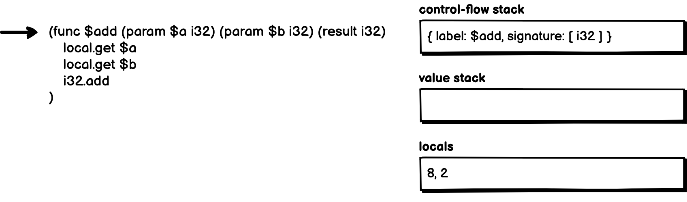
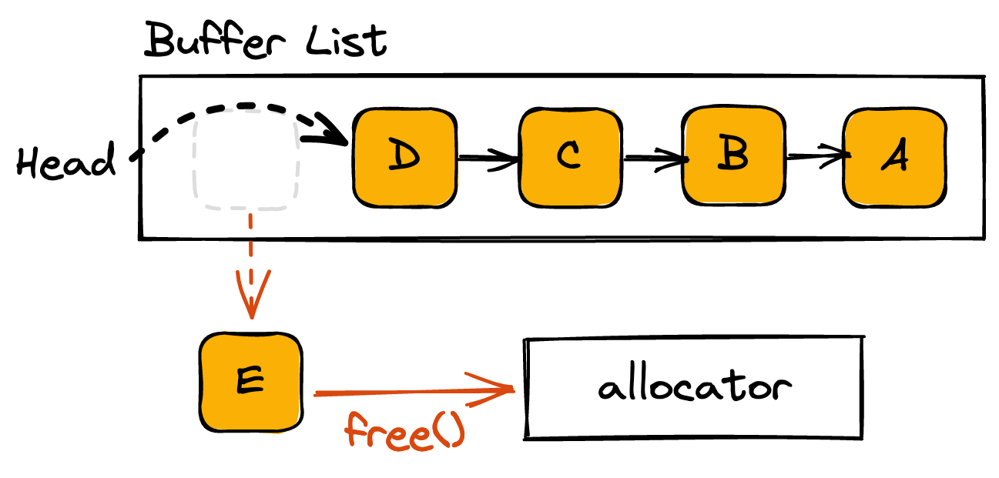

# 02.18.2022 - JavaScript/Beware the delete

Unlike C/C++, the [delete](https://developer.mozilla.org/en-US/docs/Web/JavaScript/Reference/Operators/delete) operator in JavaScript has nothing to do with memory deallocation.

What it actually does is **remove a property from its parent object**. If there is no more reference to that property, it will be marked as [unreachable](https://javascript.info/garbage-collection#reachability) and will be released when the garbage collector (GC) runs.

In the following example, delete `foo.b` will mark the string "yolo" as unreachable, and it will eventually be released from the memory:

```javascript
let foo = {
    a: 12,
    b: "yolo"
};

delete foo.b;

// foo = { a: 12 }
```


But in a scenario when two objects shared the same reference, things might not work as you expected.

```javascript
let boo = { c: true };

let foo = {
    a: 12,
    b: boo
};

let bar = {
    b: boo
};

// foo = { a: 12, b: { c: true } }
// bar = { b: { c: true } }

delete foo.b;

// foo = { a: 12 }
// bar = { b: { c: true } }
```


The string `boo` is shared between `foo` and `bar` as the property `b`, when you delete the reference `foo.b`, the string `boo` is still being referenced in `bar.b`, so it's still reachable. Hence, nothing will be deleted when the GC runs.

---

In strict mode, when the `delete` command is called and the target could not be deleted, a `SyntaxError` will be thrown. If running in non-strict mode (also known as [sloopy mode](https://developer.mozilla.org/en-US/docs/Glossary/Sloppy_mode)), a `false` value will be returned instead.

When a property is created as [non-configurable](https://developer.mozilla.org/en-US/docs/Web/JavaScript/Reference/Operators/delete#non-configurable_properties), it cannot be deleted, and a `TypeError` will be raised instead.

```javascript
'use strict';

var bar = {};
Object.defineProperty(bar, 'hello', { configurable: false });
delete bar.hello; // TypeError


var foo = {};
Object.defineProperty(foo, 'goodbye', { configurable: true });
delete foo.goodbye; // this works fine
```

A variable defined with `var` is either belongs to a scope of the function it's defined in, or the global scope (if not defined inside any function).

When defined in the global scope, a variable is added as a non-configurable property to the global object. So, it cannot be deleted.

```javascript
'use strict';

// global scope
var hello = "world";
delete globalThis.hello; // Type Error
delete hello; // Syntax Error, see below
```

Also, in strict mode, if `delete` is used on a direct reference to a variable, function argument, or a function name, it also throws a Syntax Error:

```javascript
'use strict';

var b = 'xyz';
delete b; // Syntax Error

let c = "hello";
delete c; // SyntaxError:

const d = 15;
delete d; // SyntaxError

function hello(x) {
    delete x; // Syntax Error
}

function hello() {}
delete hello; // Syntax Error
```

Deleting a variable defined with `var` inside a function is also does not works:

```javascript
'use strict';

function hello() {
    var x = "what's up?";
    delete x; // Syntax Error
}
```

---

In non-strict mode, if you define a variable without the `var` keyword, it will be added to the global object as configurable, hence, we can delete it:

```javascript
awesome = true;
delete awesome; // true
```

And if you delete something that does not exist, it also returns true!

```javascript
delete somethingDoesNotExist; // true!!!
```

---

Did you hate the `delete` yet? Let me make you hate it more.

If you `delete` an element from an array, it will be gone, but the length of the array is unchanged:

```javascript
let arr = ['a', 'b', 'c', 'd', 'e', 'f'];

<shape of arr> = {
    0: 'a', 1: 'b', 2: 'c',
    3: 'd', 4: 'e', 5: 'f',
    length: 6
}

delete arr[3];

<shape of arr> = {
    0: 'a', 1: 'b', 2: 'c',
    4: 'e', 5: 'f',
    length: 6
}
```


This makes perfect sense based on the way `delete` works, but it will be a lot of pain if someone has to debug array issues because you deleted an element from the array this way.

The right way to remove an element from an array is either to set it to `undefined` or use `Array.prototype.splice`:

```javascript
arr[3] = undefined;

<shape of arr> = {
    0: 'a', 1: 'b', 2: 'c',
    3: undefined, 4: 'e', 5: 'f',
    length: 6
}

arr.splice(3, 1);

<shape of arr> = {
    0: 'a', 1: 'b', 2: 'c',
    3: 'e', 4: 'f',
    length: 5
}
```

# 02.17.2022 - Data Structures/Representing Graphs

There are two ways to represent a graph data structure, each come with its own pros and cons.

## Using adjacency matrix

An adjacency matrix is a square matrix, each element in the matrix indicate whether pairs of vertices are connected in the graph or not.


For weighted graph, the matrix's element could be some number other than 1.

The drawbacks of using adjacency matrix is its memory usage. No matter how many edges are there, we always need $N \times N$ sized matrix, where $N$ is the number of nodes.

If there are 10000 nodes, then the matrix size will be $4 \times 10000 \times 10000$, that's around 381MB, a huge waste of memory if the graph only have a few edges.

Another point is, if we want to find out which node we can go from a node $u$, we'll need to check the whole row of $u$, which cost a lot of time.

## Using adjacency list

Adjacency list is a collection of unordered lists, each list define the set of vertices that connected to a vertex in a graph.


For the same graph, adjacency list takes less memory than using adjacency matrix.

But if we want to find out if there's an edge between two vertices $u$ and $v$, we would need to traversal the lists twice $O(2n)$. While using adjacency matrix only takes 1 lookup $O(1)$.

# 02.16.2022 - TypeScript/The unknown type

You can think of `unknown` as a type-safe version of `any`. They are both used to represent the type of value that is unknown beforehand (like a result of `JSON.parse`,...), but `unknown` required us to do more type checking before we can actually use the result.

## What's the problem with `any`?

In TypeScript, using `any` is like turning on cheat mode. Values with `any` type implicitly conform to all possible types, so you can write code just like there is no type checking at all.

The following snippet compiled fine. Because `x` has `any` type, TypeScript could not catch any error at compile time:

```typescript
let x: any;
x = 1412;
let a = x.toLowerCase();
```

Only when you run it, the program will crash because there is no `toLowerCase()` method for a number. To prevent errors like this, we have to type check `any` values ourselves.

Another example, let's say you are parsing a JSON string to a data structure and use them later on:

```typescript
interface User {
    name: string;
    email: string;
};

function parseUserData(input: string): any {
    return JSON.parse(input);
};

const user = parseUserData('{ "yolo": "haha" }');
console.log(user.name);
```

In this example, the input JSON string is invalid, so the parse result of `parseUserData` is not in the shape of a `User` at all. We are using the `user` object without validating its value, this would lead to a runtime error. TypeScript could not prevent this because we forget to do type checking (manually) on the `any` typed value.

As you can see, when using `any`, all the benefits of using TypeScript are completely gone.

## The `unknown` type

An `unknown` is a top type (just like `any`) in TypeScript. Anything is assignable to `unknown`, but `unknown` is **not assignable** to anything (except the `any` and the `unknown` itself) **without type assertion** or a **control flow-based narrowing**.

In our first example, if `x` is an `unknown`, TypeScript will throw an error when we attempt to use the value of `x` in the code:

```typescript
let x: unknown;
x = 1412;
let a = x.toLowerCase();
        ^^^^^^^^^^^^^^^^
        Property 'toLowerCase' does not exist on type 'unknown'
```

To use an `unknown` value, we need to narrow them down with type assertion, this to make sure we know what we are doing:

```typescript
let x: unknown;
x = 1412;
if (typeof x === "string") {
    let a = x.toLowerCase();
}
```

Now, let's get back to our second example and see what would TypeScript do if the `parseUserData` function has `unknown` type instead of `any`:

```typescript
interface User {
    name: string;
    email: string;
};

function parseUserData(input: string): unknown {
    return JSON.parse(input);
};

const user = parseUserData('{ "yolo": "haha" }');
console.log(user.name);
            ^^^^^^^^^
            Property 'name' does not exist on type `unknown`
```

So, no more forgetting to do validation:

```typescript@focus=10:12,15:19
interface User {
    name: string;
    email: string;
};

function parseUserData(input: string): unknown {
    return JSON.parse(input);
};

function isUser(input: unknown): input is User {
    return (input as User) !== undefined;
}

const user = parseUserData('{ "yolo": "haha" }');
if (isUser(user)) {
    console.log(user.name);
} else {
    console.log("Sorry, input data is corrupted!");
}
```

---

By enforcing type assertion before usage, the `unknown` type allows us to express the uncertainty just like what we would do with `any` without losing any benefits of the type system.

But be mindful that when doing type assertion, TypeScript does not perform any special checks to make sure the type assertion is valid. So you can write code like this and it still compiles, but the program will not work as expected:

```typescript
const user = parseUserData('{ "yolo": "haha" }') as User;
console.log(user.name); // undefined
```

You can find more in-depth discussions about the `unknown` type here:

- https://mariusschulz.com/blog/the-unknown-type-in-typescript
- https://www.typescriptlang.org/docs/handbook/release-notes/typescript-3-0.html#new-unknown-top-type
- https://www.typescriptlang.org/play?q=214#example/unknown-and-never

# 02.15.2022 - Vim/Record and Replay Macro

Macro is a complex type of repeation, it allow you to record and replay a sequence of actions.

A macro can be created by:

- Press `q<register-name>` to start record mode and store the macro to the `<register-name>`. For example `qa`.
- Perform the sequence of edits or commands.
- Stop the record by hitting `q` again.

At this point, you can replay a macro by pressing `@<register-name>` (for example: `@a`). To replay the macro multiple times, press `<n>@<register-name>` for example `99@a` will replay 99 times.

You can also call a macro while recording, this is called recursive macro.

---

Let's use macro to convert a CSV table into SQL statements. For example, the following data table has 3 columns: `name`, `email` and some id.

```
Kay Mitchell,massa.non@aol.net,2
Micah Christensen,tincidunt.orci@yahoo.couk,1
Shad Carver,ornare.fusce@protonmail.edu,4
Chanda Benton,libero.proin.mi@protonmail.net,8
Darryl Joyner,hendrerit.donec.porttitor@yahoo.org,4
```

We want to convert each line into an SQL statement that look like this. Only the name and email columns are used, the id will be deleted:

```sql
INSERT INTO users (name, email) VALUES ('<column 1>','<column 2>');
```

If we are not using macro, we have to repeat the following edit for each line:

- Press `0` to jump to the beginning of line
- Press `i` to enter Insert mode
- Type `INSERT INTO users (name, email) VALUES ('`
- Then press `<C-o>f,` to jump to the next `,` character without exiting the Insert mode, type in the closing `'`
- Press `<C-o>l` to move left one character (skipping the `,`) and insert the opening `'`
- Press `<C-o>f,` again to jump to the next `,` character, type `');`
- Finally, press `<C-o>D` to delete whatever left on that line

To save time, hit `qq` to create a new macro and store it to the register `q`. Then perform the above editing for the first line. When you are done, hit `q` again.

Now, you can go to each line and press `@q` to let the macro do its job.

If you don't want to manually press `@q` on each line, you can do it in the macro too! When recording your edit, at the last step, go to the next line and press `@q`, then close the recording. This time, the macro will automatically jump to the next line and call itself again until the cursor reached the end of the file.

To see what's your macro look like, open a new buffer and type `"qp`, the content of the macro will be pasted to the buffer:

```
0iINSERT INTO users (name, email) VALUES ('^Of,'^Ol'^Of,');^OD
```

You can edit the macro as you want, and save it back to the `q` register by pressing `"qyy` (`"q` to select the `q` register, and `yy` to copy the whole line).


# 02.14.2022 - TypeScript/Implement Rust-style Result

In Rust, there is a [Result<T, E>](https://doc.rust-lang.org/rust-by-example/std/result.html) type that could return either an `Ok(T)` value if the operation is succeeded, or an `Err(E)` value if the operation is failed.

To mimic this type in TypeScript, first, let's define the `Result<T, E>` type:

```typescript
type Result<T, E = undefined> = { ok: true, value: T }
                            | { ok: false, error: E | undefined };
```

OK, so what's going on here?

The `Result<T, E>` type is a union type that either returns:

- A _success_ result: which is an object that has the field `ok` set to `true`, and the field `value` of type `T` to carry the actual result.
- The _error_ result: which is an object that has the field `ok` set to `false`, and the field `error` of type `E` to carry the error details.

Following Rust's Result type, we can omit the type `E` and write `Result<T>`. To support this, the `error` field needs to have the type of `E | undefined`. And defaults to `undefined` if not specified.

We also need a way to create a _success_ or _error_ value, let's call them `Ok(data: T)` and `Err(error?: E)`. Both functions return a `Result<T, E>` type:

```typescript
const Ok = <T>(data: T): Result<T, never> => {
    return { ok: true, value: data };
};

const Err = <E>(error?: E): Result<never, E> => {
    return { ok: false, error };
};
```

For the `Ok` function, the error type `E` will never be used, so we don't need to worry about the `E` type, hence the return type `Result<T, never>`. The same applied for the `Result<never, E>` type of the `Err` function.

Now, we can use our `Result` type, for example, let's create a `parseBoolean` method that will return either a `boolean` value or an error `string`:

```typescript
const parseBoolean = (input: string): Result<boolean, string> => {
    if ((/(true|false)/i).test(input)) {
        return Ok(input.toLowerCase() === "true");
    }
    return Err("Invalid input!");
}

console.log(parseBoolean("true"));
// -> Result { ok: true, value: true }

console.log(parseBoolean("False"));
// -> Result { ok: true, value: false }

console.log(parseBoolean("what"));
// -> Result { ok: false, error: 'Invalid input!' }

console.log(parseBoolean("haha"));
// -> Result { ok: false, error: 'Invalid input!' }
```

Or another example, this time we return a custom error type:

```typescript
enum IntegerParseError {
    InvalidInput,
    NegativeNumber
};

const parseUnsignedInteger = (input: string): Result<number, IntegerParseError> => {
    let num = parseInt(input);
    if (isNaN(num)) {
        return Err(IntegerParseError.InvalidInput);
    }
    if (num < 0) {
        return Err(IntegerParseError.NegativeNumber);
    }
    return Ok(num);
}

console.log(parseUnsignedInteger("hello"));
// -> Result { ok: false, error: IntegerParseError.InvalidInput }

console.log(parseUnsignedInteger("1238"));
// -> Result { ok: true, value: 1238 }

console.log(parseUnsignedInteger("-12"));
// -> Result { ok: false, error: IntegerParseError.NegativeNumber }
```

Oh, and we can omit the `Err` type as well, it will be defaulted as `undefined`:

```typescript
const parseBooleanTheYoloWay = (input: string): Result<boolean> => {
    if ((/(true|false)/i).test(input)) {
        return Ok(input.toLowerCase() === "true");
    }
    return Err();
}

console.log(parseBooleanTheYoloWay("haha"));
// -> Result { ok: false, error: undefined }
```

And that's it, we have implemented Rust's Result type in TypeScript, with just 7 lines of code! (Well... just the spirit of it, there are a lot more about the real `Result` type of course).

# 02.13.2022 - Parsing/Railroad Diagrams

**Railroad Diagrams** (or **Syntax Diagrams**) are the graphical way to represent [context-free grammars](/everyday/02-10-2022-parsing-context-free-grammar).

Each diagram defines a nonterminal. And they must have an **entry point** and an **endpoint**.

There is no official standard about how should we draw the railroad/syntax diagrams but historically, terminals are represented by round boxes and nonterminals are represented by rectangular boxes.

Let's take a look at the following grammar:

```bnf
sum = signed digit, [ "+", signed digit ] ;
signed digit = [ "-" ], digit ;
digit = "0" | "1" | "2" | "3" | "4" | "5" | "6" | "7" | "8" | "9" ;
```

The railroad diagram of the above grammar can be represented as:

**digit**


**signed digit**


**sum**


In real world, syntax diagram can be seen in [JSON specs](https://www.json.org/json-en.html), or [SQLite](https://www.sqlite.org/syntaxdiagrams.html).

# 02.12.2022 - Parsing/Backus-Naur Form and variants

**Backus-Naur Form (BNF)** is a metasyntax for [context-free grammars](/everyday/02-10-2022-parsing-context-free-grammar), is used to describe the syntax of languages used in computing such as programming languages, instruction sets,...

## The BNF syntax

The specification of BNF is quite simple, it's a set of derivation rules written as:

```bnf
<symbol> ::= expression1 | expression2
```

Where:

- `<symbol>` is the nonterminal, they are always enclosed between the pair `<>`
- `expressions` consists of one or more sequences of either terminals or nonterminals.
- `::=` mean the symbol on the left must be replaced by the expression on the right.
- If a nonterminal can be replaced by multiple expressions, they can be separated by the vertical bar "|"

For example, the following grammar define a signed integer number:

```bnf
<signed integer> ::= <integer> | <sign> <integer>
<integer> ::= <digit> | <integer> <digit>
<digit>  ::= 0 | 1 | 2 | 3 | 4 | 5 | 6 | 7 | 8 | 9
<sign>   ::= -
```

## The Extended BNF syntax

There are many variants of BNF, one of the most popular variants is **Extended BNF (EBNF)**. It added some other symbols so we can explain the grammar better, like the sequence symbol (`,`), repeated symbol (`{}`), optional symbol (`[]`),...

In EBNF, nonterminal does not necessarily enclose between the pair `<>`, and the definition symbol `::=` can be written as `=`. Terminals are strictly enclosed within the quotation marks (`""` or `''`). Each production rule is terminated by the semicolon `;`, and they can contain comments (`(* *)`) too:

```bnf
(* this is a comment *)
digit = "0" | "1" | "2" | "3" | "4" | "5" | "6" | "7" | "8" | "9" ;
```

A concatenation symbol is used to express the sequence of terminals, each separated by a comma (`,`), for example:

```bnf
twelve = "1", "2" ;
ten = "1", "0" ;
one ten = "1", ten ;
```

If a symbol needed to be repeated (zero or more times), we can use `{}` symbols. For example, the following definition matches all powers of ten, including 10, 100, 1000, 10000,...

```bnf
powers of ten = one, zero, { zero } ;
one  = "1" ;
zero = "0" ;
```

Optional can be expressed by `[]`, everything that is optional can be present just once or not at all, for example:

```bnf
signed digit = [ "-" ], digit ;
digit = "0" | "1" | "2" | "3" | "4" | "5" | "6" | "7" | "8" | "9" ;
```

# 02.11.2022 - Parsing/Context-Free Grammar/Leftmost and Rightmost Derivations

A derivation of *a string* for *a grammar* is a *sequence of production rule applications*.

The process of getting the string through the derivation is the parsing process.

For example, with the following grammar:

```
S → S + S        (1)
S → 1            (2)
S → a            (3)
```

The string $1 + 1 + a$ can be derived from the start symbol $S$ using 2 types of derivations: **leftmost derivation** and **rightmost derivation**.

## Leftmost Derivation

In the leftmost derivation, the nonterminals are applied from left to right. Initially, we can apply rule 1 on the initial $S$:

$$
\rightarrow \underline{S + S} \qquad \text{(applied rule 1)}
$$

Next, the leftmost $S$ can be applied with rule 2:

$$
\rightarrow \underline{1} + S \qquad \text{(applied rule 2)}
$$

The next nonterminal is the second $S$. If we apply any of rule 2 or 3, there are still underived characters in the input string, so we choose rule 1 instead:

$$
\rightarrow 1 + \underline{S + S} \qquad \text{(applied rule 1)}
$$

Now, with the remaining characters from the input, we can apply rule 2 on the first $S$:

$$
\rightarrow 1 + \underline{1} + S \qquad \text{(applied rule 2)}
$$

Finally, the last $S$ can be applied with rule 3:

$$
\rightarrow 1 + 1 + \underline{a} \qquad \text{(applied rule 3)}
$$

The above derivation can be represented as the following parse tree:


## Rightmost Derivation

In the rightmost derivation, the nonterminals are applied from right to left.

Initially, we can apply rule 1 on the initial $S$:

$$
\rightarrow \underline{S + S} \qquad \text{(applied rule 1)}
$$

This time, we apply rule 1 on the rightmost $S$:

$$
\rightarrow S + \underline{S + S} \qquad \text{(applied rule 1)}
$$

We found that rule 3 can be applied to the rightmost $S$:

$$
\rightarrow S + S + \underline{a} \qquad \text{(applied rule 3)}
$$

Next, we can apply rule 2:

$$
\rightarrow S + \underline{1} + a \qquad \text{(applied rule 2)}
$$

And finally, rule 2 can be applied again:

$$
\rightarrow \underline{1} + 1 + a \qquad \text{(applied rule 2)}
$$

This derivation can be represented as the following parse tree:


# 02.10.2022 - Parsing/Context-Free Grammar

Context-Free Grammar (CFG) is a grammar where **production (or rewrite) rules** are in the form of:

$$
A \rightarrow \alpha
$$

$A$ is a **single nonterminal symbol**, and $\alpha$ is the **string of terminals or nonterminals**, it can also be empty.

A **terminal** (or **token**) is a symbol that does not appear on the left side of the arrow of any production rule.

In every production rule, a **nonterminal** on the left side of the arrow can always be replaced by everything on the right side of the arrow.

For example, the following grammar defined an integer in [BNF](https://en.wikipedia.org/wiki/Backus%E2%80%93Naur_form) syntax:

```
<digit>   ::= '0' | '1' | '2' | '3' | '4' | '5' | '6' | '7' | '8' | '9'
<integer> ::= ['-'] <digit> {<digit>}
```

In this grammar, `<digit>` and `<integer>` are nonterminals, and the symbols (-, 0, 1, 2, 3, 4, 5, 6, 7, 8, 9) are the terminals.

---

Formally, a Context-Free Grammar is defined by a 4-tuple:

$$
G = (V, \Sigma, R, S)
$$

Where:

- $V$ is a set of nonterminal symbols that we have in the grammar.
- $\Sigma$ is a set of terminals, which make up the content of the sentences.
- $R$ is a set of production rules of the grammar, sometimes can be symbolized as $P$.
- $S$ is the start symbol of the grammar.

---

For example, to parse an algebraic expression with the variables $x$, $y$ and $z$, like this:

$$
(x + y) * x - z * y / (x + x)
$$

We have a grammar:

$$
G = (\\{ S \\}, \\{ x, y, z, +, -, *, /, (, ) \\}, R, S)
$$

With the following production rules:

```
S → x | y | z
S → S + S
S → S - S
S → S * S
S → S / S
S → (S)
```

---

Another example, a grammar $G$ to match all palindromes of the characters $\\{ a, b \\}$ like $aa$, $aabaa$, $aabbaa$, $bab$,...

$$
G = (\\{ S \\}, \\{ a, b \\}, R, S)
$$

```
S → aSa
S → bSb
S → ε
```

The last rule is called ε-production, which means $S$ be rewritten as an empty string.

# 02.09.2022 - JavaScript/Named Imports and Dead Code Elimination

One thing about JavaScript that is sometimes confusing: The **named imports**.

When there is a big module that exports a lot of things, we usually think that we can use named import to get just what we needed in that module, and the rest of the thing will magically disappear. It's not.

What really happens is, in _development_ mode, **everything still gets included** when we bundle the application. In _production_ mode, some bundlers will have the built-in dead code elimination (or tree-shaking) feature kick in to remove unused codes.

For example, let's create a mini project to illustrate this behavior better. We are going to have an `index.js` file for our entry point, and a `lib` folder containing some library files: `a.js`, `b.js` and `c.js`, and a `lib/index.js` file where we blanket export everything in our libs:

```
.
├── package.json
└── src
    ├── index.js
    └── lib
        ├── a.js
        ├── b.js
        ├── c.js
        └── index.js
```

First, let's export a couple of things in our libs:

```js
// lib/a.js
export const a = 10;

// lib/b.js
export const b = "Hello";

// lib/c.js
export const c = (name) => console.log(`HELLO, ${name}!`);
```

Re-export everything in `lib/index.js`:

```js
export * from './a';
export * from './b';
export * from './c';
```

And import just what we needed in `index.js`:

```js
import { b } from './lib';

console.log(b);
```

Now, we build the project in two different modes: development and production, and use `webpack-bundle-analyzer` to analyze the difference:

```json@focus=5:9
{
  "name": "webpack-test",
  "version": "1.0.0",
  "main": "index.js",
  "scripts": {
    "build": "webpack build --profile --json > stats.json",
    "build:dev": "webpack build --mode development --profile --json > stats.json",
    "analyze": "webpack-bundle-analyzer stats.json"
  },
  "license": "MIT",
  "devDependencies": {
    "typescript": "^4.5.5",
    "webpack": "^5.68.0",
    "webpack-bundle-analyzer": "^4.5.0",
    "webpack-cli": "^4.9.2"
  }
}
```

In production build, as expected, there is only module `b.js` got imported, and Webpack went as far as inlined the exported values into the code:

```bash
$ yarn build && yarn analyze
```


But in development mode, you will see that everything got bundled, even the unimported modules like `a.js` or `c.js`:

```bash
$ yarn build:dev && yarn analyze
```


If we modify the `src/index.js` to import directly from module `b` instead of from the blanket re-exports in `lib/index.js`, you will get what you expected when building in development mode:

```js
import { b } from './lib/b';

console.log(b);
```


OK, now we understand how named imports behave in different build modes. As long as we import things selectively, we are good in a production build, right?

Sadly it's not!

Not all libraries made the same, for example, the infamous `lodash` package. This library was architected in a different way (go explore it yourself, check the [lodash-cli](https://github.com/lodash-archive/lodash-cli/blob/master/bin/lodash) and [lodash](https://github.com/lodash/lodash) source code). Named imports won't work as you expected!

```bash
$ yarn add lodash
```

Try to import just the `pad` function in your `src/index.js`:

```js
import { pad } from 'lodash';

console.log(pad('abc', 8, '_'));
```

And build in production mode:

```bash
$ yarn build && yarn analyze
```

What you get is a whopping 531kB of lodash in your bundle, and that's not great:


What if we selectively import just the `lodash/pad` file?

```js@focus=1
import { pad } from 'lodash/pad';

console.log(pad('abc', 8, '_'));
```


The bundle size was reduced to 22.15kB, not bad, huh? But there are still a lot of extra dependencies that got bundled, and Webpack cannot concatenate them to the module.

What you can do is, instead of using `lodash`, just use `lodash-es` package, this is still the lodash but the build is split into modules.

```bash
$ yarn add lodash-es
```

We still need to specify the import path for each method we are using:

```js@focus=1
import { pad } from 'lodash-es/pad';

console.log(pad('abc', 8, '_'));
```


But things get better! The total bundle size is now 1.33kB, a huge leap from 531kb!!!

Maybe I should rename this post's title to: "How I reduced 500% of the bundle size when using Lodash".

**What's next?**

- https://developers.google.com/web/fundamentals/performance/optimizing-javascript/tree-shaking
- https://developers.google.com/web/fundamentals/performance/webpack/decrease-frontend-size

# 02.08.2022 - Cloudflare/Expose local server with Tunnel

Like [Ngrok](https://ngrok.com/), Cloudflare Tunnel is a lightweight daemon that run on your server (or local machine) and create a tunnel between your machine and the Cloudflare edge, allowing you to expose your local services to the internet.


If you have a domain's DNS managed by Cloudflare, you can securely point your domain to the exposed local service.

To use Tunnel, first, install the [`cloudflared`](https://developers.cloudflare.com/cloudflare-one/connections/connect-apps/install-and-setup/tunnel-guide#1-download-and-install-cloudflared) command line tool on your machine.

Then, login via the CLI tool with:

```bash
$ cloudflared tunnel login
```

During the login process, you will be asked to select the domain that you want to use the tunnel with.

Next, create the tunnel:

```bash
$ cloudflared tunnel create <NAME>

# for example

$ cloudflared tunnel create dev-tunnel
```

After this step, you will see the Tunnel's UUID and the JSON config file for that tunnel, you will need this UUID for the next step.

Now, you need to create a `config.yml` file to tell the tunnel how to route traffic from outside to your local application. Each application will have the following fields:

```yaml
url: http://localhost:<LOCAL-PORT>
tunnel: <TUNNEL-UUID>
credentials-file: /root/.cloudflared/<TUNNEL-UUID>.json
```

Now, you need to assign a CNAME record to your domain, so it can point to your tunnel:

```bash
$ cloudflared tunnel route dns <TUNNEL-UUID> <HOSTNAME>

# for example

$ cloudflared tunnel route dns b33fb00f demo-001.huy.rocks
```

Finally, you can run the tunnel:

```bash
$ cloudflared tunnel run <TUNNEL-UUID>
```

You can also setup `cloudflared` as a service, so you don't have to run it manually:

```bash
$ sudo cloudflared service install
$ sudo systemctl enable cloudflared
$ sudo systemctl start cloudflared
```

Lastly, don't forget to start your app:

```bash
$ PORT=<LOCAL-PORT> ./your-secret-service
```

# 02.07.2022 - Security/Timing Attack and Constant-time Compare Algorithm

**Timing attack** is the type of attack when an attacker tries to analyze the time it takes your application to do something, in order to guess the data it's operating on.

For example, you build an API and try to secure it by checking if the access token matched with some secret token:

```typescript@focus=3:7
const verifyAccessToken = (request: RequestData) => {
    const token = request.header['AccessToken'];
    if (token == SECRET_TOKEN) {
        return true;
    } else {
        return false;
    }
};
```

By doing this, your code is vulnerable to timing attacks. The reason is, for most languages, string comparison algorithm works like this:

```
compare(s1, s2):
    if len(s1) != len(s2) then
        return false
    else
        for each character (c1, c2) in (s1, s2)
            if c1 != c2 then
                return false
    finally
        return true
```

The algorithm iterates over each character of the two string, and stop right after it found the difference. So, different inputs will take different amounts of time to run, depending on the location of the first difference.

Using the time difference, the attacker can guess what's inside the secret token. For example, if comparing each character takes 1µs, and some complete mismatch input will fail immediately:

```
Time taken: 0µs

S E C R E T
^
D O N U T S
^
```

Then, the attacker found that input starts the letter `S` takes a slightly longer time to return, they know that the letter `S` exists in the secret code:

```
Time taken: 1µs

S E C R E T
  ^
S O N U T S
  ^
```

Repeat this process for the remaining letters somehow, they can guess their way to the final secret:

```
Time taken: 4µs

S E C R E T
      ^
S E C U R E
      ^
```

So, it's necessary to avoid variable-time comparison algorithms like this when comparing secrets, instead, we should use constant-time comparison algorithms, these algorithms take the same amount of time to run regardless of the location of the difference in the input.

```
constant_compare(s1, s2):
    if len(s1) != len(s2) then
        return false
    else
        result = 0
        i = 0
        while i < len(s1) and i < len(s2)
            result |= s1[i] ^ s2[i]
            i++
        return result == 0
```

**What's next?**

- https://www.cs.rice.edu/~dwallach/pub/crosby-timing2009.pdf
- https://codahale.com/a-lesson-in-timing-attacks/
- https://bryanavery.co.uk/cryptography-net-avoiding-timing-attack/


# 02.06.2022 - Typescript/Testing with Jest

To use Jest for testing a TypeScript library, we need to install a couple of things:

```
yarn add -D jest @types/jest ts-jest ts-node
```

And set up the `jest.config.ts` file to use the `ts-jest` transformer when processing `*.test.ts` files:

```typescript
import type { Config } from '@jest/types';

const config: Config.InitialOptions = {
    verbose: true,
    transform: {
        '^.+\\.ts?$': 'ts-jest',
    }
};

export default config;
```

From now on, you can run `jest` command to start testing every `*.test.ts` file in the project.

```json@focus=3
"scripts": {
    "build": "parcel build",
    "test": "jest"
},
```

# 02.05.2022 - TypeScript/Build a library with Parcel

With Parcel 2.0, it's very easy to build a TypeScript library and publish them to NPM later on, with automatically generated types and built-in support for both CommonJS and ESModule.

Let's say you have a library file located at `src/lib.ts`:

```typescript
export const sum = (a: number, b: number) => a + b;
```

You want to publish this library as an NPM package, so everyone can use it, all you have to do is modify your `package.json` to add the `source`, `main`, `module`, and `types` sections:

```json@focus=4:7
{
  "name": "your-package-name",
  "version": "1.0.0",
  "source": "src/lib.ts",
  "main": "dist/main.js",
  "module": "dist/module.js",
  "types": "dist/types.d.ts",
  "devDependencies": {
    "parcel": "^2.0.0",
    "typescript": "^4.5.5"
  }
}
```

The `source` field defines where your package's entry point is.

The `main` field defines the main target of the build, which is the `dist/main.js` file.

The `module` field is to support ESModule.

And finally, the `types` field tells Parcel to generate a type definition `.d.ts` file for your library.

Run the build command:

```
npx parcel build
```

If everything went well, you can publish your package to NPM now.

# 02.04.2022 - JavaScript/Use any ASCII characters as a variable name

In JavaScript, you can use any ASCII characters as variable or function names, even non-English words or some special symbols:

```javascript
const π = 3.1415
console.log(π);

const Δt = start_time - end_time;
console.log(Δt);

const tên_tui = "Huy";
console.log(tên_tui);

const 五 = 5;
console.log(五 + 10);

function 합계(первый, второй) {
    return первый + второй;
}

console.log(합계(7, 8));
```

But sadly you cannot use emojis:

```javascript
const ⏰ = new Date();
//    ^^ Error: Invalid character
```

Apparently, this is not only possible in JavaScript but in almost every language.

# 02.03.2022 - Typography/Faux Bold and Faux Italic

When you load custom web fonts with just the regular font-weight, no bold or italic styles, the browser tries its best to render them in bold and italic style by **faking** it.

These styles are called **faux** weights and styles.

Faux bold is made by **stretching the vertical strokes** of the original font.


Source: https://graphicdesign.stackexchange.com/a/76034

Faux italic is made by **slanting** the original font at an angle. Some fonts actually use the same technique, and it's called **oblique**.

This makes some fonts look bad, especially for serif fonts, where all the strokes are precisely well made, and usually have **true italic** styles.


Source: https://graphicdesign.stackexchange.com/a/76034

Generally, all designers hate faux styles. But as front-end developers, we should try our best to balance between the performance of the web page and the high standard of our fellow designers. And it's not an easy job, trust me.

If loading different font styles actually bring down your site's performance, you should consider using faux styles. Of course, this should come with the agreement from your designers and carefully test the difference between real and faux styles.

Here is the comparison of the styles between some commonly used web fonts from Google Fonts.


You can see the high-resolution version of the image [here](https://raw.githubusercontent.com/huytd/everyday/master/_meta/faux-real-comparision.png), or see it directly in your browser [here](https://codepen.io/huytd/pen/LYOZqwo) and [here](https://codepen.io/huytd/pen/podbYbV).

**What's next?**

- https://alistapart.com/article/say-no-to-faux-bold/
- https://www.smashingmagazine.com/2012/07/avoiding-faux-weights-styles-google-web-fonts/

# 02.02.2022 - Math/Interpolation Methods

**Interpolation** is a type of estimation method for finding new data points based on the range of a discrete set of known data points.

The most basic kind of interpolation is **Linear Interpolation** (Lerp), it transitions from one value to another at a constant rate. Defined by:

$$
\text{lerp}(a, b, t) = a (1 - t) + b t
$$

It's implementation in Rust should look like this:

```rust
fn lerp(a: f32, b: f32, t: f32) -> f32 {
    return a * (1.0 - t) + b * t;
}
```

The interpolated points between two points A and B should form a straight line, and if we animate the object along the line, it should look like this:


**Cosine Interpolation** is the interpolation method that can generate a smooth acceleration and deceleration between the two data points, can be defined by:

$$
\text{cosine}(a, b, t) = \text{lerp}(a, b, \frac{1-\cos(\pi t)}{2})
$$

Implemented in Rust:

```rust
fn cosine(a: f32, b: f32, t: f32) -> f32 {
    let t2 = (1.0 - (t * PI).cos()) / 2.0;
    return lerp(a, b, t2);
}
```

The acceleration should happen from the beginning of the line, and slow down at the end of the line:


If we want to control the **acceleration** on just one end of the line, we can use different formulas:

$$
\text{acceleration}(a, b, t) = \text{lerp}(a, b, t^2)
$$

Implemented in Rust:

```rust
fn acceleration(a: f32, b: f32, t: f32) -> f32 {
    let t2 = t * t;
    return lerp(a, b, t2);
}
```

Here's how it look when animated:


Or **deceleration** at the end of the line:

$$
\text{deceleration}(a, b, t) = \text{lerp}(a, b, 1-(1-t)^2)
$$

Implemented in Rust:

```rust
fn deceleration(a: f32, b: f32, t: f32) -> f32 {
    let t2 = 1.0 - (1.0 - t) * (1.0 - t);
    return lerp(a, b, t2);
}
```

Animated result:


Above are just some common interpolation methods, for more, please check http://paulbourke.net/miscellaneous/interpolation/

Aside from animation, we can use interpolation functions to generate color, or dynamically generate font size on the web page, create a dynamic layout,... See more details about web-related techniques with interpolation at https://www.smashingmagazine.com/2017/05/fluid-responsive-typography-css-poly-fluid-sizing/

---

Demo source can be found here: https://github.com/huytd/interpolation-demo

# 02.01.2022 - HTML/Auto-fill OTP code from SMS

Safari on iOS and macOS devices have the ability to automatically retrieve and autofill the OTP code sent via SMS if your input has the `autocomplete="one-time-code"` attribute:

```html
<form action="/verify-otp" method="POST">
    <input type="text"
           inputmode="numeric"
           autocomplete="one-time-code"
           pattern="\d{6}"
           required>
</form>
```

To make the SMS OTP more secure, you should compose the SMS message with the origin-bound:

```
Your OTP is 123456

@app-01.huy.rocks #123456
```

The origin bound is a string containing two parts. The domain name is preceded with `@`, and the OTP is preceded with `#`.

When the device receives the SMS, the OTP code will be auto-filled only if the domain matches your website's domain.

For non-iOS devices, OTP autofill also works but not with the `autocomplete="one-time-code"` attribute. We should use WebOTP API instead.

```javascript
navigator.credentials.get({
    otp: {transport:['sms']}
})
.then(otp => input.value = otp.code);
```

More details about WebOTP can be found here: https://web.dev/web-otp/

# 01.31.2022 - Deno/Non-blocking FFI Calls

Sometimes, we want to call an FFI function that is CPU-bound. This would block the main thread. For example, in this `sleep_and_scream` method from Rust, we use `std::thread::sleep` to hang the function for a while, then print out some text:

```rust
use std::{thread, time::Duration};

#[no_mangle]
pub fn sleep_and_scream(millis: u64) {
    thread::sleep(Duration::from_millis(millis));
    println!("WAAAAAAAAAAAA!!!!!!!!!!!");
}
```

Import and call this function in Deno would cause the program to hang for a few seconds before everything can be printed out:

```typescript
const libName = './target/debug/libdeno_blocking_demo.dylib';

const lib = Deno.dlopen(libName, {
    sleep_and_scream: {
        parameters: ["u64"],
        result: "void",
    }
});

lib.symbols.sleep_and_scream(2000);
console.log("It's Deno!!!!");
```

The output:

```
<hang for 2 seconds>
WAAAAAAAAAAAA!!!!!!!!!!!
It's Deno!!!!
```

From version 1.15, Deno supports marking an FFI function as `nonblocking`, which will make the function run on a dedicated blocking thread and return a `Promise`.

```typescript
const libName = './target/debug/libdeno_blocking_demo.dylib';

const lib = Deno.dlopen(libName, {
    sleep_and_scream: {
        parameters: ["u64"],
        result: "void",
        nonblocking: true // <-- add this
    }
});

lib.symbols.sleep_and_scream(2000)
   .then(() => console.log("Finished!")); // <-- It's a promise now
console.log("It's Deno!!!!");
```

With this updated program, the output would be:

```
It's Deno!!!!
<hang for 2 seconds>
WAAAAAAAAAAAA!!!!!!!!!!!
Finished!
```

# 01.30.2022 - Deno/Introduction to FFI API

From version 1.13, Deno introduced the FFI API (foreign function interface API) that allows us to load libraries built in any language that supports the C ABI (like C/C++, Rust, Zig, Kotlin,...).

To load the library, we use the `Deno.dlopen` method and supply the call signature of the functions we want to import.

For example, create a Rust library and export a method called `hello()`:

```rust
#[no_mangle]
pub fn hello() {
    println!("Hello! This is Rust!");
}
```

Specify the crate type in `Cargo.toml` and build it with `cargo build`:

```ini
[lib]
crate-type = ["cdylib"]
```

In debug mode, the output library will be located at `target/debug/librust_deno.dylib`, where `rust-deno` is the project name.

Load this library in Deno with the following code:

```typescript
const libName = './target/debug/librust_deno.dylib';

const dylib = Deno.dlopen(libName, {
    "hello": { parameters: [], result: "void" }
});

const result = dylib.symbols.hello();
```

Finally, run it with Deno, we have to specify the `--allow-ffi` and `--unstable` flags:

```
deno run --allow-ffi --unstable demo.ts
```

We will see the output on the screen:

```
Hello! This is Rust!
```

Notice how we have to specify the call signature of the `hello()` function when importing it from Rust:

```typescript
"hello": { parameters: [], result: "void" }
```

In reality, you might not want to export and import things manually between Rust and Deno, when it comes to more complex data types like string, things get messy.

Let's take a look at our new `hello` method, we want to pass a string as a pointer from Deno to Rust, this means, we have to pass along the length of the string too:

```rust
use core::slice;
use std::ffi::CStr;

#[no_mangle]
pub fn hello(ptr: *const u8, len: usize) {
    let slice = unsafe { slice::from_raw_parts(ptr, len) };
    let cstr = unsafe { CStr::from_bytes_with_nul_unchecked(slice) };
    println!("Hello, {}!", cstr.to_str().unwrap());
}
```

Now, the Deno code:

```typescript
const libName = './target/debug/librust_deno.dylib';

const dylib = Deno.dlopen(libName, {
    "hello": { parameters: [ "pointer", "usize" ], result: "void" }
});

const nameStr = "The Notorious Snacky";
const namePtr = new Uint8Array([
    ...new TextEncoder().encode(nameStr),
]);
const result = dylib.symbols.hello(namePtr, nameStr.length + 1);
```

Let's see what's going on here. On the Rust side, we take a `*const u8` pointer and a length of the string, then convert that pointer into a Rust string with some **unsafe** codes. From the Deno side, we have to encode the string to a byte array and pass the pointer of that array to the Rust code.

The [deno_bindgen](https://github.com/denoland/deno_bindgen) project offered a convenient way to work with data types across the language boundaries, just like _wasm-bindgen_ in Rust WASM.

First, import the `deno_bindgen` crate in your Rust code:

```ini
[dependencies]
deno_bindgen = "0.4.1"
```

Don't forget to install the `deno_bindgen-cli` tool, because we are going to use this tool to build instead of `cargo`:

```
deno install -Afq -n deno_bindgen https://deno.land/x/deno_bindgen/cli.ts
```

Now, in your Rust code, just export or use things as normal:

```rust
use deno_bindgen::deno_bindgen;

#[deno_bindgen]
pub fn hello(name: &str) {
    println!("Hello, {}!", name);
}
```

Run `deno_bindgen` to build your code, the output will be a `bindings/bindings.ts` file in your project's root:

```
deno_bindgen
```

And in your Deno code, simply import the function and call it:

```typescript
import { hello } from './bindings/bindings.ts';

hello("The Notorious Snacky");
```

Finally, run the code:

```
deno run -A --unstable demo.

# Hello, The Notorious Snacky!
```

The new FFI API opened up a lot of possibilities for Deno/TypeScript, for example, there are projects like [deno_sdl2](https://github.com/littledivy/deno_sdl2) that allows us to create native SDL2 applications using Deno and TypeScript, no more Electron!

# 01.29.2022 - Supabase/Row Level Security with application user

In Postgres, tables can have [Row Level Security](https://www.postgresql.org/docs/current/ddl-rowsecurity.html) that restrict the user's action on each row.

With Supabase, we can create a policy that matched the current logged in user, this user is from the application level, not the database user:

```sql
create policy "Users can update their own profiles."
  on profiles for update using (
    auth.uid() = id
  );
```

The `auth.uid()` here is just a Postgres function provided by Supabase to extract the application's current user. See its implementation here: [supabase/auth-schema.sql#Line 77-78](https://github.com/supabase/supabase/blob/ddac1147354a386342e825cbfb70ec63775e6a2b/docker/dockerfiles/postgres/auth-schema.sql#L77-L78).

**What's next?**

- https://github.com/supabase/supabase/blob/3ec9c7c6499e4a61ca88ceb24aa4d81ee24c39ae/web/docs/guides/auth.mdx#how-it-works
- https://github.com/supabase/supabase/blob/23cac64b0c40ab9421108eb830d1b7b35979bd32/web/docs/learn/auth-deep-dive/row-level-security.md


# 01.28.2022 - WebAssembly/Working with wasm-bindgen

[wasm-bindgen](https://github.com/rustwasm/wasm-bindgen) is an awesome tool made by **rustwasm** team, make it very easy to expose Rust's data/functions to JavaScript and vice versa.

To use, you can add a `#[wasm_bindgen]` as an annotation the code where you want to be exposed or import to/from JavaScript, for example:

```rust
#[wasm_bindgen]
extern "C" {
    fn alert(s: &str);
}

#[wasm_bindgen]
pub fn greet(name: &str) {
    alert(&format!("Hello, {}!", name));
}
```

With the above code, we import the `alert()` function from JavaScript to Rust, and expose Rust's `greet()` function to JavaScript.

A Rust struct will be exposed as a class in JavaScript:

```rust
#[wasm_bindgen]
pub struct Foo {
    contents: u32,
}

#[wasm_bindgen]
impl Foo {
    #[wasm_bindgen(constructor)]
    pub fn new() -> Foo {
        Foo { contents: 0 }
    }
}
```

You can import an ES6 module to use in Rust:

```rust
#[wasm_bindgen(module = "./bar")]
extern "C" {
    fn blah(bleh: &JsValue);
}

// blah() function is in bar.js
```

There are two attributes you need to know about, `js_namespace`: indicates the JavaScript type for your binding, and `js_name` for the function name. We can use them to import multiple signatures of a polymorphic JavaScript function, like this:

```rust
#[wasm_bindgen]
extern "C" {
    #[wasm_bindgen(js_namespace = console, js_name = log)]
    fn log_str(s: &str);
    
    #[wasm_bindgen(js_namespace = console, js_name = log)]
    fn log_u32(n: u32);
}
```

Using `js_name`, you can rename not just function, but also classes or types, for example:

```rust
#[wasm_bindgen]
extern "C" {
    // Import JavaScript's String type as JsString in Rust
    #[wasm_bindgen(js_name = String)]
    type JsString;
}

```

And if you're renaming type names, you need to use `js_class` attribute when binding a function of that type:

```rust
#[wasm_bindgen(method, js_class = "String", js_name = charAt)]
fn char_at(this: &JsString, index: u32) -> JsString;
```

The `web_sys` crate also provides some good binding from JS:

```rust
use web_sys::console;

console::log_1(&"Hello using web-sys".into());
```

Finnaly, use [wasm-pack](https://github.com/rustwasm/wasm-pack) to build your Rust project into a WebAssembly module, then use it in your JavaScript project.

```
wasm-pack build
```

If you're using TypeScript or NodeJS, you might want to take a look at **wasm-bindgen** command line tool https://rustwasm.github.io/wasm-bindgen/reference/cli.html

If you're working with various data type/struct, it's very helpful to use **serde** for serializing/deserializing into and from JS. See more at https://rustwasm.github.io/wasm-bindgen/reference/arbitrary-data-with-serde.html


# 01.27.2022 - WebAssembly/Stack-based execution model

WebAssembly is executed using a stack-based virtual machine.

There are two types of execution of a WASM module:

- **Instance Execution:** If the module contains a **start** section, the referenced function here will be executed **right after the module is loaded**.
- **Function Execution:** when a function is called via `call` instruction from within the same module, by instance execution or by another module, or from the host environment.

When a function is called, several data structures are created:
- A control-flow stack: containing the _label_ of the function, a _signature_ of the function
- A _value_ stack, which carries the values between instructions
- A _locals_ vector containing the types of the function's parameters or any local variables
- And the current position of the function execution

The value of each incoming argument is copied to the local, a _signature_ is the return type of the function, if there is no return type, it's `void`.

The execution starts from the first instruction in the function's body. At each instruction, the top value of the **value stack** will be popped out to be used as the operand of that instruction. Any return values will be pushed back to the **value stack**.

If the current execution position is past the end of the function, the **function return execution** will kick-off. One value for each return type in the **signature** will be popped from the **value stack**, and provided to the caller.

Let's take a look at the execution of a simple function when we call it with `add(8, 2)`:

```wasm
(func $add (param $a i32) (param $b i32) (result i32)
  local.get $a
  local.get $b
  i32.add
)
```

The stacks are initialized, the return signature of the `$add` function is pushed to the control-flow stack, the value stack is empty and the local containing all the arguments when we called:



Starting from the first instruction of the function's body, at every `local.get` instruction, the corresponding value is read from the local and pushed to the value stack:


At the `i32.add` instruction, the top two values of the value stack are popped out to be used as the operands. After execution, the result is `10`, being pushed back to the stack:


At this step, we reached the end of the `$add` function, the control-flow stack will be popped, the return signature of this function is `i32`, so the value `10` of type `i32` will be returned to the caller of the `$add` function. The execution concluded.

# 01.26.2022 - WebAssembly/Tables and Dynamic Linking

**Table** is another shared instance in WebAssembly just like Linear Memory, but it can only store **function references**. It can be shared between modules, and all you can do with tables is to make **indirect function calls** to the functions references stored in that table.

This feature allows you to implement dynamic linking, we can have a shared module that provides some functionalities that can be called from different modules.

For example, let's create a shared Table and pass this table into two different modules. In one module, we create a function called `add` and store this function's reference to the shared table. And then, call this `add` method from another module.


First, let's write the first module, since the table is imported from JavaScript, we are going to use the `import` segment to create the table:

**math.wat**

```wasm
(module
    (import "js" "table" (table 1 anyfunc))

    (func $add (param $a i32) (param $b i32) (result i32)
        get_local $a
        get_local $b
        i32.add)

    (elem (i32.const 0) $add)
)
```

After defining the function `$add`, we store it to the offset 0 of the table with the `elem` instruction.

Next, we create another module, also use the imported table from JavaScript, and use `call_indirect` instruction to call the function at offset 0 of the table:

**calc.wat**

```wasm
(module
    (import "js" "table" (table 1 anyfunc))

    (type $t0 (func (param $a i32) (param $b i32) (result i32)))

    (func (export "add_five") (param $x i32) (result i32)
        (call_indirect (type $t0) (get_local $x) (i32.const 5) (i32.const 0))
    )
)
```

Note that, we need to define the type `$t0` so `call_indirect` will have the information of what's the function call looks like.

Finally, let's build these modules with `wat2wasm`, create a JavaScript application, define a shared table and load the two modules:

```javascript
const fs = require('fs');

const createInstance = async (path, importObj) => {
    const wasmSource = fs.readFileSync(path);
    const wasmBuffer = new Uint8Array(wasmSource);
    const wasm = await WebAssembly.instantiate(wasmBuffer, importObj);
    return wasm.instance;
};

const importObj = {
    js: {
        table: new WebAssembly.Table({ initial: 1, element: "anyfunc" })
    }
};

Promise.all([
    createInstance("math.wasm", importObj),
    createInstance("calc.wasm", importObj)
]).then(instances => {
    // get ready
});
```

The `Promise.all` returned two `instance` in an `instances` array, one for the `math.wasm` module and another one for the `calc.wasm` module. We only need to use the instance of `calc`.

Calling `add_five` from `calc`'s instance, WASM will make the call to `add` function from the `math` module, and return the result:

```javascript
const instance = instances[1];
const result = instance.exports.add_five(10);
// result = 15
```

If we are not loading the `module.wasm`, and still trying to make a call to `add_five`, the error will occur when WASM tries to call the `add` method:

```
wasm://wasm/7396aa4e:1

RuntimeError: null function or function signature mismatch
    at wasm://wasm/7396aa4e:wasm-function[0]:0x43
```


# 01.25.2022 - WebAssembly/Working with Linear Memory

Linear Memory in WebAssembly is a contiguous and mutable array of **uninterpreted bytes**. It is shared between the WASM module and the host runtime.

It can be expanded by calling `WebAssembly.Memory.grow`. The memory will be growing by each block of page size (about 64KB). But the memory layout might be changed after growth, so keep this in mind if we are holding any pointer to the data in linear memory.

By default, the memory is not shared between instances/threads. We will not go into the details of shared memory for now.

Linear Memory is mainly used for passing data back and forth between JavaScript and WebAssembly.

In the following example, we create a 1-page memory, store a string `"xịn xò"` on the memory and export them from a WASM module:

**demo.wat**

```wasm
(module
  (memory (export "memory") 1)
  (data (i32.const 0) "xịn xò")
)
```

The `data` segment initializes the memory and puts the string to the first 9 bytes (the word "xịn xò" is a UTF-8 encoded string, with 6 characters but actually takes 9 bytes).

You can compile this WAT file to a WASM module with the command `wat2wasm` from the [WebAssembly Binary Toolkit](https://github.com/WebAssembly/wabt):

```
wat2wasm demo.wat
```

Then we can load them in some JavaScript environment, for example, in NodeJS:

**demo.js**

```javascript
const fs = require('fs');
const wasmSource = fs.readFileSync('demo.wasm');
const wasmBuffer = new Uint8Array(wasmSource);

WebAssembly.instantiate(wasmBuffer, {}).then(wasm => {
    const instance = wasm.instance;
});
```

Now, let's read that 9 bytes of memory in our JavaScript code:

```javascript
const memory = instance.exports.memory;
const buffer = new Uint8Array(memory.buffer, 0, 9);
// buffer = Uint8Array(9) [
//   120, 225, 187, 139,
//   110,  32, 120, 195,
//   178
// ]
```

The `buffer` array is just a raw bytes array, we can convert it into an UTF-8 String with:

```javascript
const data = new TextDecoder("utf8").decode(buffer);
// data = "xịn xò"
```

Now, let's get into a more complex example, where we can see how's the linear memory is being read/written in both JavaScript and WASM.

We will create a WASM module with a `sum` method. This method does not take any parameters. Instead, it will read two `i32` numbers, `a` and `b` from the linear memory with the `i32.load` instruction, add them together with `i32.add` instruction, and store the result into the memory with `i32.store` instruction. And then, on the JavaScript side, we will write two numbers to the memory and call the `sum` method, then read the memory for the result.


Each `i32` number takes 4 bytes, so the address of the `a`, `b`, and `result` in the linear memory is 0, 4, and 8, and we are going to need 12 bytes in total.


We will create the memory from the JavaScript side and import it into our WASM module with the `import` segment.

**sum.wat**

```wasm
(module
  (memory (import "js" "mem") 1)
  (func (export "sum")
    (i32.store
      (i32.const 0x8)
      (i32.add
        (i32.load (i32.const 0x0))
        (i32.load (i32.const 0x4))
      )
    )
  )
)
```

Compile the above program with `wat2wasm`, we get `sum.wasm` module. In our JavaScript program, we will need to create an instance of `WebAssembly.Memory` and pass them as an import when we instantiate the WASM module

**sum.js**

```javascript
const fs = require('fs');
const wasmSource = fs.readFileSync('sum.wasm');
const wasmBuffer = new Uint8Array(wasmSource);

const memory = new WebAssembly.Memory({ initial: 1 });

WebAssembly.instantiate(wasmBuffer, { js: { mem: memory }}).then(wasm => {
    const instance = wasm.instance;
});

```

In the previous example, we refer to the memory buffer with an `Uint8Array`. This time, we are working with 32-bit values, we can create an `Uint32Array` instead:

```javascript
const buffer = new Uint32Array(memory.buffer, 0, 3);
```

We want to calculate the sum of `7 + 4 = 11`. 


First, we need to write the number `7` to the first 4 bytes of the `buffer`, write the number `4` to the next 4 bytes of the buffer:

```javascript
buffer[0] = 7;
buffer[1] = 4;
// buffer = Uint32Array(3) [ 7, 4, 0 ]
```

Now, call the `instance.exports.sum()` method. The result will be stored in the last 4 bytes of the `buffer`.

```javascript
instance.exports.sum();
// After this call, the value of buffer array is
// buffer = Uint32Array(3) [ 7, 4, 11 ]
```

It seems fine to work with the bytes directly in linear memory in the above examples since we are working with simple data types.

In reality, dealing with higher-level JavaScript data types like Object or Map requires more management and underlying conversion. There are libraries like [wasm-bindgen](https://github.com/rustwasm/wasm-bindgen/) created for this kind of task. We will take a deeper look at these libraries in later articles.

# 01.24.2022 - WebAssembly/How to read WASM code

Just like a good-old-Assembly program, a WebAssembly module is made up of different sections:


_(Source: [rsms/Introduction to WebAssembly](https://rsms.me/wasm-intro))_

The **type** section contains a list of each **unique function signature** used in the module for exported and imported functions.

The **import** section declares any imported function with their call signature and return type.

The **function** section is the index of each function, which is later defined in the code section.

The **export** section declares any part of the module that can be accessed by the host environment (JavaScript engines, WASM runtimes,...).

The **table** section maps any values that cannot be represented directly in WebAssembly, like JavaScript objects or OS file handles.

The **memory** section defines the initial size of the module's memory. Note that this section only describes the memory size. The data section is used to initialize the memory.

The **start** section defines the entry point of the module. It's the function that will be called when the module is loaded.

The **code** section defines all the functions in the module. The order of the functions here is the same as the order they're written in the source code.

With that, it's time to take a look inside a WASM module and see if we can understand anything now.

Suppose we have a Rust code that imports the `window.alert` method from JavaScript and export two functions: `alert_from_rust` and `add_five`:

```rust
use wasm_bindgen::prelude::*;

#[wasm_bindgen]
extern {
    pub fn alert(msg: &str);
}

#[wasm_bindgen]
pub fn alert_from_rust() {
    alert("This is Rust!");
}

#[wasm_bindgen]
pub fn add_five(a: i32) -> i32 {
    return a + 5;
}
```

Compile this code to a WASM using `wasm-pack`, and use [`wasm2wat`](https://webassembly.github.io/wabt/demo/wasm2wat/) to convert it to a readable WebAssembly Text Format (WAT, or WTF, whatever way you want to call it), here's what we get:

```wasm
(module
  (type $t0 (func))
  (type $t1 (func (param i32 i32)))
  (type $t2 (func (param i32) (result i32)))
  (import "alert" (func $alert (type $t1)))
  (func $alert_from_rust (export "alert_from_rust") (type $t0)
    (call $alert
      (i32.const 1048576)
      (i32.const 13)))
  (func $add_five (export "add_five") (type $t2) (param $p0 i32) (result i32)
    (i32.add
      (local.get $p0)
      (i32.const 5)))
  (memory $memory (export "memory") 17)
  (data $d0 (i32.const 1048576) "This is Rust!\00\00\00\04"))
```

In the Rust code, there are 3 functions with the following call signature:

```rust
alert_from_rust // () -> void
alert           // (&str) -> void
add_five        // (i32) -> i32
```

Their corresponding type in the **type section** is:

```wasm
(type $t0 (func))
(type $t1 (func (param i32 i32)))
(type $t2 (func (param i32) (result i32)))
```

Each type is assigned a label `$t0`, `$t1`, and `$t2`. Later on, you'll see these labels being used in the **import** and the **code** section:

```wasm
(import "alert" (func $alert (type $t1)))
(func $alert_from_rust (export "alert_from_rust") (type $t0) ...)
(func $add_five (export "add_five") (type $t2) (param $p0 i32) (result i32) ...)
```

And we can see that the WASM module are exporting our Rust's function as well as the **memory**:

```wasm
(export "alert_from_rust")
(export "add_five")
(export "memory")
```

The string literal that we passed into the `alert` function inside `alert_from_rust` is a value that Rust already known as compile-time, so it was initialized inside the **data** section:

```wasm
(data $d0 (i32.const 1048576) "This is Rust!\00\00\00\04"))
```

Now, let's circle back to the `alert` method. We can see its type definition `$t1` has taken two `i32` params instead of a string, and it got called by:

```wasm
(call $alert
  (i32.const 1048576)
  (i32.const 13))
```

In fact, there is no string type in WebAssembly, and this call shows us how we could refer to a value defined in the **data** section. The value `1048576` is the address of the string in the memory, and `13` is its length.

It's not necessary to understand WASM code to work with WASM, but it's super helpful to be able to have a peek inside the "blackbox" and understand what's going on under the hood. It will help a lot when it comes to debugging your WASM code too.


# 01.23.2022 - WebAssembly/A quick guide

WebAssembly is a new type of code that **can be loaded and run by the JavaScript VM** on web browsers. It can also be run natively on the computer by other WASM runtimes like [Wasmer](https://wasmer.io/).

WebAssembly is fast and could provide a near-native performance for several reasons:

- It's an assembly-like binary format, that takes very little time to **load** and **parse**.
- **Compiling and optimizing** in JavaScript engines also takes less time than JavaScript because it's already very close to machine code, and for most of the time, it's already being optimized by Rust/C++/Go compiler.
- The JavaScript engines don't need to **reoptimize** WebAssembly code the way it does for JavaScript in **runtime**. Hence, executing often takes less time.
- Garbage collection is not required since the memory is managed manually.

Read more about this in the "[What makes WebAssembly fast?](https://hacks.mozilla.org/2017/02/what-makes-webassembly-fast/)" article from Mozilla.

At a high level, you can think of WebAssembly as a module that has been compiled into a **near-machine code** format. It can be loaded into the JavaScript VM and run along with your JavaScript application, just like any JavaScript module.

It is not designed to replace JavaScript, but to allow web developers to take advantage of the strong points of both languages.

The process of creating and using a WebAssembly module looks like the following diagram:


You can use C/C++, Rust, or other languages to compile your code into a WASM **Module**. Each module are made up of [several sections](https://rsms.me/wasm-intro), the most important sections are:

- **References Table**: a resizable typed array of references to functions and other stuff.
- **Linear Memory**: is a resizable ArrayBuffer that is shared and can be read or written in WebAssembly and your JavaScript context.

In JavaScript, you can load this WASM module and create an **Instance** that contains the references to the table and memory of the WASM module. When creating an instance it's also possible to share some references like variables or functions from JavaScript to WASM.

In the future, WASM modules will be loadable just like any ES2015 modules with `<script type="module">`.

To load and create a WebAssembly instance in JavaScript **from scratch**, you need to:

- Fetch and load the WASM module
- Compile it and create an instance from it with [`WebAssembly.instantiate`](https://developer.mozilla.org/en-US/docs/Web/JavaScript/Reference/Global_Objects/WebAssembly/instantiate) or [`WebAssembly.instantiateStreaming`](https://developer.mozilla.org/en-US/docs/Web/JavaScript/Reference/Global_Objects/WebAssembly/instantiateStreaming)

For example, the following snippets load and create an instance from a WASM module named `demo.wasm`, it also creates and imports a `hello_from_js` function from JavaScript so it can be used from within the WASM module:

```javascript
const importObj = {
    imports: {
        hello_from_js: (message) => console.log(message);
    }
};

const source = fetch('demo.wasm');
WebAssembly.instantiateStreaming(source, importObj)
    .then(wasm => {
        const instance = wasm.instance;

        // call a method from WASM
        instance.exports.hello_from_rust("Huy");

        // access the linear memory
        const memory = new Uint8Array(instance.exports.memory.buffer);

        ...
    });
```

Using Rust, you can compile your Rust module into a WASM module by using [wasm-pack](https://github.com/rustwasm/wasm-pack). For example, the following Rust program imports the above `hello_from_js` function and call it from the `hello_from_rust` method:

```rust
use wasm_bindgen::prelude::*;

#[wasm_bindgen]
extern {
    pub fn hello_from_js(s: &str);
}

#[wasm_bindgen]
pub fn hello_from_rust(name: &str) {
    hello_from_js(&format!("Hello, {}!", name));
}
```

wasm-pack can also make it easier to load and instantiate the WASM module from JavaScript. More on that in the next article.

Currently, WebAssembly is still at MVP phase, therefore, it's still has a lot of limitation like limited WebAPI access, linear memory still limited to 4GB and it's only supports integer and float number. But libraries like wasm-bindgen are made to provide some glue codes that does many things under the hood and bring a wider support for different data types you can share between JavaScript and other languages.

# 01.22.2022 - Rust/Notes about Vector and memory allocation

A Vector in Rust is fundamentally a (pointer, capacity, length) triplet. For example, a `Vec<Char>` containing two elements `'a'` and `'b'`, with the capacity of 4, can be visualized as the following diagram:

```
            ptr      len  capacity
       +--------+--------+--------+
       | 0x0123 |      2 |      4 |
       +--------+--------+--------+
            |
            v
Heap   +--------+--------+--------+--------+
       |    'a' |    'b' | uninit | uninit |
       +--------+--------+--------+--------+
```

The **pointer** will always be pointed to the head of contiguous elements allocated on the heap.

The **capacity** of a Vector is the amount of space allocated for any future elements that will be added to that Vector.

If the Vector's length exceeds the capacity, more space will be allocated to increase the capacity, but all the Vector's elements will need to be **reallocated**. This can be slow, so creating a Vector with some capacity beforehand is always recommended.

When you create a Vector with `Vec::new`, `vec![]` or `Vec::with_capacity(0)`, the capacity will be 0. The Vector will not allocate until new elements are pushed into it.

A Vector **will never automatically shrink itself**, even if it's empty. This is to ensure there are no unnecessary allocations and deallocations. If you wish to free up unused memory, use [`Vec::shrink_to_fit`](https://doc.rust-lang.org/std/vec/struct.Vec.html#method.shrink_to_fit) or [`Vec::shrink_to`](https://doc.rust-lang.org/std/vec/struct.Vec.html#method.shrink_to).

When a Vector is dropped, there is **no guarantee on the order** of which element will be dropped first.

`Vec::push` and `Vec::insert` will never allocate/reallocate if the capacity is sufficient. And it only happens when `len == capacity`. On the other hand, bulk insertion methods like `Vec::append` may reallocate even when it's not necessary.


# 01.21.2022 - Math/Count number of digits with Logarithm

Suppose that a number $n$ has $d$ digits, then:

$$
10^{d-1} \leq n \lt 10^{d}
$$

Because $10^d$ is the smallest integer with $d + 1$ digits.

Now, take logs base 10 of this relation:

$$
log_{10}{(10^{d-1})} \leq log_{10}{n} \lt log_{10}{(10^d)}
$$

This becomes:

$$
d-1 \leq log_{10}{n} \lt d
$$

If you now take the integer part of $log_{10}{n}$, throwing away everything to the right of the decimal point, you will get $\lfloor log_{10}{n} \rfloor = d-1$. Thus, $d = \lfloor log_{10}{n} \rfloor + 1$.

For example, $234$ is a $3$ digits number, take the logs base 10:

$$
log_{10}{(234)} \approx 2.369215
$$

If we take the integer part and throw away everything to the right of the decimal point, it's $2$.

The calculation can be done programmatically like this:

```cpp
#include <math>

int digits = log10(n) + 1;
```

**Source:** [Proof: How many digits does a number have? - StackExchange Mathematics](https://math.stackexchange.com/questions/231742/proof-how-many-digits-does-a-number-have-lfloor-log-10-n-rfloor-1)


# 01.20.2022 - Rust/Blanket Implementation

By using generic parameters, you can `impl` a trait for any type that satisfies some trait bounds, for example, implement trait `ToString` for every type `T` that implemented the `Display` trait:

```rust
impl<T: Display> ToString for T {
    ...
}
```

This technique is called _**blanket implementation**_. It's being used widely in Rust standard library.

You can even omit the trait bound to implement your trait for every type:

```rust
mod foo {
    pub trait Foo {
        fn bar(&self) {
            println!("Foo::Barrrrrr!!!");
        }
    }
    impl<T> Foo for T {}
}

use foo::Foo;

let i = 10i32;
i.bar();
```


# 01.19.2022 - Rust/The Never Type

Rust has a special type `!` to imply that there is no return value. Usually called _never type_.

It allows us to write code like this:

```rust
let num = match input.parse::<f32>() {
    Ok(num) => num,
    Err(_) => {
        println!("ERROR: Cannot parse the given input!");
        return;
    }
};

println!("Parse successfully!");
```

We expect the `num` variable to have the type `f32` if the input is successfully parsed into an `f32`. But in case of parsing error, we want to print something on the screen and gracefully exit the application (instead of crashing it).

Although all branches of a `match` statement should return the same data type, because the return type of `return` is a `!`, Rust can guess the type of `n`. The type `!` can be coerced to any other type.

In the code above, when the `Err` case happens, the value of `num` will never get assigned, and the execution also stops after the `let num` statement, the last `println!` statement will never reach.

Other than `return`, the `break`, `continue`, `exit` and `panic!` expressions also have `!` type.

One more practical example usage of `!` is when you are asking a number from the user, and only continue the execution if the input is valid:

```rust
let mut buffer = String::new();
let mut done = false;
while !done {
    println!("Please enter a valid number: ");
    std::io::stdin().read_line(&mut buffer).unwrap();
    let num = match buffer.trim().parse::<i32>() {
        Ok(num) => num,
        Err(_) => continue
    };
    println!("The number is: {}", num);
    done = true;
}
```

**References:**

- https://doc.rust-lang.org/std/primitive.never.html
- https://doc.rust-lang.org/book/ch19-04-advanced-types.html?highlight=str#the-never-type-that-never-returns


# 01.18.2022 - Rust/Lifetime Elision Rules

Before Rust 1.0, writing code that returns a reference without any lifetime annotation wouldn't compile. Because Rust does not know what's the lifetime of the returned reference:

```rust
// 🚫 would not compile
fn first_word(s: &str) -> &str { ... }

// ✅ compile
fn first_word<'a>(s: &'a str) -> &'a str {
```

In later versions, the Rust compiler can automatically analyze and figure out the lifetime. It is called **lifetime elision** and is based on a set of rules. For now, these rules are applied for the `fn` and `impl` blocks. In the future, more elision rules will be added.

In a function, lifetimes on the parameters are called **input lifetimes**, and lifetimes on the return values are called **output lifetimes**.

If the lifetimes are not explicitly annotated, the compiler will try to apply these three rules:

- Each parameter that is a reference gets its own lifetime parameter, for example:

  ```rust
  fn foo(first: &str)
  // is equivalent to
  fn foo<'a>(first: &'a str)

  fn foo(first: &str, second: &Bar)
  // is equivalent to
  fn foo<'a, 'b>(first: &'a str, second: &'b Bar)
  ```

- If there is exactly one input lifetime parameter, that lifetime is assigned to all output lifetime parameters:

  ```rust
  fn foo(first: &str) -> &str
  // is equivalent to
  fn foo<'a>(first: &'a str) -> &'a str
  ```

- If there are multiple input lifetime parameters, but one of them is `&self` or `&mut self`, the lifetime of `self` will be assigned to all output lifetime parameters:

  ```rust
  fn foo(&self, first: &str) -> &str 
  // is equivalent to
  fn foo<'a, 'b>(&'a self, first: &'b str) -> &'a str
  ```

If all of the above rules are satisfied, you are good to go. If the compiler fails to apply any of the above rules, it will stop and show a compile error, asking you to annotate the lifetime yourself.

For example, in the following function, there are two lifetime parameters `'a` and `'b`:

```rust
// 🚫 would not compile
fn split<'a, 'b>(source: &'a str, delimiter: &'b str) -> &??? str
```

In this case, the compiler could not figure out the output lifetime, so it will show a compile error.


# 01.17.2022 - JavaScript/Console Assert Command

The built-in `console` comes with the `console.assert` method, which is pretty useful to write some tests in your code.

This method has the syntax of:

```javascript
console.assert(assertion: bool, msg: string, obj1: any, obj2: any,...)
```

When the `assertion` expression returns `false`, the execution will be stopped, and the `msg` string will be printed out after the `"Assertion failed:"` message. You can format the `msg` just like how you format strings in languages like C++, using any `obj` followed after `msg`.

Otherwise, the execution continues.

For example:

```javascript
const actual = 10;
const expected = 15;
console.assert(actual === expected, "Expected %d. Got %d", expected, actual);
console.log("All good!);
```

Result:

```
Assertion failed: Expected 15. Got 10
```

If we change `actual = 15`, the output on the screen will be:

```
All good!
```


# 01.16.2022 - Rust/Dealing with Integer Overflow

Overflow can happen when doing integer arithmetics in Rust, for example:

```rust
let _ = 255u8 + 1;
let _ = 0u8 - 1;
```

Rust handle overflow differently between Debug and Release mode:

- In **debug** mode, Rust includes checks for integer overflow that will **panic** at runtime.
- In **release** mode, there is no integer overflow check, so, **no panic**. Instead, Rust will perform _two's complement wrapping_, for the `u8` type, the value 256 will be wrapped into 0, the value 257 will be wrapped into 1, while the value -1 will be wrapped into 255, and so on. Hence, be mindful that the values you get might not be the ones you expected. Or you can explicitly enable overflow check by adding `overflow-checks = true` to your `Cargo.toml`.

To deal with integer overflow, Rust provides some built-in functions for integer types so you can explicitly control the overflow behavior:

- **Wrapping the values** with `wrapping_*` methods, like `wrapping_add`:

  ```rust
  u8::MAX.wrapping_add(2) == 1u8
  0u8.wrapping_sub(1) == u8::MAX
  ```

- **Returning a wrapped value, and an overflow indicator** with `overflowing_*` methods:
  
  ```rust
  5u8.overflowing_add(1) == (6u8, false)
  u8::MAX.overflowing_add(1) == (0u8, true)
  ```

- **Check and return `None`** if there is an overflow with `checked_*` methods:

  ```rust
  5u8.checked_add(1) == Some(6u8)
  u8::MAX.checked_add(1) == None
  ```
  
- **Saturate at the maximum or minimum value** of the type with `saturating_*` methods:

  ```rust
  u8::MAX.saturating_add(5) == u8::MAX
  0u8.saturating_sub(5) == 0u8
  ```

To reduce boilerplates, Rust provides [`Wrapping<T>`](https://doc.rust-lang.org/std/num/struct.Wrapping.html) and [`Saturating<T>`](https://doc.rust-lang.org/std/num/struct.Saturating.html) types to automatically provide the desired overflow behavior for your types:

```rust
use std::num::Saturating;

let a = Saturating(u32::MAX);
(a + 1).0 == u32::MAX
```

When casting between types, wrapping is the default behavior:

```rust
(257u32 as u8) == 1u8
```

**References:**

- https://github.com/rust-lang/rfcs/blob/master/text/0560-integer-overflow.md
- https://huonw.github.io/blog/2016/04/myths-and-legends-about-integer-overflow-in-rust/


# 01.15.2022 - Rust/Deref and DerefMut

The traits [`std::ops::Deref`](https://doc.rust-lang.org/std/ops/trait.Deref.html) and [`std::ops::DerefMut`](https://doc.rust-lang.org/std/ops/trait.DerefMut.html) are used for **explicit dereference operations** (immutable or mutable), like:

```rust
// immutable dereference
println!("{}", *a);

// mutable dereference
*a = <something>;
```

If a type `T` implements `Deref<Target=U>` or `DerefMut<Target=U>` like this:

```rust
impl<T> Deref for Something<T> {
  type Target = T;

  fn deref(&self) -> &Self::Target {
    &self.value
  }
}

impl<T> DerefMut for Something<T> {
  type Target = T;

  fn deref_mut(&mut self) -> &mut Self::Target {
    &mut self.value
  }
}
```

- Any usage of `*a` in **immutable contexts** are equivalent to `*Deref::deref(&a)`, and `*DerefMut::deref_mut(&mut a)` in **mutable contexts**.

- Any values of type `&T` will be coerced to values of type `&U`, and values of type `&mut T` will be coerced to values of type `&mut U`. Mutable references `&mut T` can also be coerced to immutable references `&U`, not the other way around, immutable references `&T` cannot be coerced to mutable references `&mut U`.

  For example, because type `String` [implemented `Deref<U=&str>`](https://doc.rust-lang.org/src/alloc/string.rs.html#2319-2326), we can pass a reference `&String` to any function that takes a `&str`:

  ```rust
  fn hello(name: &str) {
    ...
  }
  
  let name: String = String::from("Huy");
  hello(&name); // this works
  ```

- Type `T` will implicitly implement all the immutable (for `Deref`) and mutable (for `DerefMut`) methods of type `U`.

  For example, when creating a wrapped type using tuple struct ([see previous post](/everyday/01-14-2022-rust-implement-external-traits-for-external-types)), you cannot access any methods of the inner type from the wrapped type:

  ```rust
  struct List(Vec<i32>);
  
  let list = List(vec![1, 2, 3]);
  println!("{}", list.last());
  
  // 1    | struct List(Vec<i32>);
  //      | ----------------------
  //      | |
  //      | method `last` not found for this
  //      | doesn't satisfy `List: Iterator`
  // ...
  // 5    |   println!("{}", list.last());
  //
  ```

  If you implement `Deref` or `DerefMut` for the wrapped type, it will implicitly implement all the immutable or mutable methods from the inner type:

  ```rust
  impl Deref for List {
    type Target = Vec<i32>;
    
    fn deref(&self) -> &Self::Target {
      &self.0
    }
  }
  
  println!("{}", list.first());
  // Output: 1
  ```

You can read more about `Deref` and `DerefMut` in [The Rust Programming Language Book](https://doc.rust-lang.org/book/ch15-02-deref.html), or in the [documentation](https://doc.rust-lang.org/std/ops/trait.Deref.html).


# 01.14.2022 - Rust/Implement external traits for external types

One of the rules for working with traits in Rust is: You are not allowed to implement a trait on a type if either the trait or the type is not local to your crate.

For example, within your program, both the trait `fmt::Display` and type `Vec` are external because they're defined in the standard library. So, you cannot do something like:

```rust
impl fmt::Display for Vec<String> {
    fn fmt(&self, f: &mut fmt::Formatter<'_>) -> fmt::Result {
        ...
    }
}
```

Compiling the code above will give us the following error:

```
error[E0117]: only traits defined in the current crate can be implemented for arbitrary types
 --> src/main.rs:3:1
  |
3 | impl fmt::Display for Vec<String> {
  | ^^^^^^^^^^^^^^^^^^^^^^-----------
  | |                     |
  | |                     `Vec` is not defined in the current crate
  | impl doesn't use only types from inside the current crate
  |
  = note: define and implement a trait or new type instead

For more information about this error, try `rustc --explain E0117`.
```

One way to go about this problem is to create a new type in a [tuple struct](https://doc.rust-lang.org/book/ch05-01-defining-structs.html#using-tuple-structs-without-named-fields-to-create-different-types) that wraps around the type you want to implement a trait for.

Since the wrapper type is local to our crate, we are allowed to implement any trait for it. We can access the inner type within the new type implementation with `self.0` (which mean the first item of the tuple, since the new type is a tuple):

```rust
struct List(Vec<String>);

impl fmt::Display for List {
    fn fmt(&self, f: &mut fmt::Formatter<'_>) -> fmt::Result {
        write!(f, "Items = {}", self.0.join(", "))
    }
}
```

Because `List` is the new type that wraps around `Vec<String>`, you cannot directly access `Vec<String>`'s methods. You can re-implement these methods and redirect the call to `self.0`, or try [implement `Deref` trait](https://doc.rust-lang.org/std/ops/trait.Deref.html) for it.


# 01.13.2022 - Algorithms/Comparing floating-point numbers

Due to rounding errors, most floating-point numbers cannot be represented precisely in the computer. This led to some weird situations like:

```javascript
0.1 + 0.2 = 0.30000000000000004
```

Different languages [handle this calculation differently](https://0.30000000000000004.com/).

So, we should not directly compare two floating-point numbers, but use the approximate approach, called epsilon comparison:

```
approxEqAbs(a, b) =
  diff := abs(a - b)
  return diff <= ε
```

Where ε is some acceptable error margin, often called _epsilon_ or _machine epsilon_. It's the distance between 1 and the next largest floating-point number, or `float(1 + ε) != 1`.

For example, for IEEE-754 single precision, ε = 2^-23:

```
            1 = 1.00000000000000000000000
1 + epsilon_m = 1.00000000000000000000001
                ^                       ^
               2^0                    2^(-23)
```

For double precision, ε = 2^-52:

```
            1 = 1.0000000000000000000000000000000000000000000000000000
1 + epsilon_m = 1.0000000000000000000000000000000000000000000000000001
                ^                                                    ^
               2^0                                                2^(-52)
```

It's predefined in many languages, for example:

-  `Number.EPSILON` in JavaScript/TypeScript
- `f16_epsilon`, `f32_epsilon`, `f64_epsilon`, `f128_epsilon` in Zig
- `FLT_EPSILON` in C++
- `f32::EPSILON`, `f64::EPSILON` in Rust

See [Values for standard hardware floating-point arithmetic](https://en.wikipedia.org/wiki/Machine_epsilon#Values_for_standard_hardware_floating_point_arithmetics) table on Wikipedia for more details.

The above approximation sounds right, but it only works for small numbers around zero. This won't work correctly for larger numbers because the gap between floats grows larger.

A better approach for this case is to use relative epsilon comparison: Calculate the absolute difference between the two numbers a and b, and if the difference is smaller than a fixed portion of the larger number, then a and b can be considered equal.

```
approxEqRelative(a, b) =
  largest := max(a, b)
  diff := abs(a - b)
  return diff <= largest * ε
```

In reality, when implementing these methods, we also need to pay attention to some edge cases. Such as, if `a` and `b` are zeros or infinities, we should just compare them directly with `==`, and if any of them is `NaN`, the comparison should just return `false`.

Following is the implementation of `approxEqAbs` and `approxEqRelative` in Zig's standard library:

**lib/std/math.zig**

```zig
pub fn approxEqAbs(comptime T: type, x: T, y: T, tolerance: T) bool {
    assert(@typeInfo(T) == .Float);
    assert(tolerance >= 0);

    // Fast path for equal values (and signed zeros and infinites).
    if (x == y)
        return true;

    if (isNan(x) or isNan(y))
        return false;

    return fabs(x - y) <= tolerance;
}

pub fn approxEqRel(comptime T: type, x: T, y: T, tolerance: T) bool {
    assert(@typeInfo(T) == .Float);
    assert(tolerance > 0);

    // Fast path for equal values (and signed zeros and infinites).
    if (x == y)
        return true;

    if (isNan(x) or isNan(y))
        return false;

    return fabs(x - y) <= max(fabs(x), fabs(y)) * tolerance;
}
```

**References:**

- https://courses.engr.illinois.edu/cs357/fa2019/references/ref-1-fp/
- https://randomascii.wordpress.com/2012/02/25/comparing-floating-point-numbers-2012-edition/
- https://floating-point-gui.de/errors/comparison/


# 01.12.2022 - Zig/How ArenaAllocator works

`ArenaAllocator` is one of Zig's built-in allocators. It takes another allocator and wraps some code around to allow you to allocate memory without the need to free them individually. Every allocated memory will be freed at once when you call `ArenaAllocator.deinit()`.

```zig
var arena = std.heap.ArenaAllocator.init(std.heap.c_allocator);
defer arena.deinit();

// Use `arena.allocator()` and forget about freeing anything
```

This post will not go into the details of how memory allocation happens but will focus on how `ArenaAllocator` manages the memory buffers to be free in a single call.

You can find the implementation details in [lib/std/heap/arena_allocator.zig](https://github.com/ziglang/zig/blob/master/lib/std/heap/arena_allocator.zig).

Each instance of `ArenaAllocator` consists of two things:

- **A child_allocator:** is the actual allocator that does memory allocation and deallocation.
- **An internal buffer_list:** is a [singly linked list](https://github.com/ziglang/zig/blob/master/lib/std/linked_list.zig#L15) to keep track of the allocated buffers.


Let's take a look at the following example, assuming we allocated two objects `A` and `C`, each one allocates some child objects:

```
├── A
│   └── B
└── C
    └── D
        └── E
```

Every time memory allocation happens, the `child_allocator` will allocate a new buffer. A node containing the pointer to this buffer will be created and prepended into the `buffer_list`.


When `ArenaAllocator.deinit()` is called, Zig traverse the `buffer_list` and free each node's buffer. The way Zig stores the nodes in `buffer_list` allows it to free every child object before freeing the parent one.

```zig
pub fn deinit(self: ArenaAllocator) void {
    var it = self.state.buffer_list.first;
    while (it) |node| {
        // this has to occur before the free because the free frees node
        const next_it = node.next;
        self.child_allocator.free(node.data);
        it = next_it;
    }
}
```



In the above example, `E`, `D` will be freed before `C`. And `B` will be freed before `A`. Hence, no orphaned memory gets leaked.


# 01.11.2022 - Zig/Build system

There are 4 build modes in Zig, each can be enabled via the arguments `-O ReleaseSafe`, `-O ReleaseSmall`, and `-O ReleaseFast` when running `zig run` or `zig test`.

Depending on which mode is enabled, runtime safety checks (things like number overflow check,...) and optimizations will be enabled or disabled

|Build mode|Runtime Safety|Optimization|
|:---------|:--------------|:------------|
|Debug     |Yes            |No           |
|ReleaseSafe|Yes           |Yes, Speed   |
|ReleaseSmall|No           |Yes, Size   |
|ReleaseFast|No            |Yes, Speed   |

To build your code into an executable, use `zig build-exe`, it's also possible to cross-compile and build executable for different platforms in Zig too.

Zig also has `zig build` command, which will compile your program based on a `build.zig` file. Run `zig init-exe` or `zig init-lib` to create an empty project with `build.zig` script.

A basic Zig project will have the following structure:

```
.
├── build.zig
└── src
    └── main.zig
```

When `zig build` is triggered, the build runner will run the function `build()` in your build script as an entry point, the file look like this:

```zig
const Builder = @import("std").build.Builder;

pub fn build(b: *Builder) void {
    // Default build target and mode, will take the information
    // from the zig build command. You can override if you want.
    const target = b.standardTargetOptions(.{});
    const mode = b.standardReleaseOptions();

    // Build the executable file
    const exe = b.addExecutable("init-exe", "src/main.zig");
    exe.setTarget(target);
    exe.setBuildMode(mode);
    exe.install();

    // And run it afterwards
    const run_cmd = exe.run();
    run_cmd.step.dependOn(b.getInstallStep());

    const run_step = b.step("run", "Run the app");
    run_step.dependOn(&run_cmd.step);
}
```

The executable will be created at `./zig-cache/bin` by default.

See more details in [ZigLearn/Build system](https://ziglearn.org/chapter-3/).


# 01.10.2022 - Zig/Handling errors

A function in Zig can return either an error or an actual value, most of the time you will see something like this:

```zig
pub fn countTheSheep() !u32 {
  ...
}
```

The return type of these functions is the combination of an error set type and an expected return type, and the `!` binary operator, also called an error union type:

```
<error set>!<expected type>
```

If the error set is omited, it will be [inferred](https://ziglang.org/documentation/master/#Inferred-Error-Sets) by the compiler.

It's recommended to always use explicit error set instead of inferred.

An error set is the same as an enum, each error name will be assigned with an unsigned integer greater than 0. Each error name can have a doc comment too:

```zig
const EmotionalError = error {
  // Cuz I'm grumpy right now
  TheMusicIsTooLoud,

  TheSkyIsBlue,

  // I know, right?
  LifeIsTooHard
};
```

If you defined the same error name more than once (in two different sets — you can't define the same error in the same set), it gets assigned the same integer value:


```zig
// This won't works
const EmotionalError = error {
  TheMusicIsTooLoud,
  TheSkyIsBlue,
  LifeIsTooHard,
  TheSkyIsBlue
};

// This works
const MidlifeCrisisError = error {
  // Not again...
  LifeIsTooHard
};
```

You can merge the error sets with `||` operator, when you do so, the doc comment from the left-hand set will override the doc comment from the right-hand set:

```zig
const LifeError = EmotionalError || MidlifeCrisisError;
```

The doc comment of `LifeError.LifeIsTooHard` is `// I know, right?`.

There are a couple of ways we can handle a function with an error return type:

- Use **catch:** when you want to provide a default value in case of error, for example:

  ```zig
  fn getLen(input: [:0]const u8) !usize {
    return input.len;
  }

  var len = getLen("hello") catch 0;
  // or
  var len = getLen("hello") catch |err| {
    std.debug.print("Hey! There is an error, I'm gonna return 0");
    return 0;
  };
  ```

  If you are so sure that your code will works and the error will never happen, you can use `catch unreachable`. In this case, if you're wrong, and the program is compiled in Debug or ReleaseSafe mode, the program will panic and crash. In ReleaseFast mode, it's an undefined behavior.

- Use **try** when you want to return the same error from he caller function, otherwise, continue:

  ```zig
  var len = try getLen("hello");
  std.debug.print("It works!", .{});
  ```

  In this example, if `getLen` returns an error, the caller function will be returned with the same error. Otherwise, the execution will be continued and `"It works"` will be printed.

  You can also use `errdefer` to evaluate an expression on the exit of current code block (just like `defer`), but if and only if the error is returned from this block.

  ```zig
  var len = try getLen("hello");
  errdefer print("Len is 5, it's bad!", .{});
  if (len == 5) return error.BadLen;
  std.debug.print("It works!", .{});
  ```

- Use **if** with an error capture is also a good way in case you want to do more things depends on the result of the function:

  ```zig
  if (getLen("hello")) |len| {
    std.debug.print("Len = {}", .{len});
  } else |err| { // <-- capture err here
    std.debug.print("Oops! {}", .{err});
  }
  ```

Lastly, don't forget to check out [Zig's documentation about Errors](https://ziglang.org/documentation/master/#Errors) for more in-depth discussions about error handling!


# 01.09.2022 - Zig/JSON in 5 minutes

Zig has built-in support for JSON via the `std.json` module.

**To convert any object into a JSON string**, we use `std.json.stringify(<input>, <options>, <output stream>)`:

```zig
const x = Place{
  .lat = 51.997664,
  .long = -0.740687,
};

var buf: [100]u8 = undefined;
var fba = std.heap.FixedBufferAllocator.init(&buf);
var string = std.ArrayList(u8).init(fba.allocator());
try std.json.stringify(x, .{}, string.writer());
```

See [`StringifyOptions` struct](https://github.com/ziglang/zig/blob/master/lib/std/json.zig#L2841) for more details about what you can pass into the options.

**To parse a JSON string into an object**, we can do it in two ways:

- **_Parse into a pre-defined struct_** with `std.json.parse(<output type>, <tokens>, <options>)`:

  ```zig
  const Foo = struct { a: i32, b: bool };
  const s =
  	\\ {
  	\\   "a": 15, "b": true
  	\\ }
  ;
  const stream = std.json.TokenStream.init(s);
  const parsedData = try std.json.parse(Foo, &stream, .{});
  ```

  The `TokenStream` is a streaming parser that returns a stream of JSON, so we can pass them into `std.json.parse`.

  The JSON parser requires an allocator if the input JSON data contains strings or arrays, and we need to free them after use with `std.json.parseFree`:

  ```zig
  const gpa = std.heap.GeneralPurposeAllocator(.{}){};
  defer std.debug.assert(gpa.deinit());

  const Foo = struct { a: i32, b: bool, c: []u8 };
  const s =
  	\\ {
  	\\   "a": 15, "b": true,
  	\\   "c": "hello world"
  	\\ }
  ;
  const stream = std.json.TokenStream.init(s);
  const parsedData = try std.json.parse(Foo, &stream, .{
    .allocator = gpa.allocator()
  });
  defer std.json.parseFree(Foo, parsedData, .{
    .allocator = gpa.allocator()
  });
  ```

  Try comment out the `defer std.json.parseFree` statement to see how's the memory leak detection of `GeneralPurposeAllocator` works.

  Checkout [`ParseOptions` struct](https://github.com/ziglang/zig/blob/master/lib/std/json.zig#L1478) for more about what options you can pass, for example:

  - Set `ignore_unknown_fields` to `true` will not return any error if there is a mismatch between the output type and input data.
  - Set `duplicate_field_behavior` will change the default's behavior when there is a duplicate field in your JSON input.

- **_Parse into a dynamic object_** of type `std.json.ValueTree` with a non-stream parser `std.json.Parser(<allocator>, <copy input string>)`:

  ```zig
  var parser = std.json.Parser.init(allocator, false);
  defer parser.deinit();

  const s =
  	\\ {
  	\\   "a": 15, "b": true,
  	\\   "c": "hello world"
  	\\ }
  ;

  var tree = try parser.parse(s);
  defer tree.deinit();

  // @TypeOf(tree.root) == std.json.Value

  // Access the fields value via .get() method
  var a = tree.root.Object.get("a").?;
  var b = tree.root.Object.get("b").?;
  var c = tree.root.Object.get("c").?;
  ```

  There is also a `dump()` method that available on any `std.json.Value`, to stringify an object and print it out to the `stderr`, best for debugging purpose:

  ```zig
  tree.root.dump();
  ```

For more details, you should read [the implementation of `std.json` module](https://github.com/ziglang/zig/blob/master/lib/std/json.zig), also, don't skip the tests at the bottom of the source file. They're super useful!


# 01.08.2022 - Zig/Case Study: Implementing a Generic Stack

Implementing a stack is one of my favorite tests when working with a new language because it will show us a lot about the language's ergonomics.

We are going to make this stack a generic data structure. By Zig's convention, it will be a function that takes a type `comptime T` for its elements and returns a `type` like this:

```zig
const std = @import("std");

pub fn Stack(comptime T: type) type {
    return struct {
    };
}
```

Our `Stack` is going to have the following methods:

- `init()`: Initialize the stack
- `deinit()`: Deinitialize the stack
- `push()`: Push a new item to the stack
- `pop()`: Remove and return the top item of the stack
- `top()`: Get the top item of the stack
- `count()`: Get the length of the items in the stack
- `isEmpty()`: Check if the stack is empty or not

We will use the built-in `std.ArrayList` to store data in our stack. It's a contiguous and growable list data structure. `ArrayList` is also a generics data structure, so it's suitable for our use case here:

```zig
const ArrayList = std.ArrayList;

...
return struct {
    stack: ArrayList(T),

    const Self = @This();
};
...
```

The `const Self = @This()` statement is another common pattern in Zig for self-reference to the current `struct`.

First, let's implement `init()` and `deinit()` methods. The `ArrayList.init` method need to receive an `Allocator` as a parameter. When writing libraries in Zig, it's best to let the user of the library decide which allocator they want to use. So, we will accept an `Allocator` parameter in our `init()` method:

```zig
pub fn init(allocator: Allocator) Self {
    return Self{ .stack = ArrayList(T).init(allocator) };
}

pub fn deinit(self: *Self) void {
    self.stack.deinit();
}
```

Before we implement the `push()` and `pop()` method, let's talk about the order of data in our `ArrayList`. There are two ways to add an item to the list:

- Add a new item to the bottom of the list with the `ArrayList.append()` method. The top item of the stack will always be `stack.items[stack.items.len - 1]`.
- Add a new item to the beginning (index 0) of the list with the `ArrayList.insert()` method. The top item of the stack will always be `stack.items[0]`.

The `ArrayList.insert()` method (called with index 0) works by increasing the length of the list and moving all the items to the right before replacing the new data into the first item. The time complexity is always `O(N)`. And we can insert the new item anywhere in the list.

The `ArrayList.append()` method always adds a new item at the end of the list and allocates a new memory as needed. So, time complexity will likely be `O(1)` for most of the time. If the `Allocator` fails to allocate new memory, this method will throw an error.

We are going to use `ArrayList.append()` for our `push()` method. The return type of this method is a union type `!void`, which means this function either returns nothing (`void`) or an `error`.

```zig
pub fn push(self: *Self, val: T) !void {
    try self.stack.append(val);
}
```

And the top item of our stack will be the last item of the list:

```zig
pub fn top(self: *Self) ?T {
    if (self.stack.items.len == 0) {
        return null;
    }
    return self.stack.items[self.stack.items.len - 1];
}
```

To implement the `pop()` method, we are going to use `ArrayList.popOrNull()`, which will either remove and return the last item in the list or just return a null value if the list is empty:

```zig
pub fn pop(self: *Self) ?T {
    return self.stack.popOrNull();
}
```

There is not much to say about `count()` and `isEmpty()` methods, so I will skip ahead and show the full implementation of our stack, as well as the tests:

```zig
const std = @import("std");
const ArrayList = std.ArrayList;
const Allocator = std.mem.Allocator;

pub fn Stack(comptime T: type) type {
    return struct {
        stack: ArrayList(T),

        const Self = @This();

        pub fn init(allocator: Allocator) Self {
            return Self{ .stack = ArrayList(T).init(allocator) };
        }

        pub fn deinit(self: *Self) void {
            self.stack.deinit();
        }

        pub fn push(self: *Self, val: T) !void {
            try self.stack.append(val);
        }

        pub fn pop(self: *Self) ?T {
            return self.stack.popOrNull();
        }

        pub fn top(self: *Self) ?T {
            if (self.stack.items.len == 0) {
                return null;
            }
            return self.stack.items[self.stack.items.len - 1];
        }

        pub fn count(self: *Self) usize {
            return self.stack.items.len;
        }

        pub fn isEmpty(self: *Self) bool {
            return self.count() == 0;
        }
    };
}
```

Some tests:

```zig
test {
    const expect = std.testing.expect;

    var gpa = std.heap.GeneralPurposeAllocator(.{}){};
    defer std.debug.assert(!gpa.deinit());

    const IntStack = Stack(i32);

    var stack = IntStack.init(gpa.allocator());
    defer stack.deinit();

    try stack.push(1);
    try stack.push(2);
    try stack.push(3);

    try expect(stack.isEmpty() == false);

    try expect(stack.top().? == 3);
    try expect(stack.pop().? == 3);
    try expect(stack.top().? == 2);
    try expect(stack.pop().? == 2);
    try expect(stack.top().? == 1);
    try expect(stack.pop().? == 1);

    try expect(stack.isEmpty() == true);
}
```


# 01.07.2022 - Zig/Cross-compile C/C++ and Zig programs

Zig came with a built-in C/C++ compiler `zig cc` and `zig c++`. So you can compile and run your C/C++ code with Zig!

For example, let's compile this simple C program:

```c
#include <stdio.h>

int main() {
  printf("Hello, World!!!");
  return 0;
}
```

```
zig cc hello.c -o hello
```

What's more interesting is, cross-compiling works out of the box with Zig's C compiler, for example, you can compile the above `hello.c` program for MacOS:

```
zig cc -target x86_64-macos -o hello-mac hello.c
```

Or for Linux:

```
zig cc -target x86_64-linux-musl -o hello-linux hello.c
```

It does not just work for this toy C program, but also for many C/C++ projects, for example, Zig's author Andrew Kelley showed how he compiled LuaJIT and test them via QEMU in his article:  https://andrewkelley.me/post/zig-cc-powerful-drop-in-replacement-gcc-clang.html

And not only Zig's C/C++ compiler, but the Zig compiler itself can do cross-compile by supplying `-target` param:

```
zig build-exe -target x86_64-linux-musl hello.zig
```


# 01.06.2022 - Zig/Comptime

One of the unique features of Zig is the ability to let us control what happens in our code, during both runtime and compile time.

For optimization, Zig implicitly performs some evaluations at compile-time, for example, in the case of const.

All numeric literals `const` is of type `comptime_int` or `comptime_float`, and when we use these variables in the program, the values will be inserted at compile time instead of the variable itself.

So we can declare numeric constants without the need to specify their type:

```zig
const foo = 1234;
const bar = 12.34;
```

For mutable variables, defined with  var, you can't do this, the following definition will lead to compile error:

```zig
var foo = 1234;
// error: variable of type 'comptime_int' must be a const or comptime
foo = 2234;
```

It's because Zig assumes that an identifier declared with var will be modified at runtime. And for some variables to be modified at runtime, Zig needs to allocate some memory area for it. An exact memory size needed for the allocation is required, so we must specify a runtime type (i32 or f32,...) for that variable.

```zig
var foo: i32 = 1234;
foo = 2234;
```

We can explicitly request Zig to compute the value of this variable (and all the modifications) at compile time instead of runtime, by appending comptime keyword before the declaration:

```zig
comptime var foo = 1234;
print("{}\n", .{foo});
foo = 2234;
print("{}\n", .{foo});
```

In the above example, the value of `foo` is now calculated and modified during compile time, any usage of `foo` in the code will be replaced by its value at each usage time.

```zig
// foo after compile
print("{}\n", .{1234})
print("{}\n", .{2234});
```

We can also use `comptime` in function parameters, this opened up a lot of possibilities.

For example, let's take a look at this **impractical** example, just to see the concept, we can catch some logic errors at compile time!

The discount function returns the discounted price from an original price and the discount percent. We can use comptime to prevent the discount function to be called with any percent larger than 100%:

```zig
fn discount(price: f32, comptime percent: f32) f32 {
	if (percent > 100) @compileError("Are you nut?");
  return price - (price * percent / 100);
}
```

Calling this function with some unreasonable discount percent will throw compile error!

```zig
var price: f32 = discount(250, 125);
// error: Are you nut?
```

Another use case of `comptime` in function parameters is to pass a type into a function, it's actually how Zig implements generics:

```zig
fn makeArray(comptime T: type, size: usize) []T {
  ...
}

const arr1 = makeArray(u8, 10);
const arr2 = makeArray(f32, 5);
const arr3 = makeArray(i32, 10);
```

For every type `T` passed to the `makeArray` function, a separate copy of `makeArray` for that type will be generated at compile time.

Since `type` is also first-class in Zig, we can define generic data structures by create a function that returns a `type`:

```zig
fn List(comptime T: type) type {
  return struct {
    items: []T,
    len: usize,
  };
}
```

`List` is called a generic data structure, and we can create new list types by calling `List(i32)`, `List(u8)`,...

```zig
const NumberList = List(i32);
var list: NumberList = ...;
```

For a more in-depth discussion about `comptime`, be sure that you check out [Zig's documentation](https://ziglang.org/documentation/0.9.0/#comptime).


# 01.05.2022 - Zig/Where data is stored and how to choose an allocator

Zig has no runtime, hence, no automatic memory management. It's the developer's responsibility to manage the allocation/deallocation of memories. It's important to know how memory allocation works, where your data is stored, and what to do with them.

**Where data is stored in a Zig program?**

String literals, `comptime` variables, top-level `var`, struct-level `var`, and `const` declarations are stored in the global constant data section.

Function-level `var` variables are stored in the function's stack frame, once the function returns, any pointers to variables in the function's stack frame will become invalid.

So, Zig will not stop you from making mistakes like this:

```zig
fn createNode(value: i32) *Node {
  var node = Node { .value = value, .left = null, .right = null };
  return &node;
}
```

In the code above, we return a pointer to a `Node` object that was created inside the `createNode` function. This object, however, will be freed after the `createNode` function returns, and won't be valid anymore. Any dereference to this pointer will lead to undefined behavior.

This also explains why you are able to return a string literal from a function and safety get away with it:

```zig
fn sayHello() []const u8 {
    return "hello world";
}
```

**How to choose an allocator?**

In the above example, the right way to return a pointer from a function is to first allocate some memory for the pointer and initialize the `Node` struct to that pointer.

Unlike C, Zig does not come with any default allocator, so we need to determine which allocator we should use based on our use case.

It's a convention in Zig that a function or struct that needs to perform memory allocation accepts an `Allocator` parameter.

The rules of thumb to choose an allocator is:

- If we are making a library, do not specify any allocator, but let the user pass their desired `Allocator` as a parameter into our library and use it.
- If we are linking with `libc`, use `std.heap.c_allocator`.
- If the maximum memory size is known or need to be bound by any number at compile time, use `std.heap.FixedBufferAllocator` or `std.heap.ThreadSafeFixedBufferAllocator`.
- If we are making a program that runs straight from start to end, like a CLI program, and it would make sense to free everything at once at the end, use something like:

  ```zig
  var arena = std.heap.ArenaAllocator.init(std.heap.page_allocator);
  defer arena.deinit();

  // pass the reference of this allocator to other struct as needed
  var allocator = &arena.allocator();
  ```

  The call to `arena.deinit()` will try to automatically traverse and free everything we allocated during the program.
- Otherwise, use `std.heap.GeneralPurposeAllocator`, this allocator gives us the ability to detect memory leak, but it does not automatically free anything.

  ```zig
  var gpa = std.heap.GeneralPurposeAllocator(.{}){};
  defer std.debug.assert(!gpa.deinit());

  // pass the reference of this allocator to other struct as needed
  var allocator = &gpa.allocator();
  ```

See [std.heap](https://ziglang.org/documentation/master/std/#std;heap) package for the details of each allocator.

We also need to handle allocation error when using allocators, most of the time, an error named `error.OutOfMemory` will be returned and must be catch:

```zig
fn createNode(allocator: *Allocator, value: i32) !*Node {
    const result = try allocator.create(Node);
    result.* = Node{ .value = value };
    return result;
}

var node = createNode(allocator, 12) catch |err| {
  std.debug.print("Error: Out of memory\n{}\n", .{err});
  return null;
};
```

Lastly, it's highly recommended to watch this great talk [What's a Memory Allocator Anyway?](https://www.youtube.com/watch?v=vHWiDx_l4V0) by Benjamin Feng.


# 01.04.2022 - Zig/Strings in 5 minutes

Just like C/C++, you can define a string in Zig with an array of bytes or as a null-terminated string literal.

```javascript
var s = "hello"; // *const [5:0]u8
var s = [_]u8{'h', 'e', 'l', 'l', 'o'}; // [5]u8
```

You can reference to any byte in the string just like an array:

```javascript
var s = "hello";
s[2] == 'l' // true
```

Or reference to a substring as a slice:

```javascript
s[1..3] == "ell"
s[1..] == "ello"
```

Note that these references are to the bytes not the characters:

```javascript
var s = "Đ";
s[0] == '\c4'
s[1] == '\90'
```

For better Unicode supports, you should look at libraries like [zigstr](https://github.com/jecolon/zigstr) and [ziglyph](https://github.com/jecolon/ziglyph).

You can use the array concatenation `++` operator to combine two strings together:

```javascript
const a = "hello";
const b = "world";
const c = a ++ b;
c == "helloworld" // true
```

Get the length of a string by `.len`:

```javascript
var len = c.len;
len == 10 // true
```

Since Zig is a very simple language, there's nothing such as built-in String type, so you gotta manipulate strings manually, just like C. But you can use some help from `std.mem`.

For example, we can use `std.mem.indexOf` to find the byte offset of some content in a string:

```javascript
var found = std.mem.indexOf(u8, c, "w");
found == 5 // true
```

Or if you want to split a string into multiple substrings, `std.mem.split` will return an iterator for it:

```javascript
var s = "hello world this is a test";
var splits = std.mem.split(u8, s, " ");
while (splits.next()) |chunk| {
  std.debug.print("{s}\n", .{chunk});
}
```

The output would be:

```
hello
world
this
is
a
test
```

When `s` is defined as a string literal, they will be stored as a null-terminated byte array in a global data section in the executable after compilation process. And what you get is a pointer to that byte array `*const [N:0]u8` (`N` is the length of the string and `:0` indicates null termination).

And you can't mutate the literal string's content like this:

```javascript
var s = "good morning";
s[0] = 'm'; // error: cannot assign to constant
```

In order to do so, you must dereference it with `.*` operator, a new copy of the string will be created as an array so you can mutate it:

```javascript
var s = "good morning".*;
s[0] = 'm';
s == "mood morning" // true
std.mem.reverse(u8, s);
s == "gninrom doom" // true
```

Also, you can dynamically create a formatted string with `std.fmt`:

```javascript
const allocator = std.heap.page_allocator;
var distance: i32 = 7857;
var str = std.fmt.allocPrint(allocator, "SJC-SGN Distance = {d} miles", .{distance}) catch "format failed";
```

---

Thank you so much, everyone on [Reddit](https://www.reddit.com/r/Zig/comments/rxmg9p/zig_strings_in_5_minutes/) and [Lobsters](https://lobste.rs/s/nimeia/zig_strings_5_minutes), for the great feedbacks and discussions that helped me improve this article!!!


# 01.03.2022 - React/Render a component to any DOM node with React Portals

In React, you can mount a component into any DOM node instead of just the current parent component, with the help of `ReactDOM.createPortal([content], [node] )`.

It's very helpful when working with modal dialogs or tooltips.

For example, the following `MooContainer` component will create a portal in `document.body`, with the content is the `MooContent` component:

```javascript
const MooContent = () => <div>Moooooo!</div>;
const MooContainer = () => {
  return ReactDOM.createPortal(<MooContent />, document.body);
};
```

Regardless of where we will mount `MooContainer`, the `MooContent` will always be rendered in `body`:

```javascript
const App = () => {
  return <div>
    Hello
    <MooContainer />
  </div>;
};
```

Output:

```html
<body>
  <div id="root">
    <div>Hello</div>
  </div>
  <div>Moooooo!</div>
</body>
```

Using this method, only the HTML structure of the document will be affected and there are no changes in terms of the React's component structure, so, the hierarchy of your component should still be:

```
 App
  ├─ div
  └─ MooContainer
      └─ MooContent
```

Event bubbling will respect this hierarchy, from `MooContent` to `MooContainer` then `App`.

Accessibility wise, since `MooContent` is rendered under `document.body`, keyboard navigation or screen reader's flow will also be affected by this HTML structure, so make sure you handled them properly by yourself.


# 01.02.2022 - TypeScript/Type Intersection

Let's say, we are building a component to display some images (with lazy loading):

```javascript
const LazyImage = (props: ImageProps) => {
	...
}
```

And this component takes some properties (`ImageProps`) that came from the two imaginary types:

```javascript
type ImageSource {
	imageUrl: string;
	preloadUrl?: string;
}

type ImageMetadata {
	fileSize: number;
	width?: number;
	height?: number;
}
```

The most inefficient way is to redefine everything from `ImageSource` and `ImageMetadata` into a new type `ImageProps`:

```javascript
type ImageProps {
	imageUrl: string;
	preloadUrl?: string;
	fileSize: number;
	width?: number;
	height?: number;
}
```

The better way to do it, is to define a new `ImageProps` that is an intersection between `ImageSource` and `ImageMetadata` with the `&` operator:

```javascript
type ImageProps = ImageSource & ImageMetadata
```

The order of the types when declaring an intersection doesn't matter, so this will also work:

```javascript
type ImageProps = ImageMetadata & ImageSource
```


# 01.01.2022 - TypeScript/Non-null assertion operator

Sometimes, you'll run into a case where TS keeps complaining about a possibly undefined value. For example:

```javascript
const numToString = (a?: number) => {
  return a.toLocaleString();
  // Error: 'a' is possibly 'undefined'.
};
```

The proper way to handle this error is actually to check if `a` is valid before returning any values:

```javascript
if (a) {
  return a.toLocaleString();
} else {
  return "Failed";
}
```

But if you are sure that `a` will never be `null` or `undefined`, you can add `!` to stop TS from complaining:

```javascript
const numToString = (a?: number) => {
  return a!.toLocaleString();
};
```

What happens if `a` is still `undefined` at runtime? Your program will crash, of course.


# 12.31.2021 - Next.js/Handle Optional Subpath

In Next.js, you can define a [dynamic route](https://nextjs.org/docs/routing/dynamic-routes) by creating a file at `/pages/post/[id].tsx`. And this will catch all URLs like `/post/foo`, `/post/bar`,...

But if you want to catch URLs like `/post`, you will have to create another file at `/pages/post/index.tsx`.

One other way to catch all URLs including `/post/<anything>` and `/post`, you can create a file like `/pages/post/[...id].tsx`.

And to catch all URLs with multiple levels like `/post`, `/post/<anything>`, `/post/<anything>/<any>/<level>/...`, create a file like `/pages/post/[[...id]].tsx`.


# 12.30.2021 - Data Structures/Binary Search Tree/Delete node

Algorithm to delete a node from a BST:
- Find the node to delete
- Find the deepest right most (DRM) node of the tree
- Replace the node to delete with the DRM
- Continue find and delete the DRM in the tree

Implementation:

```javascript
delete(value: number) {
  this.root = this.deleteAt(value, this.root);
}

private deleteAt(value: number, node?: TreeNode): TreeNode | undefined {
  if (node) {
    if (value < node.value) {
      node.left = this.deleteAt(value, node.left);
    } else if (value > node.value) {
      node.right = this.deleteAt(value, node.right);
    } else {
      if (!node.left && !node.right) {
        // case 1: node has no child
        node = undefined;
      } else if (node.left && node.right) {
        // case 2: node has two child
        let rightMost = this.deepestRightMost();
        if (rightMost) {
          node.value = rightMost.value;
          node.left = this.deleteAt(rightMost.value, node.left);
          node.right = this.deleteAt(rightMost.value, node.right);
        }
      } else {
        // case 3: node has 1 child
        node = node.left || node.right;
      }
    }
  }
  return node;
}

```


# 12.29.2021 - Rust/GUI/Druid/Custom Widget

To create a custom widget in [Druid](https://linebender.org/druid/), we create a new struct and implement [Widget](https://docs.rs/druid/latest/druid/trait.Widget.html) trait. Or create a function that returns an `impl Widget`.

Widget trait defined a few lifecycle methods for a Druid's widget:

- **lifecycle:** Called on every lifecycle events for a widget based on the framework's state.
- **event:** Called on every event sent to the widget (keyboard, mouse, window, custom events,...)
- **update:** Used to update the widget's internal state or when the application data changed.
- **paint:** To draw the widget
- **layout:** To re-calculate the layout of your widget

Example:

A custom widget as a function:

```rust
fn background_label() -> impl Widget<Color> {
    Label::dynamic(|color: &Color, _| {
        let (r, g, b, _) = color.as_rgba8();
        format!("#{:X}{:X}{:X}", r, g, b)
    })
    .background(make_color_swatch())
}
```

Or a full blown struct that implemented `Widget` trait:

```rust
struct FooWidget {
    internal_state_1: String;
    internal_state_2: bool;
}

impl Widget<AppData> for FooWidget {
    fn lifecycle(...) { }
    fn event(...) { }
    fn update(...) { }
    fn layout(...) { }
    fn paint(...) { }
}
```

Depends on how much control you want to have for your widget, choose one of the two types of implementation.


# 12.28.2021 - Data Structures/Binary Tree/In-order Traversal with Stack

This one is a bit more compex than the pre-order (in term of using stack).

Algorithm:
- Create an empty stack
- Create a temporary reference called curr, set it as root
- Repeat while curr still not null, or the stack still not empty
    - For each tree starting from node curr, we want to push every left nodes in that tree to the stack. To do this, repeat while curr still has a left child, push its left node to the stack and set curr as its left.
    - Start popping out the stack and set it as curr, visit that node and set curr to its right node.

Implementation:

```javascript
let stack = [];
let curr = root;
while (curr !== null || stack.length) {
  while (curr !== null) {
    stack.push(curr);
    curr = curr.left;
  }
  curr = stack.pop();
  curr.visit();
  curr = curr.right;
}
```


# 12.27.2021 - Algorithms/Find Palindrome

When solving palindrome problems, we need to avoid sliding window solution (a.k.a brute force), where we try to generate every substring and check to find the palindrome.

The good approach to go for is the expandable solution.

For each character in the string, start expanding to the left and right of the character and check if each s[left] and s[right] pair are the same, if they're, expand the length of the palindrome string we found.

One thing we need to be aware of is, there are two cases of a palindrome:
- Odd length palindrome: which will be centered at a character, for example:
  ```
  abcba
    ^
  ```
- Even length palindrome: which will be centered in the middle of the two adjacent characters
  ```
  abba
   ^^
  ```

The algorithm to expand and find the palindrome is pretty easy to implement:

```
expand(s: string, l: int, r: int) -> int {
  while (l >= 0 && r < s.length() && s[l] == s[r]) {
    l--;
    r++;
  }
  return r - l - 1;
}
```

We use the `l` and `r` to mark the left and right boundary of the substring we want to check, if the pair are matched, we expand `l` to the left and `r` to the right until we reached the boundaries or the pair doesn't matched anymore.

Eventually, we return the length of the substring we found `r - l - 1`.

Now, whenever we want to check if a string is palindrome or not, we perform two check, one for the odd length palindrome, and another one for the even length palindrome:

Let's say we're at position #2, there are two strings we should check:

```
0 1 2 3 4 5
a b c c b d
    ^

   i = 2
 odd = expand(s, i, i) // centered at c
even = expand(s, i, i + 1) // centered between c and c
```

Given the length `len` of a palindrome substring, and the center of it, we can easily calculate the start and end point of that substring:

```
start = center - (len - 1) / 2;
end = center + len / 2;
```

Now that we have the algorithm to find palindrome centered at a character, here' the algorithm to find longest palindrome substring of a string:

```
int start = 0; int end = 0;
for (int i = 0; i < s.length(); i++) {
  int odd = expand(s, i, i);
  int even = expand(s, i, i + 1);
  int len = max(odd, even);
  if (len > end - start) {
    start = i - (len - 1) / 2;
    end = i + len / 2;
  }
}
return s.substr(start, end - start + 1);
```


# 12.26.2021 - Algorithms/Partition a number to sum of smaller ones

The array **x** is to keep track of all possible integers we can find, the array **t** is to keep the sum **t[i]** of every **x** number from **x[1]** to **x[i]**.

```javascript
const n = 8;
let x = [1];
let t = [0];

const gen = (i) => {
    for (let j = x[i - 1]; j <= ~~((n - t[i - 1]) / 2); j++) {
        x[i] = j;
        t[i] = t[i - 1] + j;
        gen(i + 1);
    }
    x[i] = n - t[i - 1];
    debug(x.slice(1, i+1));
};

gen(1);
```

Now, let's write a Generator algorithm with Backtracking.

Try every possible number from **1** to **n**, push them to an array **x** then check if it can sum up to **n** or not.

If it's not, pop it out from the array **x** and try a different one.

To make sure we don't have duplicate cases, we only select the result
array that are sorted.

```javascript
const n = 8;
let x = [];
let count = 0;

const sum = x => x.reduce((t, i) => t + i, 0);

const isSorted = (x) => {
    let clone = x.map(i => i);
    clone.sort((a,b) => a - b);
    for (let i = 0; i < x.length; i++) {
        if (x[i] !== clone[i]) return false;
    }
    return true;
};

const gen = i => {
    for (let j = 1; j <= n; j++) {
        x[i] = j;
        if (sum(x) === n) {
            if (isSorted(x)) {
                debug(x);
            }
            break;
        }
        if (i < n) {
            gen(i + 1);
        }
        x.pop();
    }
};

gen(0);
```


# 12.25.2021 - Algorithms/Generate repeated combinatorial

The algorithm is simple:

 1. Find the right most element less than n
 2. Increase it
 3. Set the other right the same

It can be implemented as following:

```javascript
const next = (r) => {
    let n = r.length;
    for (let i = n - 1; i >= 0; i--) {
        if (r[i] < n) {
            r[i]++;
            for (let j = i; j < n; j++) {
                r[j] = r[i];
            }
            return r;
        }
    }
     return null;
};
```

And here's how we would use it:

```javascript
let gen = next([0, 0, 0, 0]);
while (gen != null) {
    console.log(gen);
    gen = next(gen);
}
```


# 12.24.2021 - Scala/Partial Applied Function

Like currying, if a function takes some arguments and we invoke that function without all of the arguments, a new function will be created so we can call it with the remaining functions later on.

In Scala, it is called Partial Applied Function, and we can call it with the place holder like this:

```scala
def sum(a: Int, b: Int): Int = a + b

val add5 = sum(5, _)

def main(args: Array[String]): Unit =
  print(add5(10))
```

In JavaScript, it is equivalent to `bind` method:

```javascript
const sum = (a, b) => a + b;

const add5 = sum.bind(null, 5);

debug(add5(10));
```


