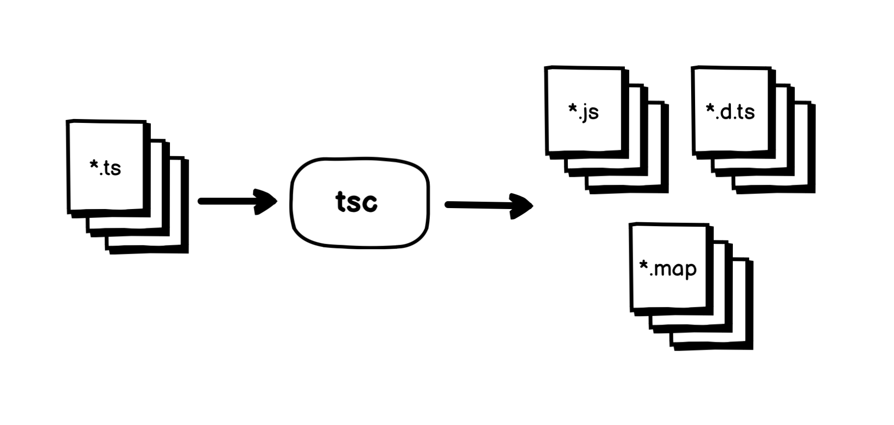
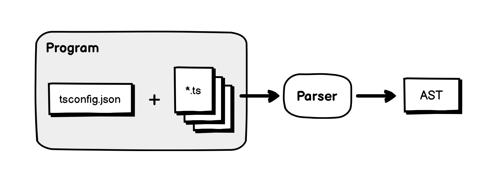
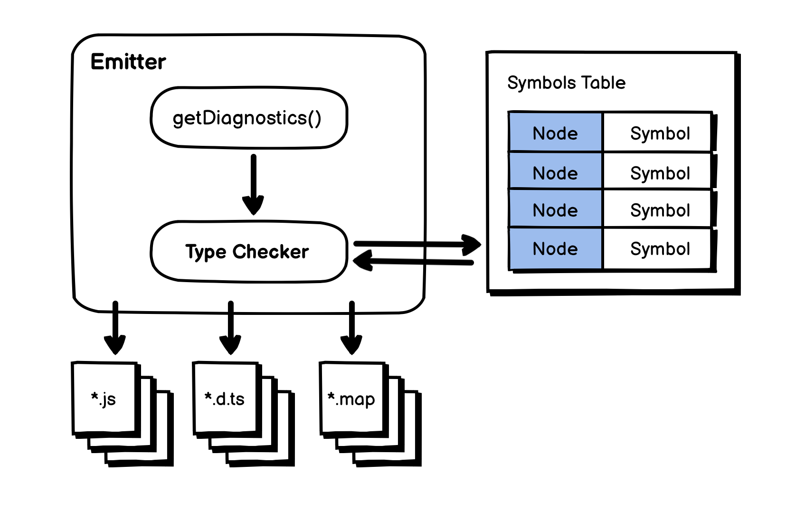

# 01.04.2022 - TypeScript/How the compiler compiles

At a high level, the TypeScript compiler is a tool to help us analyze and compile the TypeScript code into JavaScript (\*.js), as well as some type definition files (\*.d.ts) or source maps (\*.js.map).



If the source file contains some problems, the TypeScript compiler is also able to provide the diagnostics, so we know what went wrong and how to fix it.

## The compilation process

Internally, it's a complex process that involves many different parts, here's the summary of the process:


The compilation process starts when you invoke the `tsc` command. To run, the TypeScript compiler needs a `tsconfig.json` file, this file essentially defines two parts: the **Compiler Options** and the **Input Files**.

```json
{
    "files": [
        "src/*.ts"
    ],
    "compilerOptions": {
        ...
    }
}
```

The compilation context will be created as a **Program** object, defined in the **src/compiler/program.ts** file. When created, it loads all the input files and their imports. And call the **Parser** (defined in **src/compiler/parser.ts**) to parse each file into an **AST** (Abstract Syntax Tree).



Under the hood, the **Parser** creates a **Scanner** instance (defined in **src/compiler/scanner.ts**), which will scan the source code and generate a stream of `SyntaxKind` tokens.

The parsing process did not stop here, after this, the **AST** will be fed to the **Binder** (defined in **src/compiler/binder.ts**), to create a map between the **AST Nodes** and the **Symbols**.


A **Symbol** is additional metadata to store the type information of each **Node**. The **Binder** creates a **Symbols Table**, which will be used in later phases like type checking.

 After this, with the `Program.emit` call, the **Emit Worker** will be created to transform the **AST** into a string of JavaScript source code and other stuff. There are 2 types of **Emitter**:
 
- **The JavaScript Emitter**: defined in **src/compiler/emitter.ts**, emitting JavaScript source code and Source Maps.
- **Type Definition Emitter**: defined in **src/compiler/definitionEmitter.ts**, emitting type definition files.

When the **Emitter** running, it will call the `getDiagnostics()` function to create a **Type Checker**, this object is defined in the **src/compiler/checker.ts** file. Then the **Emitter** will walk the **AST** to process each **Node**.

On each **Node**, it will perform code analysis, using the type data from the **Symbols Table**, and if everything goes well, the final JavaScript sources will be generated.



## Error reporting

There are different types of errors that could be returned during the compilation process, depending on what phase the compiler found the error.

```typescript
enum BuildResultFlags {
    None = 0,
    Success = 1 << 0,
    DeclarationOutputUnchanged = 1 << 1,

    ConfigFileErrors = 1 << 2,
    SyntaxErrors = 1 << 3,
    TypeErrors = 1 << 4,
    DeclarationEmitErrors = 1 << 5,
    EmitErrors = 1 << 6,

    AnyErrors = ConfigFileErrors | SyntaxErrors | TypeErrors | DeclarationEmitErrors | EmitErrors
}
```

For example, if there is an error in `tsconfig.json` file, the `ConfigFileErrors` will be returned.

If an error is found by the **Scanner**, it is the `SyntaxErrors`. Sometimes, the code is written in the correct syntax, but semantically incorrect, most of the time they are `TypeErrors`, which can be caught by the **Parser** or the **Type Checker**. For example:

```typescript
let a: number = "hello";
```

This code is written in the correct syntax, but semantically incorrect because you cannot assign a string value to a number variable.

## Conclusion

In this article, I only illustrate the overview and the relation between each part of the compilation process, with this, you are able to explore the TypeScript source code to see how things are actually implemented.

It is recommended to read the [TypeScript Compiler Internals](https://basarat.gitbook.io/typescript/overview) document for a more in-depth version of this article (which also dives into which part of the code, and how things are called each other).