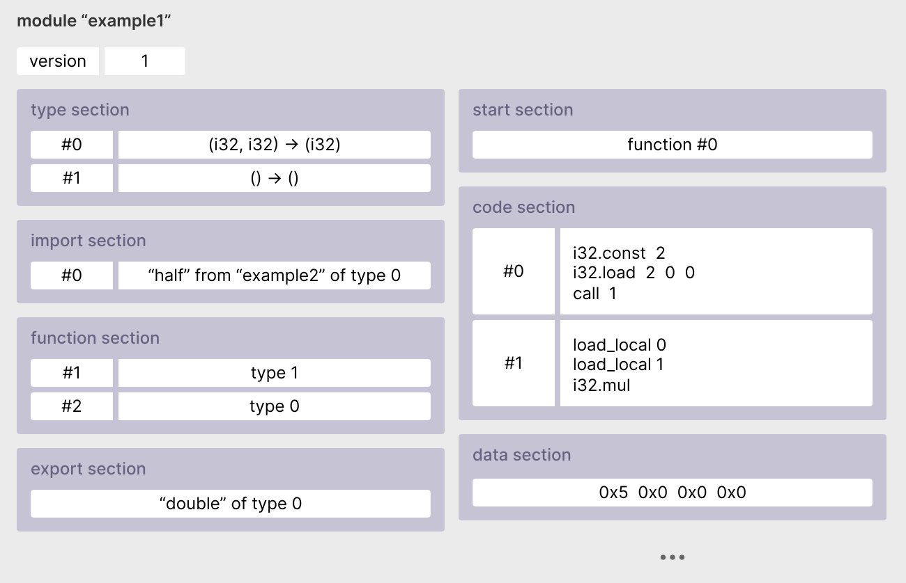

# 01.24.2022 - WebAssembly/How to read WASM code

Just like a good-old-Assembly program, a WebAssembly module is made up of different sections:


_(Source: [rsms/Introduction to WebAssembly](https://rsms.me/wasm-intro))_

The **type** section contains a list of each **unique function signature** used in the module for exported and imported functions.

The **import** section declares any imported function with their call signature and return type.

The **function** section is the index of each function, which is later defined in the code section.

The **export** section declares any part of the module that can be accessed by the host environment (JavaScript engines, WASM runtimes,...).

The **table** section maps any values that cannot be represented directly in WebAssembly, like JavaScript objects or OS file handles.

The **memory** section defines the initial size of the module's memory. Note that this section only describes the memory size. The data section is used to initialize the memory.

The **start** section defines the entry point of the module. It's the function that will be called when the module is loaded.

The **code** section defines all the functions in the module. The order of the functions here is the same as the order they're written in the source code.

With that, it's time to take a look inside a WASM module and see if we can understand anything now.

Suppose we have a Rust code that imports the `window.alert` method from JavaScript and export two functions: `alert_from_rust` and `add_five`:

```rust
use wasm_bindgen::prelude::*;

#[wasm_bindgen]
extern {
    pub fn alert(msg: &str);
}

#[wasm_bindgen]
pub fn alert_from_rust() {
    alert("This is Rust!");
}

#[wasm_bindgen]
pub fn add_five(a: i32) -> i32 {
    return a + 5;
}
```

Compile this code to a WASM using `wasm-pack`, and use [`wasm2wat`](https://webassembly.github.io/wabt/demo/wasm2wat/) to convert it to a readable WebAssembly Text Format (WAT, or WTF, whatever way you want to call it), here's what we get:

```wasm
(module
  (type $t0 (func))
  (type $t1 (func (param i32 i32)))
  (type $t2 (func (param i32) (result i32)))
  (import "alert" (func $alert (type $t1)))
  (func $alert_from_rust (export "alert_from_rust") (type $t0)
    (call $alert
      (i32.const 1048576)
      (i32.const 13)))
  (func $add_five (export "add_five") (type $t2) (param $p0 i32) (result i32)
    (i32.add
      (local.get $p0)
      (i32.const 5)))
  (memory $memory (export "memory") 17)
  (data $d0 (i32.const 1048576) "This is Rust!\00\00\00\04"))
```

In the Rust code, there are 3 functions with the following call signature:

```rust
alert_from_rust // () -> void
alert           // (&str) -> void
add_five        // (i32) -> i32
```

Their corresponding type in the **type section** is:

```wasm
(type $t0 (func))
(type $t1 (func (param i32 i32)))
(type $t2 (func (param i32) (result i32)))
```

Each type is assigned a label `$t0`, `$t1`, and `$t2`. Later on, you'll see these labels being used in the **import** and the **code** section:

```wasm
(import "alert" (func $alert (type $t1)))
(func $alert_from_rust (export "alert_from_rust") (type $t0) ...)
(func $add_five (export "add_five") (type $t2) (param $p0 i32) (result i32) ...)
```

And we can see that the WASM module are exporting our Rust's function as well as the **memory**:

```wasm
(export "alert_from_rust")
(export "add_five")
(export "memory")
```

The string literal that we passed into the `alert` function inside `alert_from_rust` is a value that Rust already known as compile-time, so it was initialized inside the **data** section:

```wasm
(data $d0 (i32.const 1048576) "This is Rust!\00\00\00\04"))
```

Now, let's circle back to the `alert` method. We can see its type definition `$t1` has taken two `i32` params instead of a string, and it got called by:

```wasm
(call $alert
  (i32.const 1048576)
  (i32.const 13))
```

In fact, there is no string type in WebAssembly, and this call shows us how we could refer to a value defined in the **data** section. The value `1048576` is the address of the string in the memory, and `13` is its length.

It's not necessary to understand WASM code to work with WASM, but it's super helpful to be able to have a peek inside the "blackbox" and understand what's going on under the hood. It will help a lot when it comes to debugging your WASM code too.
