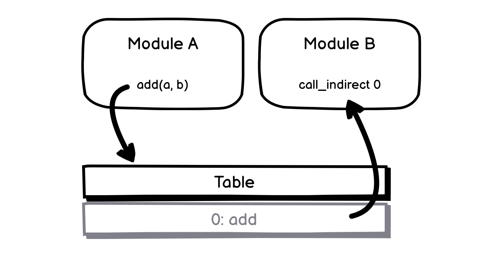

# 01.26.2022 - WebAssembly/Tables and Dynamic Linking

**Table** is another shared instance in WebAssembly just like Linear Memory, but it can only store **function references**. It can be shared between modules, and all you can do with tables is to make **indirect function calls** to the functions references stored in that table.

This feature allows you to implement dynamic linking, we can have a shared module that provides some functionalities that can be called from different modules.

For example, let's create a shared Table and pass this table into two different modules. In one module, we create a function called `add` and store this function's reference to the shared table. And then, call this `add` method from another module.



First, let's write the first module, since the table is imported from JavaScript, we are going to use the `import` segment to create the table:

**math.wat**

```wasm
(module
    (import "js" "table" (table 1 anyfunc))

    (func $add (param $a i32) (param $b i32) (result i32)
        get_local $a
        get_local $b
        i32.add)

    (elem (i32.const 0) $add)
)
```

After defining the function `$add`, we store it to the offset 0 of the table with the `elem` instruction.

Next, we create another module, also use the imported table from JavaScript, and use `call_indirect` instruction to call the function at offset 0 of the table:

**calc.wat**

```wasm
(module
    (import "js" "table" (table 1 anyfunc))

    (type $t0 (func (param $a i32) (param $b i32) (result i32)))

    (func (export "add_five") (param $x i32) (result i32)
        (call_indirect (type $t0) (get_local $x) (i32.const 5) (i32.const 0))
    )
)
```

Note that, we need to define the type `$t0` so `call_indirect` will have the information of what's the function call looks like.

Finally, let's build these modules with `wat2wasm`, create a JavaScript application, define a shared table and load the two modules:

```javascript
const fs = require('fs');

const createInstance = async (path, importObj) => {
    const wasmSource = fs.readFileSync(path);
    const wasmBuffer = new Uint8Array(wasmSource);
    const wasm = await WebAssembly.instantiate(wasmBuffer, importObj);
    return wasm.instance;
};

const importObj = {
    js: {
        table: new WebAssembly.Table({ initial: 1, element: "anyfunc" })
    }
};

Promise.all([
    createInstance("math.wasm", importObj),
    createInstance("calc.wasm", importObj)
]).then(instances => {
    // get ready
});
```

The `Promise.all` returned two `instance` in an `instances` array, one for the `math.wasm` module and another one for the `calc.wasm` module. We only need to use the instance of `calc`.

Calling `add_five` from `calc`'s instance, WASM will make the call to `add` function from the `math` module, and return the result:

```javascript
const instance = instances[1];
const result = instance.exports.add_five(10);
// result = 15
```

If we are not loading the `module.wasm`, and still trying to make a call to `add_five`, the error will occur when WASM tries to call the `add` method:

```
wasm://wasm/7396aa4e:1

RuntimeError: null function or function signature mismatch
    at wasm://wasm/7396aa4e:wasm-function[0]:0x43
```
