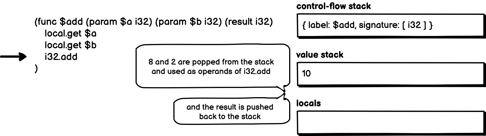

# 01.27.2022 - WebAssembly/Stack-based execution model

WebAssembly is executed using a stack-based virtual machine.

There are two types of execution of a WASM module:

- **Instance Execution:** If the module contains a **start** section, the referenced function here will be executed **right after the module is loaded**.
- **Function Execution:** when a function is called via `call` instruction from within the same module, by instance execution or by another module, or from the host environment.

When a function is called, several data structures are created:
- A control-flow stack: containing the _label_ of the function, a _signature_ of the function
- A _value_ stack, which carries the values between instructions
- A _locals_ vector containing the types of the function's parameters or any local variables
- And the current position of the function execution

The value of each incoming argument is copied to the local, a _signature_ is the return type of the function, if there is no return type, it's `void`.

The execution starts from the first instruction in the function's body. At each instruction, the top value of the **value stack** will be popped out to be used as the operand of that instruction. Any return values will be pushed back to the **value stack**.

If the current execution position is past the end of the function, the **function return execution** will kick-off. One value for each return type in the **signature** will be popped from the **value stack**, and provided to the caller.

Let's take a look at the execution of a simple function when we call it with `add(8, 2)`:

```wasm
(func $add (param $a i32) (param $b i32) (result i32)
  local.get $a
  local.get $b
  i32.add
)
```

The stacks are initialized, the return signature of the `$add` function is pushed to the control-flow stack, the value stack is empty and the local containing all the arguments when we called:


Starting from the first instruction of the function's body, at every `local.get` instruction, the corresponding value is read from the local and pushed to the value stack:


At the `i32.add` instruction, the top two values of the value stack are popped out to be used as the operands. After execution, the result is `10`, being pushed back to the stack:



At this step, we reached the end of the `$add` function, the control-flow stack will be popped, the return signature of this function is `i32`, so the value `10` of type `i32` will be returned to the caller of the `$add` function. The execution concluded.