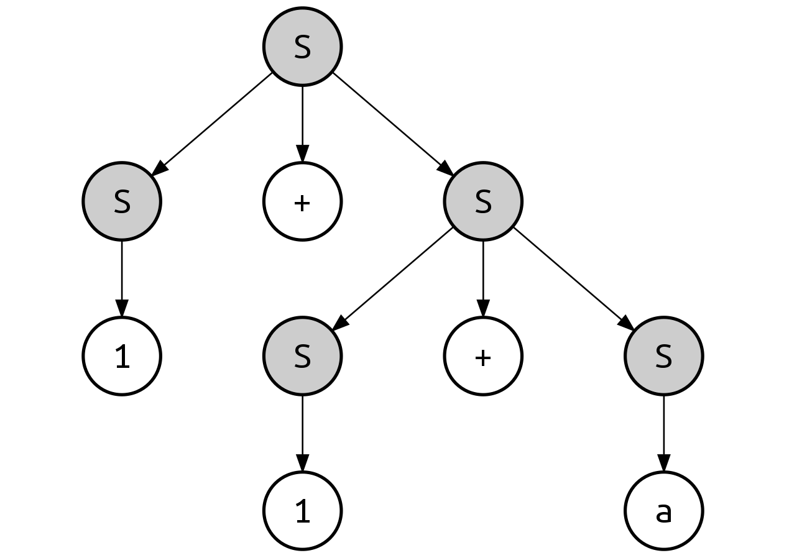
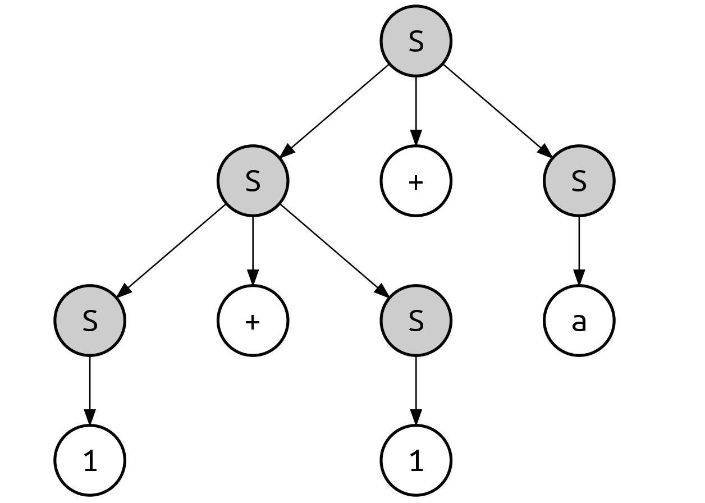

# 02.11.2022 - Parsing/Context-Free Grammar/Leftmost and Rightmost Derivations

A derivation of *a string* for *a grammar* is a *sequence of production rule applications*.

The process of getting the string through the derivation is the parsing process.

For example, with the following grammar:

```
S → S + S        (1)
S → 1            (2)
S → a            (3)
```

The string $1 + 1 + a$ can be derived from the start symbol $S$ using 2 types of derivations: **leftmost derivation** and **rightmost derivation**.

## Leftmost Derivation

In the leftmost derivation, the nonterminals are applied from left to right. Initially, we can apply rule 1 on the initial $S$:

$$
\rightarrow \underline{S + S} \qquad \text{(applied rule 1)}
$$

Next, the leftmost $S$ can be applied with rule 2:

$$
\rightarrow \underline{1} + S \qquad \text{(applied rule 2)}
$$

The next nonterminal is the second $S$. If we apply any of rule 2 or 3, there are still underived characters in the input string, so we choose rule 1 instead:

$$
\rightarrow 1 + \underline{S + S} \qquad \text{(applied rule 1)}
$$

Now, with the remaining characters from the input, we can apply rule 2 on the first $S$:

$$
\rightarrow 1 + \underline{1} + S \qquad \text{(applied rule 2)}
$$

Finally, the last $S$ can be applied with rule 3:

$$
\rightarrow 1 + 1 + \underline{a} \qquad \text{(applied rule 3)}
$$

The above derivation can be represented as the following parse tree:



## Rightmost Derivation

In the rightmost derivation, the nonterminals are applied from right to left.

Initially, we can apply rule 1 on the initial $S$:

$$
\rightarrow \underline{S + S} \qquad \text{(applied rule 1)}
$$

This time, we apply rule 1 on the rightmost $S$:

$$
\rightarrow S + \underline{S + S} \qquad \text{(applied rule 1)}
$$

We found that rule 3 can be applied to the rightmost $S$:

$$
\rightarrow S + S + \underline{a} \qquad \text{(applied rule 3)}
$$

Next, we can apply rule 2:

$$
\rightarrow S + \underline{1} + a \qquad \text{(applied rule 2)}
$$

And finally, rule 2 can be applied again:

$$
\rightarrow \underline{1} + 1 + a \qquad \text{(applied rule 2)}
$$

This derivation can be represented as the following parse tree:

