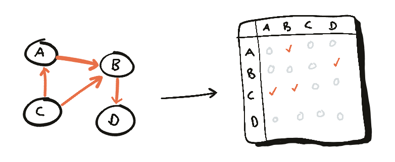
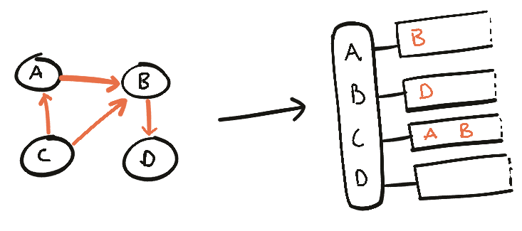

# 02.17.2022 - Data Structures/Representing Graphs

There are two ways to represent a graph data structure, each come with its own pros and cons.

## Using adjacency matrix

An adjacency matrix is a square matrix, each element in the matrix indicate whether pairs of vertices are connected in the graph or not.

For weighted graph, the matrix's element could be some number other than 1.

The drawbacks of using adjacency matrix is its memory usage. No matter how many edges are there, we always need $N \times N$ sized matrix, where $N$ is the number of nodes.

If there are 10000 nodes, then the matrix size will be $4 \times 10000 \times 10000$, that's around 381MB, a huge waste of memory if the graph only have a few edges.

Another point is, if we want to find out which node we can go from a node $u$, we'll need to check the whole row of $u$, which cost a lot of time.

## Using adjacency list

Adjacency list is a collection of unordered lists, each list define the set of vertices that connected to a vertex in a graph.

For the same graph, adjacency list takes less memory than using adjacency matrix.

But if we want to find out if there's an edge between two vertices $u$ and $v$, we would need to traversal the lists twice $O(2n)$. While using adjacency matrix only takes 1 lookup $O(1)$.