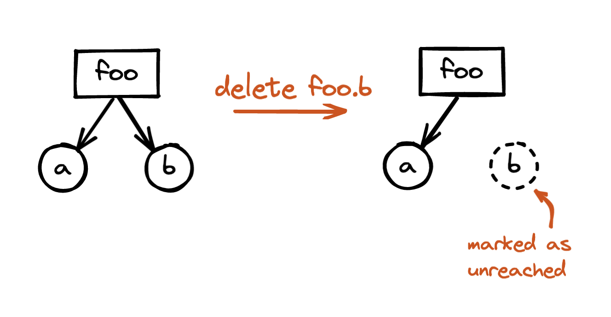
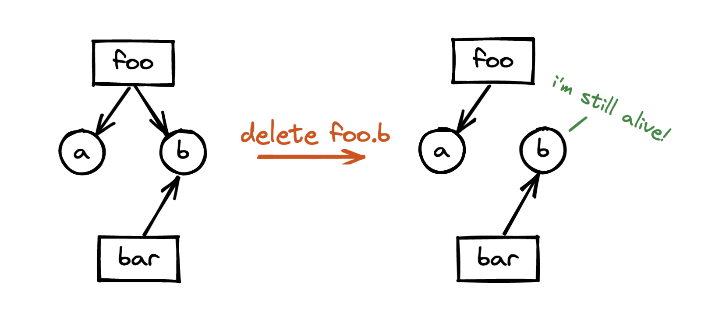
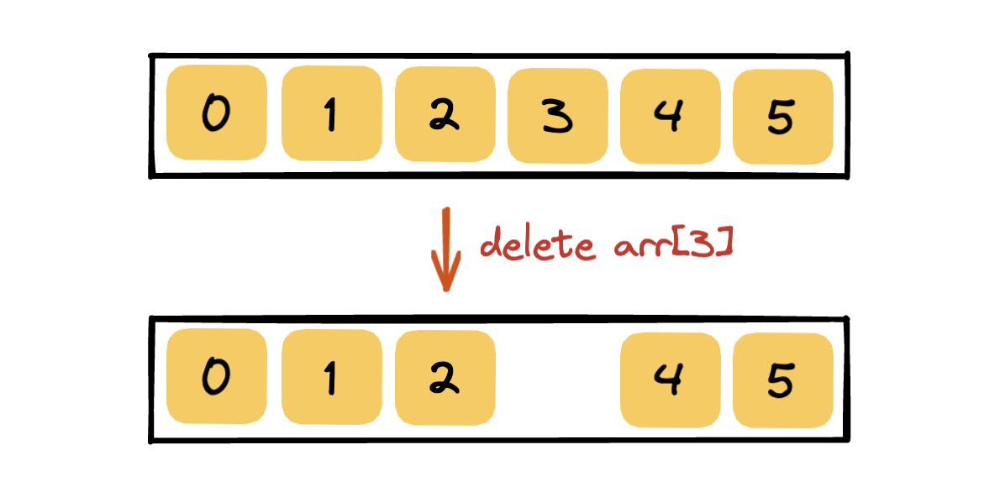

# 02.18.2022 - JavaScript/Beware the delete

Unlike C/C++, the [delete](https://developer.mozilla.org/en-US/docs/Web/JavaScript/Reference/Operators/delete) operator in JavaScript has nothing to do with memory deallocation.

What it actually does is **remove a property from its parent object**. If there is no more reference to that property, it will be marked as [unreachable](https://javascript.info/garbage-collection#reachability) and will be released when the garbage collector (GC) runs.

In the following example, delete `foo.b` will mark the string "yolo" as unreachable, and it will eventually be released from the memory:

```typescript
let foo = {
    a: 12,
    b: "yolo"
};

delete foo.b;

// foo = { a: 12 }
```



But in a scenario when two objects shared the same reference, things might not work as you expected.

```typescript
let boo = "hello";

let foo = {
    a: 12,
    b: boo
};

let bar = {
    b: boo
};

// foo = { a: 12, b: "hello" }
// bar = { b: "hello" }

delete foo.b;

// foo = { a: 12 }
// bar = { b: "hello" }
```



The string `boo` is shared between `foo` and `bar` as the property `b`, when you delete the reference `foo.b`, the string `boo` is still being referenced in `bar.b`, so it's still reachable. Hence, nothing will be deleted when the GC runs.

---

When the `delete` command is called, if the target is successfully deleted, it will return `true`, otherwise, it will return `false`.

You cannot delete a variable defined with `let` or `const` inside its declaration scope:

```javascript
{
    let c = "hello";
    delete c; // returns false
    console.log(c); // output: "hello"
    
    const d = 15;
    delete d; // returns false
    console.log(d); // output: 15
}
```

A variable defined with `var` can be deleted from within its declaration scope, but not in the function scope, or global scope.

For example, a top level `var` can't be deleted:

```javascript
// global scope
var hello = "good";
delete hello; // returns false
```

You can delete a `var` in a block scope:

```javascript
{
    var b = 10;
    delete b; // returns true
    console.log(b); // b is not defined
}
```

But you can't do it in a function scope...

```javascript
function hello() {
    var x = 10;
    delete x; // returns false
}
```

This holds true for function's params as well:

```javascript
function yolo(b) {
    delete b; // returns false
}
```

---

Did you hate the `delete` yet? Let me make you hate it more.

If you `delete` an element from an array, it will be gone, but the length of the array is unchanged:

```javascript
let arr = ['a', 'b', 'c', 'd', 'e', 'f'];

/*
shape of arr = {
    0: 'a', 1: 'b', 2: 'c',
    3: 'd', 4: 'e', 5: 'f',
    length: 6
}
*/

delete arr[3];

/*
shape of arr = {
    0: 'a', 1: 'b', 2: 'c',
    4: 'e', 5: 'f',
    length: 6
}
*/
```



This makes perfect sense based on the way `delete` works, but it will be a lot of pain if someone has to debug array issues because you deleted an element from the array this way.

The right way to remove an element from an array is either to set it to `undefined` or use `Array.prototype.splice`:

```javascript
arr[3] = undefined;
/*
shape of arr = {
    0: 'a', 1: 'b', 2: 'c',
    3: undefined, 4: 'e', 5: 'f',
    length: 6
}
*/

arr.splice(3, 1);

/*
shape of arr = {
    0: 'a', 1: 'b', 2: 'c',
    3: 'e', 4: 'f',
    length: 5
}
*/
```