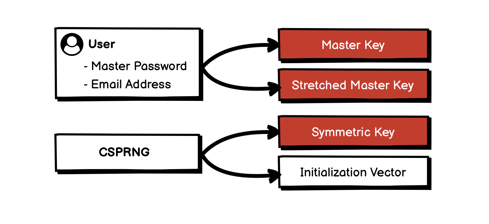
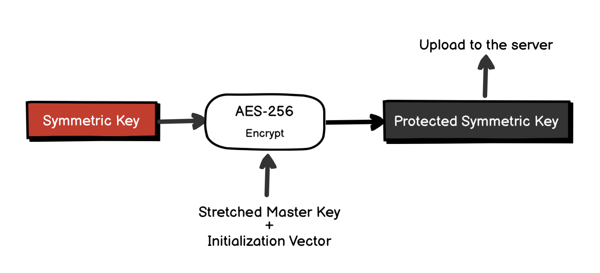
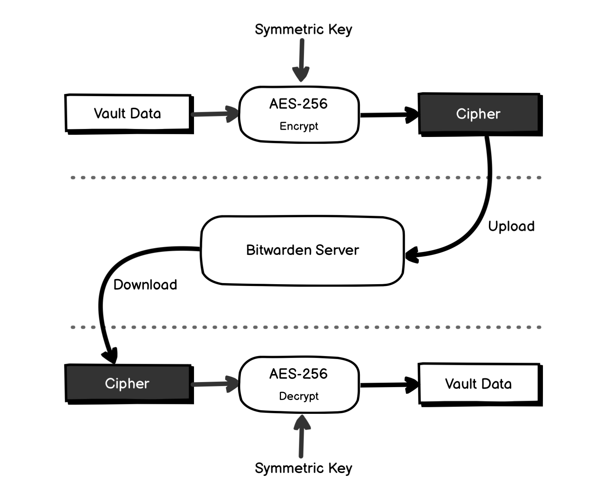
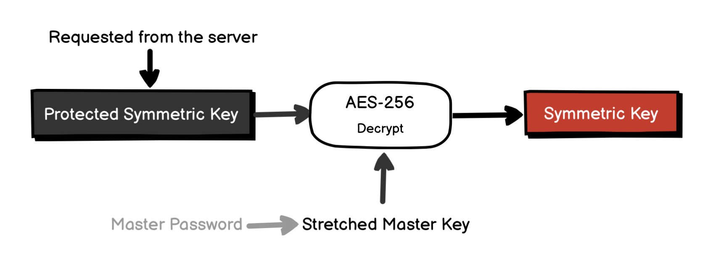
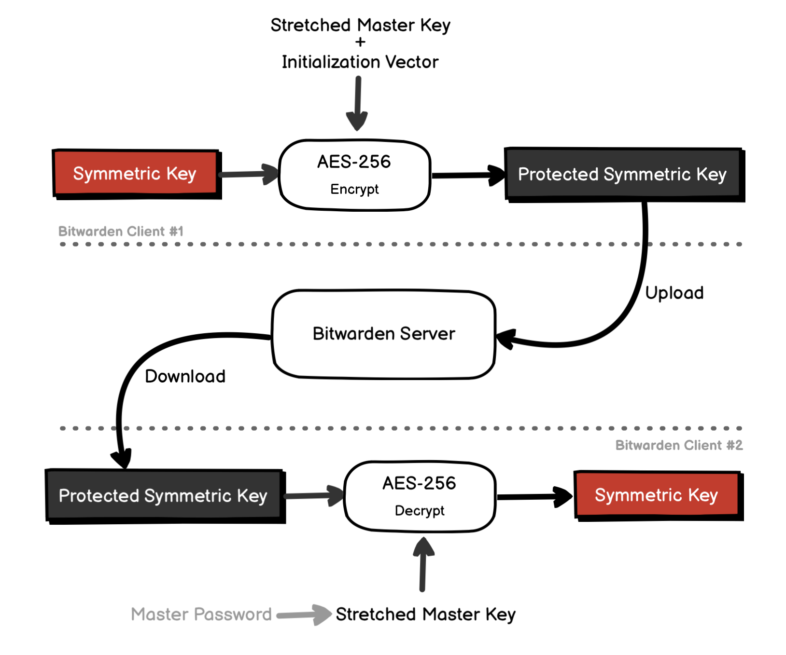

# 02.22.2022 - Security/How Bitwarden encrypts your data

This note only covers the mechanism of Bitwarden's end-to-end encryption for a single user, between one or more clients. For more information about how they handle user authentication and password sharing, you should check their [Security White Paper](https://bitwarden.com/help/bitwarden-security-white-paper/).

At a high level, Bitwarden is a password manager that has two main parts: **The Server**, and **The Clients** (Web Vault, Browser Extension, Desktop, and Mobile apps,...).

The Bitwarden Server is essentially a REST API that only stores encrypted data sent from the clients. It has almost nothing to do with data encryption (more on this later). All the data encryption, decryption, key derivation works are done by the Bitwarden Clients.

This model ensures all your sensitive data are fully encrypted everywhere outside of your device (during transmission, on Bitwarden's server,...). Without your Master Password, no one will be able to decrypt your data, even the people with DB access.

---

Everything starts with your Master Password when you create a Bitwarden account. The Bitwarden Client will generate a number of keys to be used for data encryption and user authentication:

A 256 bit **Master Key** is created by applying [PBKDF2-SHA256](/everyday/02-21-2022-security-cryptography-pbkdf2) with 100,000 iteration rounds, the Master Password, and the user's email address (as a salt).

This Master Key is then additionally stretched to a 512 bit **Stretched Master Key** using HMAC-based Extract-and-Expand Key Derivation Function (HKDF).

$$
\text{Master Password} \xrightarrow[\text{Salt = Email Address}]{PBKDF2-SHA256} \textbf{Master Key} \xrightarrow{HKDF} \textbf{Stretched Master Key}
$$

Additionally, a 512 bit **Symmetric Key** and an **Initialization Vector (IV)** are also generated using a Cryptographically Secure Pseudorandom Number Generator (CSPRNG).

The Master Key will be used for user authentication. The Symmetric Key will be used for vault data encryption/decryption.

The Symmetric Key also gets encrypted using AES-256, with the Stretched Master Key and the IV to create the **Protected Symmetric Key**, which will be sent to the server for later use (more on this later).

---

Vault items (like logins, cards, notes,...) are encrypted using AES-CBC 256 with your Symmetric Key. The encrypted items are called Ciphers, will be stored on the Bitwarden server.

Any requested items from the server are sent to the client as a Cipher, and the decryption also happens on the client only.

---

Only the Protected Symmetric Key is stored on the Bitwarden server and will be requested by the Bitwarden Client if needed. The Master Password, Master Key, or Stretched Master Key are never stored anywhere (locally or on the server).

The Symmetric Key is stored locally **in the memory** only when your Vault is unlocked because it is needed to decrypt data. When the Vault is locked, this data is purged from the memory.

When you unlock your Vault, you will be asked to enter your Master Password again, and Bitwarden Client will repeat the process described in the previous section to obtain the Stretched Master Key. The Protected Symmetric Key will be decrypted using Stretched Master Key to obtain the Symmetric Key.

The same when you log in to Bitwarden from another device or another client, only the Protected Symmetric Key is sent to the new client from the server, all the necessary keys are derived from this key and your Master Password.

---

When you change your Master Password, there is an option to rotate Encryption Key, and it's not enabled by default. This means Bitwarden doesn't need to re-encrypt all your Vault items when you changed the Master Password. It might seem obvious at this point, but if you missed it and asked how's that possible, here's why:

- The key that is used to encrypt your Vault data is the randomly generated **Symmetric Key**.
- This Symmetric Key is encrypted using the Stretched Master Key (which is derived from your Master Password) to create the **Protected Symmetric Key**.
- When you change your Master Password, you get the new Stretched Master Key, and only the Protected Symmetric Key needed to be re-generated, the Symmetric Key remain unchanged.
- So, your encrypted data does not need to be re-encrypted. In fact, the encryption has nothing to do with your Master Password.

