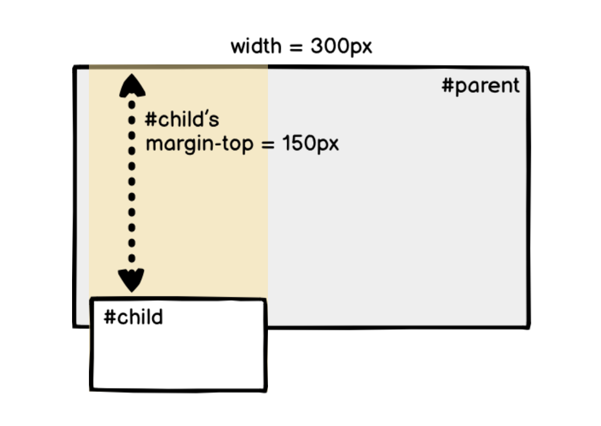
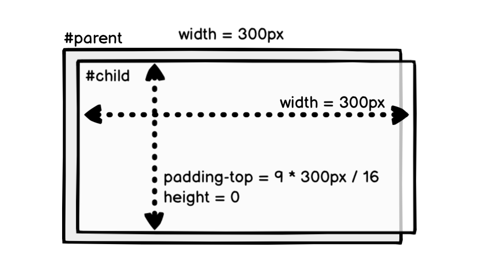

# 02.23.2022 - CSS/Percentage Padding and Margin

When you specify a percentage value for the CSS padding or margin of an element, this percentage is **based on the width of the containing block**, not the width of the element itself.

For example, in the following code, the `margin-top` of the child element is **150px** (half the parent's width), not **40px** (half of the child element's width).

```css@focus=2,9
#parent {
    width: 300px;
    height: 200px;
}

#child {
    width: 80px;
    height: 40px;
    margin-top: 50%;
}
```



---

We can use this behavior to create elements that have a specific aspect ratio.

For example, to create an element that have the aspect ratio of 16:9, we do not need to calculate the width and height manually, but use `padding-top` instead:

```css
#parent {
    width: 300px;
    height: 200px;
}

#child {
    padding-top: 56.25%; /* 9 / 16 = 0.5625 */
}
```

