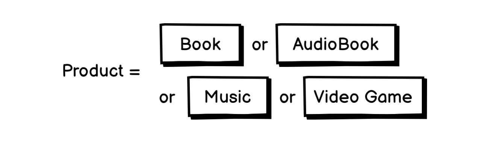

# 02.25.2022 - TypeScript/Lookup Types

Let's say you are tasked to build the next Amazon, and you gotta start small. So, you build a website that only sells books and audiobooks for now.

The system would have the `BaseItem` type, defining the essential properties of an item you are selling. For each of the product types, you use [type intersection](/everyday/01-02-2022-typescript-type-intersection) to construct a new type, along with its own properties:

```typescript
type BaseItem = {
    name: string;
    price: number;
}

type Book = BaseItem & {
    productType: "book";
    pageCount: number;
}

type AudioBook = BaseItem & {
    productType: "audioBok";
    duration: number;
}

type Product = Book | AudioBook;
```


Next, you want to build a filter function that allows the users to filter the product based on its `productType`:

```typescript
type ProductType = "book" | "audioBook";

function filterProduct(products: Product[], productType: ProducType): Product[] {
    return products.filter(
        product => product.productType === productType
    );
}
```

You can call the `filterProduct` function with any values of the `ProductType`:

```typescript
filterProduct(products, "book") // OK
filterProduct(products, "audioBook") // OK
```

This function is type-safe because it would prevent you from making mistakes like passing incorrect product types:

```typescript
filterProduct(products, "candy")
//                       ^^^^^
// Error: Argument of type 'candy' is not assignable
// to parameter of type "book" | "audioBook"
```

---

Things seem to look fine. The business went well. The management board gets over-excited and decides it's time to expand the product categories.

So we add two new product types: Music and Video Games.

```typescript
type Music = BaseItem & {
    productType: "music";
    songLength: number;
}

type VideoGame = BaseItem & {
    productType: "videoGame";
    digitalEdition: boolean;
}

type Product = Book | AudioBook | Music | VideoGame;
```



Now, you need to modify the `ProductType` type, so the `filterProduct` function could work with two new product types:

```typescript
type ProductType = "book" | "audioBook" | "music" | "videoGame";

filterProduct(products, "book") // OK
filterProduct(products, "audioBook") // OK
filterProduct(products, "music") // OK
filterProduct(products, "videoGame") // OK
```

But wait! This approach doesn't look good for a lot of reasons. First, the type definition of `ProductType` is redundant, we have to duplicate the `productType` from each product model. Second, do you want to keep extending both the `Product` and `ProductType` every time your company expands? I do not.

This is where [lookup types](https://www.typescriptlang.org/docs/handbook/release-notes/typescript-2-1.html#keyof-and-lookup-types) (a.k.a indexed access types) become useful.

Instead of writing each element of the `ProductType` union, you can create a union type dynamically from the `Product.productType` field using index lookup, just like how you access the object's property:

```typescript
// don't do this
type ProductType = "book" | "audioBook" | "music" | "videoGame";

// do this
type ProductType = Product["productType"];
// ProductType = "book" | "audioBook" | "music" | "videoGame"
```

This feature of TypeScript is very useful as it help reduce redundant code, and also help you create more well-defined types by reusing existing types instead of manually write them out.