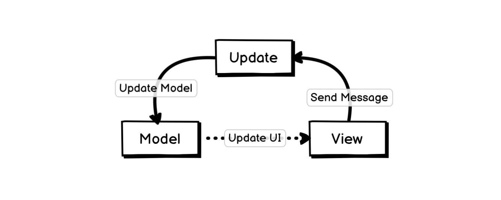
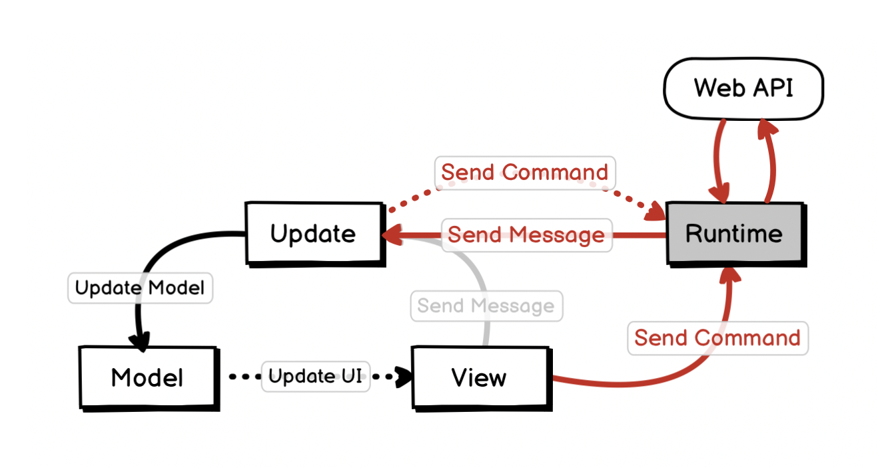
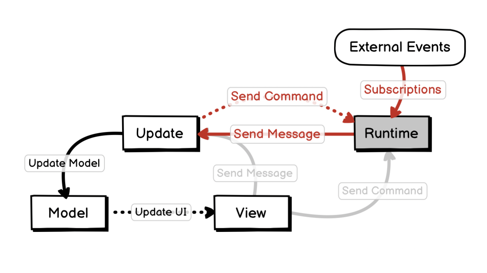

# 02.27.2022 - Design Patterns/The Elm Architecture

[The Elm Architecture](https://guide.elm-lang.org/architecture/) is not something necessary exclusive to the Elm language but should be viewed as a generic design pattern for architecting GUI applications.

In fact, this architecture is adopted in many GUI frameworks in different languages, like [Iced](https://github.com/iced-rs/iced) in Rust. And there are some other architectures that share the same idea, like [Flux](https://staltz.com/unidirectional-user-interface-architectures.html).

---

The three main components of Elm Architecture are:

- **Model:** the state of your application
- **View:** the visual representation of the Model
- **Update:** the mechanism to update the Model, based on messages

The relation between these 3 components can be described by the following diagram:



Any user's interaction on the **View** will trigger a message that will be sent to the **Update** method, this method will modify the **Model**. Any changes to the **Model** will trigger the **View** to be updated to reflect the changes.

---

In reality, GUI applications also need to handle more complex tasks, or **side effects**. For example, in a web application, you might need to make HTTP requests or listen to external signals like WebSocket events.

We need another component that handles the communication between your application and the external environment, and this is called the **Runtime**.



Your application communicates with the **Runtime** by sending **Commands**. When a **Runtime** receives a **Command**, it communicates with the external environment to get the work done and sends a **Message** back to the **Update** method of your application, so the UI can be updated with the result.

For example, Elm's [Http.get](https://package.elm-lang.org/packages/elm/http/latest/Http#get) method uses the Web API to send an HTTP request, and it also has an `expect` parameter to specify what message should be sent back to the application after the request finished.

```haskell@focus=3:4,11
import Http

type Msg
  = GotText (Result Http.Error String)

getPublicOpinion : Cmd Msg
getPublicOpinion =
  Http.get
    { url = "https://elm-lang.org/assets/public-opinion.txt"
    , expect = Http.expectString GotText
    }
```

If needed, the **Update** method can also send new **Commands** to the **Runtime**. The cycle continues.

---

Another important concept is **Subscriptions**. It's a way to tell the **Runtime** to subscribe to some external events and send a Message back to **Update** if needed.



The rest of the flow is pretty much the same as the previous section about sending **Commands**.