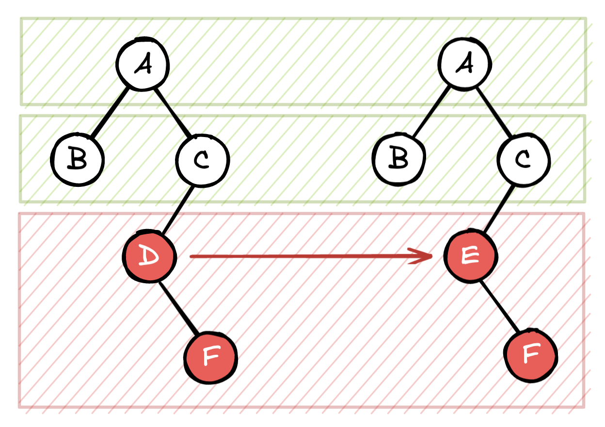

# 03.05.2022 - React/How React's Diffing Algorithm Works

If you are busy, here is the **TL; DR**:

**React Reconciliation** is the tree diffing algorithm that React used to update your application's DOM tree between renders. The [existing algorithms](https://grfia.dlsi.ua.es/ml/algorithms/references/editsurvey_bille.pdf) do this in **O(n^3)** time, with **n** is the number of nodes in the tree, which is not great.

React implements an **O(n)** time diffing algorithm based on some assumptions:

- Two elements of different types will produce different trees
- The developer can use the `key` prop to hint that an element is stable between trees

---

**A longer explanation**:

Every time a component updates (on state or prop changes, insert or delete a children node,...), the `render()` function will be called, the output is a **render tree** containing all the DOM elements created by your component and its children.

If React just replace one render tree with another on every render, it would be extremely slow, so it needs to have some sort of diffing algorithm to compare and generate the minimum number of operations to transform one render tree to another.

The way the algorithm works is:

- If two elements are the same type, React will check each of the attributes and styles, only update what changed. The algorithm continues checking all the component's children recursively.

  For example, if element A only changes the color attribute, React will only update the color, everything else remains the same:

  
  
- If two elements have different types, all old DOM nodes are destroyed, the `componentWillUnmount()` method will be called. Then, a new DOM nodes are inserted, the `UNSAFE_componentWillMount()` and `componentDidMount()` will be called.

  In the following example, the two render trees are identical until node D, which gets transformed into node E. Although the subtree of D and E are the same, React will still replace the whole subtree D to E.

  

---

The reconciliation algorithm cannot tell the difference between the two render trees if the child elements are just re-ordered. For example, if you insert a new element in the middle of the list, the algorithm will see every element from the inserted position as an updated node:


In this case, adding a `key` property into each element will help the algorithm determine if a node is unchanged or not during the update.


Keys need to be unique in the same subtree and should be stable and predictable, for example, don't use random ID. Be cautious if you use an array index for the key, otherwise, you risk the same re-ordering problem.

---

It's important to note that, the current algorithm will not try to match two subtrees if they are of different component types, even if they produce the same DOM tree.

```typescript
const A = () => <div>hello</div>;
const B = () => <div>hello</div>;

const App = (props) => (
    props.isA ? <A/> : <B/>
);
```

In the above example, components A and B render to the same HTML content. But changing the property `isA` will always replace the whole App's DOM tree because they are two different components.

**Reference:** https://reactjs.org/docs/reconciliation.html
