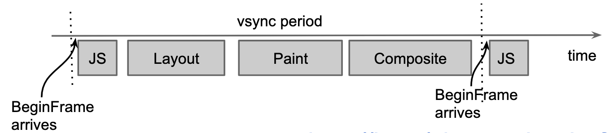
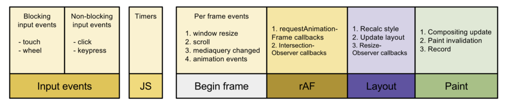
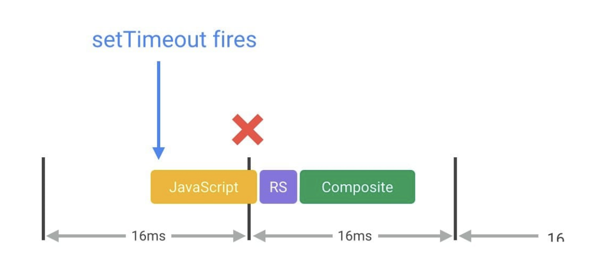

# 03.06.2022 - Reading Notes/Browser's Rendering Process

## The big picture

Most devices refresh their screen 60 times a second. On each refresh, the graphics driver generates the pixel data from the frame provided by the application and sends it to the monitor to display.

To match the monitor, the application should provide a new frame before the next screen refresh. Otherwise, the frame rate will drop.

This means each frame has a budget of 1/60 = 16.66ms for execution.

In reality, the browser has some other work to do, this reduces the budget for your application's works to roughly 10ms.

To generate each frame, the browser might do the following works (a.k.a the [pixel pipeline](https://developers.google.com/web/fundamentals/performance/rendering#the_pixel_pipeline)):

- JavaScript Execution
- Style Calculation
- Layout Calculation
- Paint
- Compositing



_Image source: [BlinkOn4 - BeginFrame Scheduling](https://docs.google.com/presentation/d/1S9QntwRBa89ktD0npMjclTL77h_RysOBoyNsk5O6ctk/edit#slide=id.g9c0fabec9_0_122)_

The Layout Calculation and Paint phase might not happen, depending on what changes are made during JavaScript Execution and Style Calculation. 

For example:

- Both the Layout and Paint phases will be called if you change some CSS properties that shift the trigger layout reflow (like changing the width, or the position of an element).
- On the other hand, if you only change the text color or background image, the browser will only Re-paint and skip the Layout phase.

## A closer look

Now, let's take a closer look at the lifecycle of a frame:



_Image source: [requestAnimationFrame Scheduling For Nerds](https://medium.com/@paul_irish/requestanimationframe-scheduling-for-nerds-9c57f7438ef4)_

Each phase has a critical impact on the rendering performance, understanding them helps avoid doing any unnecessary work and mistakes that eventually make a. negative impact on the user's experience.

### Performance impact of JavaScript Execution

The JavaScript execution, which includes event handling and executing timers (like `setTimeout`, `setInterval`) is a blocking process. This means badly-timed or long-running JavaScript will block the rendering phase, causing a delay in generating a new frame.



_Image source: [Rendering Performance: Optimizing JavaScript Execution](https://developers.google.com/web/fundamentals/performance/rendering/optimize-javascript-execution)_

To mitigate the impact of JavaScript on the rendering process, you have various solutions, like moving heavy works (that require no DOM access) off the main thread, by using Web Workers. Avoid doing any visual changes in timers.

```typescript
const worker = new Worker('worker-logic.js');
worker.postMessage(inputData);

worker.addEventListener('message', (event) => {
    // execution result in event.data
});
```

When DOM access is required, you have an option to break down tasks across multiple frames with the help of `requestAnimationFrame` or `requestIdleCallback` — [React Fiber](https://github.com/acdlite/react-fiber-architecture) is using the same idea to split the rendering across multiple frames. It's best to limit the execution in the range of **3-4ms**.

```typescript
const bigTaskList = [...];
requestAnimationFrame(taskHandler);

const taskHandler = (startTime) => {
    let finishTime;

    do {
        // get next task
        let nextTask = bigTaskList.pop();

        // do something with nextTask item
        ...

        // execution time should be limited under 3ms
        finishTime = window.performance.now();
    } while (finishTime - startTime < 3);

    if (bigTaskList.length > 0) {
        requestAnimationFrame(taskHandler);
    }
}
```

### Styling and Layout Calculation

Any CSS changes might cause a recalculation on style and layout (or reflow).

When a style calculation happens, the browser essentially does two things:

- Create a set of matching CSS selectors
- Taking all the style rules from the matching selectors figuring out the final style of each element.

In Blink-based browsers (Chrome, Edge, Opera,...), roughly 50% of the style calculation time is used to match selectors. So, it's crucial to reduce your selectors' complexity and, if possible, reduce the number of style changes that happen on each frame.

```css
/* this selector is easier to match */
.foo {
    ...
}

/* this kind of selector is more complex */
/* should be avoid if possible */
.foo:nth-last-child(-n+1) .bar {
    ...
}
```

Layout calculation is also a costly process. Starting from the root element, each of the elements on the page creates a tree of boxes containing all of its children's boxes. When layout calculation happens, the boxes sizes and positions are calculated, and the process repeats for every tree in the document.

Any layout recalculation would trigger the calculation of the whole document, so you should avoid triggering layout change wherever possible.

Newer CSS layouts like [Flexbox](https://developers.google.com/web/updates/2013/10/Flexbox-layout-isn-t-slow) or [Grid](https://techblog.smc.it/en/2020-08-03/grid-vs-flexbox-performance) generally provide better performance compared to old layouts like normal flow or floats.

It's also recommended to read ZeroX-DG's [Browser from Scratch: Layout](https://zerox-dg.github.io/blog/2021/09/26/Browser-from-Scratch-Layout/) article for a more in-depth look at how browser's layout calculation works.

**References:**

- https://developers.google.com/web/fundamentals/performance/rendering
- https://medium.com/@paul_irish/requestanimationframe-scheduling-for-nerds-9c57f7438ef4
- https://techblog.smc.it/en/2020-08-03/grid-vs-flexbox-performance
- https://developers.google.com/web/updates/2013/10/Flexbox-layout-isn-t-slow
- https://docs.google.com/presentation/d/1S9QntwRBa89ktD0npMjclTL77h_RysOBoyNsk5O6ctk/edit#slide=id.g9c0fabec9_0_122
- https://zerox-dg.github.io/blog/2021/09/26/Browser-from-Scratch-Layout/
- https://docs.google.com/document/d/1vEW86DaeVs4uQzNFI5R-_xS9TcS1Cs_EUsHRSgCHGu8/view
- https://www.w3.org/TR/CSS22/visudet.html#containing-block-details