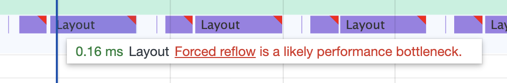

# 03.08.2022 - Reading Notes/Forced Synchronous Layout and Layout Thrashing

When a DOM node is written (change of style, attribute, or inner content), and the action triggers a layout change, the browser must do a layout recalculation (reflow). The browser usually waits for [the end of a frame](/everyday/03-06-2022-reading-notes-browser-s-rendering-process) to perform this calculation.

However, if we try to read the geometrics information of the DOM node, the browser is forced to perform layout recalculation early, during JavaScript execution. So it could have the latest information to give back to you. This forced behavior is called **forced synchronous layout**.

For example:

```typescript
// read geometry. current layout information will be used.
let width = element.clientWidth;

// write geometry. if we stop here, reflow will be scheduled
// at the end of the frame
element.style.width = '600px';

// read geometry again. this force a reflow right in JS execution
let width = element.clientWidth;
```

**Layout thrashing** is when many force synchronous layouts happen in a short amount of time (for example, in a loop), making a janky user experience.

For example:

```typescript
for (let i = 0; i < 1_000_000; i++) {
    element.style.width = element.clientWidth + 10;
}
```

In the above example, we force reflow by setting a new value for `element.style.wdith`, and read the value immediately with `element.clientWidth`. To make it worse, we do it in a loop.

In Chrome Dev Tools, we can use the Performance tool to record and detect force reflow, it is usually shown as a purple bar with a red corner like this:



The Google Sample repository provided an example to help you see layout thrashing in action, you can give it a try at https://googlesamples.github.io/web-fundamentals/tools/chrome-devtools/rendering-tools/forcedsync.html

Also, see Paul Irish's [What forces layout/reflow](https://gist.github.com/paulirish/5d52fb081b3570c81e3a) note for a list of what action triggers reflow, so you can avoid them or use them better.

**References**

- https://www.afasterweb.com/2015/10/05/how-to-thrash-your-layout/
- https://kellegous.com/j/2013/01/26/layout-performance/
- https://gist.github.com/paulirish/5d52fb081b3570c81e3a
- https://developers.google.com/web/fundamentals/performance/rendering/avoid-large-complex-layouts-and-layout-thrashing