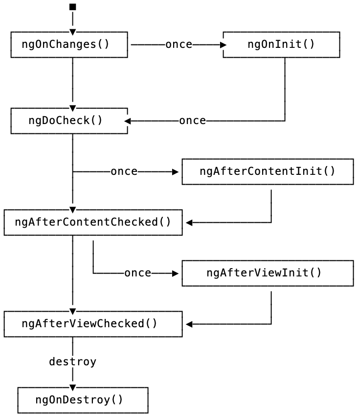

# 03.19.2022 - Angular/A 5 minutes guide to getting started

## Definition
    
Angular is:

- A component-based framework to build web apps
- A collection of libraries that support multiple features such as routing, form management, client-server communication,...
- A suite of tools to help develop, build, test,...
    
The building blocks of an Angular application:

- Many components are organized into a `NgModule`
- Many `NgModule` composed into an application
- An application always has a `root` module, called `AppModule`, and many more `feature modules`
- Each component can use one or many `services`, which will be injected into the component via the Dependency Injection system.

## Modules
    
The root `AppModule` module is defined in `app.module.ts`. A module is a class with a `@NgModule()` decorator.

For example:  

```typescript
@NgModule({  
    imports: [],  
    exports: [],  
    providers: [],  
    declarations: [],  
    bootstrap: []  
})  
export class UserModule {  
    ...
}  
```

It's different from JavaScript's module, and the `imports`, `exports` arrays here is to define the components or modules that you wish to import/export to/from your module.

For example, you have `ModuleA` and `ModuleB` and would like to import some services, components from `ModuleA` to `ModuleB`

## Component
    
A component is defined by a class with a `@Component()` decorator. The decorator defined the following information:

- The CSS selector to tell us how we gonna use this component
- The HTML template of the component
- A set of CSS styles will be used for this component

The CSS selector is an interesting thing compared to React. We can create a component by defining a new tag, or even class names, for example:  

```typescript  
@Component({ selector: 'Foo' })  
<Foo/>  
  
@Component({ selector '.foo' })  
<div class="foo"></div>  
```

An example component:  

```typescript 
@Component({  
    selector: 'hello',  
    template: '<div>Good morning</div>'  
})  
export class HelloComponent {}  
  
// Usage:  
  
<hello>  
  
// DOM output  
  
<hello>  
<div>Good morning</div>  
</hello>  
```

Instead of `template`, you can provide a `templateUrl`, it's a path to the HTML template file you wanna use.

### Life cycle

The life cycle of an Angular component



## Data binding
    
There are different ways to do binding from JavaScript code to HTML template in Angular.

For binding content, use `{{ variable }}`, for binding HTML attributes, use `[attr]="something"`, for binding events, use `(event)="something"`.

For example:  

```typescript
@Component({  
    selector: 'hello',  
    template: `  
    <div>  
        <p>{count}</p>  
        <button (click)="onAddClick()">+1</button>  
    </div>`  
})  
export class HelloComponent {  
    count = 1  
    onAddClick() {  
        this.count++  
    }  
}  
```
        
Personally, I think this is too verbose. Comparing to React.

For two ways binding, use [`ngModel`](https://angular.io/api/forms/NgModel).

## Change detector
    
Angular's change detector run after every DOM event (keystrokes, mouse move, timer tick,...) and server responses.

Read more:

    - Optimize Angular's change detection: https://web.dev/faster-angular-change-detection/

## Pipes
    
Pipe is the way to define data transformation in bindings. For example:  

```typescript
<div>{{currentTime | date: 'fullDate'}}</div>  
```

In this case, the date is a pipe that transforms data to a date string.

We can apply multiple pipes in the same expression, this is called chaining pipes, for example:  

```  
<div>{{ someValue | date | uppercase }}</div>  
```

There is a lot of built-in pipes in Angular. See [Pipe API List](https://angular.io/api?type=pipe)

We can define a pipe, by using the `@Pipe()` decorator in a class:  

```typescript
@Pipe({ name: 'titleCase' })  
export class TitleCasePipe implements PipeTransform {  
    transform(value: string): string {  
        return value[0].toUpperCase() + value.slice(1);  
    }  
}  
```
    
Read more:
- Detecting changes with pipes (https://angular.io/guide/pipes#detecting-changes-with-data-binding-in-pipes)

## Dependency Injection
    
Dependency Injection is the pattern in which you can declare dependencies for your classes without creating an instance of that dependency. Angular will do that for you.

An injectable service can be defined with the `@Injectable()` decorator as:  

```typescript
@Injectable({ providedIn: 'root' })  
export class FooService {  
    bar() {  
        // do something  
    }  
}  
```
        
The benefit of dependency injector came when we decided to use a dependency or not in our classes, for example, the class below can choose to use `FooService` or not by just defining it as a parameter in its constructor:  

```typescript
// Class Hello with FooService as its dependency  
class Hello {  
    constructor(
        private foo: FooService
    ) {
        ... 
    }  
}  
  
// Class Hello without any dependency  
class Hello {  
    constructor() {  
    }  
}  
```
