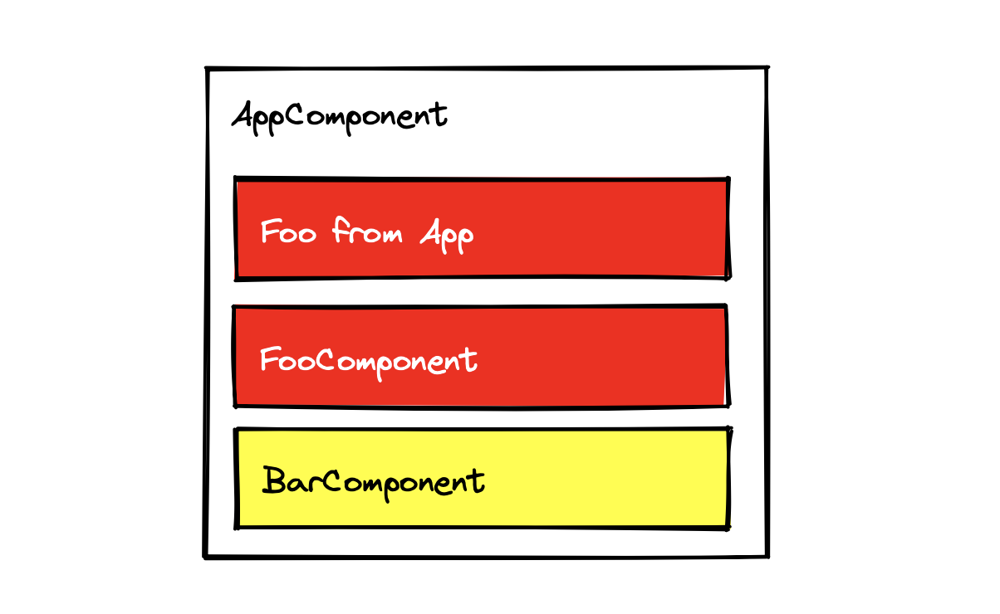
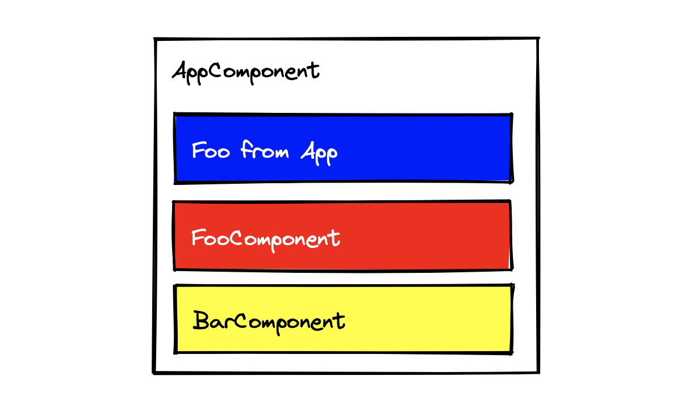
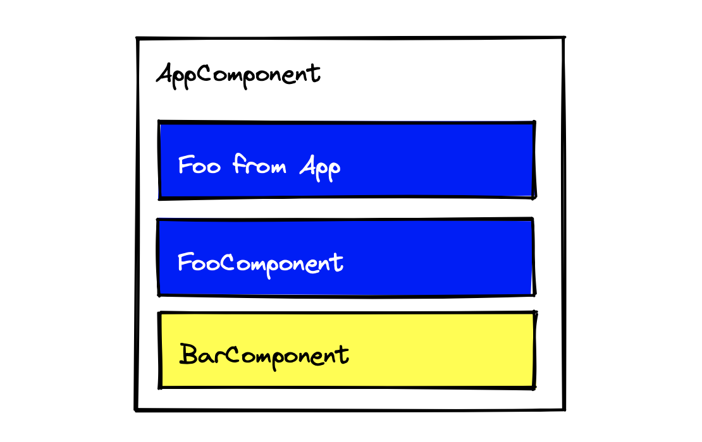

# 03.22.2022 - Angular/Component CSS Isolation

In Angular, component styles are isolated (a.k.a [View Encapsulation](https://angular.io/guide/view-encapsulation)). That means CSS styles of a component are only affect the component itself, **not its parent or child components**.

It is helpful because it can prevent CSS styles conflict between parent and child components.

To see why we need it, let's take a look at the following example.

## An example with no CSS Isolation

Let's say we are not using Angular, but some imaginary UI framework that does not supports CSS isolation. I'm using a JSX-like syntax here only to make the post easier to follow.

We have a program that looks like the following HTML structure:

```
App
 ┠ div.foo
 ┠ Foo
 ┃  ┠ div.foo
 ┖ Bar
    ┖ div.bar
```

The `Foo` component creates a `div` with class `.foo`. The `Bar` component creates a `div` with class `.bar`. The `App` component creates a `div` of class `.foo`, as well as load loading the two `Foo` and `Bar` components.

In the `Foo` component, we load a CSS file with the content of:

```typescript
// foo.style.css
.foo {
    background: red;
}

// foo.tsx
import './foo.style.css';

const Foo = () => (
    <div className='foo'>Foo</div>
)
```

The same with `Bar` component, we load a CSS file with the content like:

```typescript
// bar.style.css
.bar {
    background: red;
}

// bar.tsx
import './bar.style.css';

const Bar = () => (
    <div className='bar'>Bar</div>
)
```

And the `App` component loads them all:

```typescript
// app.style.css
.foo {
    background: blue;
}

// app.tsx
import './app.style.css'
import { Foo } from './foo';
import { Bar } from './bar';

const App = () => (
    <div className='app'>
        <div className='foo'>Foo from App</div>
        <Foo/>
        <Bar/>
    </div>
)
```

We would have the output like this:



In the `App` component, although we already define the blue background for `.foo`, it got overridden by the `.foo` style from `Foo` component, the generated CSS styles would look like this:

```css
.foo {
    background: blue;
}

.foo {
    background: red;
}

.bar {
    background: yellow;
}
```

## An example with CSS Isolation

Now, let's build this example again, this time we are using Angular.

This is how we build the `Foo` component:

```typescript
@Component({
    selector: "foo",
    styles: [
    `.foo {
        background: red;
    }`
    ],
    template: `<div class="foo">Foo</div>`
})
class FooComponent {}
```

And the `Bar` component:

```typescript
@Component({
    selector: "bar",
    styles: [
    `.bar {
        background: yellow;
    }`
    ],
    template: `<div class="bar">Bar</div>`
})
class BarComponent {}
```

And lastly, the `App` component:

```typescript
@Component({
    selector: "app",
    styles: [
    `.foo {
        background: blue;
    }`
    ],
    template: `
    <div class="app">
        <div class="foo">Foo from App</div>
        <foo></foo>
        <bar></bar>
    </div>`
})
class AppComponent {}
```

Now, the output would look like this:



The styles are isolated between the components, so, the style of `.foo` that is defined inside the `App` component only affects the content of `App` component. It has no effect on the child components like `Foo` or `Bar`. The same with the child components, the styles will never affect its parent's content.

Even if you force the style for `.foo` class from `App` component, nothing will be changed in the `Foo` component.

```css
.foo {
    background: blue !important;
}
```

The only way to force the style of child components from the parent component is to use `::ng-deep` selector for each rule in the parent:

```css
::ng-deep .foo {
    background: blue !important;
}
```



## How View Encapsulation works?

When creating a component in Angular, we can specify the `encapsulation` property, with one of the three values:

- **ViewEncapsulation.ShadowDom**: use the browser's Shadow DOM API to implement isolation. We will go into the details of this mode in another post.
- **ViewEncapsulation.Emulated**: Angular modifies the CSS selectors to implement the isolation between views
- **ViewEncapsulation.None**: disable the CSS isolation for the component

By default or when not specified, the value is `ViewEncapsulation.Emulated`. To understand how this mode works, let's look at the generated HTML structure of the above Angular example:

```html
<app _nghost-qwd-c0>
    <div _ngcontent-qwd-c0 class="app">
        <div _ngcontent-qwd-c0 class="foo">Foo from App</div>
        <foo _ngcontent-qwd-c0 _nghost-qwd-c1>
            <div _ngcontent-qwd-c1 class="foo">Foo</div>
        </foo>
        <bar _ngcontent-qwd-c0 _nghost-qwd-c2>
            <div _ngcontent-qwd-c2 class="bar">Bar</div>
        </bar>
    </div>
</app>
```

Angular appended some attributes to each of the generated HTML elements like `_nghost-<id>` and `_ngcontent-<id>`, in which:

- **ngHost** to identify where the component started
- **ngContent** is the inner HTML content of each host

For example, with the `bar` component, we can see that it is the content of `_nghost-qwd-c0`, which is the `App` component. At the same time, it is a new host called `_nghost-qwd-c2`.

The generated CSS would look like this:

```css
.foo[_ngcontent-qwd-c0] {
    background: blue;
}

.foo[_ngcontent-qwd-c1] {
    background: red;
}

.bar[_ngcontent-qwd-c2] {
    background: yellow;
}
```

By using the custom attributes, Angular is able to isolate the conflict styles selectors between the components.

If we specify the `ViewEncapsulation.None` to a component, the custom context attributes will not be generated, resulting in a normal-looking CSS styles (only for that component):

```typescript
@Component({
    selector: "app",
    styles: [
    `.foo {
        background: blue;
    }`
    ],
    ...
    encapsulation: ViewEncapsulation.None
})
```

Here's the generated CSS:

```css
.foo {
    background: blue;
}
```

The same as when we apply a `::ng-deep` pseudo-selector for a CSS rule, that CSS rule will be generated as a global scope:

```typescript
@Component({
    selector: "app",
    styles: [
    `.foo {
        background: blue;
    }

    ::ng-deep .bar {
        color: red;
    }`
    ],
    ...
    encapsulation: ViewEncapsulation.Emulated
})
```

The generated CSS would be:

```css
.foo[_ngcontent-qwd-c0] {
    background: blue;
}

.bar {
    color: red;
}
```

The `.bar` selector is generated at the global scope, so it can be applied to the `bar` elements in the inner scope.

This is why we should always narrow down the scope of the selector when using `::ng-deep`, so it will affect only the child components of your current component.

## What's next?

- https://angular.io/guide/component-styles
- https://angular.io/guide/view-encapsulation