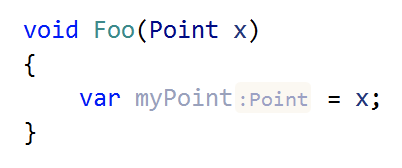
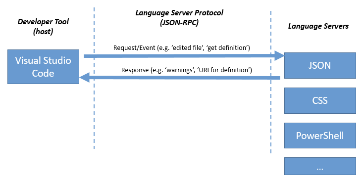
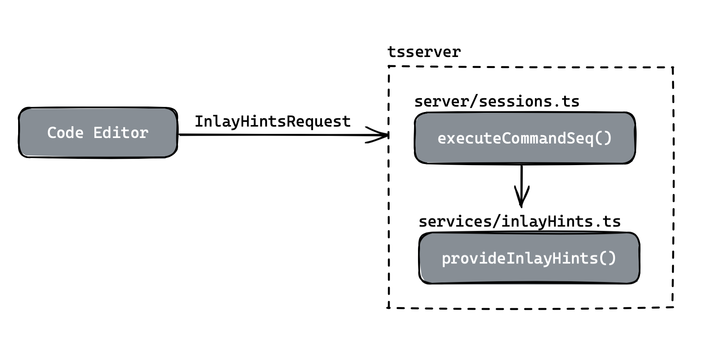
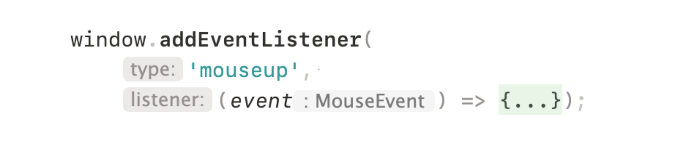
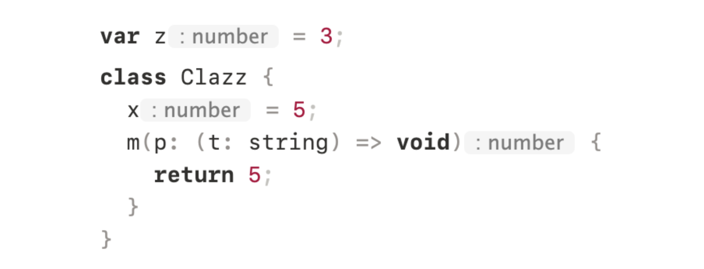
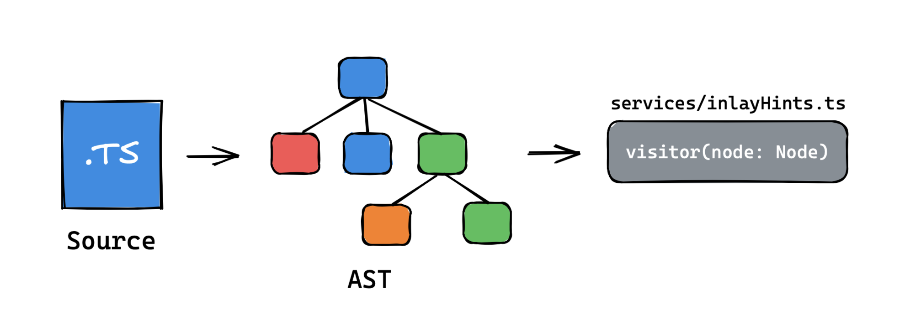
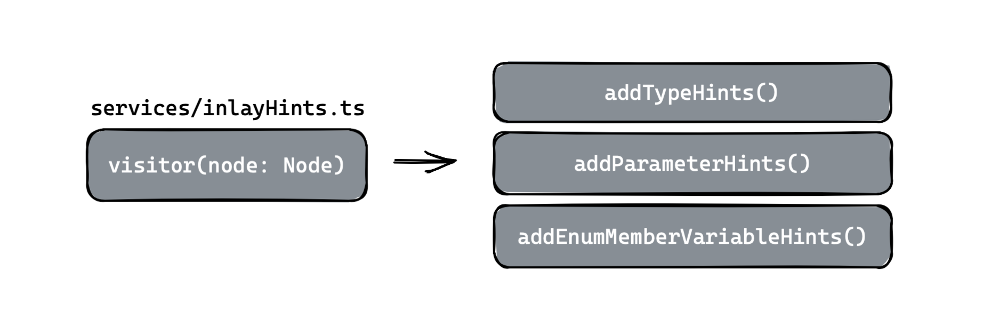
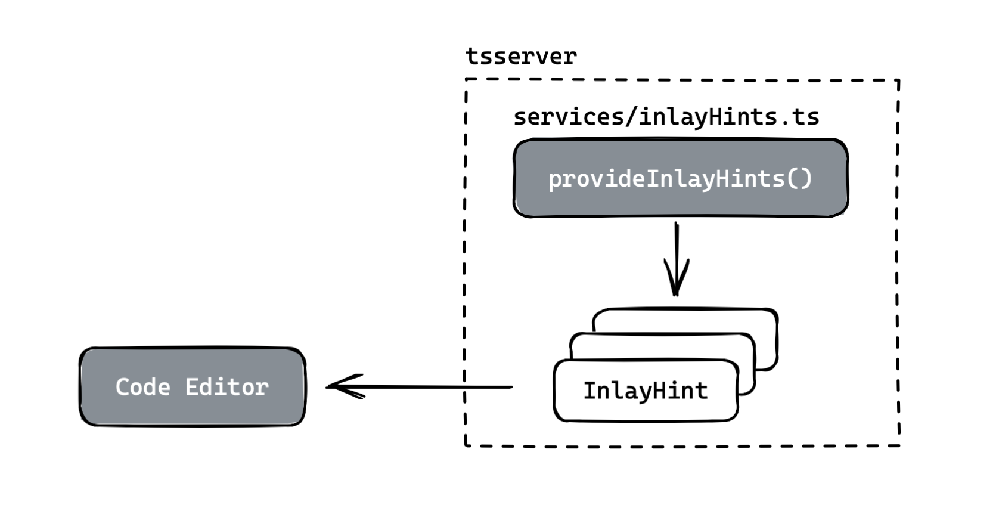
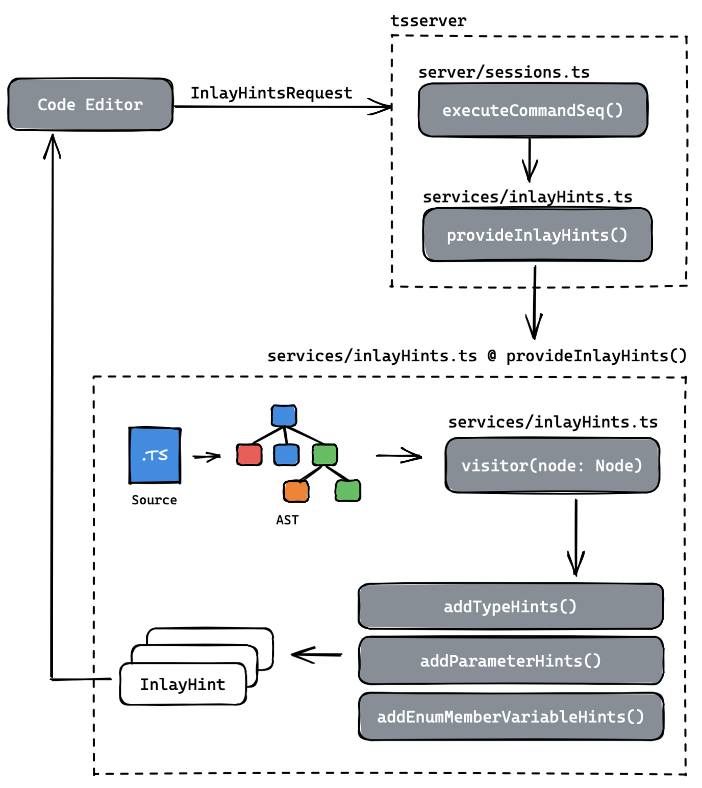

# 03.24.2022 - TypeScript/Source Code Walkthrough: InlayHints

So, I want to look into the TypeScript source code to understand how things work and maybe contribute to the project as well.

This is a quite big project but I think the code organization is pretty good. And they have loads of documents as well.

The [How the TypeScript Compiler Compiles](https://www.youtube.com/watch?v=X8k_4tZ16qU&list=PLYUbsZda9oHu-EiIdekbAzNO0-pUM5Iqj&index=4) video is a good place to start when you want to understand the compilation process of TypeScript.

Also, there are a lot of notes in [TypeScript Compiler Notes](https://github.com/microsoft/TypeScript-Compiler-Notes) repository, and the [TypeScript Deep Dive](https://basarat.gitbook.io/typescript/overview) book.

After reading them, what next is to pick up a feature that I want to look at. Since I saw a [recently closed ticket](https://github.com/microsoft/TypeScript/issues/48277) about <abbr>inlay hints</abbr>, maybe I can just go with it.

## Before we start: LSP and InlayHints

<abbr>**language server protocol (LSP)**</abbr> is the communication protocol between the *code editors* (Neovim, VSCode, IntelliJ IDEA,...) and the <abbr>**language servers**</abbr> (tsserver, gopls, rust-analyzer...) to provide rich editing and code analysis experience.

<abbr>**inlay hints**</abbr> is one of the features provided by the <abbr>language servers</abbr>, to help the editor render the type annotation next to some tokens of code. For example, the little `:Point` tag in this screenshot:



The communication between the editor and the <abbr>language server</abbr> via <abbr>language server protocol</abbr> can be described as the following diagram:



## Explore the code

Let's start looking at TypeScript's source code to see how the <abbr>inlay hints</abbr> feature is implemented. Since it's a language server's feature, this has to be something related to `tsserver`. The best way to start is to look at the test files.

The unit tests for every features in `tsserver` is defined in the [testRunner/unittests/tsserver](https://github.com/microsoft/TypeScript/tree/main/src/testRunner/unittests/tsserver) folder. Look into it, we will see there is an [inlayHints.ts](https://github.com/microsoft/TypeScript/blob/main/src/testRunner/unittests/tsserver/inlayHints.ts) file.

Also, there are other tests cases for <abbr>inlay hints</abbr> defined in the [tests/cases/fourslash/inlayHints(...).ts](https://github.com/microsoft/TypeScript/tree/main/tests/cases/fourslash) files, you can look at these files too.

### The Execution Path



In the test runner, the <abbr>inlay hints</abbr> feature are invoked with the `session.executeCommandSeq<protocol.InlayHintsRequest>` call:

**testRunner/unittests/tsserver/inlayHints.ts**

```typescript
session.executeCommandSeq<protocol.InlayHintsRequest>({  
    command: protocol.CommandTypes.ProvideInlayHints,  
    arguments: {  
        file: app.path,  
        start: 0,  
        length: app.content.length,  
    }  
})
```

Follow along and look inside this method, which is defined in the [src/server/sessions.ts](https://github.com/microsoft/TypeScript/blob/main/src/server/session.ts) file. What it does is to call the correct handler from the request command (`CommandTypes.ProvideInlayHints`). All the handlers for the LSP commands are defined as a map:

```typescript
private handlers = new Map(  
    getEntries<(request: protocol.Request) => HandlerResponse>({  
        ...  
        [CommandNames.ProvideInlayHints]:  
            (request: protocol.InlayHintsRequest) => this.requiredResponse(this.provideInlayHints(request.arguments));  
        }));
```

Now, we arrive at the `provideInlayHints` function, what this method does it to call the `LanguageService.provideInlayHints()` method. Which is located at [src/services/inlayHints.ts](https://github.com/microsoft/TypeScript/blob/main/src/services/inlayHints.ts). And this is where TypeScript implemented the <abbr>inlay hints</abbr> feature.

### How provideInlayHints works

Now, let's take a look at the `InlayHints.provideInlayHints` function: it takes an `InlayHintsContext` and returns an array of `InlayHint`.

Some interesting information in the `InlayHintsContext`:

```typescript
export interface InlayHintsContext {
    file: SourceFile;
    program: Program;
    cancellationToken: CancellationToken;
    host: LanguageServiceHost;
    span: TextSpan;
    preferences: UserPreferences;
}
```

- The compiling context of the source file (where you can access the source, the AST, the type checker,...)
- The TextSpan (is the position of text that we want to process the <abbr>inlay hints</abbr>)
- The preferences from the user's editor (In IntelliJ, you can see the options at _Preferences -> Editor -> InlayHints -> TypeScript_)
- And lastly, the CancellationToken, I guess it's for cancel the previous <abbr>inlay hints</abbr> requests.

An `InlayHint` has the structure of:

```typescript
export interface InlayHint {
    text: string;
    position: number;
    kind: InlayHintKind;
    whitespaceBefore?: boolean;
    whitespaceAfter?: boolean;
}
```

- The text content
- The position where we will add the <abbr>inlay hints</abbr> to
- The kind of <abbr>inlay hints</abbr>

You can see the details of the above types at [src/services/types.ts](https://github.com/microsoft/TypeScript/blob/main/src/services/types.ts).

In the `InlayHints.provideInlayHints` function, there are **3 methods**: `addParameterHints`, `addTypeHints`, and `addEnumMemberValueHints`, which push a new `InlayHint` object into the result array:

```typescript
function addParameterHints(text: string, position: number, isFirstVariadicArgument: boolean) {
    result.push({
        ...
        kind: InlayHintKind.Parameter,
        ...
    });
}

function addTypeHints(text: string, position: number) {
    result.push({
        ...
        kind: InlayHintKind.Type,
        ...
    });
}

function addEnumMemberValueHints(text: string, position: number) {
    result.push({
        ...
        kind: InlayHintKind.Enum,
        ...
    });
}
```

So we know there are 3 types of <abbr>inlay hints</abbr>:

- <abbr>**parameter hint:**</abbr> Is the hint that appears in function calls parameters
  
  
  
- <abbr>**type hint:**</abbr> This is the hint that appears in variable or class/struct fields declarations
  
  
  
- <abbr>**enum member value hint:**</abbr> This is the hint for the values of enums
  
  

The most important part of `InlayHints.provideInlayHints` is the `visitor()` method.



What it does is to **visit every node on the AST** of the current source file, and only generate the inlay hint **if the node is within the requested range** from the LSP client, it also skips if the node is a type declaration:

```typescript  
if (!textSpanIntersectsWith(span, node.pos, node.getFullWidth())) {  
    return;  
}  
  
if (isTypeNode(node)) {  
    return;  
}  
```

Now, for each valid node, more checks will be performed, if the node matches one of the three above inlay hints types, we get the Node's type and create the `InlayHint`:

```typescript
const declarationType = checker.getTypeAtLocation(decl);  
...  
  
const typeDisplayString = printTypeInSingleLine(declarationType);  
if (typeDisplayString) {  
    addTypeHints(typeDisplayString, decl.name.end);  
}  
```



There are some interesting pieces like the `printTypeInSingleLine(type: Type)` to format the <abbr>inlay hints</abbr> of a type into a single line, for example, with the following type:  
      
```json 
{  
    foo: number;  
    bar: string;  
}  
```  
      
The inlay hint string will be written as:  
      
```json  
{ foo: number; bar: string; }  
```

Lastly, all the `InlayHint` will be sent back to the code editor to render on the screen:



## Closing notes

In case you are lazy and scroll all the way down here from the beginning, here's a recap:



_(You can open the image in a new tab for a better resolution)_

At this point, we are pretty clear about how the <abbr>inlay hints</abbr> feature works, what we should do next is dig deeper into the AST traversal, messing up with various types of user preferences or the `InlayHint` structure to see how things change in the tests and maybe in your editor!

All the files in this walkthrough:

- [testRunner/unittests/tsserver/inlayHints.ts](https://github.com/microsoft/TypeScript/blob/main/src/testRunner/unittests/tsserver/inlayHints.ts)
- [server/session.ts](https://github.com/microsoft/TypeScript/blob/main/src/server/session.ts)
- [services/inlayHints.ts](https://github.com/microsoft/TypeScript/blob/main/src/services/inlayHints.ts)
- [services/types.ts](https://github.com/microsoft/TypeScript/blob/main/src/services/types.ts)