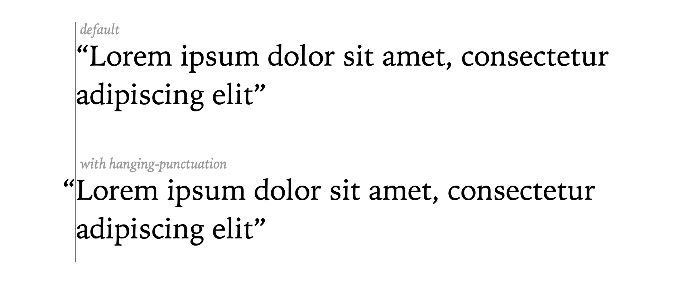
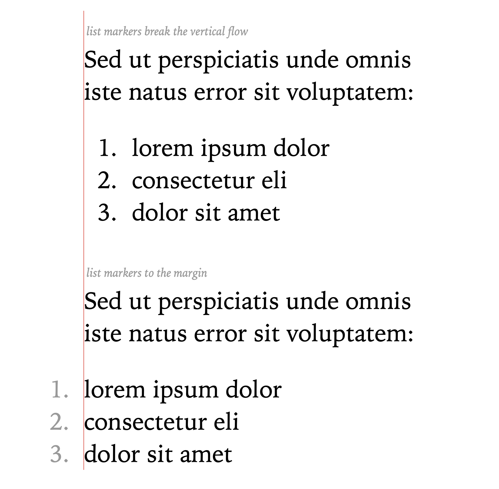

# 03.26.2022 - Typography/Hanging Punctuation

Hanging punctuation is the practice of pulling the punctuation marks into the margin of a text so that it does not disturb the _vertical [reading flow](https://betterwebtype.com/articles/2018/10/15/rhythm-in-web-typography/)_.

It was first introduced by Gutenberg in the [Gutenberg Bible](https://en.wikipedia.org/wiki/Gutenberg_Bible), the first book printed in Europe.

This practice should be applied to text that starts with a punctuation mark, for example, *quotations*, or *lists*,... and can be applied on both the left and right margin.

In CSS, there are different ways to implement hanging punctuation, for example, using the `hanging-punctuation` for body text or `list-style-position` for list items, or you can remove the padding, margin, depending on your HTML structure.

When using this style, pay attention to the mobile view or other small screen devices, because the punctuations might get overlapped to the edge of the screen.

**References**

- https://betterwebtype.com/articles/2018/10/15/rhythm-in-web-typography/#hanging-punctuation
- https://en.wikipedia.org/wiki/Hanging_punctuation
- https://www.artlebedev.com/mandership/120/
- https://www.fonts.com/content/learning/fontology/level-4/fine-typography/hanging-punctuation
- https://fonts.google.com/knowledge/using_type/working_with_hanging_punctuation
- https://css-tricks.com/almanac/properties/h/hanging-punctuation/