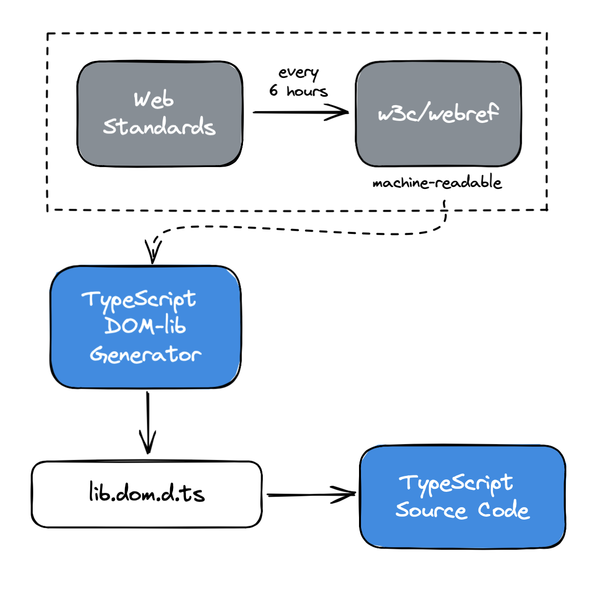

# 03.29.2022 - TypeScript/A note about lib.dom.d.ts

In TypeScript, all the type definitions for the Web API are implemented in the [lib.dom.d.ts](https://github.com/microsoft/TypeScript/blob/main/lib/lib.dom.d.ts) file.

One interesting thing is, this file is automatically generated from the Web Standards and does not mean to be edited by hand.

The [w3c/webref](https://github.com/w3c/webref) project generates the machine-readable version of the Web Standards. New data is generated every 6 hours.

The [microsoft/TypeScript-DOM-lib-generator](https://github.com/microsoft/TypeScript-DOM-lib-generator/) project pulls the machine-readable _webref_ and uses it as a reference data to generate the TypeScript interface for every Web API. The output is the generated `lib.dom.d.ts`, which will be used in TypeScript.

In this repository, we can modify the behavior of the generator like:

- Adding new types definition in `inputfiles/addedTypes.jsonc`
- Overriding the default type definition from the specs in `inputfiles/overridingTypes.jsonc`
- Modify the comment string of a type (which will also being shown in the documentation popup of the editor) in `inputfiles/comments.jsonc`
