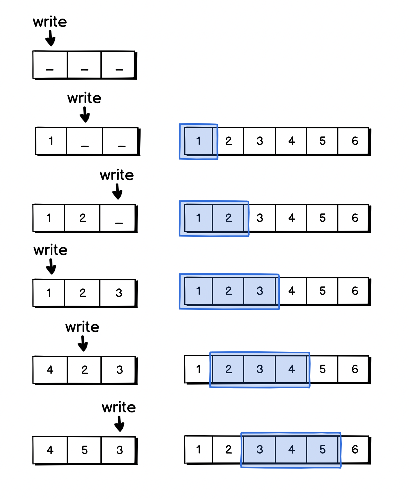

# 04.03.2022 - Algorithms/Sliding Window With Two Pointers

For the problems that require us to do something a stream of values, or a subsequence of an array, the typical approach is to use a sliding window.


A naive way to implement a sliding window is to have a nested loop, the first loop to iterate the start position of the window, and the second loop to collect the values inside a window:

```python
for(start = 0..array.length):
    for (end = start..start + window_length):
        // value array[start..end]
```

This algorithm would run in **O(N * K)** time, with **N** being the number of elements, and **K** is the window size.

A better approach to implementing sliding windows is to keep track of just the start and the end of the window. Since most of the items in between are overlapped when sliding, we can eliminate the inner loop, depending on what operation we need to perform on the array.


For example, if a problem requires us to perform some work on the sum of each window, we can reuse the sum by adding the value of the new element and subtracting the value of the value at the beginning of the previous window.

```python
start = 0
sum = 0
for (end = 0..array.length):
	sum += array[end]
	sum -= array[start]
	start += 1
```

This approach only takes **O(N)** time.

Sometimes, you will need to check for all subarrays without the fixed window size, the windows could be shrinking or expanding depending on some conditions.


In this case, the **start** and **end** pointers can be moved using this pattern:

```python
start = 0
for (end = 0..array.length):
	// do something
	...
	// shrink the window
	while (need_to_shrink):
		start += 1
```

The above approaches work well when you do not need to keep track of the overlapped items between the windows. In some problems, when working on a stream of data, you might need to have the information of all the items in between. In this case, using a circular buffer (or ring buffer) as a fixed queue would be a better solution.



A ring buffer can be easily implemented using an array for storing data, and two pointers for **writing** and **reading**.


Here's an implementation of a circular buffer using JavaScript:

```javascript
const CircularBuffer = function(size) {
    this.data = Array(size).fill(0).map(_ => 0);
    this.writePtr = 0;
    this.readPtr = 0;
    
    return {
        put: (value) => {
            this.data[this.writePtr++] = value;
            this.writePtr %= size;
        },
        get: () => {
            let item = this.data[this.readPtr++];
            this.readPtr %= size;
            return item;
        }
    }
};
```
