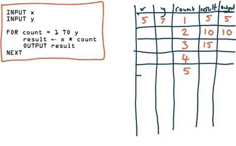

# 04.04.2022 - Reading Notes/Understand Complex Code with Dry Run

OK, this one is embarrassing, I still remember the first time I was taught to dry run the code. It was many years ago when I started learning how to program. But I've never actually tried it properly.

Most of the time, I just let the compiler run and put a log between the lines to see the output values (what do we call? log-driven debugging?), this is not a bad approach but I find it hard to fully understand the code using this approach, for many reasons:

- We can't just put a log on every line of code, for example, on an **if** statement
- Sometimes, it's not straightforward to just test a particular function without running the whole program or the flow. Using a step debugger won't help in this case.

Until recently when I do a mock interview with a friend, she did it to verify her implementation, it also helped me understand the code she wrote better.

When working with some code that you do not immediately understand, it's also good to apply this technique as well. The point is to slow down and actually take a closer look at every line of code and see how the input values transform between the lines.

There are many ways to dry run, actually. You can make a trace table to track the values at every step, like this:



<center>(Source: <a href="https://www.youtube.com/watch?v=Fpg7jpO3XlQ">Using trace tables to check an algorithm's correctness</a>)</center>

But a faster way, I think, is to just write a comment on each line of code to track the values.

For example, let's take a look at this function, and assume that we are not immediately sure what's this function does, or what's the value `a` or `r` here:

```javascript
const swap = (a, i) => {
    [a[i-1], a[i]] = [a[i], a[i-1]]
};

const sort = (a) => {  
    let r = false;  
    while (!r) {  
        r = true;  
        for (let i in a) {  
            if (a[i-1] > a[i]) {  
                r = false;  
                swap(a, i);
            }  
        }  
    }  
};
```

The only thing we know is, it's a sort function, so let's give it an array, for example: **[5,3,4,1]**. Go through every line of code and write the values of the variables on the side. So, after a few iterations, the code should look like this:

```javascript
const swap = (a, i) => { // a = [5,3,4,1], i = 1
    [a[i-1], a[i]] = [a[i], a[i-1]] // [5,3] = [3,5]
    // it's a swap! wow!
};

const sort = (a) => {  // a = [5,3,4,1]
    let r = false;  
    while (!r) {  // r = false
        r = true;  
        for (let i in a) {  // i = 1
            if (a[i-1] > a[i]) {  // 5 > 3 = true
                r = false;  
                swap(a, i); // swap(a, 1)
                            // a = [3, 5, 4, 1]
            }  
        }  
    }  
};
```

Keep going until you reached the end, know that this is an implementation of a bubble sort algorithm, it modifies the input data directly, so no need to return anything, and the swap algorithm is implemented using a neat array trick.