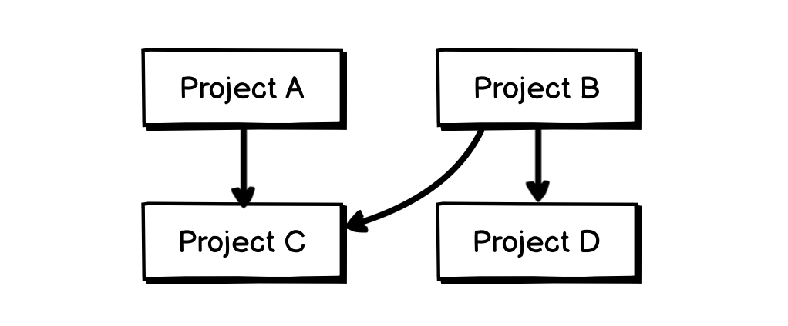
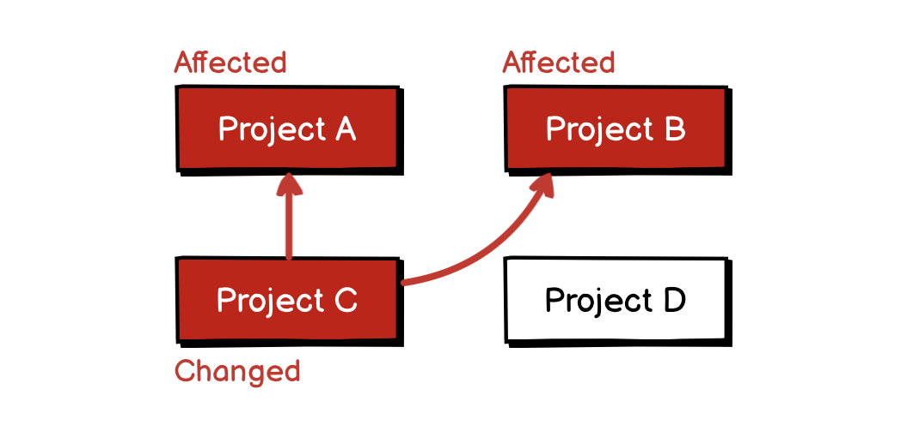
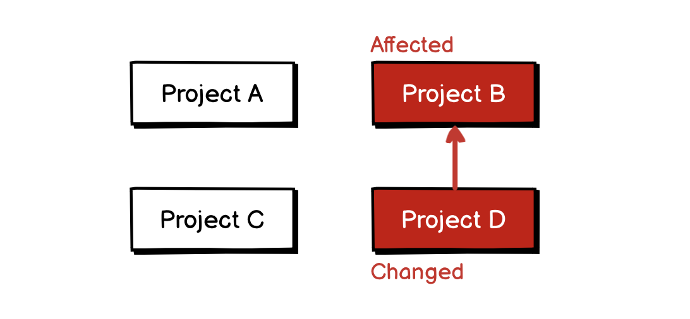
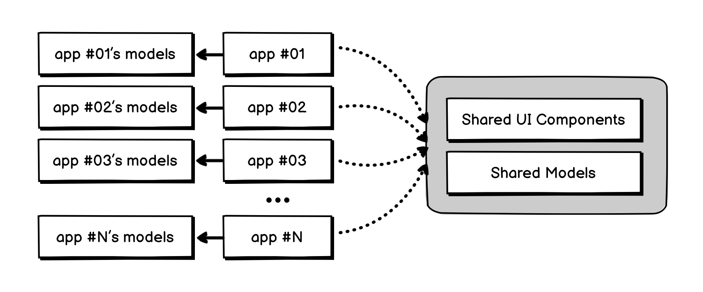
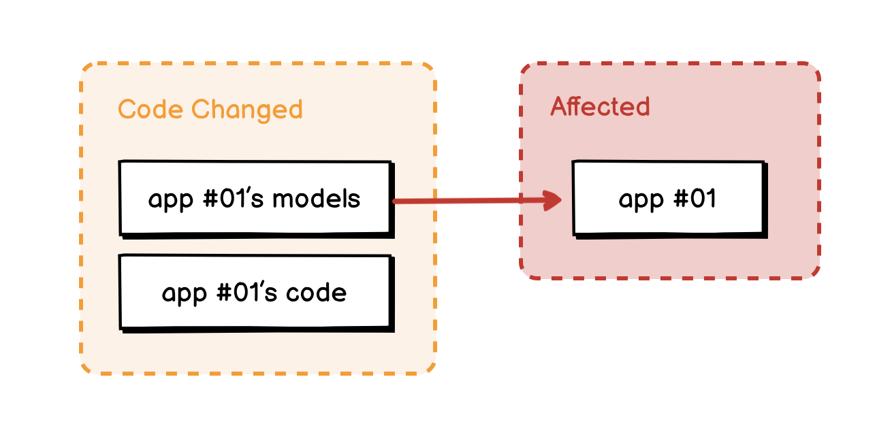

# 04.06.2022 - Monorepo/Code organization when using Nx

Nx is a tool to create and manage multiple-project workspaces. One of its most important features is the ability to track the changes in your projects in your workspace and only rebuild what is affected. (See: [Nx Affected](https://nx.dev/using-nx/affected)).

For example, if you have a workspace with 4 projects **A**, **B**, **C**, and **D** as described in the following chart. **Project A** and **B** have a dependency on **Project C**, while **Project D** is only used by **Project B**.

Making any changes to **Project C** will mark **Project A** and **B** as affected.

But if you make a change to **Project D**, only **Project B** will be marked as affected, leaving **Project A** untouched.

When using the `nx affected` to build or test the workspace, all the unaffected projects will not be built, but reuse the cached one from previous builds.

---

Sometimes, it is easy to organize the code in a way that prevents Nx from caching your build properly. For example, it is common to have a shared folder to store all the UI components or the application models in a shared project:

Since it makes sense to have all the models in one place, making it easier to find. This approach has a caveat:

Every project has a dependency on the shared Models project. Making any change to a model of any project will mark every project as affected!

A better way to organize the code, in this case, is to not share any app-specific code in the shared modules and pay attention to what you are going to share between the projects.

When making changes, also try to not change the shared code so much. This way, you will be able to keep the affected tree minimal and speed up the build process a lot.

This might sound obvious, but it actually happens for real. I know it because I did structure my project that way and wasted countless hours of waiting for Github Action to build =))