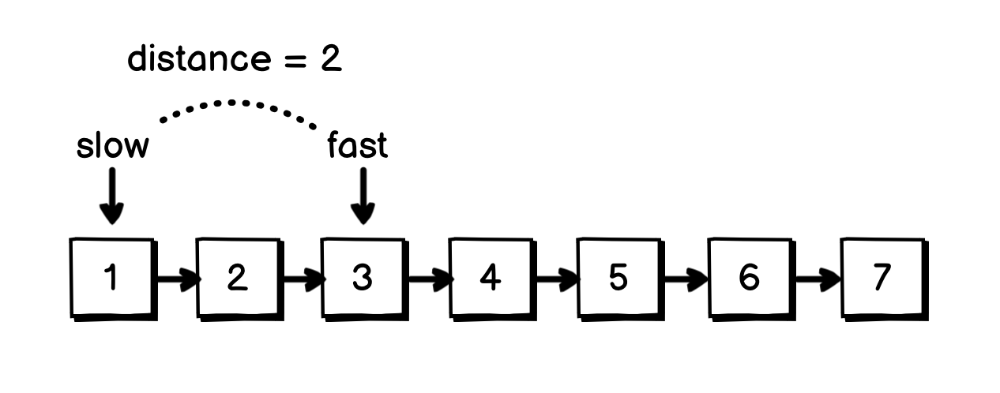
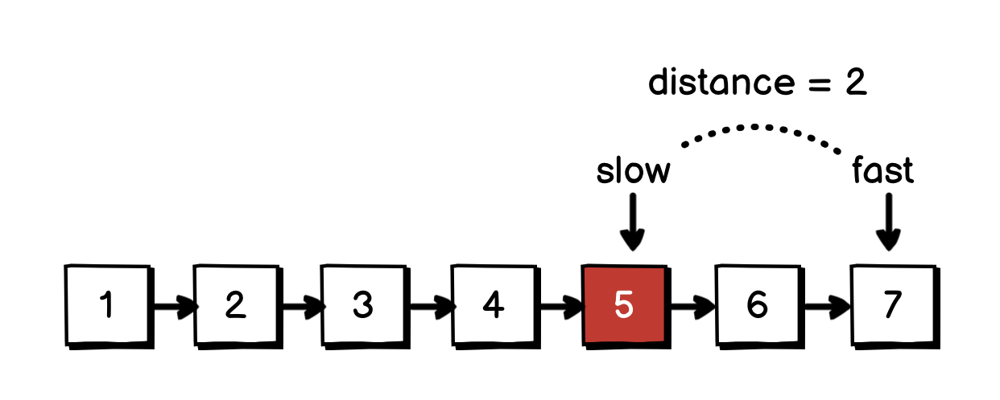
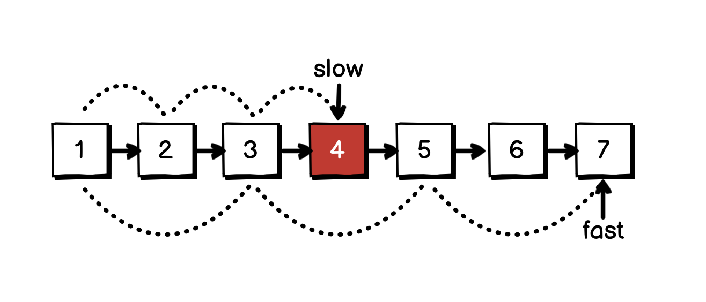

# 04.07.2022 - Algorithms/Fast and Slow Pointers For Linked List

In a Linked List, traversal is restricted to forward only, you can't really go back to previous nodes once you go past them. When working on a problem that requires us to do some lookup in a Linked List, the naive approach is to traverse the list multiple times.

Another better approach is to use the *Fast and Slow Pointers* technique. Most of the time, we can solve the problem with a single pass.

Let's take a look at some example use cases.

## Find the $n^{th}$ node from the end of the list

Let's say, we want to find the $n^{th}$ node from the end of a Linked List, we can do it naively by traversing from the head to the tail to get the length $L$ of the list, then do a second traversal just $L - n$ times.

Using fast and slow pointers, we can first increase the **fast** pointer **n** times, the distance between **fast** and **slow** is now **n** nodes.



Now, increase both the **fast** and **slow** pointers until **fast** reaches the end of the list. Since the two pointers have the distance of **n**, the position of the **slow** pointer is the $n^{th}$ node from the end of the list.



The algorithm can be implemented like this:

```go
fast := head
slow := head

for n > 0 {
    fast = fast.Next
}

for fast.Next != nil {
    fast = fast.Next
    slow = slow.Next
}

// slow is the nth from the end here
```

## Find the middle node of the list

Another example, this time we want to look for the middle node of the list. We can do it naively by traversal the list in two-pass, with the second pass in $L/2$ times.

Using fast and slow pointers, we increase the **slow** pointer one node at a time, and the **fast** pointer goes twice as fast with **fast = slow.Next.Next**, by the time **fast** reaches the end of the list, the **slow** pointer will be in the middle:



Implementation:

```go
fast := head
slow := head

for fast != nil && fast.Next != nil {
    slow = slow.Next
    fast = fast.Next.Next
}

// end of the loop, slow is the middle node
```

A similar technique can also be applied to detect a cycled linked list. Since the **fast** pointer will always, at some point, meet the **slow** pointer if it keeps cycling.