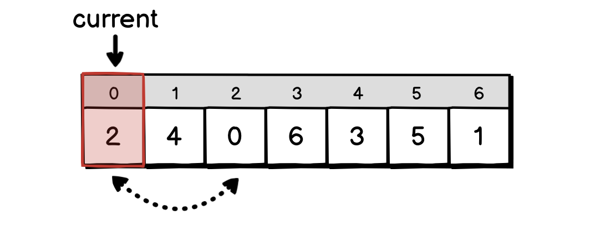

# 04.08.2022 - Algorithms/Cyclic Sort: Sorting in O(N)

Cyclic Sort is an easy to implement and efficient algorithm. The only caveat is that it requires an input array to be a continuous range of values.

It can be applied to the problems of finding *duplicate* or *missing* numbers.

We can use the fact that the input values are a continuous range of numbers, every value will match its index somehow. For example, an array of **[0..10]** will have all its values matching its index. Or in an array of **[100..200]**, every value of index $i$ has the value of $i + 100$.

So, to tell if a value is in the correct position in the array, we can just check its index.

The way the cyclic sort algorithm works is, assuming the values are in the range of **[0..n]**:

1. **Step 1:** Create a **current** pointer, check for the number under the pointer **nums[current]**
2. **Step 2:** If **nums[current]** is in the correct position, increase the pointer to the next number
3. **Step 3:** If **nums[current]** is not in the correct position, move it to the correct position (**target = nums[current]**) and move the value that is occupying position **target** back to **current**.
4. **Step 4:** Repeat until **current** reaches the end of the array

Let's take an example, we want to sort the array **nums = [2, 4, 0, 6, 3, 5, 1]**. First, the **current** pointer is at index 0, which has a value of 2. This is not the correct value, so we move the value 2 to the index 2, swapping the value **nums[2] = 0** back to **nums[0]**.



The value at **nums[current]** is now 0, which is correct. We can move the **current** pointer forward. This time, we have **current = 1**, the value at **nums[current] = 4**, which is not correct. So we move 4 into **nums[4]**, taking back the value at **nums[4]** and put it into **nums[1]**.


Now, the value at **nums[current]** is 3, still not the correct value for its position, we cannot move the **current** pointer forward. Instead, let's swap 3 with the value at **nums[3]**:


The value of **nums[current] = 6** still not the correct value for position **current = 1**, we have to swap one more time, this time, swap **nums[1]** with **nums[6]**:


Now, at the position **current = 1**, the value **nums[current] = 1** is the correct value. We can move the **current** pointer forward.


Since everything in the way are the correct values, we keep moving the pointer until we reach the end of the array, and the algorithm is finished.

The time complexity of the Cyclic Sort algorithm is $O(N)$. In the worst-case scenario, when we cannot increment the **current** pointer, it takes $O(2N - 1)$ time.

Here is the implementation of the Cyclic Sort algorithm:

```go
func CyclicSort(nums []int) {
	n := len(nums)
	i := 0
	for i < n {
		j := nums[i]
		if j < n && nums[j] != nums[i] {
			nums[j], nums[i] = nums[i], nums[j]
		} else {
			i++
		}
	}
}
```

For the problems that require us to find all the missing or duplicate numbers in an array, we can first sort the elements using Cyclic Sort and then loop through the sorted array to check if any value is displaced from its correct position.

```go
func findAllMissings(nums []int) []int {
	found := make([]int, 0)

	CyclicSort(nums)

	for i, n := range nums {
		if i != n {
			found = append(found, i)
		}
	}

	return found
}

func findAllDuplicates(nums []int) []int {
	found := make([]int, 0)

	CyclicSort(nums)

	for i, n := range nums {
		if i != n {
			found = append(found, n)
		}
	}

	return found
}
```

There is also a variant of Cyclic Sort that could return early when it finds the duplicate number during sorting, so we don't need a second loop:

```go
func findDuplicate(nums []int) int {
    n := len(nums)
    i := 0
    for i < n {
        if i != nums[i] {
            j := nums[i]
            if nums[j] != nums[i] {
                nums[j], nums[i] = nums[i], nums[j]
            } else {
                // Found the duplicate at i
                return i
            }
        } else {
            i++
        }
    }
    return -1
}
```
