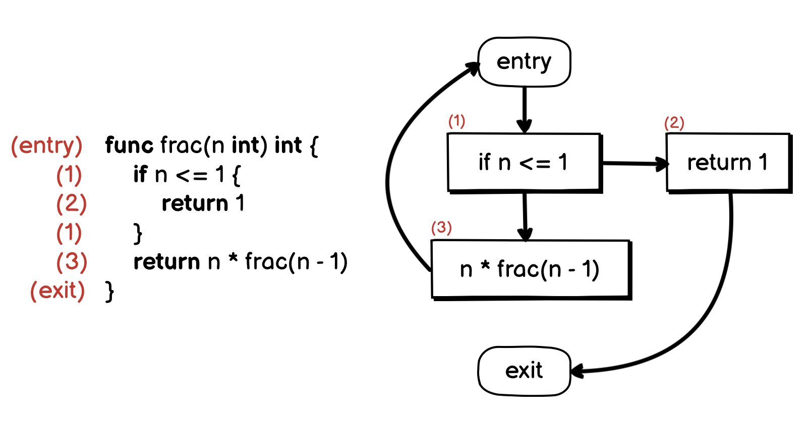
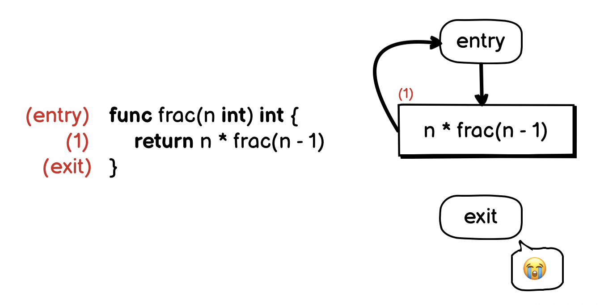
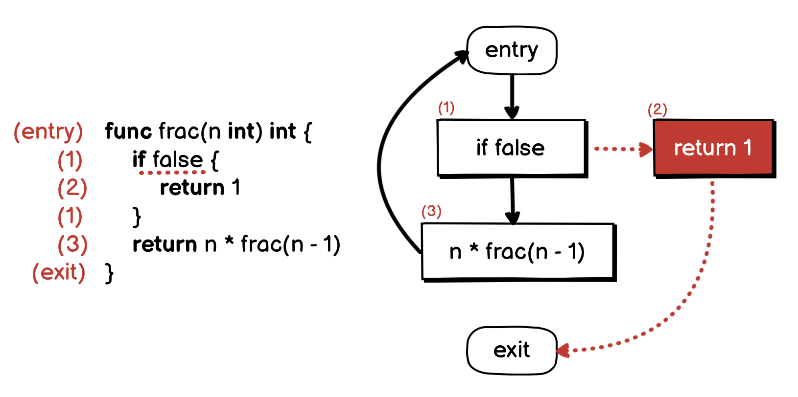

# 04.13.2022 - Reading Notes/Detect Infinite Recursive Call with Control Flow Graph

[**go-staticcheck**](https://github.com/dominikh/go-tools/) is a static code analysis tool for Go. It has an interesting ability to detect infinite recursive calls. For example, infinite calls like this would be detected early before the program run:

```go
func frac(n int) int {
    return n * frac(n - 1);
//             ^^^^^^^^^^^^
// infinite recursive call (SA5007) go-staticcheck
}
```

The way it works is interesting. It is based on [**Control Flow Graph Analysis**](https://en.wikipedia.org/wiki/Control-flow_graph).

Control Flow Graph (CFG) is a way to represent the code by a *directed graph*, where each *node* is a *basic block* — a straight line of code without any jumps. Each graph must have an _entry block_ and an _exit block_.

For example, look at the following fractional function:



There are 3 blocks **(1)**, **(2)**, and **(3)**. And the CFG for this function can be illustrated in the above graph. It has the **(entry)** and **(exit)** blocks.

In the above graph, there is a recursive call from the block **(3)**, which creates a loop to the **(entry)** block again. But thanks to the **if** statement at block **(1)**, we are able to break the loop and reach the **(exit)** block.

Let's see what happens if we make this function an infinite recursive, by removing the base condition:



Now, the recursive call from the block **(1)** creates a loop to the **(entry)** block, but there is nothing to stop the loop. We will never reach the block **(exit)**. So we know this is an infinite recursive call.

In **go-staticcheck**, this check is [implemented in **CheckInfiniteRecursion** function](https://github.com/dominikh/go-tools/blob/273d35f584109c9c64faa5cee9280f0258e4b711/staticcheck/lint.go#L2825-L2853).

```go
func CheckInfiniteRecursion(pass *analysis.Pass) (interface{}, error) {
	for _, fn := range pass.ResultOf[buildir.Analyzer].(*buildir.IR).SrcFuncs {
		eachCall(fn, func(caller *ir.Function, site ir.CallInstruction, callee *ir.Function) {
            ...
			block := site.Block()
			for _, b := range fn.Blocks {
				if block.Dominates(b) {
					continue
				}
				if len(b.Instrs) == 0 {
					continue
				}
				if _, ok := b.Control().(*ir.Return); ok {
					return
				}
			}
			report.Report(pass, site, "infinite recursive call")
		})
	}
	return nil, nil
}
```

It is worth noting that, this approach is only based on the syntax of the code, and can only catch issues during the compilation, not runtime.

For example, in the above infinite recursive call example, we can manipulate the CFG to pass the check by adding a dummy **if** statement, which does not actually serve as a base condition of the recursive call:



Syntactically, the **if** statement always creates two branches in the CFG, the static analyzer will assume that the **(exit)** block can be reached. But in this case, our **if** statement evaluates the **false** expression, which makes it always fall into the **false** branch, and the **true** branch will never reach. And at runtime, it will cause a stack overflow.

