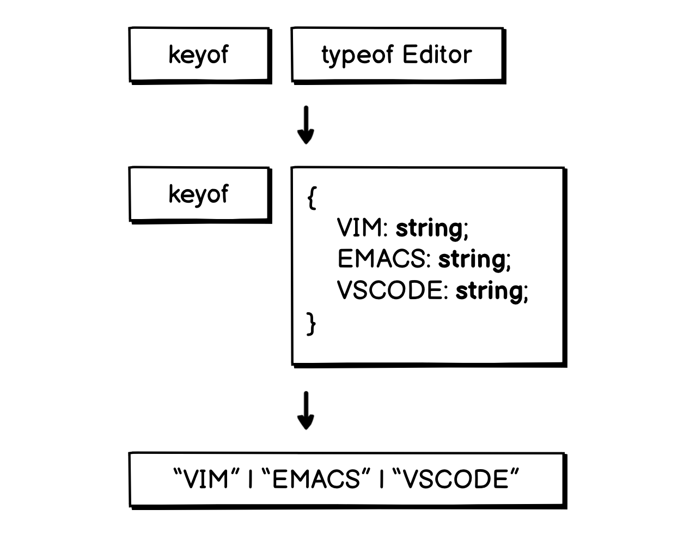

# 04.14.2022 - TypeScript/Understanding "keyof typeof"

In the ["Use String as Enum Key"](/everyday/04-11-2022-typescript-use-string-as-enum-key) article, we use the **keyof typeof** keywords to create a union of an enum's keys.

```typescript
enum Editor {
    VIM = 'Neovim',
    EMACS = 'Emacs',
    VSCODE = 'Visual Studio Code'
};

type EditorKey = keyof typeof Editor;
// Editor = "VIM" | "EMACS" | "VSCODE"
```

It might not be immediately clear why and how this keywords combination works. In this article, let's take a closer look.

As we already know, under the hood, [enums in TypeScript are just objects](/everyday/02-24-2022-typescript-enums-at-runtime-and-tree-shaking). So, the way **typeof** and **keyof** operates on enum is just the same as how it works on an object.

The **typeof** keyword returns the shape of an input object, for example:

```typescript
const bookObj = {
    title: "Hello, World",
    pages: 140,
    paperback: true
};

type Book = typeof bookObj;

// Is equivalent to

type Book = {
    title: string;
    pages: number;
    paperback: boolean;
};
```

When using the **keyof** object on some type **T**, it will return a *new type* that is *a union of keys* inside the type **T**, so:

```typescript
type BookProps = keyof Book;

// Is equivalent to

type BookProps = "title" | "pages" | "paperback";
```

When we combine **typeof** and **keyof** together, we can create a new union of literal types from the field names inside an object.

```typescript
const bookObj = {
    title: "Hello, World",
    pages: 140,
    paperback: true
};

type BookProps = keyof typeof bookObj;

// Result

type BookProps = "title" | "pages" | "paperback";
```

So, from the example in the previous article, when writing **keyof typeof Editor**, we actually get the **typeof Editor**, and pass the result into the **keyof** call:

