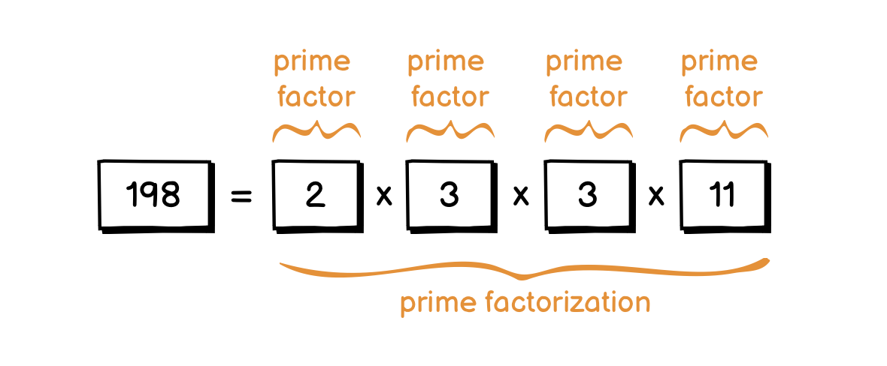
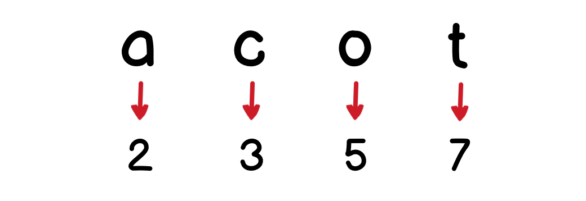
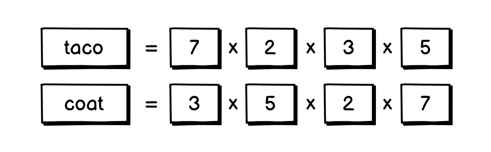

# 04.15.2022 - Math/Prime Factorization Uniqueness

In mathematics, the [fundamental theorem of arithmetic](https://en.wikipedia.org/wiki/Fundamental_theorem_of_arithmetic) states that: **"Any integer number larger than 1 can be written as a product of prime numbers in one and only one way".**

No matter how you come up with the *prime factorization*, the set of *prime factors* might have a different order, but they are always the same set.

In algorithm problem solving, the uniqueness of a prime factorization can be applied in some situations, for example, to check if two strings are made up from the same set of characters, with a different arrangement (anagram).

The idea to solve this kind of problem is, to map the characters in each string to a prime number: 

Then multiply them together, if they made up the same integer number, then they're anagram.

---

The proof of the uniqueness can be found on [Page 16, Section 2](https://www.google.com/books/edition/Elementary_Number_Theory/tr7SzBTsk1UC?hl=en&gbpv=1&pg=PA16&printsec=frontcover) of the **Elementary Number Theory: Second Edition** book. But Wikipedia has a [great summarization](https://en.wikipedia.org/wiki/Fundamental_theorem_of_arithmetic#Uniqueness):

Suppose we have an integer $n$ that has two distinct prime factorizations $n = p_1 \times p_2 \times p_3 \times \cdots \times p_j$ and $n = q_1 \times q_2 \times q_3 \times \cdots \times q_k$, where each $p_i$ and $q_i$ is a prime.

We see that $p_1$ divides $n$, so $p_1$ divides $q_1 \times q_2 \times q_3 \times \cdots \times q_k$. By [Euclid's lemma](https://en.wikipedia.org/wiki/Euclid%27s_lemma), we have that $p_1$ divides some $q_i$, let's say $q_1$.

Since $p_1$ and $q_1$ are both prime, they must be the same, so $p_1 = q_1$. Cancel both $p_1$ and $q_1$ from the two prime factorizations, we get:

$$
p_2 \times p_3 \times \cdots \times p_j = q_2 \times q_3 \times \cdots \times q_k
$$

Continue the process, eventually, we will find that each $p$ is a $q$. After each cancellation, we cannot run out of $p$ before all the $q$ are gone. This means, $p_1 \times p_2 \times p_3 \times \cdots \times p_j$ are just a rearrangement of $q_1 \times q_2 \times q_3 \times \cdots \times q_k$. The two factorizations are just differ in the order of the factors.

