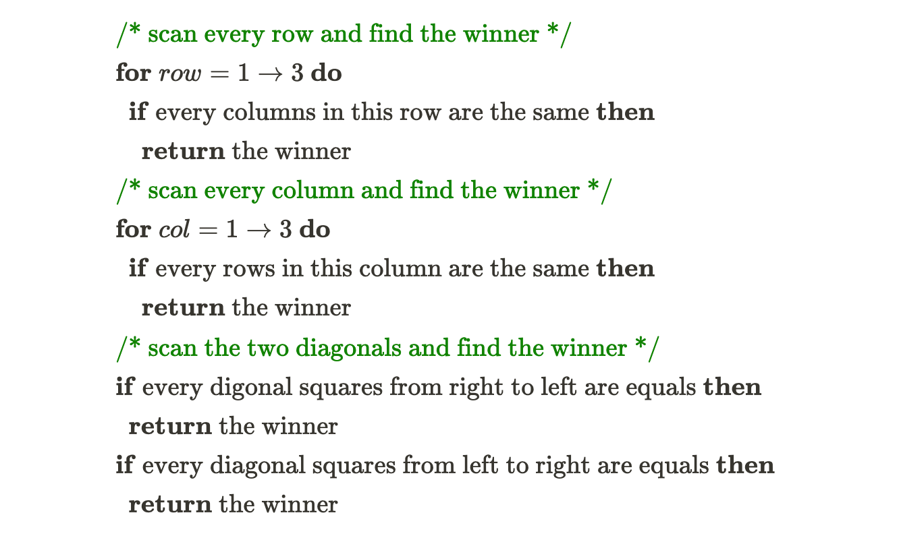
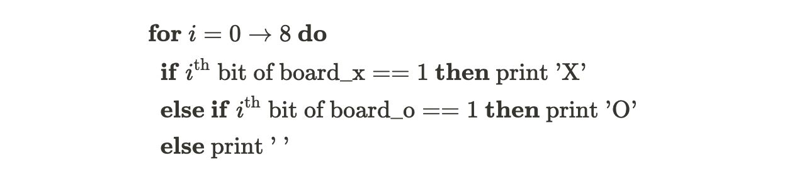
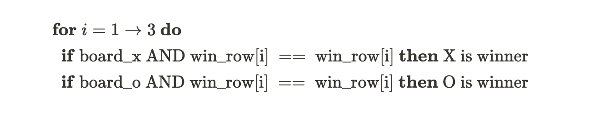

# 04.17.2022 - Data Structures/Introduction to Bitboard

[Bitboard](https://www.chessprogramming.org/Bitboards) is a widely-used technique in many computer chess programs for efficiently representing and extracting information on the chessboard. It seems to be simultaneously invented by the computer engineers from the Soviet, Britain, and America.

We'll get into chess in the next few articles, but for now, let's examine this interesting technique in a more straightforward example: The tic-tac-toe game.

---

Let's say we have a Tic-tac-toe game with the size of 3x3, it's common sense to represent this board as a 3x3 integer array, with some notation. For example, a 3x3 array with 0 represents empty squares, 1 for X, and 2 for O:

$$
\\text{board} = \\def\\arraystretch{1.5}
\\begin{array}{c:c:c}    1 & 0 & 0 \\\\
\\hdashline 0 & 2 & 1 \\\\
\\hdashline 2 & 0 & 1
\\end{array}
$$

Using the smallest possible number type — a byte (8-bit), the space required to maintain this board in the memory would be 9 bytes. And the same algorithm on the board, for example, evaluate the board to see who's the winner, would be something like:



With bitboard, we can save both the space complexity and time complexity for representing the board in memory and the algorithm to evaluate the game.

Instead of using 9 bytes (or 72 bits) of memory for the board, we could maintain two different boards, one for X and one for O, and we only need to use 9 bits per board, with every 0-bit for empty squares and 1-bit for the occupied squares.

For example, the same board as described at the beginning of the article can be represented using just two 9-bits numbers:

$$
\\begin{align}
\\text{board\_x} = \\def\\arraystretch{1.5}
\\begin{array}{c:c:c:c:c:c:c:c:c} \\hline 1 & 0 & 0 & 0 & 0 & 1 & 0 & 0 & 1 \\\\
\\hline
\\end{array} \\\\
\\text{board\_o} = \\def\\arraystretch{1.5}
\\begin{array}{c:c:c:c:c:c:c:c:c} \\hline 0 & 0 & 0 & 0 & 1 & 0 & 1 & 0 & 0 \\\\
\\hline \\end{array}
\\end{align}
$$

In reality., there's no 9-bits number type on any computer, we could use two 16-bits numbers instead, that sums up to 4 bytes, or we can even use just use 3 bytes (this would be a great exercise for the readers).

Now, how can we perform the board evaluation algorithm?

There are 9 squares on the board, indexing from 0 to 8, and this is how we read the value at the nth bit:

$$
\\def\\arraystretch{1.5}
\\begin{array}{c:c:c}    6 & 7 & 8 \\\\ \\hdashline    3 & 4 & 5 \\\\
\\hdashline    0 & 1 & 2 \\end{array}
\\ \\ \\ \\ n^\\text{th}\\ \\text{bit} = (\\text{board} \\gg n)\\ \\&\\ 1
$$

To print the board, we could write something like:



Now, let's say we want to check if it's X or O is winning the 2nd row of the board. We can check if every bit at the second row of each board is equal to 1. To do this, we apply the bitwise AND operator between each board and a mask board of *0b000111000*:

$$
\\def\\arraystretch{1.5}    \\begin{array}{c:c:c}    0 & 1 & 0 \\\\ \\hdashline    1 & 0 & 1 \\\\
\\hdashline    0 & 0 & 1 \\end{array}\\
\text{ AND }\\ \\def\\arraystretch{1.5}    \\begin{array}{c:c:c}    0 & 0 & 0 \\\\ \\hdashline    1 & 1 & 1 \\\\
\\hdashline    0 & 0 & 0 \\end{array}\ = \ \\def\\arraystretch{1.5}
\\begin{array}{c:c:c}    0 & 0 & 0 \\\\ \\hdashline    1 & 0 & 1 \\\\
\\hdashline    0 & 0 & 0 \\end{array}
$$

In case we do have a winner, the result of the AND operation between two boards would be the mask board itself.

$$
\\def\\arraystretch{1.5}    \\begin{array}{c:c:c}    0 & 1 & 0 \\\\ \\hdashline    1 & 1 & 1 \\\\
\\hdashline    0 & 0 & 1 \\end{array}\\ \text{ AND }\\
\\def\\arraystretch{1.5}    \\begin{array}{c:c:c}    0 & 0 & 0 \\\\
\\hdashline    1 & 1 & 1 \\\\    \\hdashline    0 & 0 & 0 \\end{array}\\ = \\
\\def\\arraystretch{1.5}    \\begin{array}{c:c:c}    0 & 0 & 0 \\\\ \\hdashline    1 & 1 & 1 \\\\
\\hdashline    0 & 0 & 0 \\end{array}
$$

Using this method, we can check if X or O is winning any of the 3 rows by defining 3 mask boards for each row:

$$
\\begin{align}
\\text{win\_row[1]} = \\def\\arraystretch{1.5}    \\begin{array}{c:c:c:c:c:c:c:c:c} \\hline 1 & 1 & 1 & 0 & 0 & 0 & 0 & 0 & 0 \\\\
\\hline \\end{array} \\\\
\text{win\_row[2]} = \\def\\arraystretch{1.5}    \\begin{array}{c:c:c:c:c:c:c:c:c} \\hline 0 & 0 & 0 & 1 & 1 & 1 & 0 & 0 & 0 \\\\
\\hline \\end{array} \\\\ \\text{win\_row[3]} = \\def\\arraystretch{1.5}    \\begin{array}{c:c:c:c:c:c:c:c:c} \\hline 0 & 0 & 0 & 0 & 0 & 0 & 1 & 1 & 1 \\\\
\\hline \\end{array} \\end{align}
$$

And the check algorithm:



To fully scan and check if X or O is winning any of the rows, columns and diagonals, we can define the mask board for each rows, columns and diagonal lines. Here's the example implementation in JavaScript:

```jsx
const WIN_COLS = [0b100100100, 0b010010010, 0b001001001];
const WIN_ROWS = [0b111000000, 0b000111000, 0b000000111];
const WIN_DIAG = [0b100010001, 0b001010100];

const isWinner = (p) => {
    for (let col of WIN_COLS) {
        if ((col & p) == col) return true;
    }
    for (let row of WIN_ROWS) {
        if ((row & p) == row) return true;
    }
    for (let dg of WIN_DIAG) {
        if ((dg & p) == dg) return true;
    }
    return false;
};

// Call isWinner(p) to check if X or O is winner
// with p is board_x or board_y
```
