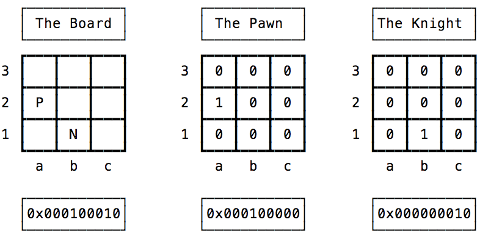

# 04.18.2022 - Algorithms/Detect chess piece movement with Bitboard

In [the previous article](/everyday/04-17-2022-data-structures-introduction-to-bitboard), we learned about Bitboard and how to use it in a simple board game. In this article, let's see how Bitboard can be actually used to implement a chessboard.

---

For those who are never played chess, a chessboard is an 8x8 board, we people put one wooden piece on each cell and move them around to kill time. Sometimes, people get emotional and flip the board, sending the piece flying around then quickly escalate the situation into a fight. Just kidding.


To encode a chessboard on the computer, we usually define the board as a 2D matrix, with each cell being a string, they have one the value of `K (King)`, `Q (Queen)`, `P (Pawn)`, `B (Bishop)`, `N (Knight)`, `R (Rook)` to annotate which chess piece standing in it. Sometimes, people use uppercase letters for white pieces and lowercase letters for black pieces.

---

Another technique to represent the chessboard is using [Bitboard](https://pages.cs.wisc.edu/~psilord/blog/data/chess-pages/rep.html). It is a technique that uses multiple 64-bit numbers (instead of a 2D array) to maintain the position of each chess piece on the board, with 0 for the empty square and 1 for the current position of that piece on the board. You can read more about it in the reference link above, let's cut the explanation here and jump right into a real example.

Let's consider a smaller example of a 3x3 board, with a Pawn and a Knight. So we'll have 3 numbers to keep track of the pieces and the board:



Now let's move the Knight from `b1` to `c3`, we have the new board data, how could we make sense of the new data and figure out which piece is moving, and move from which square, to which square?


First, let's figure out the movement that just happens on the board, to do this, we apply the `XOR` operation between the old board and the new board.

Because there's only 1 moving piece each turn, the bits of every un-moved piece will remain the same on both boards, while the bits where the moving pieces go from and to will be changed. `XOR` operation will help us filter out all un-moved pieces:


Now that we know what the movement looks like, we can go and ask every piece on the board if it's their move, by applying the `AND` operation to each of the piece.

If a piece is unmoved, none of its bits matched the bits in the movement value, so it would return 0. Otherwise, if a piece is moved, one of its bits will be matched with the bits in the movement value, the ultimate value would be some non-zero.

What if there are two pieces with the same zero return? The moving piece just landed on the square where there's already another piece, it's a capture!

Let's try it with the Pawn:


It's a zero, so the Pawn didn't move. How about the Knight?


That looks like a non-zero to me, so the Knight just moved. In fact, it's the Knight's value itself. Look at the image above again, now, do you know how to calculate the Knight's new position?

Give yourself a pat on the back if you think of an `XOR`!


That's how we detect the movement and update the board. Let's summarize the algorithm:

1. **Step 1:** Calculate the movement value
   ```go
    movement = new_board XOR old_board 
    ```
2. **Step 2:** Find out what piece just moved, and calculate its new position
   ```go
    for each piece in [pieces]: 
        if movement AND piece == 0 then 
            piece = movement XOR piece
    ```

With this algorithm, we are now able to actually see the board movement from the software's perspective, based on the input data from the hardware, so we can actually implement some game rules like capture, illegal move checking, check or checkmate, en passant,...