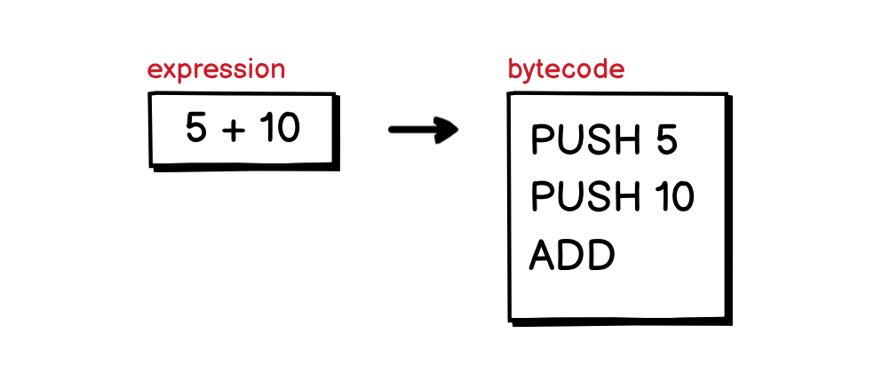
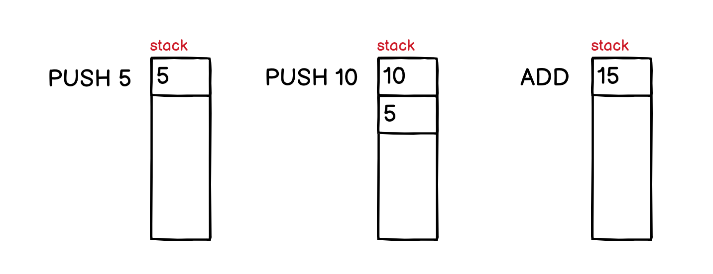
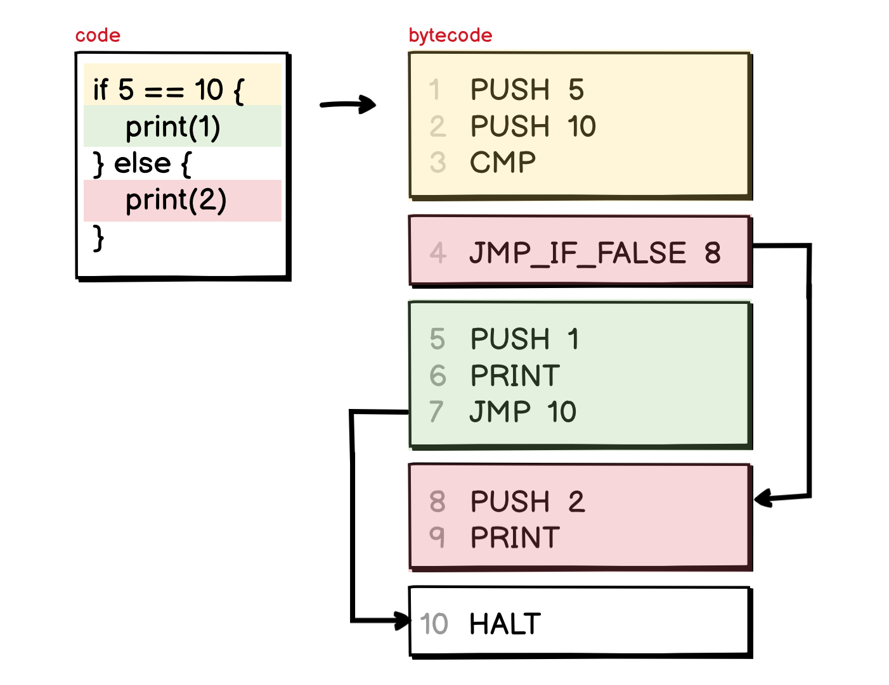
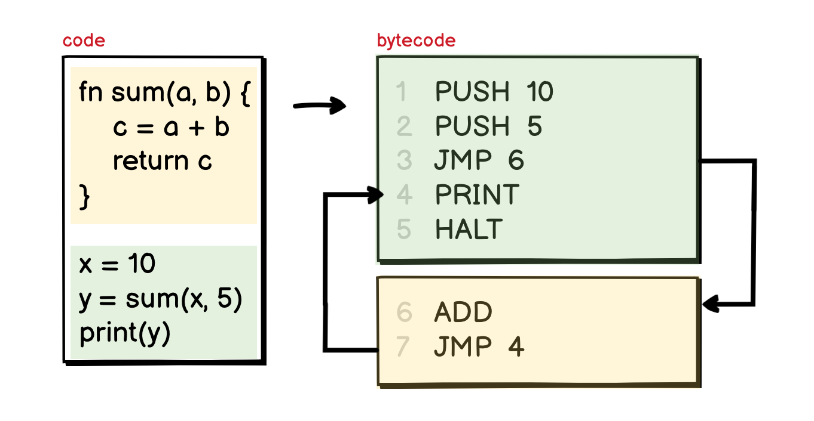

# 04.21.2022 - Compilers/How Virtual Stack Machines Executed

Different programming languages have different approaches to executing their code. Some languages execute the code as they travel the *AST* (Tree Walk approach), and some languages compile the code into *bytecode* and use a *Virtual Machine* to execute them.  
  
There are also different approaches to implementing a virtual machine, the most popular types of the virtual machine today are:
  
1. **Register-based Virtual Machines**: which uses a set of registers to store variables, calculation results,... The Lua VM and Android's Dalvik VM are register-based machines.
2. **Stack-based Virtual Machine**: which uses a stack for that purpose, there are some well-known languages that use stack machines, like .NET CLR, WASM runtime VM, Ethereum VM, Java JVM (it is, in fact, both stack-based and register-based)...

It is commonly known that register-based machines are faster than stack-based machines, but implementing them right is a complex task. And implementing a stack-based machine is much easier.

A stack machine is a type of virtual machine that uses a stack to execute code. For all the operations, the operands will pop out from the stack, and the calculation result will be pushed back to the stack, so it can be used as an operand for subsequence instructions.

## A simple expression

For a stack machine to execute, the compiler first needs to compile the code written by the programmer into bytecode. For example, an expression **5 + 10** written in a high-level programming language, would be compiled into a list of imaginary bytecodes as follow:

The way the bytecode is generated is the same as the way we rewrite the expression in [Reversed Polish Notation](https://en.wikipedia.org/wiki/Reverse_Polish_notation), it becomes **5 10 +**. Then, for each value, it will be pushed to the stack with the **PUSH** instruction. The **ADD** instruction will pop out the last two numbers from the stack, add them together and push back the result into the stack:

Most instructions in a stack-based machine will treat the data stack in the same way as the **ADD** instruction.

## Conditional branching

There is another type of instruction that can be seen in every program is conditional branching, for example, the **if** statement. It usually contains a condition expression, followed by two execution branches: the _then branch_ and the _else branch_.

In this example, the condition expression is a comparison statement, it can be checked by some imaginary **CMP** instruction, that checks the top two values in the stack and pushes back either the value 1 if the two values are equals or 0 if they are not.

The interesting thing happens right after this comparison, the bytecode compiler usually laid out the code for the two execution branches one after each other, with the _then branch_ coming first, and _else branch_ later. To skip the _then branch_, an instruction like **JMP_IF_FALSE** will be used.

The **JMP** instruction on line 7 in the above example is added to drive the execution out of the **if** block after the _then branch_ finished. Without this jump, the machine would continue to execute the _else branch_ right after it finished the _then branch_.

## Function calls

Another important type of execution is function calls. Since in reality, there are much more complex things that the compiler needs to handle when compiling a program with function calls into bytecode (like handling the frame, the default values of a function,...), we will not go into that much of details in this article.

In its most simple form, function calls are just the **JMP** instruction that let you jump around the instruction list, any parameters passed to a function are pushed to the stack before the jump.

After the execution, all the return values will be pushed to the stack again, and there is also a **JMP** instruction to put us back to where we were before the function call.

---

That's pretty much it for today. In the next few articles, we will design and implement a simple stack machine with some imaginary instruction set, just enough to execute some simple programs.

**References:**

- https://www.cp.eng.chula.ac.th/~prabhas//teaching/ca/stack.htm
- https://users.ece.cmu.edu/~koopman/stack_computers/sec3_2.html
- https://www.craftinginterpreters.com/calls-and-functions.html (Great book!)
- https://www.epfl.ch/labs/lamp/wp-content/uploads/2019/01/acc14_08_interpreters-vms.pdf