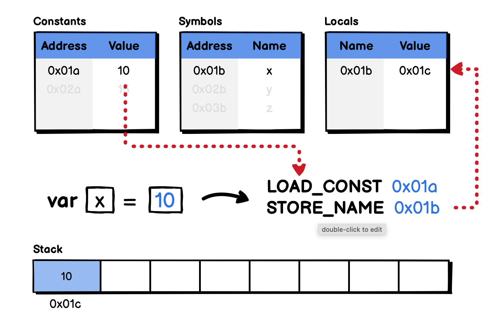
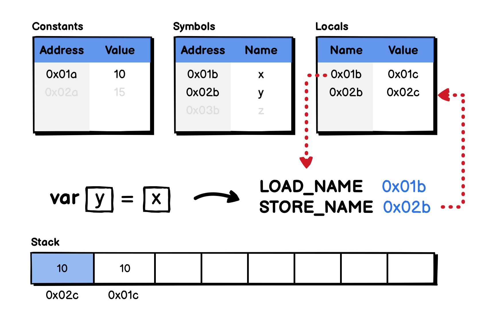
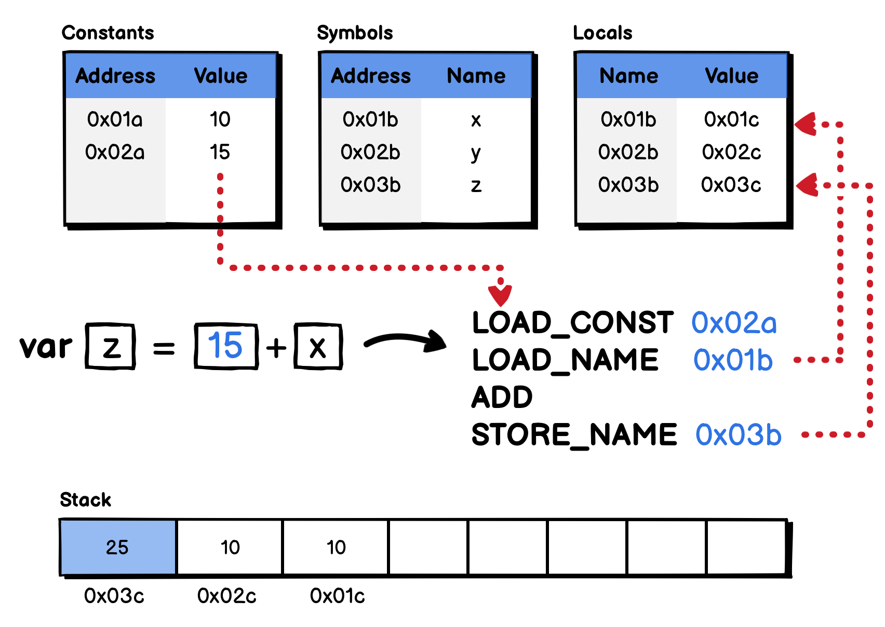

# 04.24.2022 - Compilers/Virtual Stack Machine/Variable declaration

In the [previous article](/everyday/04-21-2022-compilers-how-virtual-stack-machines-executed), we get an overview of how bytecode is executed in a stack machine.

In this article, we continue to dive into the details of a different scenario: **Variable declaration**.

In the simple language that we are designing, there will be 3 types of variable declaration:

1. Variable with a constant value
2. Variable with a value from other variables
3. Variable with a value from an expression

In the following program, we have all 3 declaration types above:

```go
var x = 10      // type 1
var y = x       // type 2
var z = 15 + x  // type 3
```

Let's take a closer look at each case to see how would the bytecode compiler compiles them.

## Inside the stack machine

Aside from the data stack, a stack machine needs to store other information that will be used for the execution, different implementations have different ways to store them, but generally, we can think of them as the 3 tables:

1. **Constants**: to store the literal values in the program, for example, numbers or strings.
2. **Symbols**: to store the variable names that are defined in the program.
3. **Locals**: to map the symbols with their actual values.

To work with these tables, the instruction set usually contains these opcodes (these names are inspired by CPython's opcodes):

- `LOAD_CONST`: Load a value from the **Constants** table, and put it on the top of the stack. It's somewhat similar to the `PUSH` instruction that was introduced in the previous article.
- `LOAD_NAME`: Load the referenced value of a symbol in the **Locals** table, and put it on the top of the stack.
- `STORE_NAME`: Store the address of the value on the top of the stack in the **Locals** table, with the key being the address to the symbol name.

Now, we are ready to dive into each variable declaration type.

## Variable with a constant value

This is the case where a new variable is declared with a constant value. During the compilation, the compiler will put the constant `10` into the **Constants** table (for example, at the location `0x01a`), and put the name `x` into the **Symbols** table at the location `0x01b`.



Then, the expression `var x = 10` will be transformed into two instructions. The first one is `LOAD_CONST 0x01a`, which loads the constant at location `0x01a` into the top of the stack, which is the number `10`. Then, the `STORE_NAME 0x01b` instruction map the address of the value on the top of the stack with the symbol located at `0x01b` — which is the symbol `x`.

## Variable with a value from other variables

Another scenario is when we define a new variable, and assign it with the value from another variable. For example, `var y = x`. Same as above, during the compilation, the symbol `y` was also created in the **Symbols** table, at the location `0x02b`.



Two instructions will be generated. The first one, `LOAD_NAME 0x01b`, will look at the **Locals** table, retrieve the referenced value mapped with the symbol at location `0x01b` — which is the value `10` (at location `0x01c` on the stack), put it to the top of the stack. Then, the second instruction, `STORE_NAME 0x02b`, will map the location of the top of the stack with the symbol at `0x02b` and save it to the **Locals**.

## Variable with a value from an expression

Next, consider the case when a variable is declared and assigned to an expression, the expression may or may not contains another variable. For example, `var z = 15 + x`.



Remember that, all bytecode is generated in the way we write *Reversed Polish Notation*, the above statement would become **15 x +**. And it would be transformed into a series of instructions as described in the above diagram.

First, the `LOAD_CONST 0x02a` will load the constant at the location `0x02a` into the top of the stack (the value `15`). Next, the `LOAD_NAME 0x01b` instruction load the value of the symbol at `0x01b` from the **Locals** table (the value `10` at the location `0x01c`), put it on the top of the stack. Then, the `ADD` instruction will pop the top two values on the stack, add them together, and push back the result into the stack — the value `25` at the location `0x03c`.

Finally, the `STORE_NAME 0x03b` instruction saves the location of the top of the stack into the **Locals** table, with the name of the symbol at `0x03b`.

---

In the above examples, we see that when a variable is created, the assigned values are copied from other variables. In reality, we may need to create a pointer that referenced some other memory location. This is a much more complex case that requires us to handle many different aspects of the language, so it will be a topic for another article.