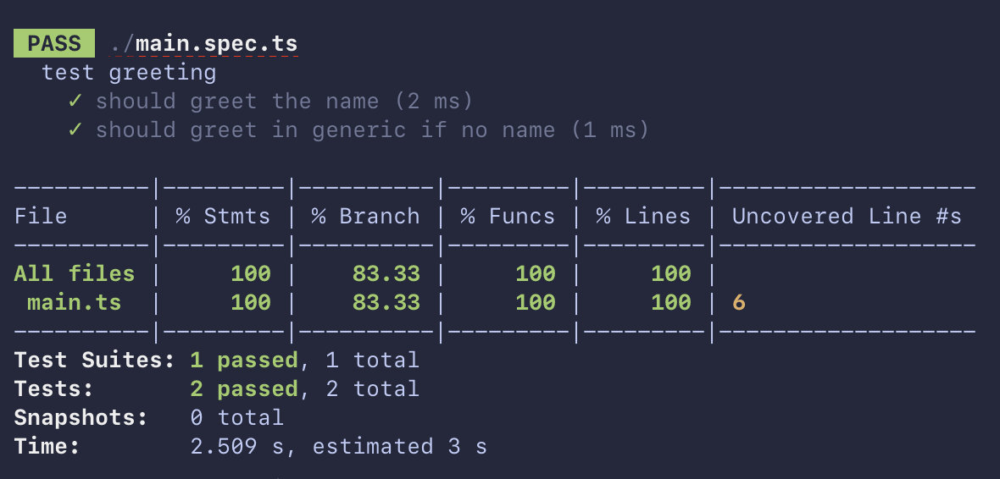
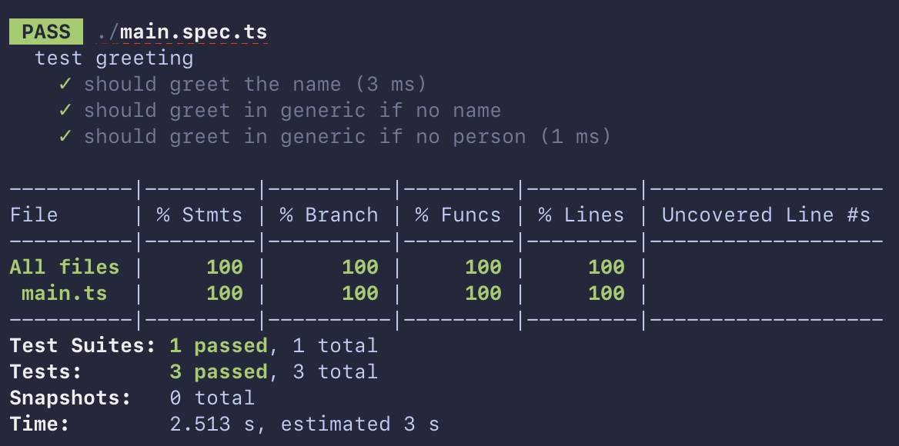

# 08.29.2022 - TypeScript/Optional Chaining and Code Coverage

For the uninformed, **optional chaining** is a new JavaScript feature that allows you to access property values deep inside an object without checking that each reference in the chain is valid. For example:

```typescript
// this nested if hell

if (foo) {
    if (foo.bar) {
        const value = foo.bar.beep || "hello";
    }
}

// can be replaced with
const value = foo?.bar?.beep ?? "hello";
```

As you can see, each `?.` create an implicit branch in the code. When it comes to writing tests, it is easy to miss these implicit branches, which will affect your code coverage.

Let's take a look at this example. I have a `greeting` method that says hello to a person if they have a name. Otherwise, just say, "Hi there!":

```typescript
interface Person {
	name: string;
}

export const greeting = (person?: Person): string => {
	if (person?.name) {
		return `Hello! ${person.name}`;
	} else {
		return `Hi there!`;
	}
};
```

And it's pretty easy to test this method:

```typescript
describe('test greeting', () => {
	it('should greet the name', () => {
		const result = greeting({ name: 'Huy' });
		expect(result).toEqual('Hello! Huy');
	});

	it('should greet in generic if no name', () => {
		const result = greeting({ name: '' });
		expect(result).toEqual('Hi there!');
	});
});
```

Now, run the test and get some code coverage. Things seem fine:

```bash
$ jest --coverage
```



But look closely. You will notice that the Conditional Coverage (`% Branch` section) does not get to 100%.

And the code that does not have enough coverage is this:

```typescript
if (person?.name) {
```

What's going on here? In our code, we already covered the case where this `if` statement returns `true` as well as the `false` case. Why is it not covered?

Turned out, it's the optional chaining that creates an implicit branch, so the code would be split into one more branch, like this:

```typescript
if (person) {
    if (person.name) {
        return `Hello! ${person.name}`;
    }
}
return `Hi there!`;
```

In the test, we did not cover the case where `person` is falsy. Let's fix it by adding one more test case:

```typescript
it('should greet in generic if no person', () => {
    const result = greeting();
    expect(result).toEqual('Hi there!');
});
```

Run the test again. Now we're able to get to 100% coverage!



**Disclaimer:** I'm not saying I'm obsessed with code coverage, or I'm advocating for 100% test coverage here. It's up to you to decide how much coverage is good for your project.