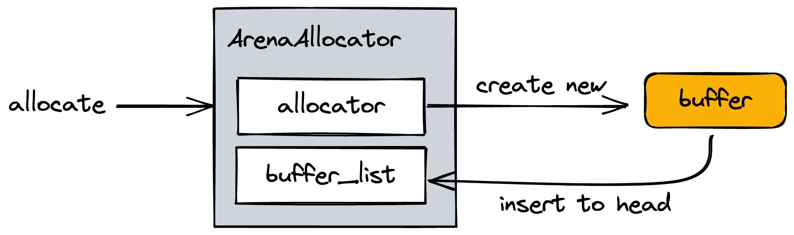
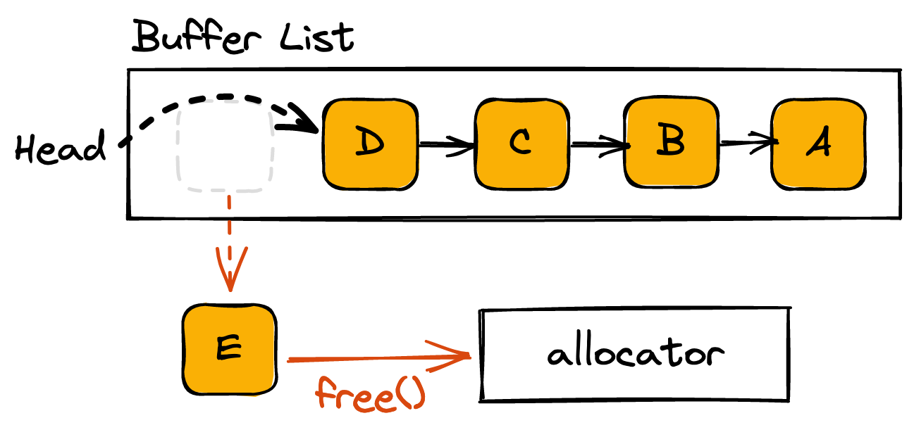

# 01.12.2022 - Zig/How ArenaAllocator works

`ArenaAllocator` is one of Zig's built-in allocators. It takes another allocator and wraps some code around to allow you to allocate memory without the need to free them individually. Every allocated memory will be freed at once when you call `ArenaAllocator.deinit()`.

```zig
var arena = std.heap.ArenaAllocator.init(std.heap.c_allocator);
defer arena.deinit();

// Use `arena.allocator()` and forget about freeing anything
```

This post will not go into the details of how memory allocation happens but will focus on how `ArenaAllocator` manages the memory buffers to be free in a single call.

You can find the implementation details in [lib/std/heap/arena_allocator.zig](https://github.com/ziglang/zig/blob/master/lib/std/heap/arena_allocator.zig).

Each instance of `ArenaAllocator` consists of two things:

- **A child_allocator:** is the actual allocator that does memory allocation and deallocation.
- **An internal buffer_list:** is a [singly linked list](https://github.com/ziglang/zig/blob/master/lib/std/linked_list.zig#L15) to keep track of the allocated buffers.



Let's take a look at the following example, assuming we allocated two objects `A` and `C`, each one allocates some child objects:

```
├── A
│   └── B
└── C
    └── D
        └── E
```

Every time memory allocation happens, the `child_allocator` will allocate a new buffer. A node containing the pointer to this buffer will be created and prepended into the `buffer_list`.


When `ArenaAllocator.deinit()` is called, Zig traverse the `buffer_list` and free each node's buffer. The way Zig stores the nodes in `buffer_list` allows it to free every child object before freeing the parent one.

```zig
pub fn deinit(self: ArenaAllocator) void {
    var it = self.state.buffer_list.first;
    while (it) |node| {
        // this has to occur before the free because the free frees node
        const next_it = node.next;
        self.child_allocator.free(node.data);
        it = next_it;
    }
}
```



In the above example, `E`, `D` will be freed before `C`. And `B` will be freed before `A`. Hence, no orphaned memory gets leaked.

