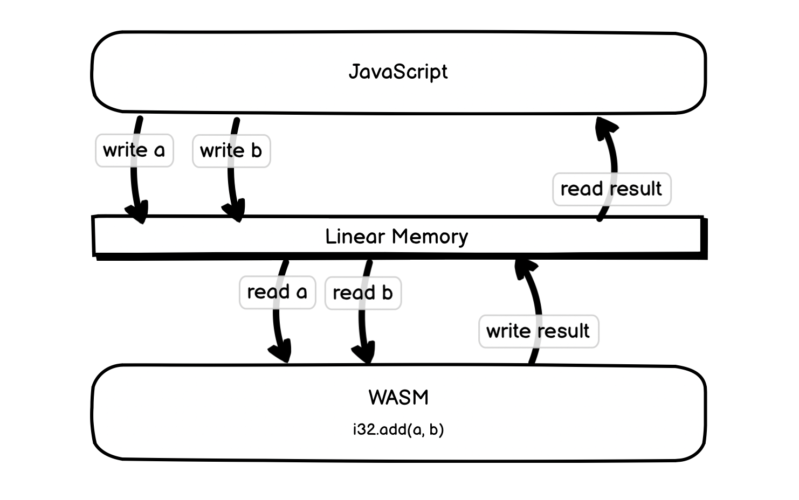

# 01.25.2022 - WebAssembly/Working with Linear Memory

Linear Memory in WebAssembly is a contiguous and mutable array of **uninterpreted bytes**. It is shared between the WASM module and the host runtime.

It can be expanded by calling `WebAssembly.Memory.grow`. The memory will be growing by each block of page size (about 64KB). But the memory layout might be changed after growth, so keep this in mind if we are holding any pointer to the data in linear memory.

By default, the memory is not shared between instances/threads. We will not go into the details of shared memory for now.

Linear Memory is mainly used for passing data back and forth between JavaScript and WebAssembly.

In the following example, we create a 1-page memory, store a string `"xịn xò"` on the memory and export them from a WASM module:

**demo.wat**
```wasm
(module
  (memory (export "memory") 1)
  (data (i32.const 0) "xịn xò")
)
```

The `data` segment initializes the memory and puts the string to the first 9 bytes (the word "xịn xò" is a UTF-8 encoded string, with 6 characters but actually takes 9 bytes).

You can compile this WAT file to a WASM module with the command `wat2wasm` from the [WebAssembly Binary Toolkit](https://github.com/WebAssembly/wabt):

```
wat2wasm demo.wat
```

Then we can load them in some JavaScript environment, for example, in NodeJS:

**demo.js**
```javascript
const fs = require('fs');
const wasmSource = fs.readFileSync('demo.wasm');
const wasmBuffer = new Uint8Array(wasmSource);

WebAssembly.instantiate(wasmBuffer, {}).then(wasm => {
    const instance = wasm.instance;
});
```

Now, let's read that 9 bytes of memory in our JavaScript code:

```javascript
const memory = instance.exports.memory;
const buffer = new Uint8Array(memory.buffer, 0, 9);
// buffer = Uint8Array(9) [
//   120, 225, 187, 139,
//   110,  32, 120, 195,
//   178
// ]
```

The `buffer` array is just a raw bytes array, we can convert it into an UTF-8 String with:

```javascript
const data = new TextDecoder("utf8").decode(buffer);
// data = "xịn xò"
```

Now, let's get into a more complex example, where we can see how's the linear memory is being read/written in both JavaScript and WASM.

We will create a WASM module with a `sum` method. This method does not take any parameters. Instead, it will read two `i32` numbers, `a` and `b` from the linear memory with the `i32.load` instruction, add them together with `i32.add` instruction, and store the result into the memory with `i32.store` instruction. And then, on the JavaScript side, we will write two numbers to the memory and call the `sum` method, then read the memory for the result.



Each `i32` number takes 4 bytes, so the address of the `a`, `b`, and `result` in the linear memory is 0, 4, and 8, and we are going to need 12 bytes in total.


We will create the memory from the JavaScript side and import it into our WASM module with the `import` segment.

**sum.wat**
```wasm
(module
  (memory (import "js" "mem") 1)
  (func (export "sum")
    (i32.store
      (i32.const 0x8)
      (i32.add
        (i32.load (i32.const 0x0))
        (i32.load (i32.const 0x4))
      )
    )
  )
)
```

Compile the above program with `wat2wasm`, we get `sum.wasm` module. In our JavaScript program, we will need to create an instance of `WebAssembly.Memory` and pass them as an import when we instantiate the WASM module:

```javascript
const fs = require('fs');
const wasmSource = fs.readFileSync('sum.wasm');
const wasmBuffer = new Uint8Array(wasmSource);

const memory = new WebAssembly.Memory({ initial: 1 });

WebAssembly.instantiate(wasmBuffer, { js: { mem: memory }}).then(wasm => {
    const instance = wasm.instance;
});

```

In the previous example, we refer to the memory buffer with an `Uint8Array`. This time, we are working with 32-bit values, we can create an `Uint32Array` instead:

```javascript
const buffer = new Uint32Array(memory.buffer, 0, 3);
```

We want to calculate the sum of `7 + 4 = 11`. 


First, we need to write the number `7` to the first 4 bytes of the `buffer`, write the number `4` to the next 4 bytes of the buffer:

```javascript
buffer[0] = 7;
buffer[1] = 4;
// buffer = Uint32Array(3) [ 7, 4, 0 ]
```

Now, call the `instance.exports.sum()` method. The result will be stored in the last 4 bytes of the `buffer`.

```javascript
instance.exports.sum();
// After this call, the value of buffer array is
// buffer = Uint32Array(3) [ 7, 4, 11 ]
```

It seems fine to work with the bytes directly in linear memory in the above examples since we are working with simple data types.

In reality, dealing with higher-level JavaScript data types like Object or Map requires more management and underlying conversion. There are libraries like [wasm-bindgen](https://github.com/rustwasm/wasm-bindgen/) created for this kind of task. We will take a deeper look at these libraries in later articles.