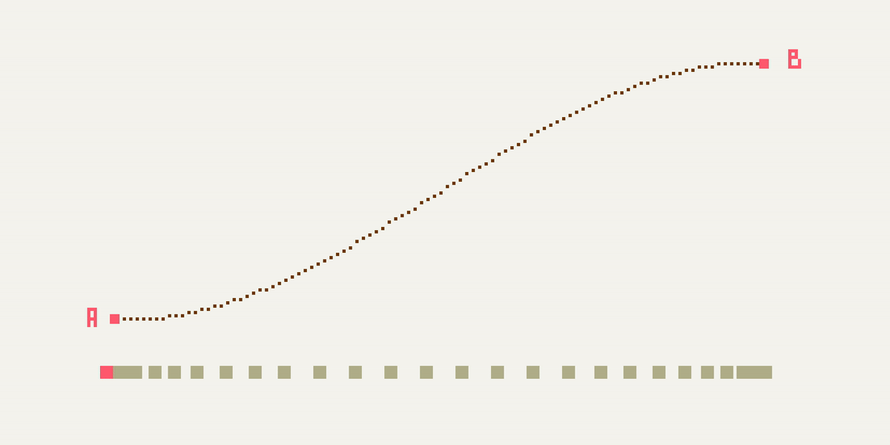

# 02.02.2022 - Math/Interpolation Methods

**Interpolation** is a type of estimation method for finding new data points based on the range of a discrete set of known data points.

The most basic kind of interpolation is **Linear Interpolation** (Lerp), it transitions from one value to another at a constant rate. Defined by:

$$
\text{lerp}(a, b, t) = a (1 - t) + b t
$$

It's implementation in Rust should look like this:

```rust
fn lerp(a: f32, b: f32, t: f32) -> f32 {
    return a * (1.0 - t) + b * t;
}
```

The interpolated points between two points A and B should form a straight line, and if we animate the object along the line, it should look like this:


**Cosine Interpolation** is the interpolation method that can generate a smooth acceleration and deceleration between the two data points, can be defined by:

$$
\text{cosine}(a, b, t) = \text{lerp}(a, b, \frac{1-\cos(\pi t)}{2})
$$

Implemented in Rust:

```rust
fn cosine(a: f32, b: f32, t: f32) -> f32 {
    let t2 = (1.0 - (t * PI).cos()) / 2.0;
    return lerp(a, b, t2);
}
```

The acceleration should happen from the beginning of the line, and slow down at the end of the line:



If we want to control the **acceleration** on just one end of the line, we can use different formulas:

$$
\text{acceleration}(a, b, t) = \text{lerp}(a, b, t^2)
$$

Implemented in Rust:

```rust
fn acceleration(a: f32, b: f32, t: f32) -> f32 {
    let t2 = t * t;
    return lerp(a, b, t2);
}
```

Here's how it look when animated:


Or **deceleration** at the end of the line:

$$
\text{deceleration}(a, b, t) = \text{lerp}(a, b, 1-(1-t)^2)
$$

Implemented in Rust:

```rust
fn deceleration(a: f32, b: f32, t: f32) -> f32 {
    let t2 = 1.0 - (1.0 - t) * (1.0 - t);
    return lerp(a, b, t2);
}
```

Animated result:


Above are just some common interpolation methods, for more, please check http://paulbourke.net/miscellaneous/interpolation/

Aside from animation, we can use interpolation functions to generate color, or dynamically generate font size on the web page, create a dynamic layout,... See more details about web-related techniques with interpolation at https://www.smashingmagazine.com/2017/05/fluid-responsive-typography-css-poly-fluid-sizing/