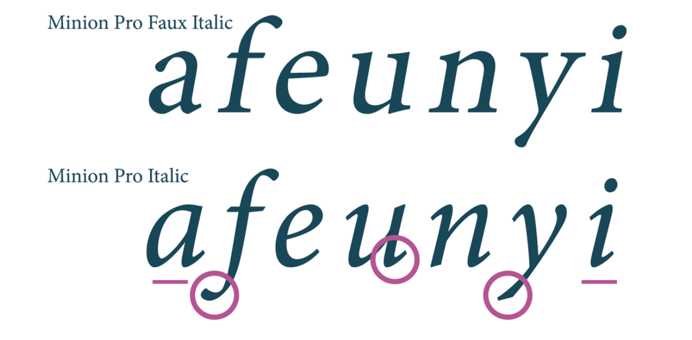

# 02.03.2022 - Typography/Faux Bold and Faux Italic

When you load custom web fonts with just the regular font-weight, no bold or italic styles, the browser tries its best to render them in bold and italic style by **faking** it.

These styles are called **faux** weights and styles.

Faux bold is made by **stretching the vertical strokes** of the original font.

Source: https://graphicdesign.stackexchange.com/a/76034

Faux italic is made by **slanting** the original font at an angle. Some fonts actually use the same technique, and it's called **oblique**.

This makes some fonts look bad, especially for serif fonts, where all the strokes are precisely well made, and usually have **true italic** styles.

Source: https://graphicdesign.stackexchange.com/a/76034

Generally, all designers hate faux styles. But as front-end developers, we should try our best to balance between the performance of the web page and the high standard of our fellow designers. And it's not an easy job, trust me.

If loading different font styles actually bring down your site's performance, you should consider using faux styles. Of course, this should come with the agreement from your designers and carefully test the difference between real and faux styles.

Here is the comparison of the styles between some commonly used web fonts from Google Fonts.

You can see the high-resolution version of the image [here](https://raw.githubusercontent.com/huytd/everyday/master/_meta/faux-real-comparision.png), or see it directly in your browser [here](https://codepen.io/huytd/pen/LYOZqwo) and [here](https://codepen.io/huytd/pen/podbYbV).

**Read more:**

- https://alistapart.com/article/say-no-to-faux-bold/
- https://www.smashingmagazine.com/2012/07/avoiding-faux-weights-styles-google-web-fonts/