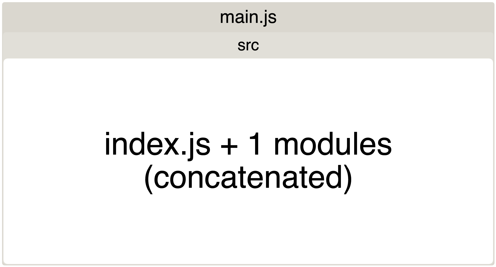

# 02.09.2022 - JavaScript/Named Imports and Dead Code Elimination

One thing about JavaScript that is sometimes confusing: The **named imports**.

When there is a big module that exports a lot of things, we usually think that we can use named import to get just what we needed in that module, and the rest of the thing will magically disappear. It's not.

What really happens is, in _development_ mode, **everything still gets included** when we bundle the application. In _production_ mode, some bundlers will have the built-in dead code elimination (or tree-shaking) feature kick in to remove unused codes.

For example, let's create a mini project to illustrate this behavior better. We are going to have an `index.js` file for our entry point, and a `lib` folder containing some library files: `a.js`, `b.js` and `c.js`, and a `lib/index.js` file where we blanket export everything in our libs:

```
.
├── package.json
└── src
    ├── index.js
    └── lib
        ├── a.js
        ├── b.js
        ├── c.js
        └── index.js
```

First, let's export a couple of things in our libs:

```js
// lib/a.js
export const a = 10;

// lib/b.js
export const b = "Hello";

// lib/c.js
export const c = (name) => console.log(`HELLO, ${name}!`);
```

Re-export everything in `lib/index.js`:

```js
export * from './a';
export * from './b';
export * from './c';
```

And import just what we needed in `index.js`:

```js
import { b } from './lib';

console.log(b);
```

Now, we build the project in two different modes: development and production, and use `webpack-bundle-analyzer` to analyze the difference:

```json@focus=5:9
{
  "name": "webpack-test",
  "version": "1.0.0",
  "main": "index.js",
  "scripts": {
    "build": "webpack build --profile --json > stats.json",
    "build:dev": "webpack build --mode development --profile --json > stats.json",
    "analyze": "webpack-bundle-analyzer stats.json"
  },
  "license": "MIT",
  "devDependencies": {
    "typescript": "^4.5.5",
    "webpack": "^5.68.0",
    "webpack-bundle-analyzer": "^4.5.0",
    "webpack-cli": "^4.9.2"
  }
}
```

In production build, as expected, there is only module `b.js` got imported, and Webpack went as far as inlined the exported values into the code:

```bash
$ yarn build && yarn analyze
```


But in development mode, you will see that everything got bundled, even the unimported modules like `a.js` or `c.js`:

```bash
$ yarn build:dev && yarn analyze
```


If we modify the `src/index.js` to import directly from module `b` instead of from the blanket re-exports in `lib/index.js`, you will get what you expected when building in development mode:

```js
import { b } from './lib/b';

console.log(b);
```


OK, now we understand how named imports behave in different build modes. As long as we import things selectively, we are good in a production build, right?

Sadly it's not!

Not all libraries made the same, for example, the infamous `lodash` package. This library was architected in a different way (go explore it yourself, check the [lodash-cli](https://github.com/lodash-archive/lodash-cli/blob/master/bin/lodash) and [lodash](https://github.com/lodash/lodash) source code). Named imports won't work as you expected!

```bash
$ yarn add lodash
```

Try to import just the `pad` function in your `src/index.js`:

```js
import { pad } from 'lodash';

console.log(pad('abc', 8, '_'));
```

And build in production mode:

```bash
$ yarn build && yarn analyze
```

What you get is a whopping 531kB of lodash in your bundle, and that's not great:


What if we selectively import just the `lodash/pad` file?

```js@focus=1
import { pad } from 'lodash/pad';

console.log(pad('abc', 8, '_'));
```


The bundle size was reduced to 22.15kB, not bad, huh? But there are still a lot of extra dependencies that got bundled, and Webpack cannot concatenate them to the module.

What you can do is, instead of using `lodash`, just use `lodash-es` package, this is still the lodash but the build is split into modules.

```bash
$ yarn add lodash-es
```

We still need to specify the import path for each method we are using:

```js@focus=1
import { pad } from 'lodash-es/pad';

console.log(pad('abc', 8, '_'));
```



But things get better! The total bundle size is now 1.33kB, a huge leap from 531kb!!!

Maybe I should rename this post's title to: "How I reduced 500% of the bundle size when using Lodash".

**Read more:**
- https://developers.google.com/web/fundamentals/performance/optimizing-javascript/tree-shaking
- https://developers.google.com/web/fundamentals/performance/webpack/decrease-frontend-size