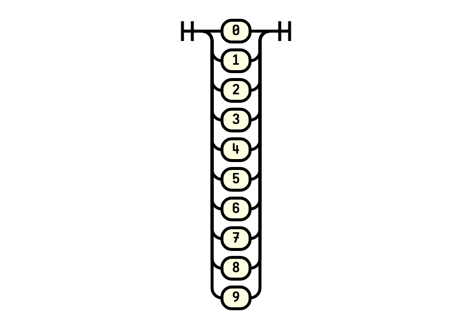
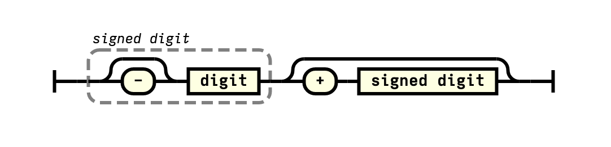

# 02.13.2022 - Parser/Railroad Diagrams

**Railroad Diagrams** (or **Syntax Diagrams**) are the graphical way to represent [context-free grammars](/everyday/02-10-2022-parsing-context-free-grammar).

Each diagram defines a nonterminal. And they must have an **entry point** and an **endpoint**.

There is no official standard about how should we draw the railroad/syntax diagrams but historically, terminals are represented by round boxes and nonterminals are represented by rectangular boxes.

Let's take a look at the following grammar:

```bnf
sum = signed digit, [ "+", signed digit ] ;
signed digit = [ "-" ], digit ;
digit = "0" | "1" | "2" | "3" | "4" | "5" | "6" | "7" | "8" | "9" ;
```

The railroad diagram of the above grammar can be represented as:

**digit**



**signed digit**


**sum**



In real world, syntax diagram can be seen in [JSON specs](https://www.json.org/json-en.html), or [SQLite](https://www.sqlite.org/syntaxdiagrams.html).